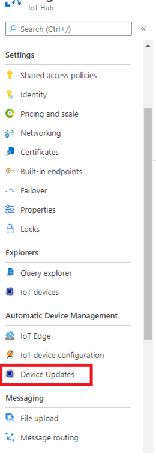
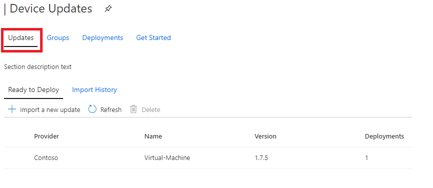
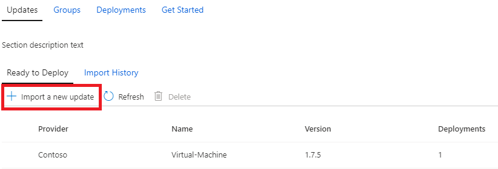
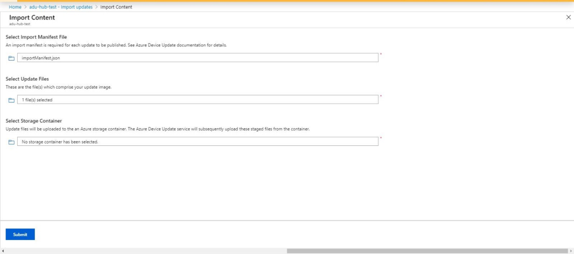
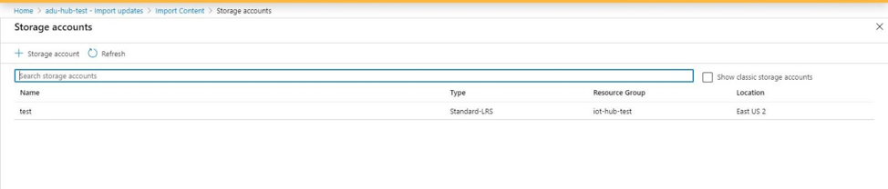
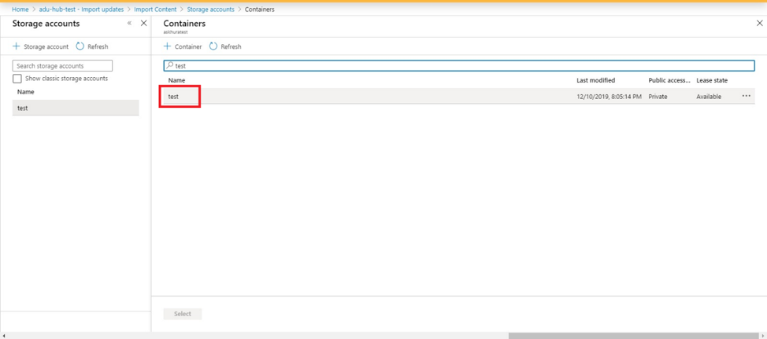
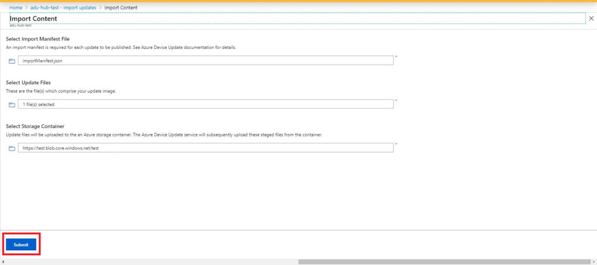
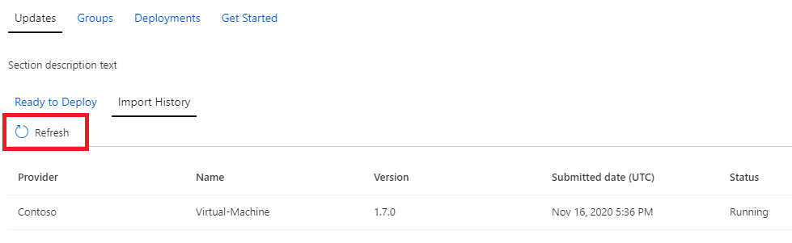
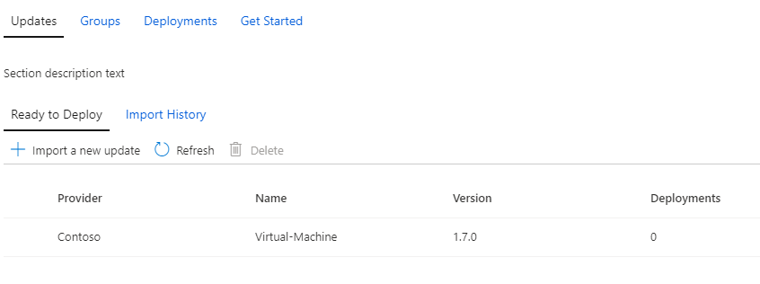

# Import New Update
Learn how to import a new update into Device Update for IoT Hub.

## Prerequisites

* Access to an IoT Hub with Device Update for IoT Hub enabled.
* An IoT device (or [simulator](./device-update-simulator.md)) provisioned within the IoT Hub, running either Azure RTOS ThreadX or Ubuntu 18.04 x64.
    * If using a real device, you’ll need an update image file (for example, Yocto image) for image update, or APT Manifest file for package update.
* [PowerShell 5](https://docs.microsoft.com/powershell/scripting/install/installing-powershell) or later.
* Supported browsers:
  * [Microsoft Edge](https://www.microsoft.com/edge)
  * Google Chrome

> [!NOTE]
> Some data submitted to this service might be processed in a region outside the region this instance was created in.

## Create Device Update Import Manifest

1. Ensure that your update image file or APT Manifest file is located in a directory accessible from PowerShell.

2. Clone [Device Update for IoT Hub repository](https://github.com/azure/iot-hub-device-update), or download it as a .zip file to
a location accessible from PowerShell (Once the zip file is downloaded, right click for `Properties` > `General` tab > check `Unblock` in the `Security` section to avoid PowerShell security warning prompts).

3. In PowerShell, navigate to `tools/AduCmdlets` directory and run:

    ```powershell
    Set-ExecutionPolicy -ExecutionPolicy RemoteSigned -Scope Process
    Import-Module .\AduUpdate.psm1
    ```

4. Run the following commands by replacing the sample parameter values to generate an import manifest, a JSON file that describes the update:
    ```powershell
    $compat = New-AduUpdateCompatibility -DeviceManufacturer 'deviceManufacturer' -DeviceModel 'deviceModel'

    $importManifest = New-AduImportManifest -Provider 'updateProvider' -Name 'updateName' -Version 'updateVersion' `
                                            -UpdateType 'updateType' -InstalledCriteria 'installedCriteria' `
                                            -Compatibility $compat -Files 'updateFilePath(s)'

    $importManifest | Out-File '.\importManifest.json' -Encoding UTF8
    ```

    For quick reference, here are some example values for the above parameters. For full documentation, see the full import manifest schema below.

    | Parameter | Description |
    | --------- | ----------- |
    | deviceManufacturer | Manufacturer of the device the update is compatible with, for example, Contoso
    | deviceModel | Model of the device the update is compatible with, for example, Toaster
    | updateProvider | Provider part of update identity, for example, Fabrikam
    | updateName | Name part of update identity, for example, ImageUpdate
    | updateVersion | Update version, for example, 2.0
    | updateType | <ul><li>Specify `microsoft/swupdate:1` for image update</li><li>Specify `microsoft/apt:1` for package update</li></ul>
    | installedCriteria | <ul><li>Specify value of SWVersion for `microsoft/swupdate:1` update type</li><li>Specify [recommended value]() for `microsoft/apt:1` update type.
    | updateFilePath(s) | Path to the update file(s) on your PC

    Full import manifest schema

    | Name | Type | Description | Restrictions |
    | --------- | --------- | --------- | --------- |
    | UpdateId | `UpdateId` object | Update identity. |
    | UpdateType | string | Update type: <ul><li>Specify `microsoft/apt:1` when performing a package-based update using reference agent.</li><li>Specify `microsoft/swupdate:1` when performing an image-based update using reference agent.</li><li>Specify `microsoft/simulator:1` when using sample agent simulator.</li><li>Specify a custom type if developing a custom agent.</li></ul> | <ul><li>Format: `{provider}/{type}:{typeVersion}`</li><li>Maximum of 32 characters total</li></ul> |
    | InstalledCriteria | string | String interpreted by the agent to determine if the update completed successfully:  <ul><li>Specify **value** of SWVersion for update type `microsoft/swupdate:1`.</li><li>Specify `{name}-{version}` for update type `microsoft/apt:1`, of which name and version are obtained from the APT file.</li><li>Specify hash of the update file for update type `microsoft/simulator:1`.</li><li>Specify a custom string if developing a custom agent.</li></ul> | Maximum of 64 characters |
    | Compatibility | Array of `CompatibilityInfo` objects | Compatibility information of device compatible with this update. | Maximum of 10 items |
    | CreatedDateTime | date/time | Date and time at which the update was created. | Delimited ISO 8601 date and time format, in UTC |
    | ManifestVersion | string | Import manifest schema version. Specify `2.0`, which will be compatible with `urn:azureiot:AzureDeviceUpdateCore:1` interface and `urn:azureiot:AzureDeviceUpdateCore:4` interface.</li></ul> | Must be `2.0` |
    | Files | Array of `File` objects | Update payload files | Maximum of 5 files |

Note: All fields are required.

## Review Generated Import Manifest

Example:
```json
{
  "updateId": {
    "provider": "Microsoft",
    "name": "Toaster",
    "version": "2.0"
  },
  "updateType": "microsoft/swupdate:1",
  "installedCriteria": "5",
  "compatibility": [
    {
      "deviceManufacturer": "Fabrikam",
      "deviceModel": "Toaster"
    },
    {
      "deviceManufacturer": "Contoso",
      "deviceModel": "Toaster"
    }
  ],
  "files": [
    {
      "filename": "file1.json",
      "sizeInBytes": 7,
      "hashes": {
        "sha256": "K2mn97qWmKSaSaM9SFdhC0QIEJ/wluXV7CoTlM8zMUo="
      }
    },
    {
      "filename": "file2.zip",
      "sizeInBytes": 11,
      "hashes": {
        "sha256": "gbG9pxCr9RMH2Pv57vBxKjm89uhUstD06wvQSioLMgU="
      }
    }
  ],
  "createdDateTime": "2020-10-08T03:32:52.477Z",
  "manifestVersion": "2.0"
}
```

## Import update

1. Log into Azure portal using [this link](https://portal.azure.com) and navigate to your IoT Hub with Device Update.

2. On the left-hand side of the page, select "Device Updates" under "Automatic Device Management".

   

3. You will see several tabs across the top of the screen. Select the Updates tab.

   

4. Select "+ Import New Update" below the "Ready to Deploy" header.

   

5. Select the folder icon or text box under "Select an Import Manifest File". You will see a file picker dialog. Select the Import Manifest you created previously using the PowerShell cmdlet. Next, select the folder icon or text box under "Select one or more update files". You will see a file picker dialog. Select your update file(s).

   

6. Select the folder icon or text box under "Select a storage container". Then select the appropriate storage account.

   

7. If you’ve already created a container, you can reuse it. (Otherwise, select "+ Container" to create a new storage container for updates.).  Select the container you wish to use and click "Select".

   

8. Select "Submit" to start the import process.

   

9. The import process begins, and the screen changes to the "Import History" section. Select "Refresh" to view progress until the import process completes (depending on the size of the update, this may complete in a few minutes but could take longer).

   

10. When the Status column indicates the import has succeeded, select the "Ready to Deploy" header. You should see your imported update in the list now.

    

[Next Step: Create Groups](create-update-group.md)
