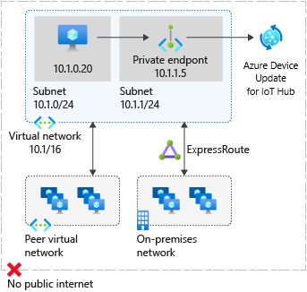

# Network security for Device Update for IoT Hub resources
This article describes how to use the following network security features when managing device updates: 

- Service tags in Network Security Groups and Azure Firewalls
- Private endpoints in Azure Virtual Networks

> [!IMPORTANT]
> Disabling Public Network Access in the linked **IoT Hub** is not supported by Device Update.

## Service tags
A service tag represents a group of IP address prefixes from a given Azure service. Microsoft manages the address prefixes encompassed by the service tag and automatically updates the service tag as addresses change, minimizing the complexity of frequent updates to network security rules. For more information about service tags, see [Service tags overview](../virtual-network/service-tags-overview.md).

You can use service tags to define network access controls on [network security groups](../virtual-network/network-security-groups-overview.md#security-rules) or [Azure Firewall](../firewall/service-tags.md). Use service tags in place of specific IP addresses when you create security rules. By specifying the service tag name (for example, **AzureDeviceUpdate**) in the appropriate *source* or *destination* field of a rule, you can allow or deny the traffic for the corresponding service.

| Service tag | Purpose | Can use inbound or outbound? | Can be regional? | Can use with Azure Firewall? |
| --- | -------- |:---:|:---:|:---:|
| AzureDeviceUpdate | Device Update for IoT Hub. | Both | No | Yes |

### Regional IP ranges
Because IoT Hub IP rules do not support Service Tags, you have to use AzureDeviceUpdate Service Tag IP prefixes instead. Because this tag is currently global, we are providing the following table for convenience. Please note that location is that of Device Update resources.  

| Location | IP ranges |
| --- | --- |  
| Australia East | 20.211.71.192/26,20.53.47.16/28,20.70.223.192/26,104.46.179.224/28,20.92.5.128/25,20.92.5.128/26 |
| East US | 20.119.27.192/26,20.119.28.128/26,20.62.132.240/28,20.62.135.128/27,20.62.135.160/28,20.59.77.64/26,20.59.81.64/26,20.66.3.208/28 |
| East US 2 | 20.119.155.192/26,20.62.59.16/28,20.98.195.192/26,20.40.229.32/28,20.98.148.192/26,20.98.148.64/26 |
| East US 2 EUAP | 20.47.236.192/26,20.47.237.128/26,20.51.20.64/28,20.228.1.0/26,20.45.241.192/26,20.46.11.192/28 |
| North Europe | 20.223.64.64/26,52.146.136.16/28,52.146.141.64/26,20.105.211.0/26,20.105.211.192/26,20.61.102.96/28,20.86.93.128/26 |
| South Central US | 20.65.133.64/28,20.97.35.64/26,20.97.39.192/26,20.125.162.0/26,20.49.119.192/28,20.51.7.64/26 |
| Southeast Asia | 20.195.65.112/28,20.195.87.128/26,20.212.79.64/26,20.195.72.112/28,20.205.49.128/26,20.205.67.192/26 |
| Sweden Central | 20.91.144.0/26,51.12.46.112/28,51.12.74.192/26,20.91.11.64/26,20.91.9.192/26,51.12.198.96/28 |
| UK South | 20.117.192.0/26,20.117.193.64/26,51.143.212.48/28,20.58.67.0/28,20.90.38.128/26,20.90.38.64/26 |
| West Europe | 20.105.211.0/26,20.105.211.192/26,20.61.102.96/28,20.86.93.128/26,20.223.64.64/26,52.146.136.16/28,52.146.141.64/26 |
| West US 2 | 20.125.0.128/26,20.125.4.0/25,20.51.12.64/26,20.83.222.128/26,20.69.0.112/28,20.69.4.128/26,20.69.4.64/26,20.69.8.192/26 |
| West US 3 | 20.118.138.192/26,20.118.141.64/26,20.150.244.16/28,20.119.27.192/26,20.119.28.128/26,20.62.132.240/28,20.62.135.128/27,20.62.135.160/28 |

> [!NOTE]
> IP prefixes above are unlikely to change but you should review the list once a month.

## Private endpoints
You can use [private endpoints](../private-link/private-endpoint-overview.md) to allow traffic from your virtual network to your Device Update accounts securely over a [private link](../private-link/private-link-overview.md) without going through the public internet. A private endpoint is a special network interface for an Azure service in your VNet. When you create a private endpoint for your Device Update account, it provides secure connectivity between clients on your VNet and your Device Update account. The private endpoint is assigned an IP address from the IP address range of your VNet. The connection between the private endpoint and the Device Update services uses a secure private link.

Using private endpoints for your Device Update resource enables you to:

- Secure access to your Device Update account from a VNet over the Microsoft backbone network as opposed to the public internet.
- Securely connect from on-premises networks that connect to the VNet using VPN or Express Routes with private-peering.

When you create a private endpoint for a Device Update account in your VNet, a consent request is sent for approval to the resource owner. If the user requesting the creation of the private endpoint is also an owner of the account, this consent request is automatically approved. Otherwise, the connection is in **pending** state until approved. Applications in the VNet can connect to the Device Update service over the private endpoint seamlessly, using the same hostname and authorization mechanisms that they would use otherwise. Account owners can manage consent requests and the private endpoints, through the **Private endpoints** tab for the resource in the Azure portal.

### Connect to private endpoints
Clients on a VNet using the private endpoint should use the same account hostname and authorization mechanisms as clients connecting to the public endpoint. DNS resolution automatically routes connections from the VNet to the account over a private link. Device Update creates a [private DNS zone](../dns/private-dns-overview.md) attached to the VNet with the necessary update for the private endpoints, by default. However, if you're using your own DNS server, you may need to make additional changes to your DNS configuration.

### DNS changes for private endpoints
When you create a private endpoint, the DNS CNAME record for the resource is updated to an alias in a subdomain with the prefix `privatelink`. By default, a private DNS zone is created that corresponds to the private link's subdomain. 

When you resolve the account endpoint URL from outside the VNet with the private endpoint, it resolves to the public endpoint of the service. The DNS resource records for account 'Contoso', when resolved from **outside the VNet** hosting the private endpoint, will be:

| Name                                          | Type      | Value                                         |
| --------------------------------------------- | ----------| --------------------------------------------- |  
| `contoso.api.adu.microsoft.com`             | CNAME     | `contoso.api.privatelink.adu.microsoft.com` |
| `contoso.api.privatelink.adu.microsoft.com` | CNAME     | \<Azure traffic manager profile\> |

When resolved from the VNet hosting the private endpoint, the account endpoint URL resolves to the private endpoint's IP address. The DNS resource records for the account 'Contoso', when resolved from **inside the VNet** hosting the private endpoint, will be:

| Name                                          | Type      | Value                                         |
| --------------------------------------------- | ----------| --------------------------------------------- |  
| `contoso.api.adu.microsoft.com`             | CNAME     | `contoso.api.privatelink.adu.microsoft.com` |
| `contoso.api.privatelink.adu.microsoft.com` | CNAME     | 10.0.0.5 |

This approach enables access to the account for clients on the VNet hosting the private endpoints, and clients outside the VNet.

If you're using a custom DNS server on your network, clients can resolve the FQDN for the device update account endpoint to the private endpoint IP address. Configure your DNS server to delegate your private link subdomain to the private DNS zone for the VNet, or configure the A records for `accountName.api.privatelink.adu.microsoft.com` with the private endpoint IP address.

The recommended DNS zone name is `privatelink.adu.microsoft.com`.

### Private endpoints and device update management

> [!NOTE]
> This section applies only to Device Update accounts that have public network access disabled and private endpoint connections manually approved.

The following table describes the various states of the private endpoint connection and the effects on device update management (importing, grouping and deploying):

| Connection State   |  Successfully manage device updates (Yes/No) |
| ------------------ | -------------------------------|
| Approved           | Yes                            |
| Rejected           | No                             |
| Pending            | No                             |
| Disconnected       | No                             |

For update management to be successful, the private endpoint connection state should be **approved**. If a connection is rejected, it can't be approved using the Azure portal. The only possibility is to delete the connection and create a new one instead.

## Next steps

* [Configure private endpoints](configure-private-endpoints.md).
