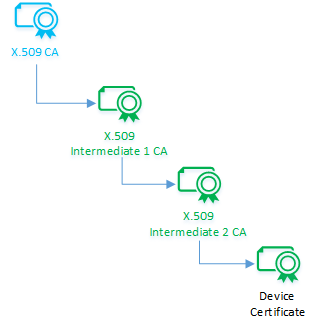

# Authenticate identities with X.509 certificates

IoT Hub uses X.509 certificates to authenticate devices. X.509 authentication allows authentication of an IoT device at the physical layer as part of the Transport Layer Security (TLS) standard connection establishment. 

An X.509 CA certificate is a digital certificate that can sign other certificates. A digital certificate is considered an X.509 certificate if it conforms to the certificate formatting standard prescribed by IETF's RFC 5280 standard. A certificate authority (CA) means that its holder can sign other certificates.

This article describes how to use X.509 certificate authority (CA) certificates to authenticate devices connecting to IoT Hub, which includes the following steps:

* How to get an X.509 CA certificate
* How to register the X.509 CA certificate to IoT Hub
* How to sign devices using X.509 CA certificates
* How devices signed with X.509 CA are authenticated

[!INCLUDE [iot-hub-include-x509-ca-signed-support-note](../../includes/iot-hub-include-x509-ca-signed-support-note.md)]

The X.509 CA feature enables device authentication to IoT Hub using a certificate authority (CA). It simplifies the initial device enrollment process and supply chain logistics during device manufacturing.

## Authentication and authorization

*Authentication* is the process of proving that you are who you say you are. Authentication verifies the identity of a user or device to IoT Hub. It's sometimes shortened to *AuthN*. *Authorization* is the process of confirming permissions for an authenticated user or device on IoT Hub. It specifies what resources and commands you're allowed to access, and what you can do with those resources and commands. Authorization is sometimes shortened to *AuthZ*.

This article describes authentication using **X.509 certificates**. You can use any X.509 certificate to authenticate a device with IoT Hub by uploading either a certificate thumbprint or a certificate authority (CA) to Azure IoT Hub. 

X.509 certificates are used for authentication in IoT Hub, not authorization. Unlike with Azure Active Directory and shared access signatures, you can't customize permissions with X.509 certificates.

## Enforce X.509 authentication

For additional security, an IoT hub can be configured to not allow SAS authentication for devices and modules, leaving X.509 as the only accepted authentication option. Currently, this feature isn't available in Azure portal. To configure, set `disableDeviceSAS` and `disableModuleSAS` to `true` on the IoT Hub resource properties:

```azurecli
az resource update -n <iothubName> -g <resourceGroupName> --resource-type Microsoft.Devices/IotHubs --set properties.disableDeviceSAS=true properties.disableModuleSAS=true
```

## Benefits of X.509 CA certificate authentication

X.509 certificate authority (CA) authentication is an approach for authenticating devices to IoT Hub using a method that dramatically simplifies device identity creation and life-cycle management in the supply chain.

A distinguishing attribute of X.509 CA authentication is the one-to-many relationship that a CA certificate has with its downstream devices. This relationship enables registration of any number of devices into IoT Hub by registering an X.509 CA certificate once. Otherwise, unique certificates would have to be pre-registered for every device before a device can connect. This one-to-many relationship also simplifies device certificates lifecycle management operations.

Another important attribute of X.509 CA authentication is simplification of supply chain logistics. Secure authentication of devices requires that each device holds a unique secret like a key as the basis for trust. In certificate-based authentication, this secret is a private key. A typical device manufacturing flow involves multiple steps and custodians. Securely managing device private keys across multiple custodians and maintaining trust is difficult and expensive. Using certificate authorities solves this problem by signing each custodian into a cryptographic chain of trust rather than entrusting them with device private keys. Each custodian signs devices at their respective step of the manufacturing flow. The overall result is an optimal supply chain with built-in accountability through use of the cryptographic chain of trust.

This process yields the most security when devices protect their unique private keys. To this end, we recommend using Hardware Secure Modules (HSM) capable of internally generating private keys.

The Azure IoT Hub Device Provisioning Service (DPS) makes it easy to provision groups of devices to hubs. For more information, see [Tutorial: Provision multiple X.509 devices using enrollment groups](../iot-dps/tutorial-custom-hsm-enrollment-group-x509.md).

## Get an X.509 CA certificate

The X.509 CA certificate is the top of the chain of certificates for each of your devices.  You may purchase or create one depending on how you intend to use it.

For production environments, we recommend that you purchase an X.509 CA certificate from a professional certificate services provider. Purchasing a CA certificate has the benefit of the root CA acting as a trusted third party to vouch for the legitimacy of your devices. Consider this option if your devices are part of an open IoT network where they interact with third-party products or services.

You may also create a self-signed X.509 CA certificate for testing purposes. For more information about creating certificates for testing, see [Create and upload certificates for testing](tutorial-x509-test-certs.md).

>[!NOTE]
>We do not recommend the use of self-signed certificates for production environments.

Regardless of how you obtain your X.509 CA certificate, make sure to keep its corresponding private key secret and protected always. This precaution is necessary for building trust in the X.509 CA authentication.

## Sign devices into the certificate chain of trust

The owner of an X.509 CA certificate can cryptographically sign an intermediate CA that can in turn sign another intermediate CA, and so on, until the last intermediate CA terminates this process by signing a device certificate. The result is a cascaded chain of certificates known as a *certificate chain of trust*. This delegation of trust is important because it establishes a cryptographically variable chain of custody and avoids sharing of signing keys.



The device certificate (also called a leaf certificate) must have its common name (CN) set to the **device ID** (`CN=deviceId`) that was used when registering the IoT device in Azure IoT Hub. This setting is required for authentication.

For modules using X.509 authentication, the module's certificate must have its common name (CN) formatted like `CN=deviceId/moduleId`.

Learn how to [create a certificate chain](https://github.com/Azure/azure-iot-sdk-c/blob/master/tools/CACertificates/CACertificateOverview.md) as done when signing devices.

## Register the X.509 CA certificate to IoT Hub

Register your X.509 CA certificate to IoT Hub, which uses it to authenticate your devices during registration and connection. Registering the X.509 CA certificate is a two-step process that includes uploading the certificate file and then establishing proof of possession.

The upload process entails uploading a file that contains your certificate. This file should never contain any private keys.

The proof of possession step involves a cryptographic challenge and response process between you and IoT Hub. Given that digital certificate contents are public and therefore susceptible to eavesdropping, IoT Hub has to verify that you really own the CA certificate. You can choose to either automatically or manually verify ownership. For manual verification, Azure IoT Hub generates a random challenge that you sign with the CA certificate's corresponding private key. If you kept the private key secret and protected as recommended, then only you possess the knowledge to complete this step. Secrecy of private keys is the source of trust in this method. After signing the challenge, you complete this step and manually verify your certificate by uploading a file containing the results.

Learn how to [register your CA certificate](tutorial-x509-test-certs.md#register-your-subordinate-ca-certificate-to-your-iot-hub).

## Authenticate devices signed with X.509 CA certificates

Every IoT hub has an identity registry that stores information about the devices and modules permitted to connect to it. Before a device or module can connect, there must be an entry for that device or module in the IoT hub's identity registry. A device or module authenticates with the IoT hub based on credentials stored in the identity registry.

With your X.509 CA certificate registered and devices signed into a certificate chain of trust, the final step is device authentication when the device connects. When an X.509 CA-signed device connects, it uploads its certificate chain for validation. The chain includes all intermediate CA and device certificates. With this information, IoT Hub authenticates the device in a two-step process. IoT Hub cryptographically validates the certificate chain for internal consistency, and then issues a proof-of-possession challenge to the device. IoT Hub declares the device authentic on a successful proof-of-possession response from the device. This declaration assumes that the device's private key is protected and that only the device can successfully respond to this challenge. We recommend using secure chips like Hardware Secure Modules (HSM) in devices to protect private keys.

A successful device connection to IoT Hub completes the authentication process and is also indicative of a proper setup. Every time a device connects, IoT Hub renegotiates the TLS session and verifies the device’s X.509 certificate.

## Revoke a device certificate

IoT Hub doesn't check certificate revocation lists from the certificate authority when authenticating devices with certificate-based authentication. If you have a device that needs to be blocked from connecting to IoT Hub because of a potentially compromised certificate, you should disable the device in the identity registry. For more information, see [Disable or delete a device in an IoT hub](./iot-hub-create-through-portal.md#disable-or-delete-a-device-in-an-iot-hub).

## Example scenario

Company-X makes Smart-X-Widgets that are designed for professional installation. Company-X outsources both manufacturing and installation. Factory-Y manufactures the Smart-X-Widgets and Technician-Z installs them. Company-X wants the Smart-X-Widget shipped directly from Factory-Y to Technician-Z for installation and then for it to connect directly to Company-X's instance of IoT Hub. To make this happen, Company-X need to complete a few one-time setup operations to prime Smart-X-Widget for automatic connection. This end-to-end scenario includes the following steps:

1. Acquire the X.509 CA certificate

2. Register the X.509 CA certificate to IoT Hub

3. Sign devices into a certificate chain of trust

4. Connect the devices

These steps are demonstrated in [Tutorial: Create and upload certificates for testing](./tutorial-x509-test-certs.md).

### Acquire the certificate

Company-X can either purchase an X.509 CA certificate from a public root certificate authority or create one through a self-signed process. Either option entails two basic steps: generating a public/private key pair and signing the public key into a certificate.

Details on how to accomplish these steps differ with various service providers.

:::image type="content" source="./media/iot-hub-x509ca-concept/csr-flow.png" alt-text="Diagram showing the flow for generating an X.509 CA certificate." lightbox="./media/iot-hub-x509ca-concept/csr-flow.png":::

#### Purchase a certificate

Purchasing a CA certificate has the benefit of having a well-known root CA act as a trusted third party to vouch for the legitimacy of IoT devices when the devices connect. Choose this option if your devices interact with third-party products or services.

To purchase an X.509 CA certificate, choose a root certificate service provider. The root CA provider will guide you on how to create the public/private key pair and how to generate a certificate signing request (CSR) for their services. A CSR is the formal process of applying for a certificate from a certificate authority. The outcome of this purchase is a certificate for use as an authority certificate. Given the ubiquity of X.509 certificates, the certificate is likely to have been properly formatted to IETF's RFC 5280 standard.

#### Create a self-signed certificate

The process to create a self-signed X.509 CA certificate is similar to purchasing one, except that it doesn't involve a third-party signer like the root certificate authority. In our example, Company-X would sign its authority certificate instead of a root certificate authority.

You might choose this option for testing until you're ready to purchase an authority certificate. You could also use a self-signed X.509 CA certificate in production if your devices don't connect to any third-party services outside of IoT Hub.

### Register the certificate to IoT Hub

Company-X needs to register the X.509 CA to IoT Hub where it serves to authenticate Smart-X-Widgets as they connect. This one-time process enables the ability to authenticate and manage any number of Smart-X-Widget devices. The one-to-many relationship between CA certificate and device certificates is one of the main advantages of using the X.509 CA authentication method. The alternative would be to upload individual certificate thumbprints for each and every Smart-X-Widget device, thereby adding to operational costs.

Registering the X.509 CA certificate is a two-step process: upload the certificate then provide proof-of-possession.

:::image type="content" source="./media/iot-hub-x509ca-concept/pop-flow.png" alt-text="Diagram showing the process flow for registering an X.509 CA certificate." lightbox="./media/iot-hub-x509ca-concept/pop-flow.png":::

#### Upload the certificate

The X.509 CA certificate upload process is just that: uploading the CA certificate to IoT Hub. IoT Hub expects the certificate in a file.

The certificate file must not under any circumstances contain any private keys. Best practices from standards governing Public Key Infrastructure (PKI) mandates that knowledge of Company-X's private key resides exclusively within Company-X.

#### Prove possession

The X.509 CA certificate, just like any digital certificate, is public information that is susceptible to eavesdropping. As such, an eavesdropper may intercept a certificate and try to upload it as their own. In our example, IoT Hub has to make sure that the CA certificate Company-X uploaded really belongs to Company-X. It does so by challenging Company-X to prove that they possess the certificate through a [proof-of-possession (PoP) flow](https://tools.ietf.org/html/rfc5280#section-3.1).

For the proof-of-possession flow, IoT Hub generates a random number to be signed by Company-X using its private key. If Company-X followed PKI best practices and protected their private key, then only they would be able to correctly respond to the proof-of-possession challenge. IoT Hub proceeds to register the X.509 CA certificate upon a successful response of the proof-of-possession challenge.

A successful response to the proof-of-possession challenge from IoT Hub completes the X.509 CA registration.

### Sign devices into a certificate chain of trust

IoT requires a unique identity for every device that connects. For certificate-based authentication, these identities are in the form of certificates. In our example, certificate-based authentication means that every Smart-X-Widget must possess a unique device certificate.

A valid but inefficient way to provide unique certificates on each device is to pre-generate certificates for Smart-X-Widgets and to trust supply chain partners with the corresponding private keys. For Company-X, this means entrusting both Factory-Y and Technician-Z. This method comes with challenges that must be overcome to ensure trust, as follows:

* Having to share device private keys with supply chain partners, besides ignoring PKI best practices of never sharing private keys, makes building trust in the supply chain expensive. It requires systems like secure rooms to house device private keys and processes like periodic security audits. Both add cost to the supply chain.

* Securely accounting for devices in the supply chain, and later managing them in deployment, becomes a one-to-one task for every key-to-device pair from the point of device unique certificate (and private key) generation to device retirement. This precludes group management of devices unless the concept of groups is explicitly built into the process somehow. Secure accounting and device life-cycle management, therefore, becomes a heavy operations burden.

X.509 CA certificate authentication offers elegant solutions to these challenges by using certificate chains. A certificate chain results from a CA signing an intermediate CA that in turn signs another intermediate CA, and so on, until a final intermediate CA signs a device. In our example, Company-X signs Factory-Y, which in turn signs Technician-Z that finally signs Smart-X-Widget.

:::image type="content" source="./media/iot-hub-x509ca-concept/cert-chain-hierarchy.png" alt-text="Diagram showing an example of a certificate chain hierarchy." lightbox="./media/iot-hub-x509ca-concept/cert-chain-hierarchy.png":::

This cascade of certificates in the chain represents the logical hand-off of authority. Many supply chains follow this logical hand-off whereby each intermediate CA gets signed into the chain while receiving all upstream CA certificates, and the last intermediate CA finally signs each device and injects all the authority certificates from the chain into the device. This hand-off is common when the contracted manufacturing company with a hierarchy of factories commissions a particular factory to do the manufacturing. While the hierarchy may be several levels deep (for example, by geography/product type/manufacturing line), only the factory at the end gets to interact with the device but the chain is maintained from the top of the hierarchy.

Alternate chains may have different intermediate CAs interact with the device in which case the CA interacting with the device injects certificate chain content at that point. Hybrid models are also possible where only some of the CA has physical interaction with the device.

The following diagram shows how the certificate chain of trust comes together in our Smart-X-Widget example.

:::image type="content" source="./media/iot-hub-x509ca-concept/cert-mfr-chain.png" alt-text="Diagram showing the certificate chain of trust from the certificates of one company to the certificates of another company." lightbox="./media/iot-hub-x509ca-concept/cert-mfr-chain.png":::

1. Company-X never physically interacts with any of the Smart-X-Widgets. It initiates the certificate chain of trust by signing Factory-Y's intermediate CA certificate.
1. Factory-Y now has its own intermediate CA certificate and a signature from Company-X. It passes copies of these items to the device. It also uses its intermediate CA certificate to sign Technician-Z's intermediate CA certificate and the Smart-X-Widget device certificate.
1. Technician-Z now has its own intermediate CA certificate and a signature from Factory-Y. It passes copies of these items to the device. It also uses its intermediate CA certificate to sign the Smart-X-Widget device certificate.
1. Every Smart-X-Widget device now has its own unique device certificate and copies of the public keys and signatures from each intermediate CA certificate that it interacted with throughout the supply chain. These certificates and signatures can be traced back to the original Company-X root.

The CA method of authentication infuses secure accountability into the device manufacturing supply chain. Because of the certificate chain process, the actions of every member in the chain are cryptographically recorded and verifiable.

This process relies on the assumption that the unique device public/private key pair is created independently and that the private key is protected within the device always. Fortunately, secure silicon chips exist in the form of Hardware Secure Modules (HSM) that are capable of internally generating keys and protecting private keys. Company-X only needs to add one such secure chip into Smart-X-Widget's component bill of materials.

### Authenticate devices

Once the top level CA certificate is registered to IoT Hub and the devices have their unique certificates, how do they connect? By registering an X.509 CA certificate to IoT Hub one time, how do potentially millions of devices connect and get authenticated from the first time? Through the same certificate upload and proof-of-possession flow that we earlier encountered with registering the X.509 CA certificate.

Devices manufactured for X.509 CA authentication are equipped with unique device certificates and a certificate chain from their respective manufacturing supply chain. Device connection, even for the first time, happens in a two-step process: certificate chain upload and proof-of-possession.

During the certificate chain upload, the device uploads its unique certificate and its certificate chain to IoT Hub. Using the pre-registered X.509 CA certificate, IoT Hub validates that the uploaded certificate chain is internally consistent and that the chain was originated by the valid owner of the X.509 CA certificate. As with the X.509 CA registration process, IoT Hub uses a proof-of-possession challenge-response process to ascertain that the chain, and therefore the device certificate, belongs to the device uploading it. A successful response triggers IoT Hub to accept the device as authentic and grant it connection.

In our example, each Smart-X-Widget would upload its device unique certificate together with Factory-Y and Technician-Z X.509 CA certificates and then respond to the proof-of-possession challenge from IoT Hub.

:::image type="content" source="./media/iot-hub-x509ca-concept/device-pop-flow.png" alt-text="Diagram showing the flow for validating a device certificate." lightbox="./media/iot-hub-x509ca-concept/device-pop-flow.png":::

The foundation of trust rests in protecting private keys, including device private keys. We therefore can't stress enough the importance of secure silicon chips in the form of Hardware Secure Modules (HSM) for protecting device private keys, and the overall best practice of never sharing any private keys, like one factory entrusting another with its private key.

## Next steps

Use the Device Provisioning Service to [Provision multiple X.509 devices using enrollment groups](../iot-dps/tutorial-custom-hsm-enrollment-group-x509.md).

To learn more about the fields that make up an X.509 certificate, see [X.509 certificates](reference-x509-certificates.md).

If you have a root CA certificate or subordinate CA certificate and you want to upload it to your IoT hub, you must verify that you own that certificate. For more information, see [Tutorial: Create and upload certificates for testing](tutorial-x509-test-certs.md).