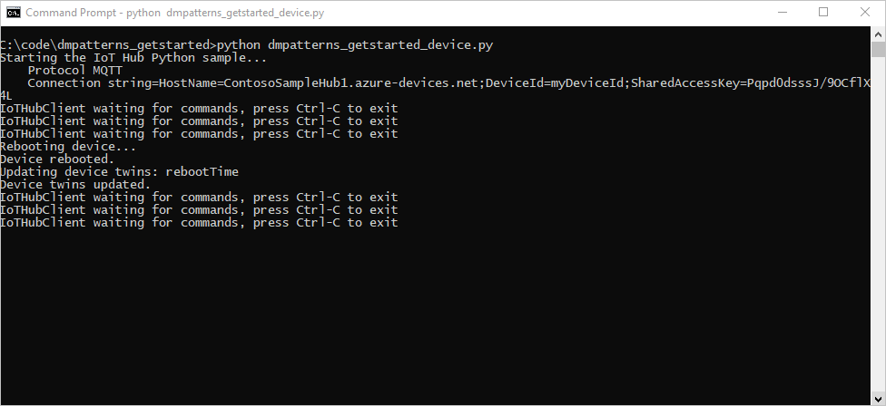
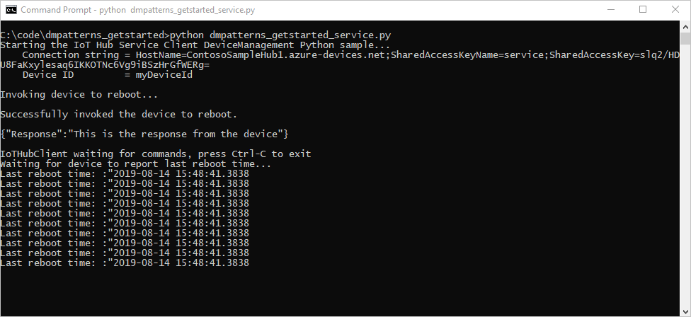

# Get started with device management (Python)

[!INCLUDE [iot-hub-selector-dm-getstarted](../../includes/iot-hub-selector-dm-getstarted.md)]

[!INCLUDE [iot-hub-include-dm-getstarted](../../includes/iot-hub-include-dm-getstarted.md)]

This article shows you how to create:

* **dmpatterns_getstarted_device.py**: a simulated device app with a direct method that reboots the device and reports the last reboot time. Direct methods are invoked from the cloud.

* **dmpatterns_getstarted_service.py**: a Python console app that calls the direct method in the simulated device app through your IoT hub. It displays the response and updated reported properties.

> [!NOTE]
> For more information about the SDK tools available to build both device and back-end apps, see [Azure IoT SDKs](iot-hub-devguide-sdks.md).

## Prerequisites

* An active Azure account. (If you don't have an account, you can create a [free account](https://azure.microsoft.com/pricing/free-trial/) in just a couple of minutes.)

* An IoT hub. Create one with the [CLI](iot-hub-create-using-cli.md) or the [Azure portal](iot-hub-create-through-portal.md).

* A registered device. Register one in the [Azure portal](iot-hub-create-through-portal.md#register-a-new-device-in-the-iot-hub).

* [Python version 3.7 or later](https://www.python.org/downloads/) is recommended. Make sure to use the 32-bit or 64-bit installation as required by your setup. When prompted during the installation, make sure to add Python to your platform-specific environment variable.

* Make sure that port 8883 is open in your firewall. The device sample in this article uses MQTT protocol, which communicates over port 8883. This port may be blocked in some corporate and educational network environments. For more information and ways to work around this issue, see [Connecting to IoT Hub (MQTT)](../iot/iot-mqtt-connect-to-iot-hub.md#connecting-to-iot-hub).

## Register a new device in the IoT hub

[!INCLUDE [iot-hub-get-started-create-device-identity](../../includes/iot-hub-get-started-create-device-identity.md)]

## Create a device app with a direct method

In this section, you:

* Create a Python console app that responds to a direct method called by the cloud.

* Simulate a device reboot.

* Use the reported properties to enable device twin queries to identify devices and when they last rebooted.

In Azure Cloud Shell you used previously, or any other environment with Python, create the device code.

1. At your command prompt, run the following command to install the **azure-iot-device** package:

    ```cmd/sh
    pip install azure-iot-device
    ```

2. Using a text editor, create a file named **dmpatterns_getstarted_device.py** in your working directory.

3. Add the following `import` statements at the start of the **dmpatterns_getstarted_device.py** file.

    ```python
    import time
    import datetime
    from azure.iot.device import IoTHubDeviceClient, MethodResponse
    ```

4. Add the **CONNECTION_STRING** variable. Replace the `{deviceConnectionString}` placeholder value with your device connection string. You copied this connection string previously in [Register a new device in the IoT hub](#register-a-new-device-in-the-iot-hub).  

    ```python
    CONNECTION_STRING = "{deviceConnectionString}"
    ```

5. Add the following function to instantiate a client configured for direct methods on the device.

    ```python
    def create_client():
        # Instantiate the client
        client = IoTHubDeviceClient.create_from_connection_string(CONNECTION_STRING)

        # Define the handler for method requests
        def method_request_handler(method_request):
            if method_request.name == "rebootDevice":
                # Act on the method by rebooting the device
                print("Rebooting device")
                time.sleep(20)
                print("Device rebooted")

                # ...and patching the reported properties
                current_time = str(datetime.datetime.now())
                reported_props = {"rebootTime": current_time}
                client.patch_twin_reported_properties(reported_props)
                print( "Device twins updated with latest rebootTime")

                # Create a method response indicating the method request was resolved
                resp_status = 200
                resp_payload = {"Response": "This is the response from the device"}
                method_response = MethodResponse(method_request.request_id, resp_status, resp_payload)
            
            else:
                # Create a method response indicating the method request was for an unknown method
                resp_status = 404
                resp_payload = {"Response": "Unknown method"}
                method_response = MethodResponse(method_request.request_id, resp_status, resp_payload)

            # Send the method response
            client.send_method_response(method_response)

        try:
            # Attach the handler to the client
            client.on_method_request_received = method_request_handler
        except:
            # In the event of failure, clean up
            client.shutdown()

        return client
    ```

6. Start the direct method sample and wait.

    ```python
    def main():
        print ("Starting the IoT Hub Python sample...")
        client = create_client()

        print ("Waiting for commands, press Ctrl-C to exit")
        try:
            # Wait for program exit
            while True:
                time.sleep(1000)
        except KeyboardInterrupt:
            print("IoTHubDeviceClient sample stopped")
        finally:
            # Graceful exit
            print("Shutting down IoT Hub Client")
            client.shutdown()

    if __name__ == '__main__':
        main()
    ```

7. Save and close the **dmpatterns_getstarted_device.py** file.

> [!NOTE]
> To keep things simple, this tutorial does not implement any retry policy. In production code, you should implement retry policies (such as an exponential backoff), as suggested in the article, [Transient Fault Handling](/azure/architecture/best-practices/transient-faults).

## Get the IoT hub connection string

[!INCLUDE [iot-hub-howto-device-management-shared-access-policy-text](../../includes/iot-hub-howto-device-management-shared-access-policy-text.md)]

[!INCLUDE [iot-hub-include-find-service-connection-string](../../includes/iot-hub-include-find-service-connection-string.md)]

## Create a service app to trigger a reboot

In this section, you create a Python console app that initiates a remote reboot on a device using a direct method. The app uses device twin queries to discover the last reboot time for that device.

In Azure Cloud Shell or any other environment with Python, create the console code.

1. At your command prompt, run the following command to install the **azure-iot-hub** package:

    ```cmd/sh
    pip install azure-iot-hub
    ```

2. Using a text editor, create a file named **dmpatterns_getstarted_service.py** in your working directory.

3. Add the following `import` statements at the start of the **dmpatterns_getstarted_service.py** file.

    ```python
    import sys, time

    from azure.iot.hub import IoTHubRegistryManager
    from azure.iot.hub.models import CloudToDeviceMethod, CloudToDeviceMethodResult, Twin
    ```

4. Add the following variable declarations. Replace the `{IoTHubConnectionString}` placeholder value with the IoT hub connection string you copied previously in [Get the IoT hub connection string](#get-the-iot-hub-connection-string). Replace the `{deviceId}` placeholder value with the device ID you registered in [Register a new device in the IoT hub](#register-a-new-device-in-the-iot-hub).

    ```python
    CONNECTION_STRING = "{IoTHubConnectionString}"
    DEVICE_ID = "{deviceId}"

    METHOD_NAME = "rebootDevice"
    METHOD_PAYLOAD = "{\"method_number\":\"42\"}"
    TIMEOUT = 60
    WAIT_COUNT = 10
    ```

5. Add the following function to invoke the device method to reboot the target device, then query for the device twins and get the last reboot time.

    ```python
    def iothub_devicemethod_sample_run():
        try:
            # Create IoTHubRegistryManager
            registry_manager = IoTHubRegistryManager(CONNECTION_STRING)

            print ( "" )
            print ( "Invoking device to reboot..." )

            # Call the direct method.
            deviceMethod = CloudToDeviceMethod(method_name=METHOD_NAME, payload=METHOD_PAYLOAD)
            response = registry_manager.invoke_device_method(DEVICE_ID, deviceMethod)

            print ( "" )
            print ( "Successfully invoked the device to reboot." )

            print ( "" )
            print ( response.payload )

            while True:
                print ( "" )
                print ( "IoTHubClient waiting for commands, press Ctrl-C to exit" )

                status_counter = 0
                while status_counter <= WAIT_COUNT:
                    twin_info = registry_manager.get_twin(DEVICE_ID)

                    if twin_info.properties.reported.get("rebootTime") != None :
                        print ("Last reboot time: " + twin_info.properties.reported.get("rebootTime"))
                    else:
                        print ("Waiting for device to report last reboot time...")

                    time.sleep(5)
                    status_counter += 1

        except Exception as ex:
            print ( "" )
            print ( "Unexpected error {0}".format(ex) )
            return
        except KeyboardInterrupt:
            print ( "" )
            print ( "IoTHubDeviceMethod sample stopped" )

    if __name__ == '__main__':
        print ( "Starting the IoT Hub Service Client DeviceManagement Python sample..." )
        print ( "    Connection string = {0}".format(CONNECTION_STRING) )
        print ( "    Device ID         = {0}".format(DEVICE_ID) )

        iothub_devicemethod_sample_run()
    ```

6. Save and close the **dmpatterns_getstarted_service.py** file.

## Run the apps

You're now ready to run the device code and the service code that initiates a reboot of the device.

1. At the command prompt where you created the device, run the following command to begin listening for the reboot direct method.

    ```cmd/sh
    python dmpatterns_getstarted_device.py
    ```

2. At the command prompt where you create the service, run the following command to trigger the remote reboot and query for the device twin to find the last reboot time.

    ```cmd/sh
    python dmpatterns_getstarted_service.py
    ```

3. You see the device response to the direct method in the console.

   The following shows the device response to the reboot direct method:

   

   The following shows the service calling the reboot direct method and polling the device twin for status:

   

[!INCLUDE [iot-hub-dm-followup](../../includes/iot-hub-dm-followup.md)]
