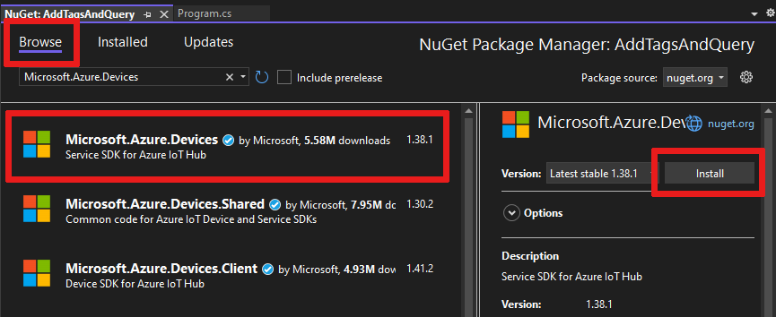

# Get started with device twins (.NET)

[!INCLUDE [iot-hub-selector-twin-get-started](../../includes/iot-hub-selector-twin-get-started.md)]

This article shows you how to:

* Use a simulated device app to report its connectivity channel as a reported property on the device twin.

* Query devices from your back-end app using filters on the tags and properties previously created.

In this article, you create two .NET console apps:

* **AddTagsAndQuery**: a back-end app that adds tags and queries device twins.

* **ReportConnectivity**: a simulated device app that connects to your IoT hub and reports its connectivity condition.

> [!NOTE]
> See [Azure IoT SDKs](iot-hub-devguide-sdks.md) for more information about the SDK tools available to build both device and back-end apps.

## Prerequisites

* Visual Studio.

* An IoT hub. Create one with the [CLI](iot-hub-create-using-cli.md) or the [Azure portal](iot-hub-create-through-portal.md).

* A registered device. Register one in the [Azure portal](iot-hub-create-through-portal.md#register-a-new-device-in-the-iot-hub).

* Make sure that port 8883 is open in your firewall. The device sample in this article uses MQTT protocol, which communicates over port 8883. This port may be blocked in some corporate and educational network environments. For more information and ways to work around this issue, see [Connecting to IoT Hub (MQTT)](../iot/iot-mqtt-connect-to-iot-hub.md#connecting-to-iot-hub).

## Get the IoT hub connection string

[!INCLUDE [iot-hub-howto-twin-shared-access-policy-text](../../includes/iot-hub-howto-twin-shared-access-policy-text.md)]

[!INCLUDE [iot-hub-include-find-custom-connection-string](../../includes/iot-hub-include-find-custom-connection-string.md)]

## Create a device app that updates reported properties

In this section, you create a .NET console app that connects to your hub as **myDeviceId**, and then updates its reported properties to confirm that it's connected using a cellular network.

1. Open Visual Studio and select **Create new project**.

1. Choose **Console App (.NET Framework)**, then select **Next**.

1. In **Configure your new project**, name the project **ReportConnectivity**, then select **Next**.

1. In Solution Explorer, right-click the **ReportConnectivity** project, and then select **Manage NuGet Packages**.

1. Keep the default .NET Framework, then select **Create** to create the project.

1. Select **Browse** and search for and choose **Microsoft.Azure.Devices.Client**. Select **Install**.

   This step downloads, installs, and adds a reference to the [Azure IoT device SDK](https://www.nuget.org/packages/Microsoft.Azure.Devices.Client/) NuGet package and its dependencies.

1. Add the following `using` statements at the top of the **Program.cs** file:

   ```csharp  
   using Microsoft.Azure.Devices.Client;
   using Microsoft.Azure.Devices.Shared;
   using Newtonsoft.Json;
   ```

1. Add the following fields to the **Program** class. Replace `{device connection string}` with the device connection string you saw when you registered a device in the IoT Hub:

   ```csharp  
   static string DeviceConnectionString = "HostName=<yourIotHubName>.azure-devices.net;DeviceId=<yourIotDeviceName>;SharedAccessKey=<yourIotDeviceAccessKey>";
   static DeviceClient Client = null;
   ```

1. Add the following method to the **Program** class:

   ```csharp
   public static async void InitClient()
   {
       try
       {
           Console.WriteLine("Connecting to hub");
           Client = DeviceClient.CreateFromConnectionString(DeviceConnectionString, 
             TransportType.Mqtt);
           Console.WriteLine("Retrieving twin");
           await Client.GetTwinAsync();
       }
       catch (Exception ex)
       {
           Console.WriteLine();
           Console.WriteLine("Error in sample: {0}", ex.Message);
       }
   }
   ```

   The **Client** object exposes all the methods you require to interact with device twins from the device. The code shown above initializes the **Client** object, and then retrieves the device twin for **myDeviceId**.

1. Add the following method to the **Program** class:

   ```csharp  
   public static async void ReportConnectivity()
   {
       try
       {
           Console.WriteLine("Sending connectivity data as reported property");

           TwinCollection reportedProperties, connectivity;
           reportedProperties = new TwinCollection();
           connectivity = new TwinCollection();
           connectivity["type"] = "cellular";
           reportedProperties["connectivity"] = connectivity;
           await Client.UpdateReportedPropertiesAsync(reportedProperties);
       }
       catch (Exception ex)
       {
           Console.WriteLine();
           Console.WriteLine("Error in sample: {0}", ex.Message);
       }
   }
   ```

   The code above updates the reported property of  **myDeviceId** with the connectivity information.

1. Finally, add the following lines to the **Main** method:

   ```csharp
   try
   {
       InitClient();
       ReportConnectivity();
   }
   catch (Exception ex)
   {
       Console.WriteLine();
       Console.WriteLine("Error in sample: {0}", ex.Message);
   }
   Console.WriteLine("Press Enter to exit.");
   Console.ReadLine();
   ```

1. In Solution Explorer, right-click on your solution, and select **Set StartUp Projects**.

1. In **Common Properties** > **Startup Project**, select **Multiple startup projects**. For **ReportConnectivity**, select **Start** as the **Action**. Select **OK** to save your changes.  

1. Run this app by right-clicking the **ReportConnectivity** project and selecting **Debug**, then **Start new instance**. You should see the app getting the twin information, and then sending connectivity as a ***reported property***.

   

   After the device reported its connectivity information, it should appear in both queries.

1. Right-click the **AddTagsAndQuery** project and select **Debug** > **Start new instance** to run the queries again. This time, **myDeviceId** should appear in both query results.

   

## Create a service app that updates desired properties and queries twins

In this section, you create a .NET console app, using C#, that adds location metadata to the device twin associated with **myDeviceId**. The app queries IoT hub for devices located in the US and then queries devices that report a cellular network connection.

1. In Visual Studio, select **File > New > Project**. In **Create a new project**, select **Console App (.NET Framework)**, and then select **Next**.

1. In **Configure your new project**, name the project **AddTagsAndQuery**, the select **Next**.

   :::image type="content" source="./media/device-twins-dotnet/config-addtagsandquery-app.png" alt-text="Screenshot of how to create a new Visual Studio project." lightbox="./media/device-twins-dotnet/config-addtagsandquery-app.png":::

1. Accept the default version of the .NET Framework, then select **Create** to create the project.

1. In Solution Explorer, right-click the **AddTagsAndQuery** project, and then select **Manage NuGet Packages**.

1. Select **Browse** and search for and select **Microsoft.Azure.Devices**. Select **Install**.

   

   This step downloads, installs, and adds a reference to the [Azure IoT service SDK](https://www.nuget.org/packages/Microsoft.Azure.Devices/) NuGet package and its dependencies.

1. Add the following `using` statements at the top of the **Program.cs** file:

   ```csharp  
   using Microsoft.Azure.Devices;
   ```

1. Add the following fields to the **Program** class. Replace `{iot hub connection string}` with the IoT Hub connection string that you copied in [Get the IoT hub connection string](#get-the-iot-hub-connection-string).

   ```csharp  
   static RegistryManager registryManager;
   static string connectionString = "{iot hub connection string}";
   ```

1. Add the following method to the **Program** class:

   ```csharp  
   public static async Task AddTagsAndQuery()
   {
       var twin = await registryManager.GetTwinAsync("myDeviceId");
       var patch =
           @"{
               tags: {
                   location: {
                       region: 'US',
                       plant: 'Redmond43'
                   }
               }
           }";
       await registryManager.UpdateTwinAsync(twin.DeviceId, patch, twin.ETag);

       var query = registryManager.CreateQuery(
         "SELECT * FROM devices WHERE tags.location.plant = 'Redmond43'", 100);
       var twinsInRedmond43 = await query.GetNextAsTwinAsync();
       Console.WriteLine("Devices in Redmond43: {0}", 
         string.Join(", ", twinsInRedmond43.Select(t => t.DeviceId)));

       query = registryManager.CreateQuery("SELECT * FROM devices WHERE tags.location.plant = 'Redmond43' AND properties.reported.connectivity.type = 'cellular'", 100);
       var twinsInRedmond43UsingCellular = await query.GetNextAsTwinAsync();
       Console.WriteLine("Devices in Redmond43 using cellular network: {0}", 
         string.Join(", ", twinsInRedmond43UsingCellular.Select(t => t.DeviceId)));
   }
   ```

   The **RegistryManager** class exposes all the methods required to interact with device twins from the service. The previous code first initializes the **registryManager** object, then retrieves the device twin for **myDeviceId**, and finally updates its tags with the desired location information.

   After updating, it executes two queries: the first selects only the device twins of devices located in the **Redmond43** plant, and the second refines the query to select only the devices that are also connected through cellular network.

   The previous code, when it creates the **query** object, specifies a maximum number of returned documents. The **query** object contains a **HasMoreResults** boolean property that you can use to invoke the **GetNextAsTwinAsync** methods multiple times to retrieve all results. A method called **GetNextAsJson** is available for results that are not device twins, for example, results of aggregation queries.

1. Finally, add the following lines to the **Main** method:

   ```csharp  
   registryManager = RegistryManager.CreateFromConnectionString(connectionString);
   AddTagsAndQuery().Wait();
   Console.WriteLine("Press Enter to exit.");
   Console.ReadLine();
   ```

1. Run this application by right-clicking on the **AddTagsAndQuery** project and selecting **Debug**, followed by **Start new instance**. You should see one device in the results for the query asking for all devices located in **Redmond43** and none for the query that restricts the results to devices that use a cellular network.

   

In this article, you:

* Added device metadata as tags from a back-end app
* Reported device connectivity information in the device twin
* Queried the device twin information, using SQL-like IoT Hub query language

## Next steps

To learn how to:

* Send telemetry from devices, see [Quickstart: Send telemetry from an IoT Plug and Play device to Azure IoT Hub](../iot-develop/quickstart-send-telemetry-iot-hub.md?pivots=programming-language-csharp).

* Configure devices using device twin's desired properties, see [Tutorial: Configure your devices from a back-end service](tutorial-device-twins.md).

* Control devices interactively, such as turning on a fan from a user-controlled app, see [Quickstart: Control a device connected to an IoT hub](./quickstart-control-device.md?pivots=programming-language-csharp).
