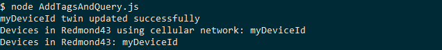
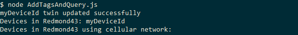

# Get started with device twins (Node.js)

[!INCLUDE [iot-hub-selector-twin-get-started](../../includes/iot-hub-selector-twin-get-started.md)]

This article shows you how to:

* Use a simulated device app to report its connectivity channel as a reported property on the device twin.

* Query devices from your back-end app using filters on the tags and properties previously created.

In this article, you create two Node.js console apps:

* **AddTagsAndQuery.js**: a back-end app that adds tags and queries device twins.

* **TwinSimulatedDevice.js**: a simulated device app that connects to your IoT hub and reports its connectivity condition.

> [!NOTE]
> See [Azure IoT SDKs](iot-hub-devguide-sdks.md) for more information about the SDK tools available to build both device and back-end apps.

## Prerequisites

To complete this article, you need:

* An IoT hub. Create one with the [CLI](iot-hub-create-using-cli.md) or the [Azure portal](iot-hub-create-through-portal.md).

* A registered device. Register one in the [Azure portal](iot-hub-create-through-portal.md#register-a-new-device-in-the-iot-hub).

* Node.js version 10.0.x or later.

* Make sure that port 8883 is open in your firewall. The device sample in this article uses MQTT protocol, which communicates over port 8883. This port may be blocked in some corporate and educational network environments. For more information and ways to work around this issue, see [Connecting to IoT Hub (MQTT)](../iot/iot-mqtt-connect-to-iot-hub.md#connecting-to-iot-hub).

## Get the IoT hub connection string

[!INCLUDE [iot-hub-howto-twin-shared-access-policy-text](../../includes/iot-hub-howto-twin-shared-access-policy-text.md)]

[!INCLUDE [iot-hub-include-find-custom-connection-string](../../includes/iot-hub-include-find-custom-connection-string.md)]

## Create a device app that updates reported properties

In this section, you create a Node.js console app that connects to your hub as **myDeviceId**, and then updates its device twin's reported properties to confirm that it's connected using a cellular network.

1. Create a new empty folder called **reportconnectivity**. In the **reportconnectivity** folder, create a new package.json file using the following command at your command prompt. The `--yes` parameter accepts all the defaults.

    ```cmd/sh
    npm init --yes
    ```

2. At your command prompt in the **reportconnectivity** folder, run the following command to install the **azure-iot-device**, and **azure-iot-device-mqtt** packages:

    ```cmd/sh
    npm install azure-iot-device azure-iot-device-mqtt --save
    ```

3. Using a text editor, create a new **ReportConnectivity.js** file in the **reportconnectivity** folder.

4. Add the following code to the **ReportConnectivity.js** file. Replace `{device connection string}` with the device connection string you saw when you registered a device in the IoT Hub:

    ```javascript
        'use strict';
        var Client = require('azure-iot-device').Client;
        var Protocol = require('azure-iot-device-mqtt').Mqtt;

        var connectionString = '{device connection string}';
        var client = Client.fromConnectionString(connectionString, Protocol);

        client.open(function(err) {
        if (err) {
            console.error('could not open IotHub client');
        }  else {
            console.log('client opened');

            client.getTwin(function(err, twin) {
            if (err) {
                console.error('could not get twin');
            } else {
                var patch = {
                    connectivity: {
                        type: 'cellular'
                    }
                };

                twin.properties.reported.update(patch, function(err) {
                    if (err) {
                        console.error('could not update twin');
                    } else {
                        console.log('twin state reported');
                        process.exit();
                    }
                });
            }
            });
        }
        });
    ```

    The **Client** object exposes all the methods you require to interact with device twins from the device. The previous code, after it initializes the **Client** object, retrieves the device twin for **myDeviceId** and updates its reported property with the connectivity information.

5. Run the device app

    ```cmd/sh
        node ReportConnectivity.js
    ```

    You should see the message `twin state reported`.

6. Now that the device reported its connectivity information, it should appear in both queries. Go back in the **addtagsandqueryapp** folder and run the queries again:

    ```cmd/sh
        node AddTagsAndQuery.js
    ```

    This time **myDeviceId** should appear in both query results.

    

## Create a service app that updates desired properties and queries twins

In this section, you create a Node.js console app that adds location metadata to the device twin associated with **myDeviceId**. The app queries IoT hub for devices located in the US and then queries devices that report a cellular network connection.

1. Create a new empty folder called **addtagsandqueryapp**. In the **addtagsandqueryapp** folder, create a new package.json file using the following command at your command prompt. The `--yes` parameter accepts all the defaults.

    ```cmd/sh
    npm init --yes
    ```

2. At your command prompt in the **addtagsandqueryapp** folder, run the following command to install the **azure-iothub** package:

    ```cmd/sh
    npm install azure-iothub --save
    ```

3. Using a text editor, create a new **AddTagsAndQuery.js** file in the **addtagsandqueryapp** folder.

4. Add the following code to the **AddTagsAndQuery.js** file. Replace `{iot hub connection string}` with the IoT Hub connection string you copied in [Get the IoT hub connection string](#get-the-iot-hub-connection-string).

   ``` javascript
        'use strict';
        var iothub = require('azure-iothub');
        var connectionString = '{iot hub connection string}';
        var registry = iothub.Registry.fromConnectionString(connectionString);

        registry.getTwin('myDeviceId', function(err, twin){
            if (err) {
                console.error(err.constructor.name + ': ' + err.message);
            } else {
                var patch = {
                    tags: {
                        location: {
                            region: 'US',
                            plant: 'Redmond43'
                      }
                    }
                };

                twin.update(patch, function(err) {
                  if (err) {
                    console.error('Could not update twin: ' + err.constructor.name + ': ' + err.message);
                  } else {
                    console.log(twin.deviceId + ' twin updated successfully');
                    queryTwins();
                  }
                });
            }
        });
   ```

    The **Registry** object exposes all the methods required to interact with device twins from the service. The previous code first initializes the **Registry** object, then retrieves the device twin for **myDeviceId**, and finally updates its tags with the desired location information.

    After updating the tags it calls the **queryTwins** function.

5. Add the following code at the end of  **AddTagsAndQuery.js** to implement the **queryTwins** function:

   ```javascript
        var queryTwins = function() {
            var query = registry.createQuery("SELECT * FROM devices WHERE tags.location.plant = 'Redmond43'", 100);
            query.nextAsTwin(function(err, results) {
                if (err) {
                    console.error('Failed to fetch the results: ' + err.message);
                } else {
                    console.log("Devices in Redmond43: " + results.map(function(twin) {return twin.deviceId}).join(','));
                }
            });

            query = registry.createQuery("SELECT * FROM devices WHERE tags.location.plant = 'Redmond43' AND properties.reported.connectivity.type = 'cellular'", 100);
            query.nextAsTwin(function(err, results) {
                if (err) {
                    console.error('Failed to fetch the results: ' + err.message);
                } else {
                    console.log("Devices in Redmond43 using cellular network: " + results.map(function(twin) {return twin.deviceId}).join(','));
                }
            });
        };
   ```

    The previous code executes two queries: the first selects only the device twins of devices located in the **Redmond43** plant, and the second refines the query to select only the devices that are also connected through cellular network.

    When the code creates the **query** object, it specifies the maximum number of returned documents in the second parameter. The **query** object contains a **hasMoreResults** boolean property that you can use to invoke the **nextAsTwin** methods multiple times to retrieve all results. A method called **next** is available for results that are not device twins, for example, the results of aggregation queries.

6. Run the application with:

    ```cmd/sh
        node AddTagsAndQuery.js
    ```

   You should see one device in the results for the query asking for all devices located in **Redmond43** and none for the query that restricts the results to devices that use a cellular network.

   

In this article, you:

* Added device metadata as tags from a back-end app
* Reported device connectivity information in the device twin
* Queried the device twin information, using SQL-like IoT Hub query language

## Next steps

To learn how to:

* Send telemetry from devices, see [Quickstart: Send telemetry from an IoT Plug and Play device to Azure IoT Hub](../iot-develop/quickstart-send-telemetry-iot-hub.md?pivots=programming-language-nodejs)

* Configure devices using device twin's desired properties, see [Tutorial: Configure your devices from a back-end service](tutorial-device-twins.md)

* Control devices interactively, such as turning on a fan from a user-controlled app, see [Quickstart: Control a device connected to an IoT hub](./quickstart-control-device.md?pivots=programming-language-nodejs)
