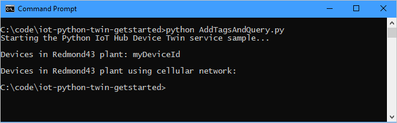
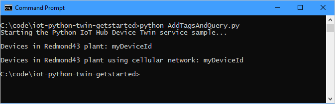
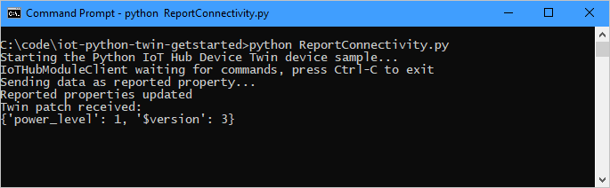

# Get started with device twins (Python)

[!INCLUDE [iot-hub-selector-twin-get-started](../../includes/iot-hub-selector-twin-get-started.md)]

This article shows you how to:

* Use a simulated device app to report its connectivity channel as a reported property on the device twin.

* Query devices from your back-end app using filters on the tags and properties previously created.

In this article, you create two Python console apps:

* **AddTagsAndQuery.py**: a back-end app that adds tags and queries device twins.

* **ReportConnectivity.py**: a simulated device app that connects to your IoT hub and reports its connectivity condition.

> [!NOTE]
> For more information about the SDK tools available to build both device and back-end apps, see [Azure IoT SDKs](iot-hub-devguide-sdks.md).

## Prerequisites

* An active Azure account. (If you don't have an account, you can create a [free account](https://azure.microsoft.com/pricing/free-trial/) in just a couple of minutes.)

* An IoT hub. Create one with the [CLI](iot-hub-create-using-cli.md) or the [Azure portal](iot-hub-create-through-portal.md).

* A registered device. Register one in the [Azure portal](iot-hub-create-through-portal.md#register-a-new-device-in-the-iot-hub).

* [Python version 3.7 or later](https://www.python.org/downloads/) is recommended. Make sure to use the 32-bit or 64-bit installation as required by your setup. When prompted during the installation, make sure to add Python to your platform-specific environment variable.

* Make sure that port 8883 is open in your firewall. The device sample in this article uses MQTT protocol, which communicates over port 8883. This port may be blocked in some corporate and educational network environments. For more information and ways to work around this issue, see [Connecting to IoT Hub (MQTT)](../iot/iot-mqtt-connect-to-iot-hub.md#connecting-to-iot-hub).

## Get the IoT hub connection string

[!INCLUDE [iot-hub-howto-twin-shared-access-policy-text](../../includes/iot-hub-howto-twin-shared-access-policy-text.md)]

[!INCLUDE [iot-hub-include-find-custom-connection-string](../../includes/iot-hub-include-find-custom-connection-string.md)]

## Create a service app that updates desired properties and queries twins

In this section, you create a Python console app that adds location metadata to the device twin associated with your **{Device ID}**. The app queries IoT hub for devices located in the US and then queries devices that report a cellular network connection.

1. In your working directory, open a command prompt and install the **Azure IoT Hub Service SDK for Python**.

   ```cmd/sh
   pip install azure-iot-hub
   ```

2. Using a text editor, create a new **AddTagsAndQuery.py** file.

3. Add the following code to import the required modules from the service SDK:

   ```python
   import sys
   from time import sleep
   from azure.iot.hub import IoTHubRegistryManager
   from azure.iot.hub.models import Twin, TwinProperties, QuerySpecification, QueryResult
   ```

4. Add the following code. Replace `[IoTHub Connection String]` with the IoT hub connection string you copied in [Get the IoT hub connection string](#get-the-iot-hub-connection-string). Replace `[Device Id]` with the device ID (the name) from your registered device in the IoT hub.
  
    ```python
    IOTHUB_CONNECTION_STRING = "[IoTHub Connection String]"
    DEVICE_ID = "[Device Id]"
    ```

5. Add the following code to the **AddTagsAndQuery.py** file:

    ```python
    def iothub_service_sample_run():
        try:
            iothub_registry_manager = IoTHubRegistryManager(IOTHUB_CONNECTION_STRING)

            new_tags = {
                    'location' : {
                        'region' : 'US',
                        'plant' : 'Redmond43'
                    }
                }

            twin = iothub_registry_manager.get_twin(DEVICE_ID)
            twin_patch = Twin(tags=new_tags, properties= TwinProperties(desired={'power_level' : 1}))
            twin = iothub_registry_manager.update_twin(DEVICE_ID, twin_patch, twin.etag)

            # Add a delay to account for any latency before executing the query
            sleep(1)

            query_spec = QuerySpecification(query="SELECT * FROM devices WHERE tags.location.plant = 'Redmond43'")
            query_result = iothub_registry_manager.query_iot_hub(query_spec, None, 100)
            print("Devices in Redmond43 plant: {}".format(', '.join([twin.device_id for twin in query_result.items])))

            print()

            query_spec = QuerySpecification(query="SELECT * FROM devices WHERE tags.location.plant = 'Redmond43' AND properties.reported.connectivity = 'cellular'")
            query_result = iothub_registry_manager.query_iot_hub(query_spec, None, 100)
            print("Devices in Redmond43 plant using cellular network: {}".format(', '.join([twin.device_id for twin in query_result.items])))

        except Exception as ex:
            print("Unexpected error {0}".format(ex))
            return
        except KeyboardInterrupt:
            print("IoT Hub Device Twin service sample stopped")
    ```

    The **IoTHubRegistryManager** object exposes all the methods required to interact with device twins from the service. The code first initializes the **IoTHubRegistryManager** object, then updates the device twin for **DEVICE_ID**, and finally runs two queries. The first selects only the device twins of devices located in the **Redmond43** plant, and the second refines the query to select only the devices that are also connected through a cellular network.

6. Add the following code at the end of  **AddTagsAndQuery.py** to implement the **iothub_service_sample_run** function:

    ```python
    if __name__ == '__main__':
        print("Starting the Python IoT Hub Device Twin service sample...")
        print()

        iothub_service_sample_run()
    ```

7. Run the application with:

    ```cmd/sh
    python AddTagsAndQuery.py
    ```

    You should see one device in the results for the query asking for all devices located in **Redmond43** and none for the query that restricts the results to devices that use a cellular network. In the next section, you'll create a device app that will use a cellular network and you'll rerun this query to see how it changes.

    

## Create a device app that updates reported properties

In this section, you create a Python console app that connects to your hub as your **{Device ID}** and then updates its device twin's reported properties to confirm that it's connected using a cellular network.

1. From a command prompt in your working directory, install the **Azure IoT Hub Device SDK for Python**:

    ```cmd/sh
    pip install azure-iot-device
    ```

2. Using a text editor, create a new **ReportConnectivity.py** file.

3. Add the following code to import the required modules from the device SDK:

    ```python
    import time
    from azure.iot.device import IoTHubModuleClient
    ```

4. Add the following code. Replace the `[IoTHub Device Connection String]` placeholder value with the device connection string you saw when you registered a device in the IoT Hub:

    ```python
    CONNECTION_STRING = "[IoTHub Device Connection String]"
    ```

5. Add the following code to the **ReportConnectivity.py** file to instantiate a client and implement the device twins functionality:

    ```python
    def create_client():
        # Instantiate client
        client = IoTHubModuleClient.create_from_connection_string(CONNECTION_STRING)

        # Define behavior for receiving twin desired property patches
        def twin_patch_handler(twin_patch):
            print("Twin patch received:")
            print(twin_patch)

        try:
            # Set handlers on the client
            client.on_twin_desired_properties_patch_received = twin_patch_handler
        except:
            # Clean up in the event of failure
            client.shutdown()

        return client
    ```

6. Add the following code at the end of  **ReportConnectivity.py** to run the application:

    ```python
    def main():
        print ( "Starting the Python IoT Hub Device Twin device sample..." )
        client = create_client()
        print ( "IoTHubModuleClient waiting for commands, press Ctrl-C to exit" )

        try:
            # Update reported properties with cellular information
            print ( "Sending data as reported property..." )
            reported_patch = {"connectivity": "cellular"}
            client.patch_twin_reported_properties(reported_patch)
            print ( "Reported properties updated" )

            # Wait for program exit
            while True:
                time.sleep(1000000)
        except KeyboardInterrupt:
            print ("IoT Hub Device Twin device sample stopped")
        finally:
            # Graceful exit
            print("Shutting down IoT Hub Client")
            client.shutdown()

    if __name__ == '__main__':
        main()
    ```

7. Run the device app:

    ```cmd/sh
    python ReportConnectivity.py
    ```

    You should see confirmation the device twin reported properties were updated.

    

8. Now that the device reported its connectivity information, it should appear in both queries. Go back and run the queries again:

    ```cmd/sh
    python AddTagsAndQuery.py
    ```

    This time your **{Device ID}** should appear in both query results.

    

    In your device app, you'll see confirmation that the desired properties twin patch sent by the service app was received.

    

In this article, you:

* Added device metadata as tags from a back-end app
* Reported device connectivity information in the device twin
* Queried the device twin information using the IoT Hub query language

## Next steps

To learn how to:

* Send telemetry from devices, see [Quickstart: Send telemetry from an IoT Plug and Play device to Azure IoT Hub](../iot-develop/quickstart-send-telemetry-iot-hub.md?pivots=programming-language-python) article.

* Configure devices using device twin's desired properties, see [Tutorial: Configure your devices from a back-end service](tutorial-device-twins.md).

* Control devices interactively, such as turning on a fan from a user-controlled app, see [Quickstart: Control a device connected to an IoT hub](./quickstart-control-device.md?pivots=programming-language-python).
