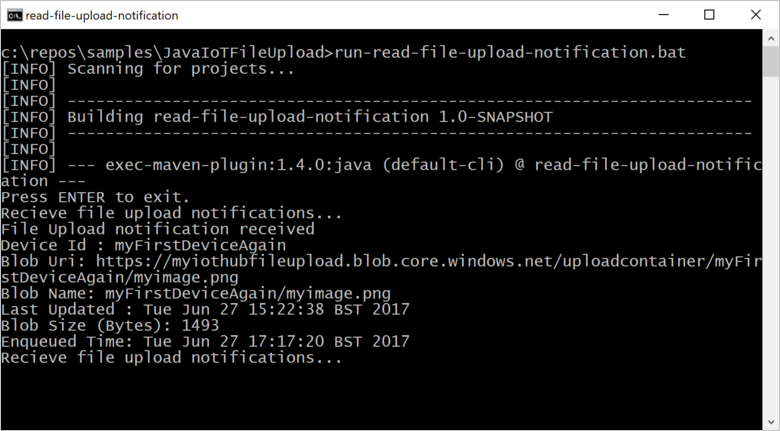

# Upload files from your device to the cloud with Azure IoT Hub (Java)

[!INCLUDE [iot-hub-file-upload-language-selector](../../includes/iot-hub-file-upload-language-selector.md)]

This article demonstrates how to [file upload capabilities of IoT Hub](iot-hub-devguide-file-upload.md) upload a file to [Azure blob storage](../storage/index.yml), using Java.

The [Send telemetry from a device to an IoT hub](../iot-develop/quickstart-send-telemetry-iot-hub.md?pivots=programming-language-java) quickstart and [Send cloud-to-device messages with IoT Hub](c2d-messaging-java.md) articles show the basic device-to-cloud and cloud-to-device messaging functionality of IoT Hub. The [Configure message routing with IoT Hub](tutorial-routing.md) tutorial shows a way to reliably store device-to-cloud messages in Azure blob storage. However, in some scenarios, you can't easily map the data your devices send into the relatively small device-to-cloud messages that IoT Hub accepts. For example:

* Videos
* Large files that contain images
* Vibration data sampled at high frequency
* Some form of preprocessed data.

These files are typically batch processed in the cloud, using tools such as [Azure Data Factory](../data-factory/introduction.md) or the [Hadoop](../hdinsight/index.yml) stack. When you need to upload files from a device, you can still use the security and reliability of IoT Hub. This article shows you how. View two samples from [azure-iot-sdk-java
](https://github.com/Azure/azure-iot-sdk-java/tree/main/iothub/device/iot-device-samples/file-upload-sample/src/main/java/samples/com/microsoft/azure/sdk/iot) in GitHub.

> [!NOTE]
> IoT Hub supports many device platforms and languages (including C, .NET, and JavaScript) through Azure IoT device SDKs. Refer to the [Azure IoT Developer Center](https://azure.microsoft.com/develop/iot) to learn how to connect your device to Azure IoT Hub.

[!INCLUDE [iot-hub-include-x509-ca-signed-file-upload-support-note](../../includes/iot-hub-include-x509-ca-signed-file-upload-support-note.md)]

## Prerequisites

* An IoT hub. Create one with the [CLI](iot-hub-create-using-cli.md) or the [Azure portal](iot-hub-create-through-portal.md).

* A registered device. Register one in the [Azure portal](iot-hub-create-through-portal.md#register-a-new-device-in-the-iot-hub).

* [Java SE Development Kit 8](/java/azure/jdk/). Make sure you select **Java 8** under **Long-term support** to get to downloads for JDK 8.

* [Maven 3](https://maven.apache.org/download.cgi)

* Port 8883 should be open in your firewall. The device sample in this article uses MQTT protocol, which communicates over port 8883. This port may be blocked in some corporate and educational network environments. For more information and ways to work around this issue, see [Connecting to IoT Hub (MQTT)](../iot/iot-mqtt-connect-to-iot-hub.md#connecting-to-iot-hub).

[!INCLUDE [iot-hub-associate-storage](../../includes/iot-hub-include-associate-storage.md)]

## Create a project using Maven

Create a directory for your project, and start a shell in that directory. On the command line, execute the following

```cmd/sh
mvn archetype:generate -DgroupId=com.mycompany.app -DartifactId=my-app -DarchetypeArtifactId=maven-archetype-quickstart -DarchetypeVersion=1.4 -DinteractiveMode=false
```

This generates a directory with the same name as the *artifactId* and a standard project structure:

```
  my-app
  |-- pom.xml
   -- src
      -- main
         -- java
            -- com
               -- mycompany
                  -- app
                     --App.Java
```

Using a text editor, replace the pom.xml file with the following:

```xml

<?xml version="1.0" encoding="UTF-8"?>

<project xmlns="http://maven.apache.org/POM/4.0.0" xmlns:xsi="http://www.w3.org/2001/XMLSchema-instance"
  xsi:schemaLocation="http://maven.apache.org/POM/4.0.0 http://maven.apache.org/xsd/maven-4.0.0.xsd">
  <modelVersion>4.0.0</modelVersion>

  <groupId>com.mycompany.app</groupId>
  <artifactId>my-app</artifactId>
  <version>1.0-SNAPSHOT</version>

  <name>my-app</name>
  <!-- FIXME change it to the project's website -->
  <url>http://www.example.com</url>

  <properties>
    <project.build.sourceEncoding>UTF-8</project.build.sourceEncoding>
    <maven.compiler.source>1.7</maven.compiler.source>
    <maven.compiler.target>1.7</maven.compiler.target>
  </properties>

  <dependencies>
      <dependency>
      <groupId>com.microsoft.azure.sdk.iot</groupId>
      <artifactId>iot-device-client</artifactId>
      <version>1.30.1</version>
    </dependency>
    <dependency>
      <groupId>org.slf4j</groupId>
      <artifactId>slf4j-log4j12</artifactId>
      <version>1.7.29</version>
    </dependency>    
    <dependency>
      <groupId>junit</groupId>
      <artifactId>junit</artifactId>
      <version>4.11</version>
      <scope>test</scope>
    </dependency>
  </dependencies>

  <build>
    <pluginManagement><!-- lock down plugins versions to avoid using Maven defaults (may be moved to parent pom) -->
      <plugins>
        <plugin>
          <groupId>org.apache.maven.plugins</groupId>
            <artifactId>maven-compiler-plugin</artifactId>
            <version>3.3</version>
            <configuration>
              <source>1.7</source>
              <target>1.7</target>
            </configuration>
        </plugin>
        <plugin>
          <artifactId>maven-shade-plugin</artifactId>
          <version>2.4</version>
          <executions>
              <execution>
                  <phase>package</phase>
                  <goals>
                    <goal>shade</goal>
                  </goals>
                  <configuration>
                      <filters>
                          <filter>
                              <artifact>*:*</artifact>
                              <excludes>
                                  <exclude>META-INF/*.SF</exclude>
                                  <exclude>META-INF/*.RSA</exclude>
                              </excludes>
                          </filter>
                      </filters>
                      <shadedArtifactAttached>true</shadedArtifactAttached>
                      <shadedClassifierName>with-deps</shadedClassifierName>
                  </configuration>
              </execution>
          </executions>
        </plugin>
      </plugins>
    </pluginManagement>
  </build>
</project>

```

## Upload a file from a device app

Copy the file that you want to upload to the `my-app` folder in your project tree. Using a text editor, replace App.java with the following code. Supply your device connection string and file name where noted. You copied the device connection string when you registered the device.

```java
package com.mycompany.app;

import com.azure.storage.blob.BlobClient;
import com.azure.storage.blob.BlobClientBuilder;
import com.microsoft.azure.sdk.iot.deps.serializer.FileUploadCompletionNotification;
import com.microsoft.azure.sdk.iot.deps.serializer.FileUploadSasUriRequest;
import com.microsoft.azure.sdk.iot.deps.serializer.FileUploadSasUriResponse;
import com.microsoft.azure.sdk.iot.device.DeviceClient;
import com.microsoft.azure.sdk.iot.device.IotHubClientProtocol;

import java.io.BufferedInputStream;
import java.io.File;
import java.io.FileInputStream;
import java.io.IOException;
import java.net.URISyntaxException;
import java.util.Scanner;

public class App 
{
    /**
     * Upload a single file to blobs using IoT Hub.
     *
     */
    public static void main(String[] args)throws IOException, URISyntaxException
    {
        String connString = "Your device connection string here";
        String fullFileName = "Path of the file to upload";

        System.out.println("Starting...");
        System.out.println("Beginning setup.");

        // File upload will always use HTTPS, DeviceClient will use this protocol only
        //   for the other services like Telemetry, Device Method and Device Twin.
        IotHubClientProtocol protocol = IotHubClientProtocol.MQTT;

        System.out.println("Successfully read input parameters.");

        DeviceClient client = new DeviceClient(connString, protocol);

        System.out.println("Successfully created an IoT Hub client.");

        try
        {
            File file = new File(fullFileName);
            if (file.isDirectory())
            {
                throw new IllegalArgumentException(fullFileName + " is a directory, please provide a single file name, or use the FileUploadSample to upload directories.");
            }

            System.out.println("Retrieving SAS URI from IoT Hub...");
            FileUploadSasUriResponse sasUriResponse = client.getFileUploadSasUri(new FileUploadSasUriRequest(file.getName()));

            System.out.println("Successfully got SAS URI from IoT Hub");
            System.out.println("Correlation Id: " + sasUriResponse.getCorrelationId());
            System.out.println("Container name: " + sasUriResponse.getContainerName());
            System.out.println("Blob name: " + sasUriResponse.getBlobName());
            System.out.println("Blob Uri: " + sasUriResponse.getBlobUri());

            System.out.println("Using the Azure Storage SDK to upload file to Azure Storage...");

            try
            {
                BlobClient blobClient =
                    new BlobClientBuilder()
                        .endpoint(sasUriResponse.getBlobUri().toString())
                        .buildClient();

                blobClient.uploadFromFile(fullFileName);
            }
            catch (Exception e)
            {
                System.out.println("Exception encountered while uploading file to blob: " + e.getMessage());

                System.out.println("Failed to upload file to Azure Storage.");

                System.out.println("Notifying IoT Hub that the SAS URI can be freed and that the file upload failed.");

                // Note that this is done even when the file upload fails. IoT Hub has a fixed number of SAS URIs allowed active
                // at any given time. Once you are done with the file upload, you should free your SAS URI so that other
                // SAS URIs can be generated. If a SAS URI is not freed through this API, then it will free itself eventually
                // based on how long SAS URIs are configured to live on your IoT Hub.
                FileUploadCompletionNotification completionNotification = new FileUploadCompletionNotification(sasUriResponse.getCorrelationId(), false);
                client.completeFileUpload(completionNotification);

                System.out.println("Notified IoT Hub that the SAS URI can be freed and that the file upload was a failure.");

                client.closeNow();
                return;
            }

            System.out.println("Successfully uploaded file to Azure Storage.");

            System.out.println("Notifying IoT Hub that the SAS URI can be freed and that the file upload was a success.");
            FileUploadCompletionNotification completionNotification = new FileUploadCompletionNotification(sasUriResponse.getCorrelationId(), true);
            client.completeFileUpload(completionNotification);
            System.out.println("Successfully notified IoT Hub that the SAS URI can be freed, and that the file upload was a success");
        }
        catch (Exception e)
        {
            System.out.println("On exception, shutting down \n" + " Cause: " + e.getCause() + " \nERROR: " +  e.getMessage());
            System.out.println("Shutting down...");
            client.closeNow();
        }

        System.out.println("Press any key to exit...");

        Scanner scanner = new Scanner(System.in);
        scanner.nextLine();
        System.out.println("Shutting down...");
        client.closeNow();
    }
}
```

## Build and run the application

At a command prompt in the `my-app` folder, run the following command:

```cmd/sh
mvn clean package -DskipTests
```

When the build is complete, run the following command to run the application:

```cmd/sh
mvn exec:java -Dexec.mainClass="com.mycompany.app.App"
```

You can use the portal to view the uploaded file in the storage container you configured:

:::image type="content" source="media/iot-hub-java-java-upload/uploaded-file.png" alt-text="Screenshot showing a file that was uploaded to your storage container." lightbox="media/iot-hub-java-java-upload/uploaded-file.png":::

## Receive a file upload notification

In this section, you create a Java console app that receives file upload notification messages from IoT Hub.

1. Create a directory for your project, and start a shell in that directory. On the command line, execute the following

    ```cmd/sh
    mvn archetype:generate -DgroupId=com.mycompany.app -DartifactId=my-app -DarchetypeArtifactId=maven-archetype-quickstart -DarchetypeVersion=1.4 -DinteractiveMode=false
    ```

2. At your command prompt, navigate to the new `my-app` folder.

3. Using a text editor, replace the `pom.xml` file in the `my-app` folder with the following. Adding the service client dependency enables you to use the **iothub-java-service-client** package in your application to communicate with your IoT hub service:

    ```xml
    <?xml version="1.0" encoding="UTF-8"?>

    <project xmlns="http://maven.apache.org/POM/4.0.0" xmlns:xsi="http://www.w3.org/2001/XMLSchema-instance"
      xsi:schemaLocation="http://maven.apache.org/POM/4.0.0 http://maven.apache.org/xsd/maven-4.0.0.xsd">
      <modelVersion>4.0.0</modelVersion>

      <groupId>com.mycompany.app</groupId>
      <artifactId>my-app</artifactId>
      <version>1.0-SNAPSHOT</version>

      <name>my-app</name>
      <!-- FIXME change it to the project's website -->
      <url>http://www.example.com</url>

      <properties>
        <project.build.sourceEncoding>UTF-8</project.build.sourceEncoding>
        <maven.compiler.source>1.7</maven.compiler.source>
        <maven.compiler.target>1.7</maven.compiler.target>
      </properties>

      <dependencies>
          <dependency>
          <groupId>com.microsoft.azure.sdk.iot</groupId>
          <artifactId>iot-device-client</artifactId>
          <version>1.30.1</version>
        </dependency>
        <dependency>
          <groupId>com.microsoft.azure.sdk.iot</groupId>
          <artifactId>iot-service-client</artifactId>
          <version>1.7.23</version>
        </dependency>
        <dependency>
          <groupId>org.slf4j</groupId>
          <artifactId>slf4j-log4j12</artifactId>
          <version>1.7.29</version>
        </dependency>    
        <dependency>
          <groupId>junit</groupId>
          <artifactId>junit</artifactId>
          <version>4.11</version>
          <scope>test</scope>
        </dependency>
      </dependencies>

      <build>
        <pluginManagement><!-- lock down plugins versions to avoid using Maven defaults (may be moved to parent pom) -->
          <plugins>
            <plugin>
              <groupId>org.apache.maven.plugins</groupId>
                <artifactId>maven-compiler-plugin</artifactId>
                <version>3.3</version>
                <configuration>
                  <source>1.7</source>
                  <target>1.7</target>
                </configuration>
            </plugin>
            <plugin>
              <artifactId>maven-shade-plugin</artifactId>
              <version>2.4</version>
              <executions>
                  <execution>
                      <phase>package</phase>
                      <goals>
                        <goal>shade</goal>
                      </goals>
                      <configuration>
                          <filters>
                              <filter>
                                  <artifact>*:*</artifact>
                                  <excludes>
                                      <exclude>META-INF/*.SF</exclude>
                                      <exclude>META-INF/*.RSA</exclude>
                                  </excludes>
                              </filter>
                          </filters>
                          <shadedArtifactAttached>true</shadedArtifactAttached>
                          <shadedClassifierName>with-deps</shadedClassifierName>
                      </configuration>
                  </execution>
              </executions>
            </plugin>
          </plugins>
        </pluginManagement>
      </build>
    </project>
    ```

    > [!NOTE]
    > You can check for the latest version of **iot-service-client** using [Maven search](https://search.maven.org/#search%7Cga%7C1%7Ca%3A%22iot-service-client%22%20g%3A%22com.microsoft.azure.sdk.iot%22).

4. Save and close the `pom.xml` file.

5. Get the IoT Hub service connection string.
   [!INCLUDE [iot-hub-include-find-service-connection-string](../../includes/iot-hub-include-find-service-connection-string.md)]

6. Using a text editor, open the `my-app\src\main\java\com\mycompany\app\App.java` file and replace the code with the following.

    ```java
    package com.mycompany.app;

    import com.microsoft.azure.sdk.iot.service.*;
    import java.io.IOException;
    import java.net.URISyntaxException;
    import java.util.concurrent.ExecutorService;
    import java.util.concurrent.Executors;


    public class App 
    {
        private static final String connectionString = "{Your service connection string here}";
        private static final IotHubServiceClientProtocol protocol = IotHubServiceClientProtocol.AMQPS;

        public static void main(String[] args) throws Exception
        {
            ServiceClient sc = ServiceClient.createFromConnectionString(connectionString, protocol);

            FileUploadNotificationReceiver receiver = sc.getFileUploadNotificationReceiver();
            receiver.open();
            FileUploadNotification fileUploadNotification = receiver.receive(2000);
    
            if (fileUploadNotification != null)
            {
                System.out.println("File Upload notification received");
                System.out.println("Device Id : " + fileUploadNotification.getDeviceId());
                System.out.println("Blob Uri: " + fileUploadNotification.getBlobUri());
                System.out.println("Blob Name: " + fileUploadNotification.getBlobName());
                System.out.println("Last Updated : " + fileUploadNotification.getLastUpdatedTimeDate());
                System.out.println("Blob Size (Bytes): " + fileUploadNotification.getBlobSizeInBytes());
                System.out.println("Enqueued Time: " + fileUploadNotification.getEnqueuedTimeUtcDate());
            }
            else
            {
                System.out.println("No file upload notification");
            }
    
            receiver.close();
        }
    
    }
    ```


7. Save and close the `my-app\src\main\java\com\mycompany\app\App.java` file.

8. Use the following command to build the app and check for errors:
    ```cmd/sh
    mvn clean package -DskipTests
    ```
## Run the application

Now you're ready to run the application.

At a command prompt in the `my-app` folder, run the following command:

```cmd/sh
mvn exec:java -Dexec.mainClass="com.mycompany.app.App"
```
The following screenshot shows the output from the **read-file-upload-notification** app:



## Next steps

In this article, you learned how to use the file upload feature of IoT Hub to simplify file uploads from devices. You can continue to explore this feature with the following articles:

* [Create an IoT hub programmatically](iot-hub-rm-template-powershell.md)

* [Azure IoT SDKs](iot-hub-devguide-sdks.md)

To further explore the capabilities of IoT Hub, see:

* [Simulating a device with IoT Edge](../iot-edge/quickstart-linux.md)
