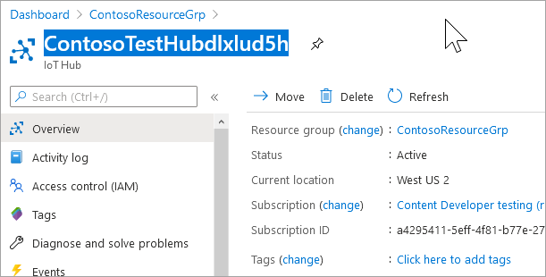
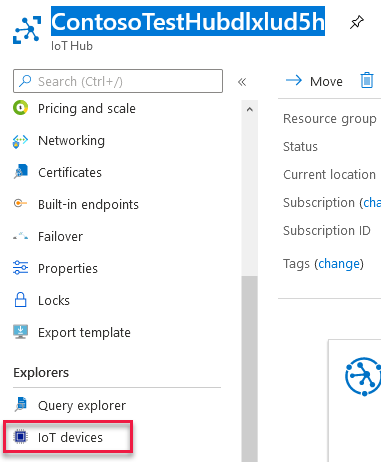

# Quickstart: Deploy an Azure IoT Hub and a storage account using an ARM template

In this quickstart, you use an Azure Resource Manager template (ARM template) to create an IoT Hub that will route messages to Azure Storage, and a storage account to hold the messages. After manually adding a virtual IoT device to the hub to submit the messages, you configure that connection information in an application called  arm-read-write application to submit messages from that device to the hub. The hub is routing configured so the messages sent to the hub are automatically routed by the hub to the storage account. At the end of this quickstart, you can open the storage account and see the messages sent.

[!INCLUDE [About Azure Resource Manager](../../includes/resource-manager-quickstart-introduction.md)]

## Prerequisites

If you don't have an Azure subscription, create a [free Azure account](https://azure.microsoft.com/free/) before you begin.

## The template

If your environment meets the prerequisites and you're familiar with using ARM templates, select the **Deploy to Azure** button. The template will open in the Azure portal and deploy your IoT Hub and storage account. If you want to deploy to Azure Government, select **Deploy to Azure US GOV**.


[](https://portal.azure.com/#create/Microsoft.Template/uri/https%3A%2F%2Fraw.githubusercontent.com%2FAzure%2Fazure-quickstart-templates%2Fmaster%2F101-iothub-auto-route-messages%2Fazuredeploy.json)

[](https://portal.azure.us/#create/Microsoft.Template/uri/https%3A%2F%2Fraw.githubusercontent.com%2FAzure%2Fazure-quickstart-templates%2Fmaster%2F101-iothub-auto-route-messages%2Fazuredeploy.json)

[](http://armviz.io/#/?load=https%3A%2F%2Fraw.githubusercontent.com%2FAzure%2Fazure-quickstart-templates%2Fmaster%2F101-iothub-auto-route-messages%2Fazuredeploy.json)

The template used in this quickstart is cakked `101-iothub-auto-route-messages` from [Azure Quickstart Templates](https://azure.microsoft.com/resources/templates/101-iothub-auto-route-messages).

<!-- robin -- should see a list of templates here -- does it work? -->
> [!NOTE]
> list of templates goes here

:::code language="json" source="~/quickstart-templates/101-iothub-auto-route-messages/azuredeploy.json" :::

Two Azure resources are defined in the template: 
* [Microsoft.Devices/Iothubs](/azure/templates/microsoft.iothubs)
* [Microsoft.Storage/](/azure/templates/microsoft.storage)

## Overview

This section provides the steps to deploy the template, create a virtual device, and run the arm-read-write application to send the messages.

1. Create the resources by deploying the ARM template.

> [!INFO]
> Start the deployment of the template. While it's running, set up the arm-read-write application to run.

1. Download and unzip the C# IoT samples zip file which is [IoT Samples C#](https://Azure-Samples/azure-iot-samples-csharp).

1. Open a command window and go to the folder where you unzipped the IoT C# Samples. Find the folder with the arm-read-write.csproj file. You create the environment variables here. Log into the [Azure portal](http://portal.azure.com] to get the keys. Select **Resource Groups** then select the resource group used for this quickstart.

   

1. You see the IoT Hub and storage account that were created when you deployed the ARM template. Wait until the template is fully deployed before continuing. Then select your resource group to see your resources.

   

1. First, you need the **hub name**. Select the hub in the list of resources. Copy the name of the hub from the top of the IoT Hub section to the Windows clipboard. 
 
  

   Substitute the hub name in this command where noted, and execute this command in the command window:

   
```cmd
   SET IOT_HUB_URI="<hub name goes here>.azure-devices-net";
```

   which will look this example:

```cmd
   SET IOT_HUB_URI="ContosoTestHubdlxlud5h.azure-devices-net";
```

1. The next environmental variable is the IoT Device Key. Add a new device to the hub by selecing **IOT Devices** from the IoT Hub menu for the hub. 

   

1. On the right side of the screen, select **+ NEW** to add a new device. 

   Fill in the new device name. This quickstart uses a name starting with **Contoso-Test-Device**. Save the device and then open that screen again to retrieve the device key. (The key is generated for you when you close the pane.) Select either the primary or secondary key and copy it to the Windows clipboard; In the command window, set the command to execute and then press <Enter>. The command should look like this one but with the device key pasted in:

   ```cmd
   SET IOT_DEVICE_KEY=<device-key-goes-here>
   ```

1. The last environment variable is the **Device ID**. In the command window, set up the command and execute it. It Should look like this:
   
   ```CMD
   SET IOT_DEVICE_ID=<device-id-goes-here> which will look like this:
   ```

   which will look like this example:

   ```CMD
   ```SET IOT_DEVICE_ID=Contoso-Test-Device
   ```

1. To see the environment variables you've defined, type SET on the command line and press <Enter>, then look for the ones starting with **IoT**.

  

Now the environmental variables are set, run the application from the same command window. 

From the folder with the arm-read-write.csproj file in it, run the application. It's a .NET Core application, you can just run it from the command line.

1. DO NOT CLOSE THE CMD WINDOW where you set the environment variables. Since the application is a .NET Core application, you can run it without even opening the code. 

1. In the Command window, type the following command.

    `DOTNET RUN ARM-READ-WRITE

The application runs, generating and displaying messages as it sends each one to the IoT Hub. The Iot Hub uses the routing configuration to route the messages to the storage account. Let the app run for 10 to 15 minutes, then press Enter one or twice until it stops running.

** View the results

1. Log in to the (Azure portal)[https://portal.azure.com] and select the Resource Group, then select the Storage account.

1. Drill down into the storage account until you find files.

1. Select one of the files and select Save As and save the file to a location you can find later. It will have a name that's numeric, like 47. Add ".txt" to the end to make it easier to open it.

1. Double-click the file in Windows Explorer to open it. Each row is a different message sent to the IoT Hub. 

** You have created an IoT Hub and a storage account, and run a program to write messages to the hub. The messages are then routed to the storage account. 

## Clean up resources

Go to the [Azure portal](https://portal.azure.com). Select **Resource Groups**, find the resource group you used for this quickstart. Delete the resource group. It will delete all of the resources in the group.

## Next steps

```markdown
> [!div class="nextstepaction"]
> [Tutorial: Create and deploy your first ARM template](/azure/azure-resource-manager/templates/template-tutorial-create-first-template)
```