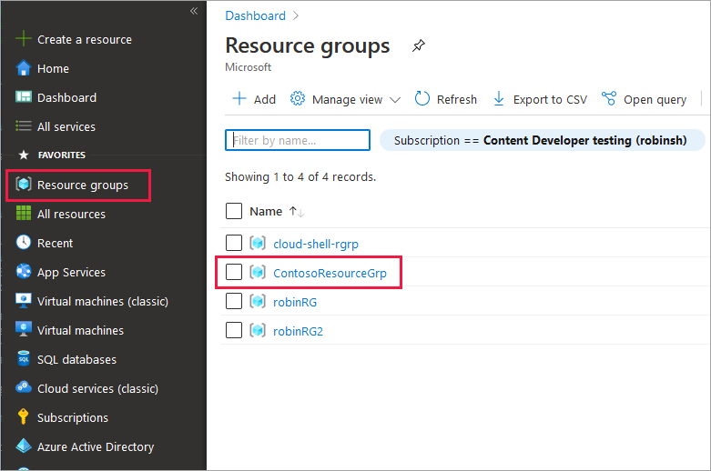
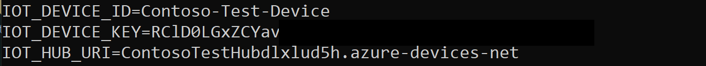
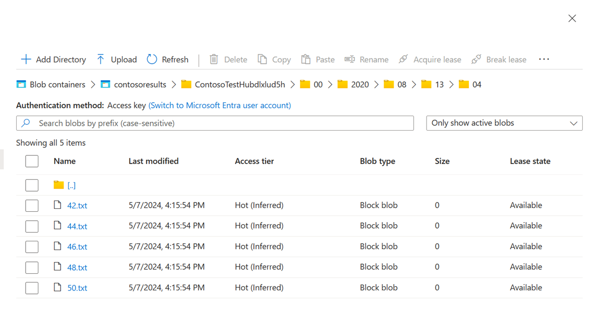
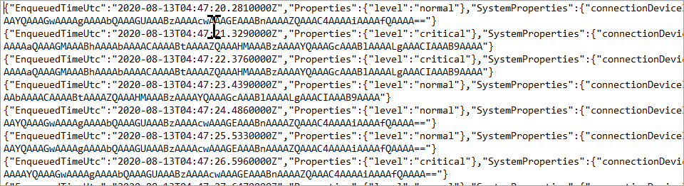

# Quickstart: Deploy an Azure IoT hub and a storage account using an ARM template

In this quickstart, you use an Azure Resource Manager template (ARM template) to create an IoT hub that will route messages to Azure Storage, and a storage account to hold the messages. After manually adding a virtual IoT device to the hub to submit the messages, you configure that connection information in an application called  *arm-read-write* to submit messages from the device to the hub. The hub is configured so the messages sent to the hub are automatically routed to the storage account. At the end of this quickstart, you can open the storage account and see the messages sent.

[!INCLUDE [About Azure Resource Manager](../../includes/resource-manager-quickstart-introduction.md)]

If your environment meets the prerequisites and you're familiar with using ARM templates, select the **Deploy to Azure** button. The template will open in the Azure portal.

[](https://portal.azure.com/#create/Microsoft.Template/uri/https%3A%2F%2Fraw.githubusercontent.com%2FAzure%2Fazure-quickstart-templates%2Fmaster%2Fquickstarts%2Fmicrosoft.devices%2Fiothub-auto-route-messages%2Fazuredeploy.json)

## Prerequisites

- If you don't have an Azure subscription, create a [free Azure account](https://azure.microsoft.com/free/) before you begin.

- The sample application you run in this quickstart is written using C#. You need the .NET SDK 6.0 or greater on your development machine.

    You can download the .NET Core SDK for multiple platforms from [.NET](https://dotnet.microsoft.com/download).

    You can verify the current version of C# on your development machine using the following command:

    ```cmd/sh
    dotnet --version
    ```

- Download and unzip the [IoT C# SDK](https://github.com/Azure/azure-iot-sdk-csharp/archive/main.zip).

## Review the template

The template used in this quickstart is called `101-iothub-auto-route-messages` from [Azure Quickstart Templates](https://azure.microsoft.com/resources/templates/iothub-auto-route-messages).

:::code language="json" source="~/quickstart-templates/quickstarts/microsoft.devices/iothub-auto-route-messages/azuredeploy.json":::

Two Azure resources are defined in the template:

- [Microsoft.Storage/storageAccounts](/azure/templates/microsoft.storage/storageaccounts)
- [Microsoft.Devices/IotHubs](/azure/templates/microsoft.devices/iothubs)

## Deploy the template and run the sample app

This section provides the steps to deploy the template, create a virtual device, and run the arm-read-write application to send the messages.

1. Create the resources by deploying the ARM template.

    > [!TIP]
    > Select the button below to start the deployment of the template. While it's running, set up the arm-read-write application to run.

    [](https://portal.azure.com/#create/Microsoft.Template/uri/https%3A%2F%2Fraw.githubusercontent.com%2FAzure%2Fazure-quickstart-templates%2Fmaster%2Fquickstarts%2Fmicrosoft.devices%2Fiothub-auto-route-messages%2Fazuredeploy.json)

1. Open a command window and go to the folder where you unzipped the IoT C# SDK. Find the folder with the arm-read-write.csproj file. You create the environment variables in this command window. Sign in to the [Azure portal](https://portal.azure.com) to get the keys. Select **Resource Groups** then select the resource group used for this quickstart.

   

1. You see the IoT Hub and storage account that were created when you deployed the ARM template. Wait until the template is fully deployed before continuing. Then select your resource group to see your resources.

   

1. You need the **hub name**. Select the hub in the list of resources. Copy the name of the hub from the top of the IoT Hub section to the Windows clipboard.

    Substitute the hub name in this command where noted, and execute this command in the command window:

    ```cmd
    SET IOT_HUB_URI=<hub name goes here>.azure-devices-net;
    ```

   which will look this example:

   ```cmd
   SET IOT_HUB_URI=ContosoTestHubdlxlud5h.azure-devices-net;
   ```

1. The next environment variable is the IoT Device Key. Add a new device to the hub by selecting **Devices** from the IoT Hub menu for the hub.

   :::image type="content" source="./media/horizontal-arm-route-messages/04-select-iot-devices.png" alt-text="Screenshot that shows devices in the left pane." border="true":::

1. On the right side of the screen, select **+ Add Device** to add a new device.

   Fill in the new device name. This quickstart uses a name starting with **Contoso-Test-Device**. Save the device and then open that screen again to retrieve the device key. (The key is generated for you when you close the pane.) Select either the primary or secondary key and copy it to the Windows clipboard. In the command window, set the command to execute and then press **Enter**. The command should look like this one but with the device key pasted in:

   ```cmd
   SET IOT_DEVICE_KEY=<device-key-goes-here>
   ```

1. The last environment variable is the **Device ID**. In the command window, set up the command and execute it.

   ```cmd
   SET IOT_DEVICE_ID=<device-id-goes-here>
   ```

   which will look like this example:

   ```cmd
   SET IOT_DEVICE_ID=Contoso-Test-Device
   ```

1. To see the environment variables you've defined, type SET on the command line and press **Enter**, then look for the ones starting with **IoT**.

   

    Now the environment variables are set, run the application from the same command window. Because you're using the same window, the variables will be accessible in memory when you run the application.

1. To run the application, type the following command in the command window and press **Enter**.

    `dotnet run arm-read-write`

   The application generates and displays messages on the console as it sends each message to the IoT hub. The hub was configured in the ARM template to have automated routing. Messages containing the text `level = storage` are automatically routed to the storage account. Let the app run for 10 to 15 minutes, then press **Enter** once or twice until it stops running.

## Review deployed resources

1. Sign in to the [Azure portal](https://portal.azure.com) and select the Resource Group, then select the storage account.

1. Drill down into the storage account until you find files.

   

1. Select one of the files and select **Download** and download the file to a location you can find later. It will have a name that's numeric, like 47. Add _.txt_ to the end and then double-click on the file to open it.

1. When you open the file, each row is for a different message; the body of each message is also encrypted. It must be in order for you to perform queries against the body of the message.

   

   > [!NOTE]
   > These messages are encoded in UTF-32 and base64. If you read the message back, you have to decode it from base64 and utf-32 in order to read it as ASCII. If you're interested, you can use the method ReadOneRowFromFile in the Routing Tutorial to read one for from one of these message files and decode it into ASCII. ReadOneRowFromFile is in the IoT C# SDK repository that you unzipped for this quickstart. Here is the path from the top of that folder: *./iothub/device/samples/getting started/RoutingTutorial/SimulatedDevice/Program.cs.* Set the boolean `readTheFile` to true, and hardcode the path to the file on disk, and it will open and translate the first row in the file.

You have deployed an ARM template to create an IoT hub and a storage account, and run a program to send messages to the hub. The messages are then automatically stored in the storage account where they can be viewed.

## Clean up resources

To remove the resources added during this quickstart, sign in to the [Azure portal](https://portal.azure.com). Select **Resource Groups**, then find the resource group you used for this quickstart. Select the resource group and then select *Delete*. It will delete all of the resources in the group.

## Next steps

> [!div class="nextstepaction"]
> [Tutorial: Create and deploy your first ARM template](../azure-resource-manager/templates/template-tutorial-create-first-template.md)
