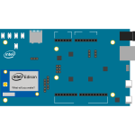
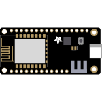
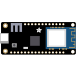
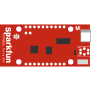

# IoT Hub Documentation 

Learn how to use IoT Hub to connect, monitor, and control billions of Internet of Things assets. Tutorials, API references, videos and other documentation help you deploy reliable and bi-directional communication between IoT devices and a solution back end. 

<ul class="panelContent cardsFTitle">
     <li>
        <a href="/azure/iot-hub/iot-hub-what-is-iot-hub">
        

            

                

                    

                        

                            
                        

                    

                    

                        <h3>Learn about Azure IoT Hub</h3>
                    

                

            

        

        </a>
    </li>
     <li>
        <a href="https://azure.microsoft.com/documentation/videos/index/?services=iot-hub">
        

            

                

                    

                        

                            
                        

                    

                    

                        <h3>Azure IoT Hub Video Library</h3>
                    

                

            

        

        </a>
    </li>
    <li>
        <a href="/azure/iot-hub/iot-hub-csharp-csharp-getstarted">
        

            

                

                    

                        

                            
                        

                    

                    

                        <h3>Get Started with IoT Hub using .NET</h3>
                    

                

            

        

        </a>
    </li>
    <li>
        <a href="/azure/iot-hub/iot-hub-java-java-getstarted">
        

            

                

                    

                        

                            
                        

                    

                    

                        <h3>Get Started with IoT Hub using Java</h3>
                    

                

            

        

        </a>
    </li>
    <li>
        <a href="/azure/iot-hub/iot-hub-node-node-getstarted">
        

            

                

                    

                        

                            
                        

                    

                    

                        <h3>Get Started with IoT Hub using Node.js</h3>
                    

                

            

        

        </a>
    </li>
    <li>
        <a href="/azure/iot-hub/iot-hub-device-sdk-c-intro">
        

            

                

                    

                        

                            
                        

                    

                    

                        <h3>Get Started with IoT Hub using C</h3>
                    

                

            

        

        </a>
    </li>
    <li>
        <a href="/azure/iot-hub/iot-hub-raspberry-pi-kit-node-get-started">
        

            

                

                    

                        

                            
                        

                    

                    

                        <h3>Get Started with IoT Hub using Raspberry Pi</h3>
                    

                

            

        

        </a>
    </li>
    <li>
        <a href="/azure/iot-hub/iot-hub-intel-edison-kit-node-get-started">
        

            

                

                    

                        

                            
                        

                    

                    

                        <h3>Get Started with IoT Hub using Intel Edison</h3>
                    

                

            

        

        </a>
    </li>
    <li>
        <a href="/azure/iot-hub/iot-hub-arduino-huzzah-esp8266-get-started">
        

            

                

                    

                        

                            
                        

                    

                    

                        <h3>Get Started with IoT Hub using Feather Huzzah ESP8266</h3>
                    

                

            

        

        </a>
    </li>
    <li>
        <a href="/azure/iot-hub/iot-hub-adafruit-feather-m0-wifi-kit-arduino-get-started">
        

            

                

                    

                        

                            
                        

                    

                    

                        <h3>Get Started with IoT Hub using Feather M0</h3>
                    

                

            

        

        </a>
    </li>
    <li>
        <a href="/azure/iot-hub/iot-hub-sparkfun-esp8266-thing-dev-get-started">
        

            

                

                    

                        

                            
                        

                    

                    

                        <h3>Get Started with IoT Hub using Sparkfun Thing Dev</h3>
                    

                

            

        

        </a>
    </li>
    <li>
        <a href="/azure/iot-hub/iot-hub-gateway-kit-c-get-started">
        

            

                

                    

                        

                            
                        

                    

                    

                        <h3>Get Started with IoT Hub using Intel NUC</h3>
                    

                

            

        

        </a>
    </li>
</ul>

---
 
<h2>Reference</h2>
<ul class="panelContent cardsW">
    <li>
        

            

                

                    

                        <h3>Command-Line</h3>
                        
<a href="/cli/azure/iot">Azure CLI 2.0</a>

                    

                

            

        

    </li>
    <li>
        

            

                

                    

                        <h3>Languages</h3>
                        
<a href="/dotnet/api/microsoft.azure.devices">.NET (Service)</a>

                        
<a href="/dotnet/api/microsoft.azure.devices.client">.NET (Devices)</a>

                        
<a href="https://azure.github.io/azure-iot-sdk-c/index.html">C device SDK</a>

                        
<a href="/java/api/com.microsoft.azure.sdk.iot.service">Java (Service)</a>

                        
<a href="/java/api/com.microsoft.azure.sdk.iot.device">Java (Devices)</a>

                        
<a href="http://azure.github.io/azure-iot-sdk-node/">Node.js SDKs</a>

                        
<a href="http://azure.github.io/iot-edge/">Azure IoT Edge</a>

                    

                

            

        

    </li>
    <li>
        

            

                

                    

                        <h3>REST</h3>
                        
<a href="/rest/api/iothub/iothubresource">REST (Resource Provider)</a>

                        
<a href="/rest/api/iothub/deviceapi">REST (Device Identities)</a>

                        
<a href="/rest/api/iothub/devicetwinapi">REST (Device Twins)</a>

                        
<a href="/rest/api/iothub/httpruntime">REST (Device Messaging)</a>

                        
<a href="/rest/api/iothub/jobapi">REST (Jobs)</a>

                    

                

            

        

    </li>
</ul>
