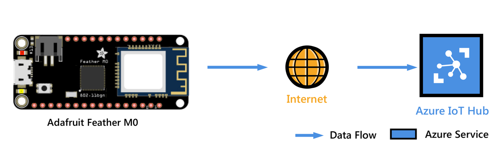
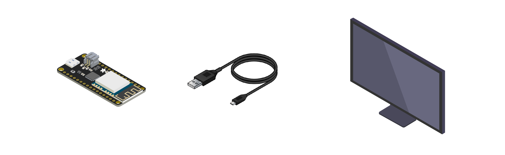
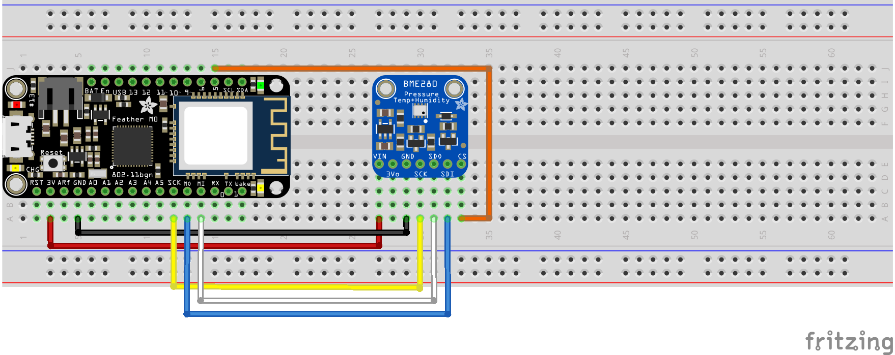
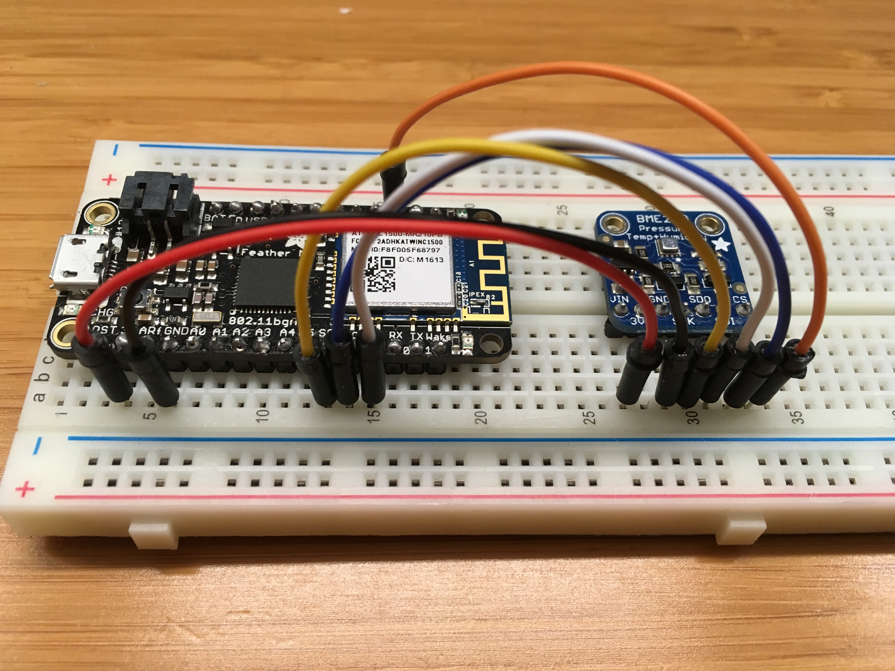
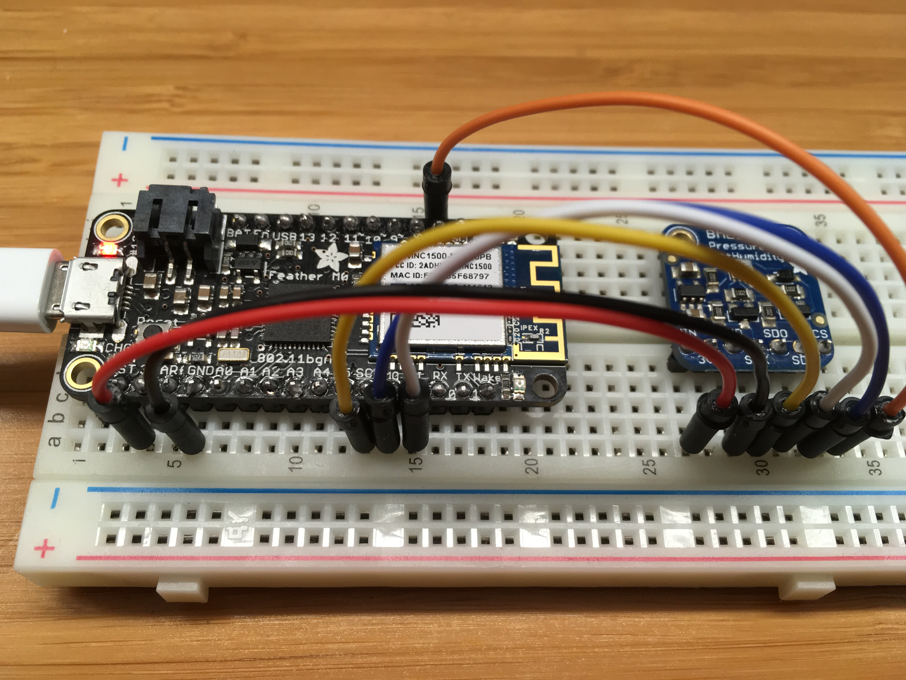
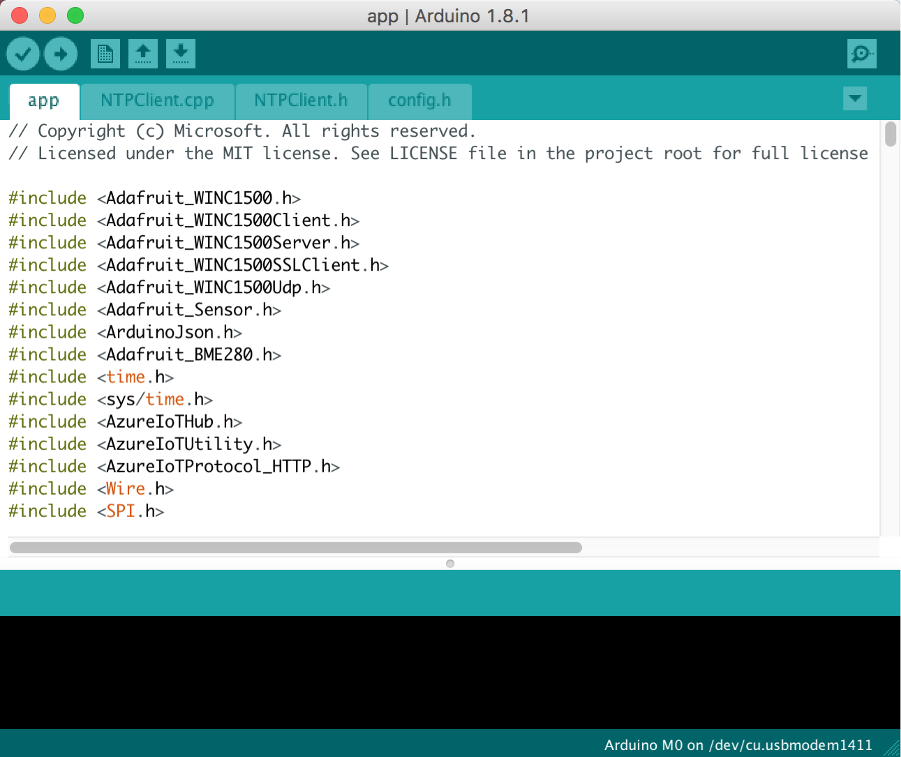
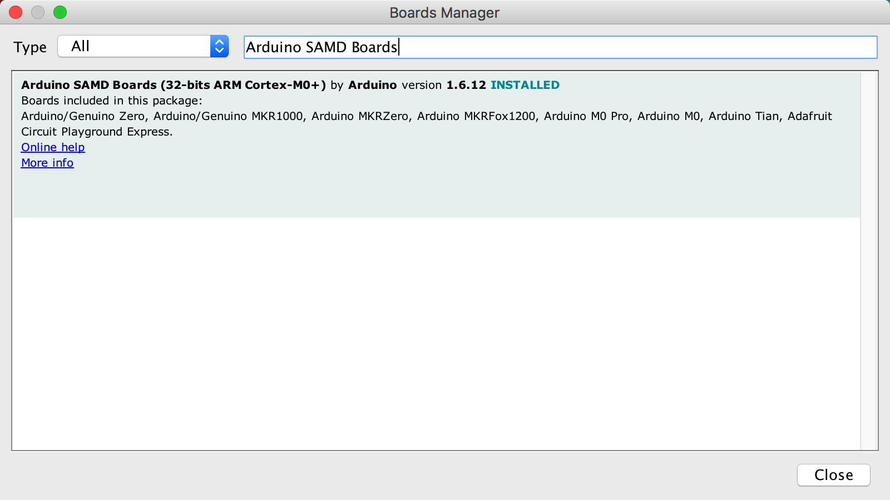
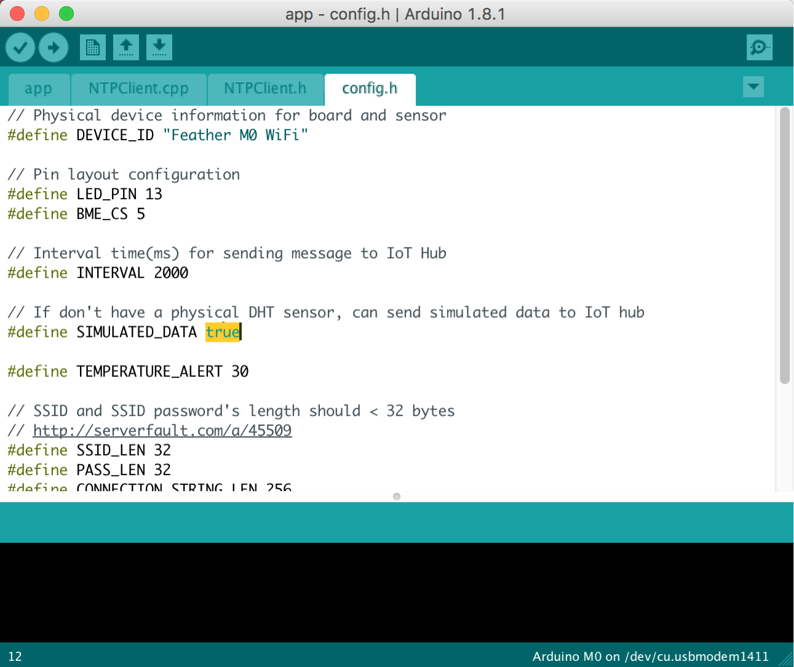

# Connect Adafruit Feather M0 WiFi to Azure IoT Hub in the cloud
[!INCLUDE [iot-hub-get-started-device-selector](../../includes/iot-hub-get-started-device-selector.md)]



In this tutorial, you begin by learning the basics of working with your Arduino board. You then learn how to seamlessly connect your devices to the cloud by using [Azure IoT Hub](iot-hub-what-is-iot-hub.md).

## What you do

Connect Adafruit Feather M0 WiFi to an IoT hub that you create. Then you run a sample application on M0 WiFi to collect the temperature and humidity data from a BME280. Finally, you send the sensor data to your IoT hub.


## What you learn

* How to create an IoT hub and register a device for Feather M0 WiFi
* How to connect Feather M0 WiFi with the sensor and your computer
* How to collect sensor data by running a sample application on Feather M0 WiFi
* How to send the sensor data to your IoT hub

## What you need



To complete this operation, you need the following parts from your Feather M0 WiFi Starter Kit:

* The Feather M0 WiFi board
* A Micro USB to Type A USB cable

You also need the following things for your development environment:

* A Mac or PC that is running Windows or Ubuntu.
* A wireless network for Feather M0 WiFi to connect to.
* An Internet connection to download the configuration tool.
* [Arduino IDE](https://www.arduino.cc/en/main/software) version 1.6.8 or later. Earlier versions don't work with the Azure IoT library.


If you don’t have a sensor, the following items are optional. You also have the option of using simulated sensor data:

* An BME280 temperature and humidity sensor
* A breadboard
* M/M jumper wires

[!INCLUDE [iot-hub-get-started-create-hub-and-device](../../includes/iot-hub-get-started-create-hub-and-device.md)]

## Connect Feather M0 WiFi with the sensor and your computer
In this section, you connect the sensors to your board. Then you plug in your device to your computer for further use.

### Connect a DHT22 temperature and humidity sensor to Feather M0 WiFi

Use the breadboard and jumper wires to make the connection. If you don’t have a sensor, skip this section because you can use simulated sensor data instead.




For sensor pins, use the following wiring:


| Start (Sensor)           | End (Board)            | Cable Color   |
| -----------------------  | ---------------------- | ------------: |
| VDD (Pin 27A)            | 3V (Pin 3A)            | Red cable     |
| GND (Pin 29A)            | GND (Pin 6A)           | Black cable   |
| SCK (Pin 30A)            | SCK (Pin 12A)          | Yellow cable  |
| SDO (Pin 31A)            | MI (Pin 14A)           | White cable   |
| SDI (Pin 32A)            | M0 (Pin 13A)           | Blue cable    |
| CS (Pin 33A)             | GPIO 5 (Pin 15J)       | Orange cable  |

For more information, see [Adafruit BME280 Humidity + Barometric Pressure + Temperature Sensor Breakout](https://learn.adafruit.com/adafruit-bme280-humidity-barometric-pressure-temperature-sensor-breakout/wiring-and-test?view=all) and [Adafruit Feather M0 WiFi pinouts](https://learn.adafruit.com/adafruit-feather-m0-wifi-atwinc1500/pinouts).


Now your Feather M0 WiFi should be connected with a working sensor.



### Connect Feather M0 WiFi to your computer

Use the Micro USB to Type A USB cable to connect Feather M0 WiFi to your computer, as shown:



### Add serial port permissions (Ubuntu only)

If you use Ubuntu, make sure you have the permissions to operate on the USB port of Feather M0 WiFi. To add serial port permissions, follow these steps:


1. At a terminal, run the following commands:

   ```bash
   ls -l /dev/ttyUSB*
   ls -l /dev/ttyACM*
   ```

   You get one of the following outputs:

   * crw-rw---- 1 root uucp xxxxxxxx
   * crw-rw---- 1 root dialout xxxxxxxx

   In the output, notice that `uucp` or `dialout` is the group owner name of the USB port.

2. To add the user to the group, run the following command:

   ```bash
   sudo usermod -a -G <group-owner-name> <username>
   ```

   In the previous step, you obtained the group owner name `<group-owner-name>`. Your Ubuntu user name is `<username>`.

3. For the change to appear, sign out of Ubuntu and then sign in again.

## Collect sensor data and send it to your IoT hub

In this section, you deploy and run a sample application on Feather M0 WiFi. The sample application makes the LED blink on Feather M0 WiFi. It then sends the temperature and humidity data collected from the BME280 sensor to your IoT hub.

### Get the sample application from GitHub and prepare the Arduino IDE

The sample application is hosted on GitHub. Clone the sample repository that contains the sample application from GitHub. To clone the sample repository, follow these steps:

1. Open a command prompt or a terminal window.

2. Go to a folder where you want the sample application to be stored.
3. Run the following command:

   ```bash
   git clone https://github.com/Azure-Samples/iot-hub-Feather-M0-WiFi-client-app.git
   ```

### Install the package for Feather M0 WiFi in the Arduino IDE

1. Open the folder where the sample application is stored.

2. Open the app.ino file in the app folder in the Arduino IDE.

   

3. Click **Tools** > **Board** > **Boards Manager**, and then install the `Arduino SAMD Boards` version `1.6.2` or later. To add the board file definitions, install the `Adafruit SAMD` package.

   Boards Manager indicates that `Arduino SAMD Boards` with a version of `1.6.2` or later is installed. 

   

4. Click **Tools** > **Board** > **Adafruit M0 WiFi**.

5. Install drivers (for Windows only). When you plug in Feather M0 WiFi, you might need to install a driver. Click [the download link on the webpage](https://github.com/adafruit/Adafruit_Windows_Drivers/releases/download/1.1/adafruit_drivers.exe) to download the Driver Installer. Follow the steps to install the drivers you want.

### Install necessary libraries

1. In the Arduino IDE, click **Sketch** > **Include Library** > **Manage Libraries**.

2. Search for the following library names one by one. For each library that you find, click **Install**:

   * `RTCZero`
   * `NTPClient`
   * `AzureIoTHub`
   * `AzureIoTUtility`
   * `AzureIoTProtocol_HTTP`
   * `ArduinoJson`
   * `Adafruit BME280 Library`
   * `Adafruit Unified Sensor`

3. Manually install `Adafruit_WINC1500`. Go to [this website](https://github.com/adafruit/Adafruit_WINC1500) and click **Clone or download** > **Download ZIP**. Then in your Arduino IDE, go to **Sketch** > **Include Library** > **Add .zip Library** and add the zip file you just downloaded.

### Use the sample application if you don’t have a real BME280 sensor

If you don’t have a real BME280 sensor, the sample application can simulate temperature and humidity data. To set up the sample application to use simulated data, follow these steps:

1. Open the `config.h` file in the `app` folder.

2. Locate the following line of code and change the value from `false` to `true`:

   ```c
   define SIMULATED_DATA true
   ```
   

3. Save the file with `Control-s`.

### Deploy the sample application to Feather M0 WiFi

1. In the Arduino IDE, click **Tool** > **Port**, and then click the serial port for Feather M0 WiFi.

2. Click **Sketch** > **Upload** to build and deploy the sample application to Feather M0 WiFi.

### Enter your credentials

After the upload completes successfully, follow these steps to enter your credentials:

1. In the Arduino IDE, click **Tools** > **Serial Monitor**.

2. In the lower-right corner of the serial monitor window, select **No line ending** in the drop-down list on the left.
3. Select **115200 baud** in the drop-down list on the right.
4. In the input box located at the top of the serial monitor window, enter the following information if you're asked to provide it, and then click **Send**:

   * Wi-Fi SSID
   * Wi-Fi password
   * Device connection string

> [!Note]
> The credential information is stored in the EEPROM of Feather M0 WiFi. If you click the reset button on the Feather M0 WiFi board, the sample application asks if you want to erase the information. Enter `Y` to erase the information. You're asked to provide the information a second time.

### Verify that the sample application is running successfully

If you see the following output from the serial monitor window and the blinking LED on Feather M0 WiFi, the sample application is running successfully:


## Next steps

You have successfully connected Feather M0 WiFi to your IoT hub and sent the captured sensor data to your IoT hub. 

[!INCLUDE [iot-hub-get-started-next-steps](../../includes/iot-hub-get-started-next-steps.md)]

