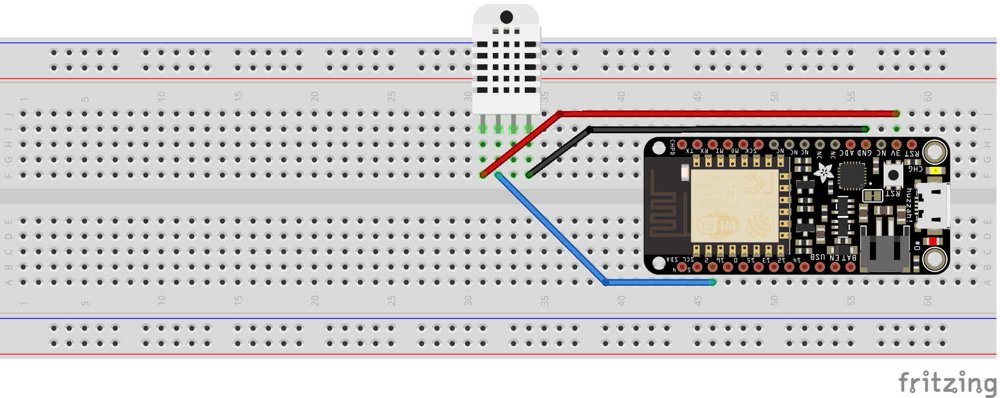
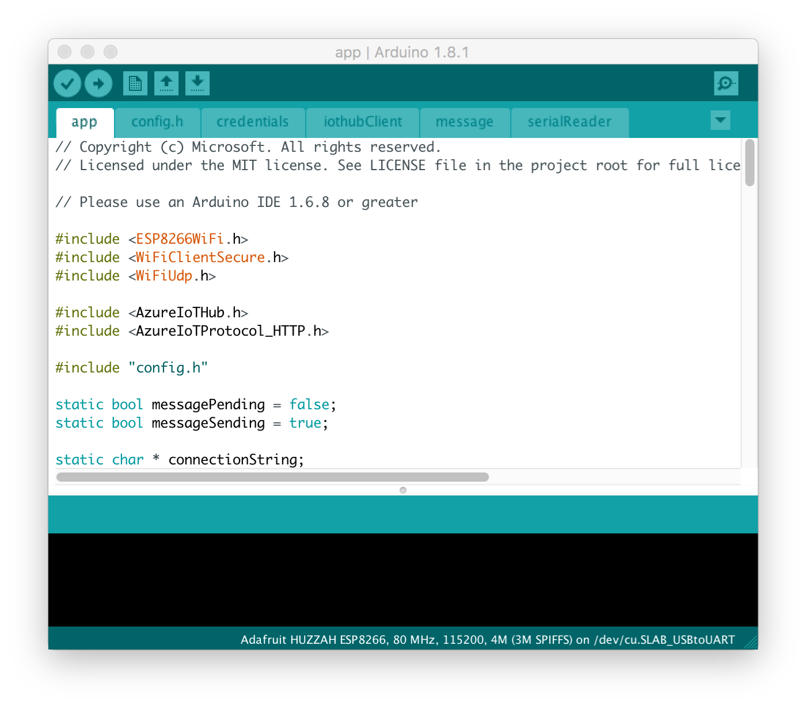

# Connect Adafruit Feather HUZZAH ESP8266 to Azure IoT Hub in the cloud

[!INCLUDE [iot-hub-get-started-device-selector](../../includes/iot-hub-get-started-device-selector.md)]


## What you do


Connect Adafruit Feather HUZZAH ESP8266 to an IoT hub that you create. Then you run a sample application on ESP8266 to collect the temperature and humidity data from a DHT22 sensor. Finally, you send the sensor data to your IoT hub.

> [!NOTE]
> If you're using other ESP8266 boards, you can still follow these steps to connect it to your IoT hub. Depending on the ESP8266 board you're using, you might need to reconfigure the `LED_PIN`. For example, if you're using ESP8266 from AI-Thinker, you might change it from `0` to `2`. Don't have a kit yet? Get it from the [Azure website](http://azure.com/iotstarterkits).


## What you learn

* How to create an IoT hub and register a device for Feather HUZZAH ESP8266
* How to connect Feather HUZZAH ESP8266 with the sensor and your computer
* How to collect sensor data by running a sample application on Feather HUZZAH ESP8266
* How to send the sensor data to your IoT hub

## What you need


To complete this operation, you need the following parts from your Feather HUZZAH ESP8266 Starter Kit:

* The Feather HUZZAH ESP8266 board
* A Micro USB to Type A USB cable

You also need the following things for your development environment:

* An active Azure subscription. If you don't have an Azure account, [create a free Azure trial account](https://azure.microsoft.com/free/) in just a few minutes.
* Mac or PC that is running Windows or Ubuntu.
* Wireless network for Feather HUZZAH ESP8266 to connect to.
* Internet connection to download the configuration tool.
* [Arduino IDE](https://www.arduino.cc/en/main/software) version 1.6.8 or later. Earlier versions don't work with the AzureIoT library.

The following items are optional in case you don’t have a sensor. You also have the option of using simulated sensor data.

* An Adafruit DHT22 temperature and humidity sensor
* A breadboard
* M/M jumper wires


[!INCLUDE [iot-hub-get-started-create-hub-and-device](../../includes/iot-hub-get-started-create-hub-and-device.md)]

## Connect Feather HUZZAH ESP8266 with the sensor and your computer
In this section, you connect the sensors to your board. Then you plug in your device to your computer for further use.
### Connect a DHT22 temperature and humidity sensor to Feather HUZZAH ESP8266

Use the breadboard and jumper wires to make the connection as follows. If you don’t have a sensor, skip this section because you can use simulated sensor data instead.




For sensor pins, use the following wiring:


| Start (Sensor)           | End (Board)           | Cable Color   |
| -----------------------  | ---------------------- | ------------: |
| VDD (Pin 31F)            | 3V (Pin 58H)           | Red cable     |
| DATA (Pin 32F)           | GPIO 2 (Pin 46A)       | Blue cable    |
| GND (Pin 34F)            | GND (PIn 56I)          | Black cable   |

For more information, see [Adafruit DHT22 sensor setup](https://learn.adafruit.com/dht/connecting-to-a-dhtxx-sensor) and [Adafruit Feather HUZZAH Esp8266 Pinouts](https://learn.adafruit.com/adafruit-feather-huzzah-esp8266/using-arduino-ide?view=all#pinouts).


Now your Feather Huzzah ESP8266 should be connected with a working sensor.


### Connect Feather HUZZAH ESP8266 to your computer

As shown next, use the Micro USB to Type A USB cable to connect Feather HUZZAH ESP8266 to your computer.


### Add serial port permissions (Ubuntu only)


If you use Ubuntu, make sure you have the permissions to operate on the USB port of Feather HUZZAH ESP8266. To add serial port permissions, follow these steps:


1. Run the following commands at a terminal:

   ```bash
   ls -l /dev/ttyUSB*
   ls -l /dev/ttyACM*
   ```

   You get one of the following outputs:

   * crw-rw---- 1 root uucp xxxxxxxx
   * crw-rw---- 1 root dialout xxxxxxxx

   In the output, notice that `uucp` or `dialout` is the group owner name of the USB port.

1. Add the user to the group by running the following command:

   ```bash
   sudo usermod -a -G <group-owner-name> <username>
   ```

   `<group-owner-name>` is the group owner name you obtained in the previous step. `<username>` is your Ubuntu user name.

1. Sign out of Ubuntu, and then sign in again for the change to appear.

## Collect sensor data and send it to your IoT hub

In this section, you deploy and run a sample application on Feather HUZZAH ESP8266. The sample application blinks the LED on Feather HUZZAH ESP8266, and sends the temperature and humidity data collected from the DHT22 sensor to your IoT hub.

### Get the sample application from GitHub

The sample application is hosted on GitHub. Clone the sample repository that contains the sample application from GitHub. To clone the sample repository, follow these steps:

1. Open a command prompt or a terminal window.
1. Go to a folder where you want the sample application to be stored.
1. Run the following command:

   ```bash
   git clone https://github.com/Azure-Samples/iot-hub-feather-huzzah-client-app.git
   ```

Install the package for Feather HUZZAH ESP8266 in the Arduino IDE:

1. Open the folder where the sample application is stored.
1. Open the app.ino file in the app folder in the Arduino IDE.

   

1. In the Arduino IDE, click **File** > **Preferences**.
1. In the **Preferences** dialog box, click the icon next to the **Additional Boards Manager URLs** box.
1. In the pop-up window, enter the following URL, and then click **OK**.

   `http://arduino.esp8266.com/stable/package_esp8266com_index.json`

   

1. In the **Preference** dialog box, click **OK**.
1. Click **Tools** > **Board** > **Boards Manager**, and then search for esp8266.

   Boards Manager indicates that ESP8266 with a version of 2.2.0 or later is installed.

   

1. Click **Tools** > **Board** > **Adafruit HUZZAH ESP8266**.

### Install necessary libraries

1. In the Arduino IDE, click **Sketch** > **Include Library** > **Manage Libraries**.
1. Search for the following library names one by one. For each  library that you find, click **Install**.
   * `AzureIoTHub`
   * `AzureIoTUtility`
   * `AzureIoTProtocol_MQTT`
   * `ArduinoJson`
   * `DHT sensor library`
   * `Adafruit Unified Sensor`

### Don’t have a real DHT22 sensor?

The sample application can simulate temperature and humidity data in case you don’t have a real DHT22 sensor. To set up the sample application to use simulated data, follow these steps:

1. Open the `config.h` file in the `app` folder.
1. Locate the following line of code and change the value from `false` to `true`:
   ```c
   define SIMULATED_DATA true
   ```
   

1. Save the file with `Control-s`.

### Deploy the sample application to Feather HUZZAH ESP8266

1. In the Arduino IDE, click **Tool** > **Port**, and then click the serial port for Feather HUZZAH ESP8266.
1. Click **Sketch** > **Upload** to build and deploy the sample application to Feather HUZZAH ESP8266.

### Enter your credentials

After the upload completes successfully, follow these steps to enter your credentials:

1. In the Arduino IDE, click **Tools** > **Serial Monitor**.
1. In the serial monitor window, notice the two drop-down lists in the lower-right corner.
1. Select **No line ending** for the left drop-down list.
1. Select **115200 baud** for the right drop-down list.
1. In the input box located at the top of the serial monitor window, enter the following information if you are asked to provide them, and then click **Send**.
   * Wi-Fi SSID
   * Wi-Fi password
   * Device connection string

> [!Note]
> The credential information is stored in the EEPROM of Feather HUZZAH ESP8266. If you click the reset button on the Feather HUZZAH ESP8266 board, the sample application asks if you want to erase the information. Enter `Y` to have the information erased. You are asked to provide the information a second time.

### Verify the sample application is running successfully

If you see the following output from the serial monitor window and the blinking LED on Feather HUZZAH ESP8266, the sample application is running successfully.


## Next steps

You have successfully connected a Feather HUZZAH ESP8266 to your IoT hub, and sent the captured sensor data to your IoT hub. 

[!INCLUDE [iot-hub-get-started-next-steps](../../includes/iot-hub-get-started-next-steps.md)]

