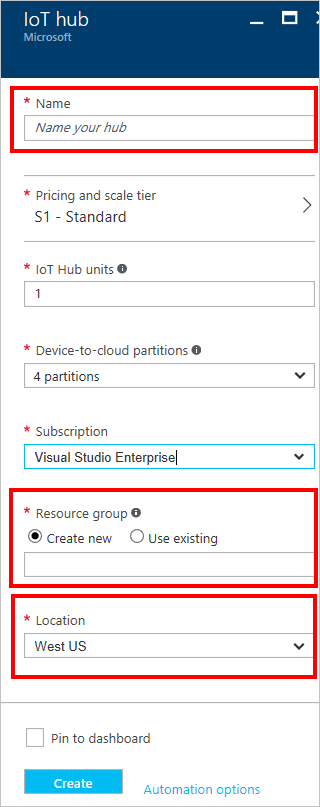
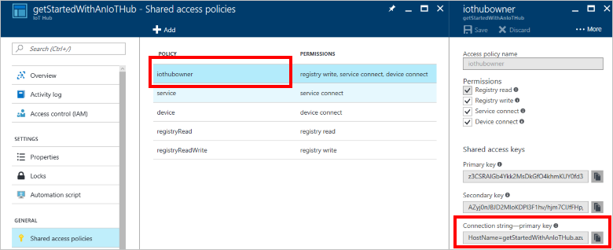

# Connect Adafruit Feather HUZZAH ESP8266 to Azure IoT Hub in the cloud


## What you will do

Connect Adafruit Feather HUZZAH ESP8266 to an IoT hub. Then run a sample application on ESP8266 to collect temperature and humidity data from a DHT22 sensor. Finally, send the sensor data to your IoT hub.

> [!NOTE]
>If you are using other ESP8266 boards, you can still follow these steps to connect them to your IoT hub. Depending on the ESP8266 board you are using, you may need to reconfigure the `LED_PIN`. For example, if you are using ESP8266 from AI-Thinker, you may change it from `0` to `2`. Don't have a board yet? [Get a Microsoft Azure IoT starter kit](http://azure.com/iotstarterkits).

## What you will learn

* How to create an IoT hub and register a device for Feather HUZZAH ESP8266.
* How to connect Feather HUZZAH ESP8266 with the sensor and your computer.
* How to collect sensor data by running a sample application on Feather HUZZAH ESP8266.
* How to send the sensor data to your IoT hub.

## What you will need


To complete this operation, you need the following parts from your Feather HUZZAH ESP8266 Starter Kit:

* The Feather HUZZAH ESP8266 board.
* A Micro USB to Type A USB cable.

You also need the following things for your development environment:

* Mac or PC that is running Windows or Ubuntu.
* Wireless network for Feather HUZZAH ESP8266 to connect to.
* Internet connection to download the configuration tool.
* [Arduino IDE](https://www.arduino.cc/en/main/software) version 1.6.8 (or newer), earlier versions don't work with the AzureIoT library.


The following items are optional in case you don’t have a sensor. You also have the option of using simulated sensor data.

* An Adafruit DHT22 temperature and humidity sensor.
* A breadboard.
* M/M jumper wires.

## Create an IoT hub and register a device for Feather HUZZAH ESP8266

### Create your Azure IoT hub in the Azure portal

1. Sign in to the [Azure portal](https://portal.azure.com/).
1. Click **New** > **Internet of Things** > **IoT Hub**.

   

1. In the **IoT hub** pane, enter the necessary information for your IoT hub:

   

   * **Name**: It is the name for your IoT hub. If the name you enter is valid, a green check mark appears.
   * **Pricing and scale tier**: Select the free F1 tier. This option is sufficient for this demo. See [pricing and scale tier](https://azure.microsoft.com/pricing/details/iot-hub/).

   * **Resource group**: Create a resource group to host the IoT hub or use an existing one. See [Using resource groups to manage your Azure resources](../azure-resource-manager/resource-group-portal.md).
   * **Location**: Select the closest location to you where the IoT hub is created.
   * **Pin the dashboard**: Check this option for easy access to your IoT hub from the dashboard.
1. Click **Create**. It could take a few minutes for your IoT hub to be created. You can see progress in the **Notifications** pane.

   

1. Once your IoT hub is created, click it from the dashboard. Make a note of the **Hostname**, and then click **Shared access policies**.

   

1. In the **Shared access policies** pane, click the **iothubowner** policy, and then copy and make a note of the **Connection string** of your IoT hub to be used later. For more information, see [Control access to IoT Hub](iot-hub-devguide-security.md).

   

### Register a device for Feather HUZZAH ESP8266 in your IoT hub

Every IoT hub has an identity registry that stores information about the devices that are permitted to connect to the IoT hub. Before a device can connect to an IoT hub, there must be an entry for that device in the IoT hub's identity registry.

In this section, you use a CLI tool iothub explorer to register a device for Feather HUZZAH ESP8266 in the identity registry of your IoT hub.

> [!NOTE]
> iothub explorer requires Node.js 4.x or higher to work properly.

To register a device for Feather HUZZAH ESP8266, follow these steps:

1. [Download](https://nodejs.org/en/download/) and install the latest LTS version of Node.js, NPM included.
1. Install iothub explorer by using NPM.

   * Windows 7 or later

     Start a command prompt as an administrator. Install iothub explorer by running the following command:

     ```bash
     npm install -g iothub-explorer
     ```
   * Ubuntu 16.04 or later

     Open a terminal by using the keyboard shortcut Ctrl + Alt + T, and then run the following command:

     ```bash
     sudo npm install -g iothub-explorer
     ```
   * macOS 10.1 or later

     Open a terminal, and then run the following command:

     ```bash
     npm install -g iothub-explorer
     ```
1. Log in to your IoT hub by running the following command:

   ```bash
   iothub-explorer login [your iot hub connection string]
   ```
1. Register a new device with `deviceID` as `new-device`, and get its connection string by running the following command:

   ```bash
   iothub-explorer create new-device --connection-string
   ```

Make a note of the connection string of the registered device.

> [!NOTE]
> To view the connection string of registered devices, run the `iothub-explorer list` command.

## Connect Feather HUZZAH ESP8266 with the sensor and your computer

### Connect a DHT22 temperature and humidity sensor to Feather HUZZAH ESP8266

Use the breadboard and jumper wires to make the connection as follows. If you don’t have a sensor, skip this section because you can use simulated sensor data instead.


Use the following wiring for sensor pins:

| Start (Sensor)           | End (Board)           | Cable Color   |
| -----------------------  | ---------------------- | ------------: |
| VDD (Pin 31F)            | 3V (Pin 58H)           | Red cable     |
| DATA (Pin 32F)           | GPIO 2 (Pin 46A)       | Blue cable    |
| GND (Pin 34F)            | GND (PIn 56I)          | Black cable   |

For more information, see: [Adafruit DHT22 sensor setup](https://learn.adafruit.com/dht/connecting-to-a-dhtxx-sensor) and [Adafruit Feather HUZZAH Esp8266 Pinouts](https://learn.adafruit.com/adafruit-feather-huzzah-esp8266/using-arduino-ide?view=all#pinouts)

Now your Feather Huzzah ESP8266 should be connected with a working sensor.


### Connect Feather HUZZAH ESP8266 to your computer

Use the Micro USB to Type A USB cable to connect Feather HUZZAH ESP8266 to your computer as follows.


### Add serial port permissions – Ubuntu only

If you use Ubuntu, make sure you have the permissions to operate on the USB port of Feather HUZZAH ESP826. To add serial port permissions, follow these steps:

1. Run the following commands at a terminal:

   ```bash
   ls -l /dev/ttyUSB*
   ls -l /dev/ttyACM*
   ```

   You get one of the following outputs:

   * crw-rw---- 1 root uucp xxxxxxxx
   * crw-rw---- 1 root dialout xxxxxxxx

   In the output, notice `uucp` or `dialout` that is the group owner name of the USB port.

1. Add the user to the group by running the following command:

   ```bash
   sudo usermod -a -G <group-owner-name> <username>
   ```

   `<group-owner-name>` is the group owner name you obtained in the previous step. `<username>` is your Ubuntu user name.

1. Log out Ubuntu and log in it again for the change to take effect.

## Collect sensor data and send it to your IoT hub

In this section, you deploy and run a sample application on Feather HUZZAH ESP8266. The sample application blinks the LED on Feather HUZZAH ESP8266 and sends the temperature and humidity data collected from the DHT22 sensor to your IoT hub.

### Get the sample application from GitHub

The sample application is hosted on GitHub. Clone the sample repository that contains the sample application from GitHub. To clone the sample repository, follow these steps:

1. Open a command prompt or a terminal window.
1. Go to a folder where you want the sample application to be stored.
1. Run the following command:

   ```bash
   git clone https://github.com/Azure-Samples/iot-hub-feather-huzzah-client-app.git
   ```

Install the package for Feather HUZZAH ESP8266 in Arduino IDE:

1. Open the folder where the sample application is stored.
1. Open the app.ino file in the app folder in Arduino IDE.

   

1. In the Arduino IDE, click **File** > **Preferences**.
1. In the **Preferences** dialog box, click the icon next to the **Additional Boards Manager URLs** text box.
1. In the pop-up window, enter the following URL, and then click **OK**.

   `http://arduino.esp8266.com/stable/package_esp8266com_index.json`

   

1. In the **Preference** dialog box, click **OK**.
1. Click **Tools** > **Board** > **Boards Manager**, and then search for esp8266.

   Boards Manager indicates that ESP8266 with a version of 2.2.0 or later is installed.

   

1. Click **Tools** > **Board** > **Adafruit HUZZAH ESP8266**.

### Install necessary libraries

1. In the Arduino IDE, click **Sketch** > **Include Library** > **Manage Libraries**.
1. Search for the following library names one by one. For each of the library you find, click **Install**.
   * `AzureIoTHub`
   * `AzureIoTUtility`
   * `AzureIoTProtocol_MQTT`
   * `ArduinoJson`
   * `DHT sensor library`
   * `Adafruit Unified Sensor`

### Don’t have a real DHT22 sensor?

The sample application can simulate temperature and humidity data in case you don’t have a real DHT22 sensor. To enable the sample application to use simulated data, follow these steps:

1. Open the `config.h` file in the `app` folder.
1. Locate the following line of code and change the value from `false` to `true`:
   ```c
   define SIMULATED_DATA true
   ```
   

1. Save the file with `Control-s`.

### Deploy the sample application to Feather HUZZAH ESP8266

1. In the Arduino IDE, click **Tool** > **Port**, and then click the serial port for Feather HUZZAH ESP8266.
1. Click **Sketch** > **Upload** to build and deploy the sample application to Feather HUZZAH ESP8266.

### Enter your credentials

After the upload completes successfully, follow the steps to enter your credentials:

1. In the Arduino IDE, click **Tools** > **Serial Monitor**.
1. In the serial monitor window, notice the two drop-down lists on the bottom right corner.
1. Select **No line ending** for the left drop-down list.
1. Select **115200 baud** for the right drop-down list.
1. In the input box located at the top of the serial monitor window, enter the following information if you are asked to provide them, and then click **Send**.
   * Wi-Fi SSID
   * Wi-Fi password
   * Device connection string

> [!Note]
> The credential information is stored in the EEPROM of Feather HUZZAH ESP8266. If you click the reset button on the Feather HUZZAH ESP8266 board, the sample application asks you if you want to erase the information. Enter `Y` to have the information erased and you are asked to provide the information again.

### Verify the sample application is running successfully

If you see the following output from the serial monitor window and the blinking LED on Feather HUZZAH ESP8266, the sample application is running successfully.


## Next steps

You have successfully connected a Feather HUZZAH ESP8266 to your IoT hub and sent the captured sensor data to your IoT hub. 

To continue getting started with IoT Hub and to explore other IoT scenarios, see:

- [Manage cloud device messaging with iothub-explorer](iot-hub-explorer-cloud-device-messaging.md)
- [Save IoT Hub messages to Azure data storage](iot-hub-store-data-in-azure-table-storage.md)
- [Use Power BI to visualize real-time sensor data from Azure IoT Hub](iot-hub-live-data-visualization-in-power-bi.md).
- [Use Azure Web Apps to visualize real-time sensor data from Azure IoT Hub](iot-hub-live-data-visualization-in-web-apps.md).
- [Weather forecast using the sensor data from your IoT hub in Azure Machine Learning](iot-hub-weather-forecast-machine-learning.md)