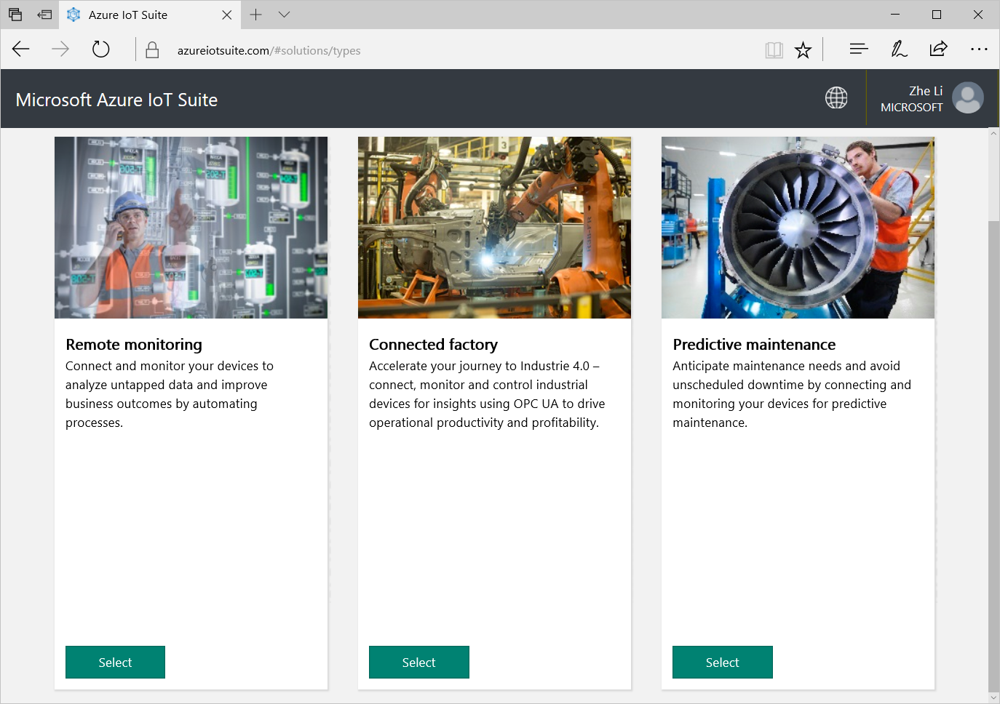
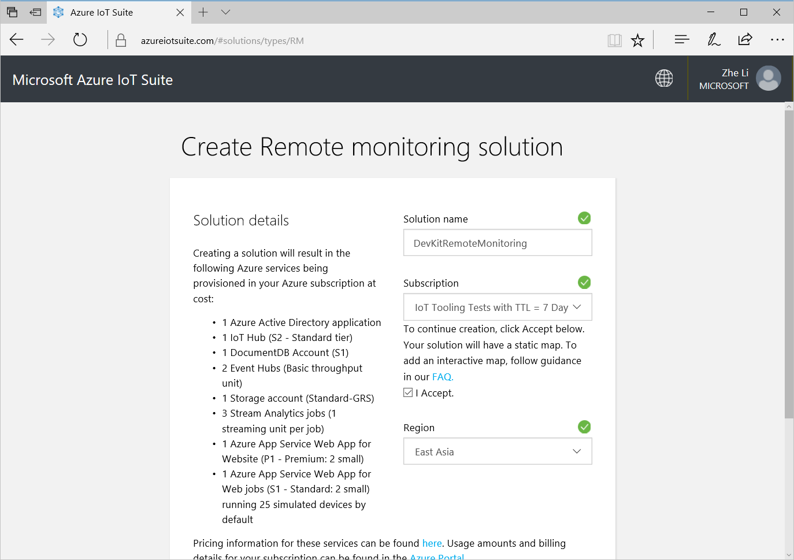
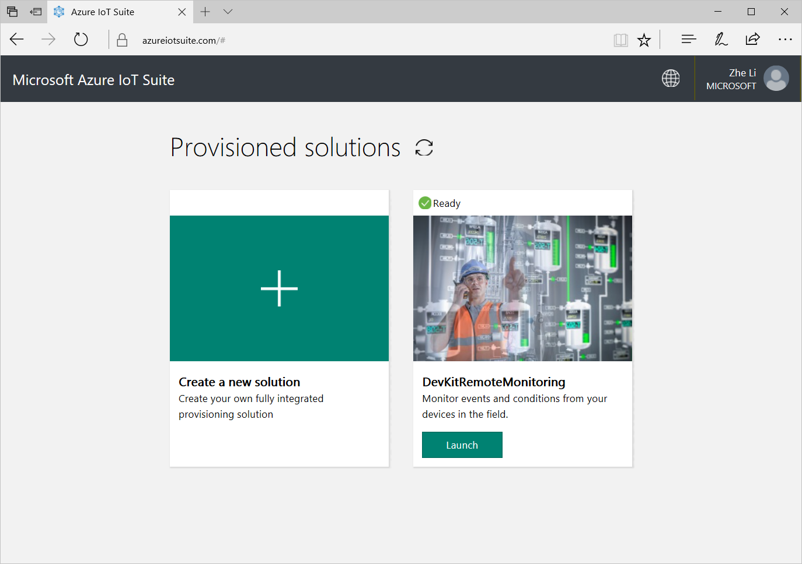
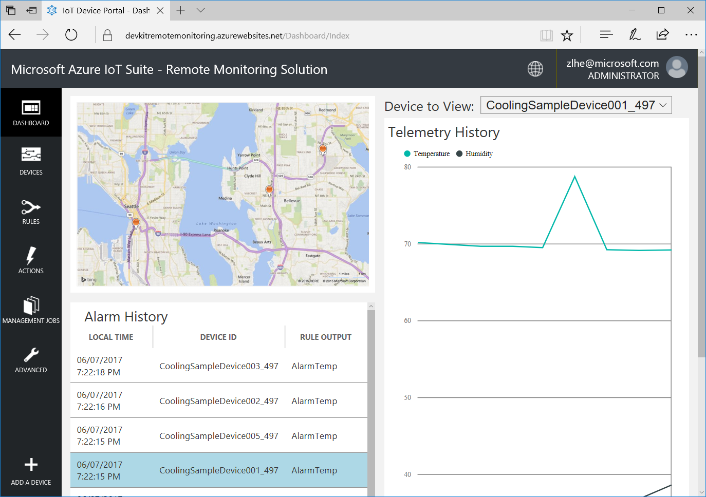
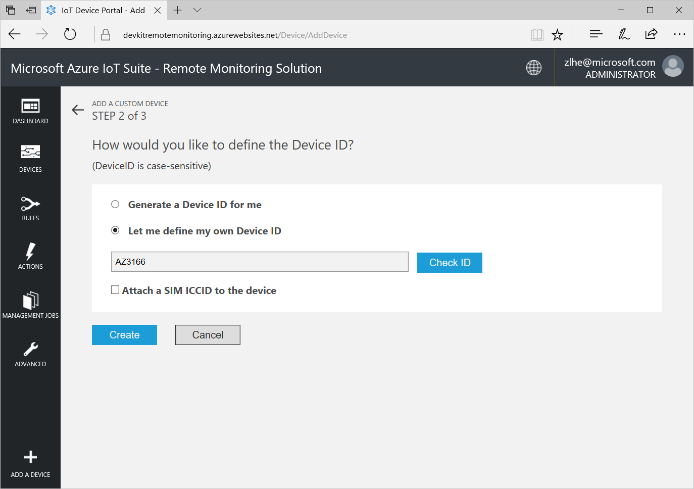
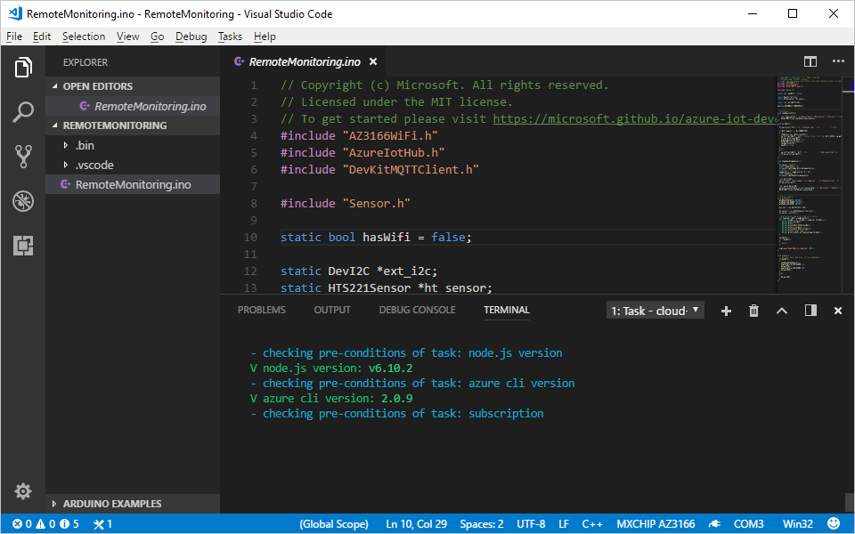
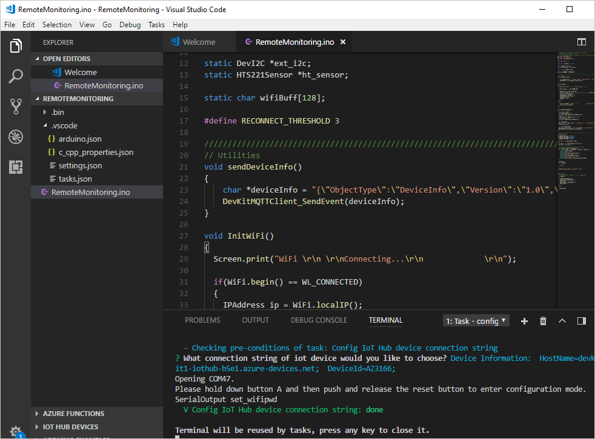
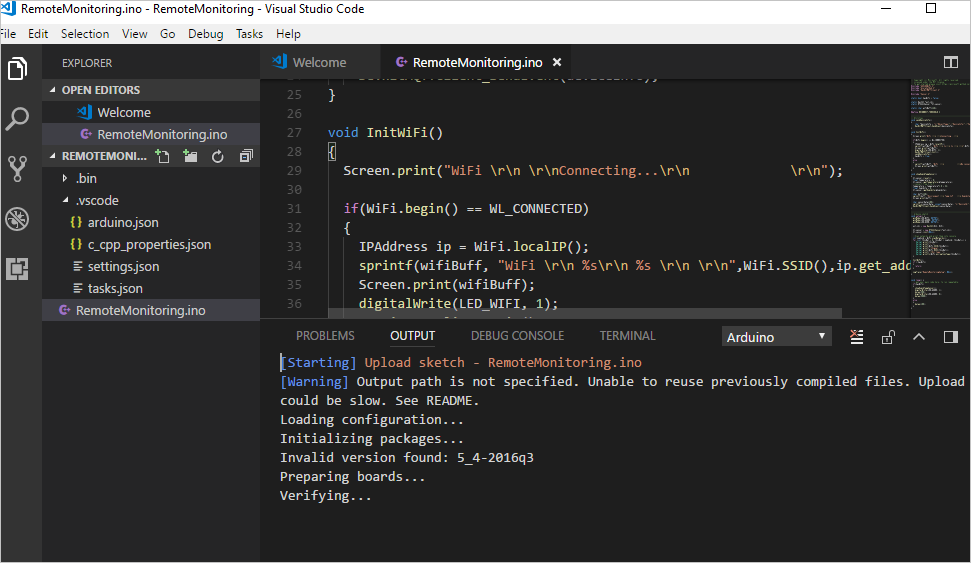
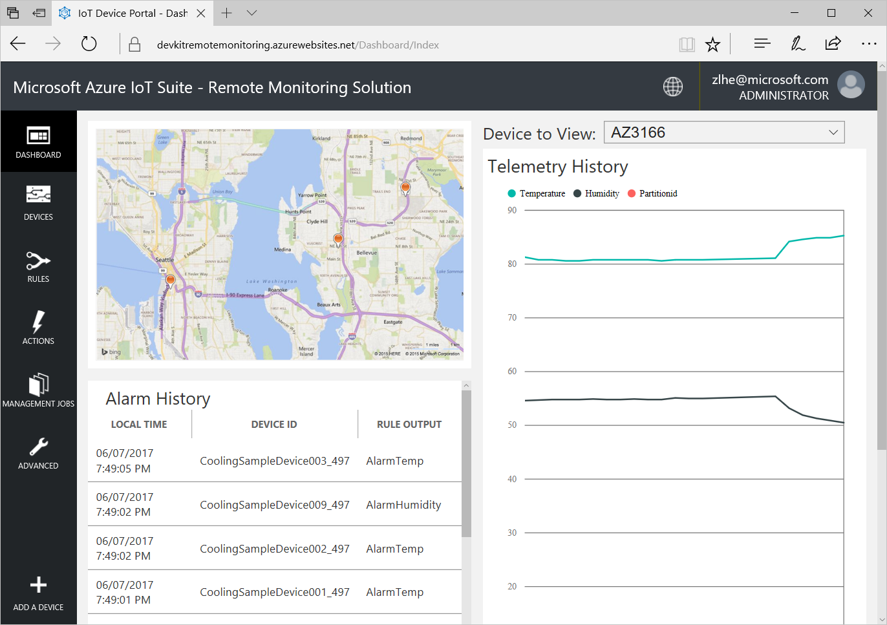

# Connect MXChip IoT DevKit to Azure IoT Remote Monitoring solution accelerator

In this tutorial, you learn how to run a sample app on your DevKit to send sensor data to your Azure IoT Remote Monitoring solution accelerator.

The [MXChip IoT DevKit](https://aka.ms/iot-devkit) is an all-in-one Arduino compatible board with rich peripherals and sensors. You can develop for it using [Visual Studio Code extension for Arduino](https://aka.ms/arduino). And it comes with a growing [projects catalog](https://microsoft.github.io/azure-iot-developer-kit/docs/projects/) to guide you prototype Internet of Things (IoT) solutions that take advantage of Microsoft Azure services.

## What you need

Finish the [Getting Started Guide](https://docs.microsoft.com/azure/iot-hub/iot-hub-arduino-iot-devkit-az3166-get-started) to:

* Have your DevKit connected to Wi-Fi
* Prepare the development environment

An active Azure subscription. If you do not have one, you can register via one of these two methods:

* Activate a [free 30-day trial Microsoft Azure account](https://azure.microsoft.com/free/)

* Claim your [Azure credit](https://azure.microsoft.com/pricing/member-offers/msdn-benefits-details/) if you are MSDN or Visual Studio subscriber

## Create an Azure IoT Remote Monitoring solution accelerator

1. Go to [Azure IoT solution accelerators site](https://www.azureiotsolutions.com/) and click **Create a new solution**.

   

   > [!WARNING]
   > By default, this sample creates an S2 IoT Hub after it creates one IoT Remote Monitoring solution accelerator. If this IoT hub is not used with massive number of devices, we highly recommend you downgrade it from S2 to S1, and delete the IoT Remote Monitoring solution accelerator so the related IoT Hub can also be deleted, when you no longer need it. 

2. Select **Remote monitoring**.

3. Enter a solution name, select a subscription and a region, and then click **Create solution**. The solution may take a while to be provisioned.
  
   

4. After provisioning finishes, click **Launch**. Some simulated devices are created for the solution during the provisioning process. Click **DEVICES** to check them out.

   
  
   

5. Click **ADD A DEVICE**.

6. Click **Add New** for **Custom Device**.
  
   

7. Click **Let me define my own Device ID**, enter `AZ3166`, and then click **Create**.
  
   

8. Make a note of **IoT Hub Hostname**, and click **Done**.

## Open the RemoteMonitoring sample

1. Disconnect the DevKit from your computer, if it is connected.

2. Start VS Code.

3. Connect the DevKit to your computer. VS Code automatically detects your DevKit and opens the following pages:

   * The DevKit introduction page.
   * Arduino Examples: Hands-on samples to get started with DevKit.

4. Expand left side **ARDUINO EXAMPLES** section, browse to **Examples for MXCHIP AZ3166 > AzureIoT**, and select **RemoteMonitoring**. It opens a new VS Code window with a project folder in it.

   > [!NOTE]
   > If you happen to close the pane, you can reopen it. Use `Ctrl+Shift+P` (macOS: `Cmd+Shift+P`) to open the command palette, type **Arduino**, and then find and select **Arduino: Examples**.

## Provision required Azure services

In the solution window, run your task through `Ctrl+P` (macOS: `Cmd+P`) by entering `task cloud-provision` in the provided text box.

In the VS Code terminal, an interactive command line guides you through provisioning the required Azure services.

## Build and upload the device code

1. Use `Ctrl+P` (macOS: `Cmd + P`) and type **task config-device-connection**.

2. The terminal asks whether you want to use a connection string that it retrieves from the `task cloud-provision` step. You could also input your own device connection string by clicking 'Create New...'

3. The terminal prompts you to enter configuration mode. To do so, hold down button A, then push and release the reset button. The screen displays the DevKit ID and 'Configuration'.

   

4. After `task config-device-connection` finishes, click `F1` to load VS Code commands and select `Arduino: Upload`. VS Code starts verifying and uploading the Arduino sketch.
  
   

The DevKit reboots and starts running the code.

## Test the project

When the sample app runs, DevKit sends sensor data over WiFi to your Azure IoT Remote Monitoring solution accelerator. To see the result, follow these steps:

1. Go to your Azure IoT Remote Monitoring solution accelerator, and click **DASHBOARD**.

2. On the Remote Monitoring solution console, you will see your DevKit sensor status.

   

## Change device ID

If you want to change the hardcoded **AZ3166** to a customized device ID in the code, modify the line of code displayed in the [remote monitoring example](https://github.com/Microsoft/devkit-sdk/blob/master/AZ3166/src/libraries/AzureIoT/examples/RemoteMonitoring/RemoteMonitoring.ino#L23).

## Problems and feedback

If you encounter problems, refer to [the IoT developer kit FAQs](https://microsoft.github.io/azure-iot-developer-kit/docs/faq/) or reach out to us using the following channels:

* [Gitter.im](https://gitter.im/Microsoft/azure-iot-developer-kit)
* [Stack Overflow](https://stackoverflow.com/questions/tagged/iot-devkit)

## Next steps

Now that you have learned how to connect a DevKit device to your Azure IoT Remote Monitoring solution accelerator and visualize the sensor data, here are the suggested next steps:

* [Azure IoT solution accelerators overview](https://docs.microsoft.com/azure/iot-suite/)

* [Connect an MXChip IoT DevKit device to your Azure IoT Central application](https://docs.microsoft.com/microsoft-iot-central/howto-connect-devkit)

* [IoT developer kit](https://microsoft.github.io/azure-iot-developer-kit/) 
