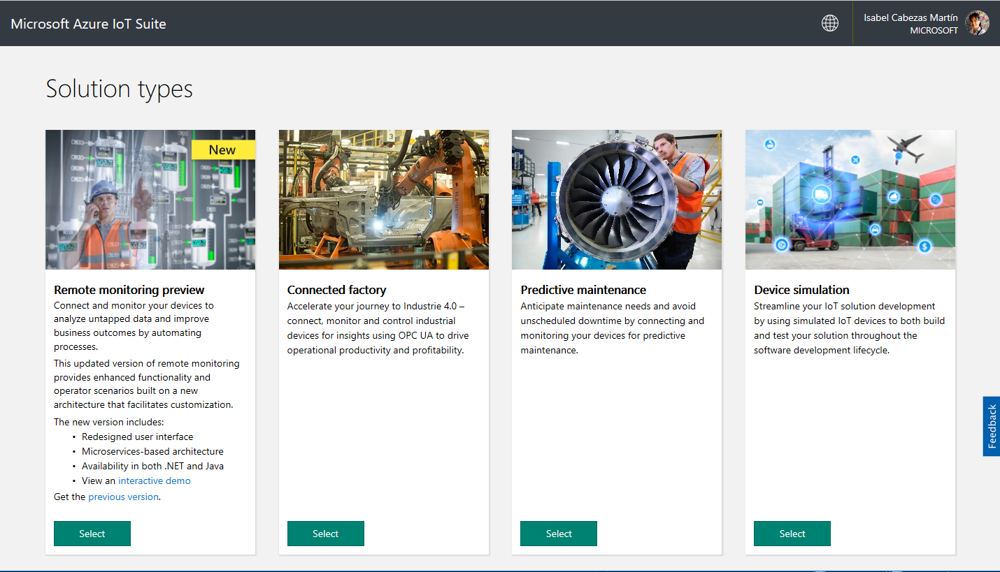
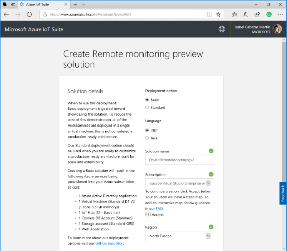
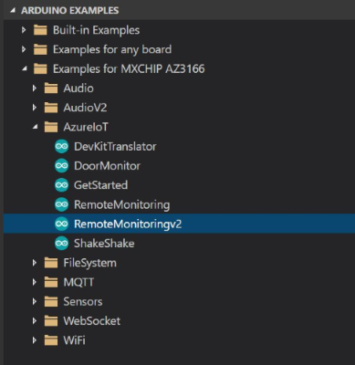
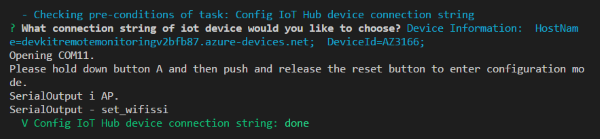
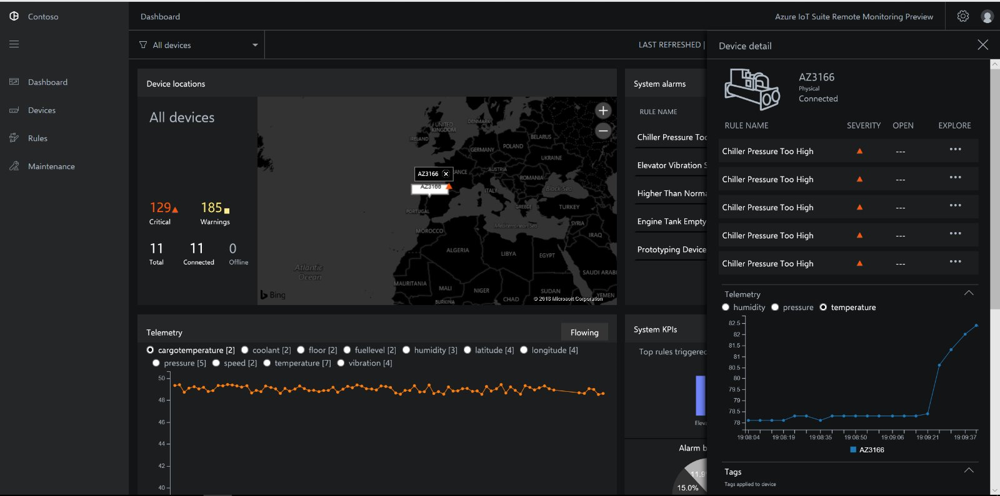
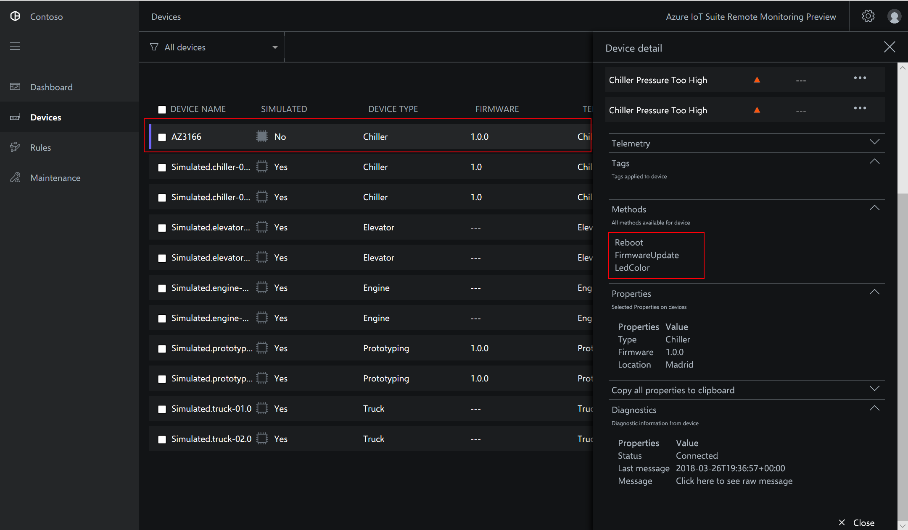
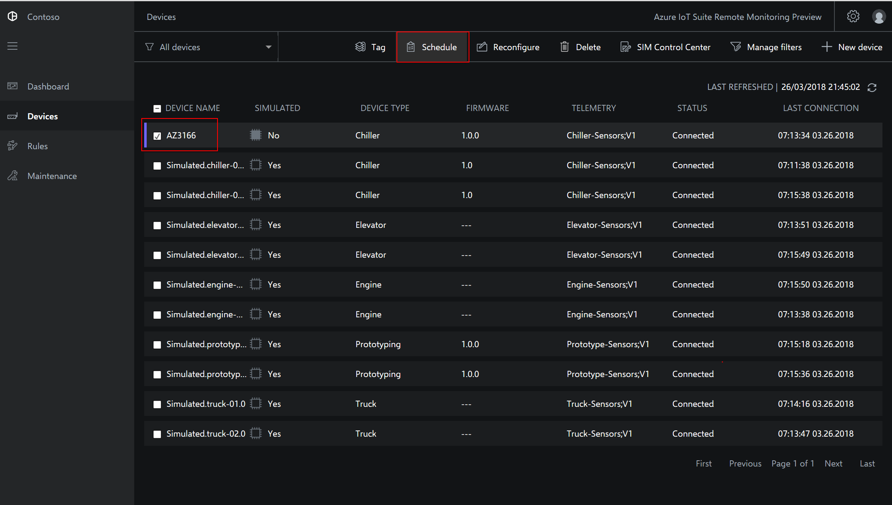

# Connect IoT DevKit AZ3166 to Azure IoT Suite for remote monitoring v2

In this tutorial, you learn how to run a sample app on your DevKit to send sensor data to your Azure IoT Suite.

The [MXChip IoT DevKit](https://aka.ms/iot-devkit) is an all-in-one Arduino compatible board with rich peripherals and sensors. You can develop for it using [Visual Studio Code extension for Arduino](https://aka.ms/arduino). And it comes with a growing [projects catalog](https://microsoft.github.io/azure-iot-developer-kit/docs/projects/) to guide you prototype Internet of Things (IoT) solutions that take advantage of Microsoft Azure services.

## What you need

Finish the [Getting Started Guide](https://docs.microsoft.com/azure/iot-hub/iot-hub-arduino-iot-devkit-az3166-get-started) to:

* Have your DevKit connected to Wi-Fi
* Prepare the development environment

An active Azure subscription. If you do not have one, you can register via one of these two methods:

* Activate a [free 30-day trial Microsoft Azure account](https://azureinfo.microsoft.com/us-freetrial.html)
* Claim your [Azure credit](https://azure.microsoft.com/pricing/member-offers/msdn-benefits-details/) if you are MSDN or Visual Studio subscriber

## Create an Azure IoT Suite

1. Go to [Azure IoT Suite site](https://www.azureiotsuite.com/) and click **Create a new solution**.

  
 

2. Select **Remote monitoring preview**.

3. Enter a solution name, select a subscription and a region, and then click **Create solution**. The solution may take a while to be provisioned.

  

4. After the provision is completed, click **Launch**. Some simulated devices are created for the solution during the provision process. Click **DEVICES** to check them out.

  

  

## Open the RemoteMonitoring sample

1. Disconnect the DevKit from your computer, if it is connected.

2. Start VS Code.

3. Connect the DevKit to your computer. VS Code automatically detects your DevKit and opens the following pages:
  * The DevKit introduction page.
  * Arduino Examples: Hands-on samples to get started with DevKit.

4. Expand left side **ARDUINO EXAMPLES** section, browse to **Examples for MXCHIP AZ3166 > AzureIoT**, and select **RemoteMonitoringv2**. It opens a new VS Code window with a project folder in it.

  

  > [!NOTE]
  > If you happen to close the pane, you can reopen it. Use `Ctrl+Shift+P` (macOS: `Cmd+Shift+P`) to open the command palette, type **Arduino**, and then find and select **Arduino: Examples**.

## Provision required Azure services

In the solution window, run your task through `Ctrl+P` (macOS: `Cmd+P`) by entering `task cloud-provision` in the provided text box:

In the VS Code terminal, an interactive command line guides you through provisioning the required Azure services.

Sometimes you will receive a popup window asking you to introduce a code in order to log into your Azure account.

Then choose the subscritpion where you have your IoT Suite Remote Monitoring V2 solution and select the IoT Hub:

## Build and upload the device code

1. Use `Ctrl+P` (macOS: `Cmd + P`) and type **task config-device-connection**.

2. The terminal asks you whether you want to use connection string that retrieves from `task cloud-provision` step. 

3. The terminal prompts you to enter configuration mode. To do so, hold down button A, then push and release the reset button and then release the button A. 
The screen displays the DevKit ID and 'Configuration'.

4. After `task config-device-connection` finished, use `Ctrl+P` (macOS: `Cmd + P`) and type **task device-upload**.

The DevKit reboots and starts running the code.

Now, you can see your new physical device in the VS Code section "Azure IoT Hub Devices"

## Test the project

When the sample app runs, DevKit sends sensor data over Wi-Fi to your Azure IoT Suite. To see the result, follow these steps:

1. Go to your Azure IoT Suite, and click **DASHBOARD**.

2. On the Azure IoT Suite solution console, you will see your DevKit sensor status. 

If you click on the sensor name (AZ3166) a tab opens on the right side of the dashboard, where you can see the MX Chip sensors chart in real time.

## Send a C2D message
Remote Monitoring v2 allows you to invoke remote method on the device.
The MX Chip example code publishes three methods that you can see in the Method section when you the sensor is selected.

You can change the color of one of the MX Chip led using the method "LedColor". For doing it, select the checkbox of the device and click on the Schedule button. 

Choose the method called ChangeColor in the dropdown where all the methods appear, write a name and Apply.

In several seconds, your physical MX Chip should change the color of the RGB led (below of the A button)

## Change device ID

You can change the device ID in IoT Hub by following [this guide](https://microsoft.github.io/azure-iot-developer-kit/docs/customize-device-id/).

## Problems and feedback

If you encounter problems, refer to [FAQs](https://microsoft.github.io/azure-iot-developer-kit/docs/faq/) or reach out to us from the following channels:

* [Gitter.im](http://gitter.im/Microsoft/azure-iot-developer-kit)
* [Stackoverflow](https://stackoverflow.com/questions/tagged/iot-devkit)

## Next steps

Now that you have learned how to connect a DevKit device to your Azure IoT Suite and visualize the sensor data, here are the suggested next steps:

* [Azure IoT Suite overview](https://docs.microsoft.com/azure/iot-suite/)
* [Connect an MXChip IoT DevKit device to your Microsoft IoT Central application](https://docs.microsoft.com/en-us/microsoft-iot-central/howto-connect-devkit)
