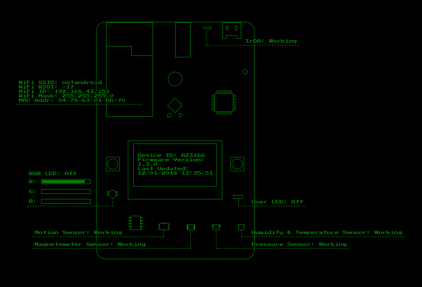

# MXChip IoT DevKit

You can use this example to monitor the MXChip IoT DevKit WiFi information and sensor states and to control the color of the user LED using Azure IoT Hub device twins.

## What you learn

- How to monitor the MXChip IoT DevKit sensor states.

- How to use Azure device twins to control the color of the DevKit's RGB LED.

## What you need

- Set up your development environment by following the [Getting Started Guide](https://docs.microsoft.com/azure/iot-hub/iot-hub-arduino-iot-devkit-az3166-get-started).

- From your GitBash terminal window (or other Git command-line interface), type the following commands:

   ```bash
   git clone https://github.com/DevKitExamples/DevKitState.git
   cd DevKitState
   code .
   ```

## Provision Azure Services

1. Click the **Tasks** drop-down menu in Visual Studio Code and select **Run Task...** - **cloud-provision**.

2. Your progress is displayed under the **TERMINAL** tab of the **Welcome** panel.

3. When prompted with the message *What subscription would you like to choose*, select a subscription.

4. Select or choose a resource group. 
 
   > [!NOTE]
   > If you already have a free IoT Hub, you can skip this step.

5. When prompted with the message *What IoT hub would you like to choose*, select or create an IoT Hub.

6. Something similar to *function app: function app name: xxx*, is displayed. Write down the function app name; it will be used in a later step.

7. Wait for the Azure Resource Manager template deployment to finish, which is indicated when the message *Resource Manager template deployment: Done* is displayed.

## Deploy Function App

1. Click the **Tasks** drop-down menu in Visual Studio Code and select **Run Task...** - **cloud-deploy**.

2. Wait for function app code uploading process to finish; the message *function app deploys: Done* is displayed.

## Configure IoT Hub Device Connection String in DevKit

1. Connect your MXChip IoT DevKit to your computer.

2. Click the **Tasks** drop-down menu in Visual Studio Code and select **Run Task...** - **config-device-connection**

3. On the MXChip IoT DevKit, press and hold button **A**, press the **Reset** button, and then release button **A** to make the DekKit enter configuration mode.

4. Wait for connection string configuration process to be completed.

## Upload Arduino Code to DevKit

With your MXChip IoT DevKit connected to your computer:

1. Click the **Tasks** drop-down menu in Visual Studio Code and select **Run Build Task...** The Arduino sketch is compiled and uploaded to the DevKit.

2. When the sketch has been uploaded successfully, a *Build & Upload Sketch: success* message is displayed.

## Monitor DevKit State in Browser

1. In a Web browser, open the `DevKitState\web\index.html` file--which was created during the What you need step.

2. The following Web page appears:

3. Input the function app name you wrote down earlier.

4. Click the **Connect** button

5. Within a few seconds, the page refreshes and displays the DevKit's WiFi connection status and the state of each of the onboard sensors.

## Control the DevKit's User LED

1. Click the user LED graphic on the Web page illustration.

2. Within a few seconds, the screen refreshes and shows the current color status of the user LED.

3. Try changing the color value of the RGB LED by clicking in various locations on the RGB slider controls.

## Example operation



> [!NOTE]
> You can see raw data of device twin in Azure portal:
> IoT Hub -\> IoT devices -\> *\<your device\>* -\> Device Twin.

## Next steps

You have learned how to:
- Connect an MXChip IoT DevKit device to your Azure IoT Remote Monitoring solution accelerator.
- Use the Azure IoT device twins function to sense and control the color of the DevKit's RGB LED.

Here are the suggested next steps:

* [Azure IoT Remote Monitoring solution accelerator overview](https://docs.microsoft.com/azure/iot-suite/)
* [Connect an MXChip IoT DevKit device to your Azure IoT Central application](https://docs.microsoft.com/microsoft-iot-central/howto-connect-devkit)
