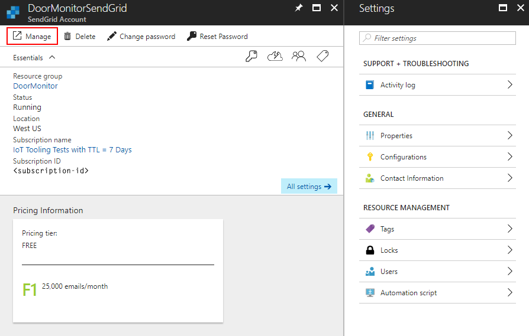
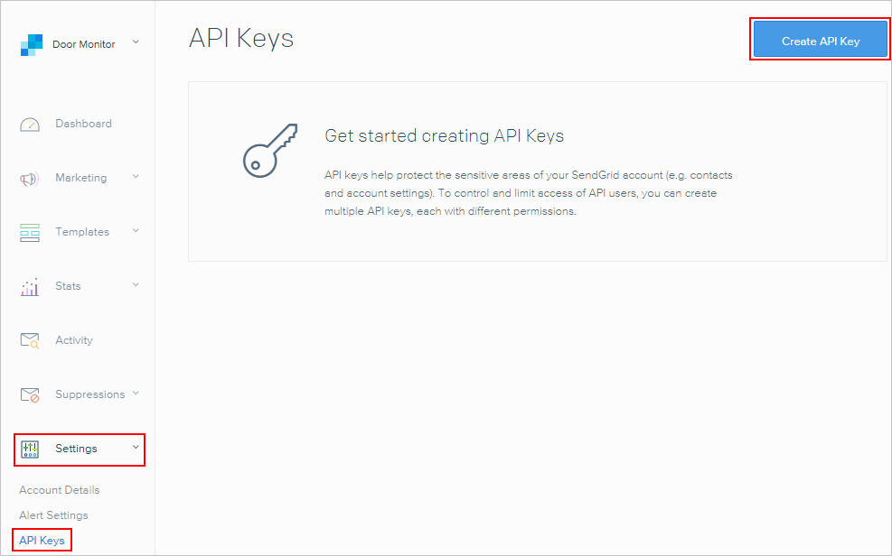
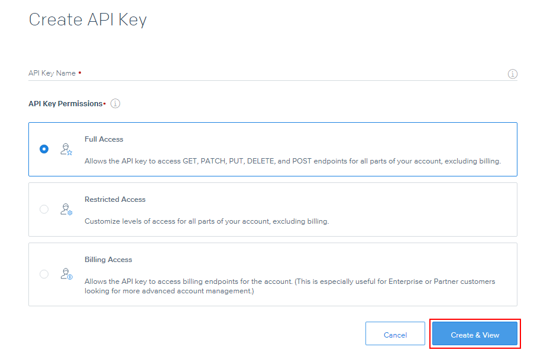
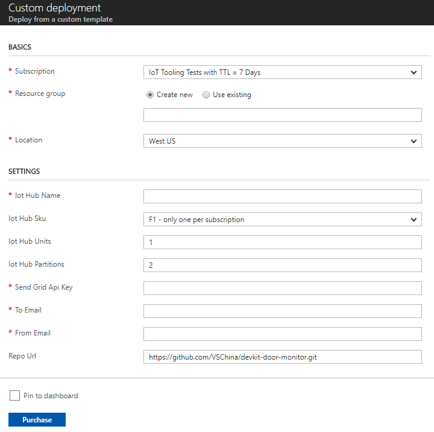
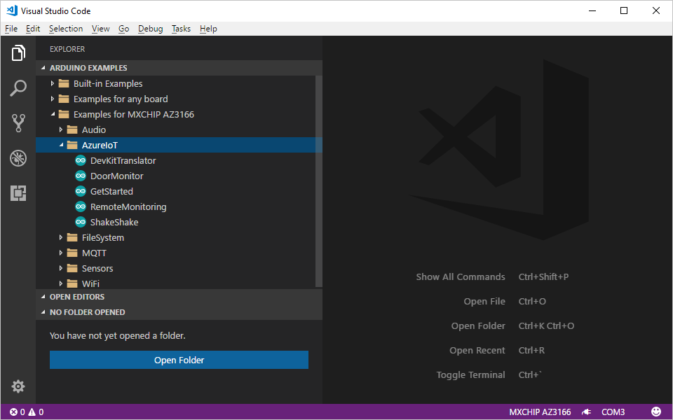
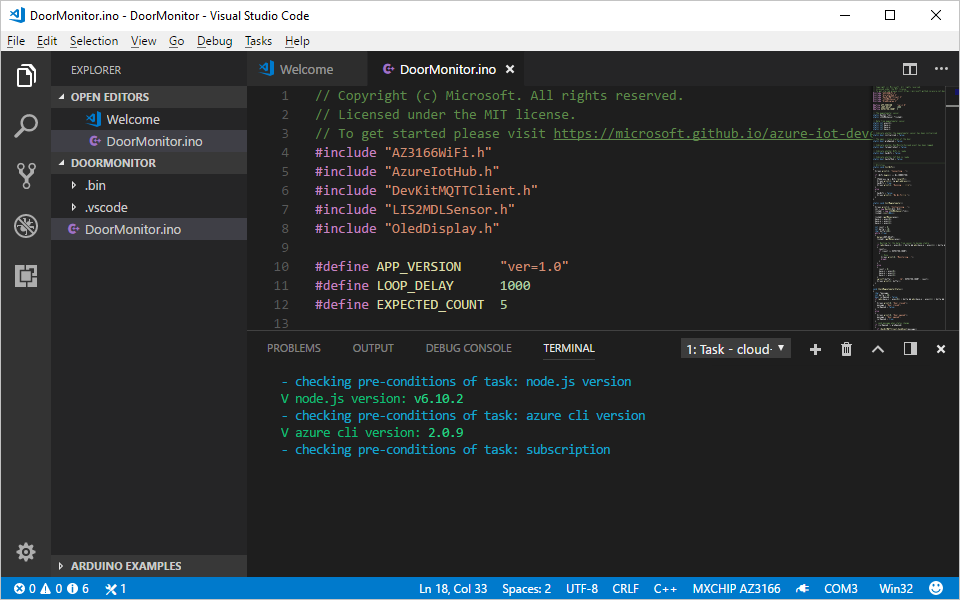
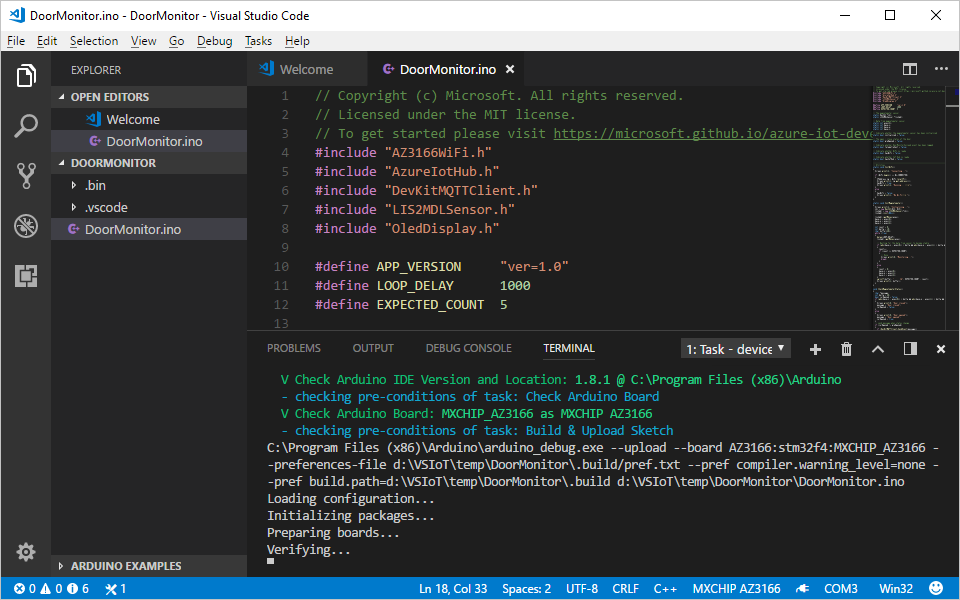

# Door Monitor          

The MXChip IoT DevKit contains a built-in magnetic sensor. In this project, you detect the presence or absence of a nearby strong magnetic field -- in this case, coming from a small, permanent magnet.

## What you learn

In this project, you learn:
- How to use the MXChip IoT DevKit's magnetic sensor to detect the movement of a nearby magnet.
- How to use the SendGrid service to send a notification to your email address.

> [!NOTE]
> For a practical use of this project, perform the following tasks:
> - Mount a magnet to the edge of a door.
> - Mount the DevKit on the door jamb close to the magnet. Opening or closing the door will trigger the sensor, resulting in your receiving an email notification of the event.

## What you need

Finish the [Getting Started Guide](iot-hub-arduino-iot-devkit-az3166-get-started.md) to:

* Have your DevKit connected to Wi-Fi
* Prepare the development environment

An active Azure subscription. If you do not have one, you can register via one of these methods:

* Activate a [free 30-day trial Microsoft Azure account](https://azure.microsoft.com/free/).
* Claim your [Azure credit](https://azure.microsoft.com/pricing/member-offers/msdn-benefits-details/) if you are an MSDN or Visual Studio subscriber.

## Deploy the SendGrid service in Azure

[SendGrid](https://sendgrid.com/) is a cloud-based email delivery platform. This service will be used to send email notifications.

> [!NOTE]
> If you have already deployed a SendGrid service, you may proceed directly to [Deploy IoT Hub in Azure](#deploy-iot-hub-in-azure).

### SendGrid Deployment

To provision Azure services, use the **Deploy to Azure** button. This button enables quick and easy deployment of your open-source projects to Microsoft Azure.

Click the **Deploy to Azure** button below. 

If you are not already signed into your Azure account, sign in now. 

You now see the SendGrid sign-up form.

Complete the sign-up form:

   * **Resource group**: Create a resource group to host the SendGrid service, or use an existing one. See [Using resource groups to manage your Azure resources](../azure-resource-manager/resource-group-portal.md).

   * **Name**: The name for your SendGrid service. Choose a unique name, differing from other services you may have.

   * **Password**: The service requires a password, which will not be used for anything in this project.

   * **Email**: The SendGrid service will send verification to this email address.

Check the **Pin to dashboard** option to make this application easier to find in the future, then click **Purchase** to submit the sign-in form.
 
### SendGrid API Key creation

After the deployment completes, click it and then click the **Manage** button. Your SendGrid account page appears, where you need to verify your email address.

On the SendGrid page, click **Settings** > **API Keys** > **Create API Key**.

On the **Create API Key** page, input the **API Key Name** and click **Create & View**.

Your API key is displayed only one time. Be sure to copy and store it safely, as it is used in the next step.

## Deploy IoT Hub in Azure

The following steps will provision other Azure IoT related services and deploy Azure Functions for this project.

Click the **Deploy to Azure** button below. 

The sign-up form appears.

Fill in the fields on the sign-up form.

   * **Resource group**: Create a resource group to host the SendGrid service, or use an existing one. See [Using resource groups to manage your Azure resources](../azure-resource-manager/resource-group-portal.md).

   * **Iot Hub Name**: The name for your IoT hub. Choose a unique name, differing from other services you may have.

   * **Iot Hub Sku**: F1 (limited to one per subscription) is free. You can see more pricing information on the [pricing page](https://azure.microsoft.com/pricing/details/iot-hub/).

   * **From Email**: This field should be the same email address you used when setting up the SendGrid service.

Check the **Pin to dashboard** option to make this application easier to find in the future, then click **Purchase** when you're ready to continue to the next step.
 
## Build and upload the code

Next, load the sample code in VS Code and provision the necessary Azure services.

### Start VS Code

- Make sure your DevKit is **not** connected to your computer.
- Start VS Code.
- Connect the DevKit to your computer.

> [!NOTE]
> When you launch VS Code, you may receive an error message stating that it cannot find the Arduino IDE or related board package. If you receive this error, close VS Code, launch the Arduino IDE again, and VS Code should locate the Arduino IDE path correctly.

### Open Arduino Examples folder

Expand the left side **ARDUINO EXAMPLES** section, browse to **Examples for MXCHIP AZ3166 > AzureIoT**, and select **DoorMonitor**. This action opens a new VS Code window with a project folder in it.

You can also open the example app from the command palette. Use `Ctrl+Shift+P` (macOS: `Cmd+Shift+P`) to open the command palette, type **Arduino**, and then find and select **Arduino: Examples**.

### Provision Azure services

In the solution window, run the cloud provisioning task:
- Type `Ctrl+P` (macOS: `Cmd+P`).
- Enter `task cloud-provision` in the provided text box.

In the VS Code terminal, an interactive command line guides you through provisioning the required Azure services. Select all of the same items from the prompted list that you previously provisioned in [Deploy IoT Hub in Azure](#deploy-iot-hub-in-azure).

> [!NOTE]
> If the page hangs in the loading status when trying to sign in to Azure, refer to the ["page hanges when logging in" section of the IoT DevKit FAQ](https://microsoft.github.io/azure-iot-developer-kit/docs/faq/#page-hangs-when-log-in-azure) to resolve this issue. 

### Build and upload the device code

Next, upload the code for the device.

#### Windows

1. Use `Ctrl+P` to run `task device-upload`.

2. The terminal prompts you to enter configuration mode. To do so, hold down button A, then push and release the reset button. The screen displays the DevKit identification number and the word *Configuration*.

#### macOS

1. Put the DevKit into configuration mode: Hold down button A, then push and release the reset button. The screen displays 'Configuration'.

2. Click `Cmd+P` to run `task device-upload`.

#### Verify, upload, and run the sample app

The connection string that is retrieved from the [Provision Azure services](#provision-azure-services) step is now set. 

VS Code then starts verifying and uploading the Arduino sketch to the DevKit.

The DevKit reboots and starts running the code.

> [!NOTE]
> Occasionally, you may receive an "Error: AZ3166: Unknown package" error message. This error occurs when the board package index is not refreshed correctly. To resolve this error, refer to the [development section of the IoT DevKit FAQ](https://microsoft.github.io/azure-iot-developer-kit/docs/faq/#development).

## Test the project

The program first initializes when the DevKit is in the presence of a stable magnetic field.

After initialization, `Door closed` is displayed on the screen. When there is a change in the magnetic field, the state changes to `Door opened`. Each time the door state changes, you receive an email notification. (These email messages may take up to five minutes to be received.)

## Problems and feedback

If you encounter problems, refer to the [IoT DevKit FAQ](https://microsoft.github.io/azure-iot-developer-kit/docs/faq/) or connect using the following channels:

* [Gitter.im](http://gitter.im/Microsoft/azure-iot-developer-kit)
* [Stackoverflow](https://stackoverflow.com/questions/tagged/iot-devkit)

## Next steps

You have learned how to connect a DevKit device to your Azure IoT Remote Monitoring solution accelerator and used the SendGrid service to send an email. Here are the suggested next steps:

* [Azure IoT Remote Monitoring solution accelerator overview](https://docs.microsoft.com/azure/iot-suite/)
* [Connect an MXChip IoT DevKit device to your Azure IoT Central application](https://docs.microsoft.com/microsoft-iot-central/howto-connect-devkit)
