# Connect IoT DevKit AZ3166 to Azure IoT Hub

[!INCLUDE [iot-hub-get-started-device-selector](../../includes/iot-hub-get-started-device-selector.md)]

You can use the [MXChip IoT DevKit](https://microsoft.github.io/azure-iot-developer-kit/) to develop and prototype Internet of Things (IoT) solutions that take advantage of Microsoft Azure services. It includes an Arduino-compatible board with rich peripherals and sensors, an open-source board package, and a growing [projects catalog](https://microsoft.github.io/azure-iot-developer-kit/docs/projects/).

## What you do

Connect the [DevKit](https://microsoft.github.io/azure-iot-developer-kit/) to an Azure IoT hub that you create, collect the temperature and humidity data from sensors, and send the data to the IoT hub.

Don't have a DevKit yet? Try the [DevKit simulator](https://azure-samples.github.io/iot-devkit-web-simulator/) or [purchase a DevKit](https://aka.ms/iot-devkit-purchase).

## What you learn

* How to connect the IoT DevKit to a wireless access point and prepare your development environment.
* How to create an IoT hub and register a device for the MXChip IoT DevKit.
* How to collect sensor data by running a sample application on the MXChip IoT DevKit.
* How to send the sensor data to your IoT hub.

## What you need

* An MXChip IoT DevKit board with a Micro-USB cable. [Get it now](https://aka.ms/iot-devkit-purchase).
* A computer running Windows 10 or macOS 10.10+.
* An active Azure subscription. [Activate a free 30-day trial Microsoft Azure account](https://azureinfo.microsoft.com/us-freetrial.html).
  
## Prepare your hardware

Hook up the following hardware to your computer:

* DevKit board
* Micro-USB cable

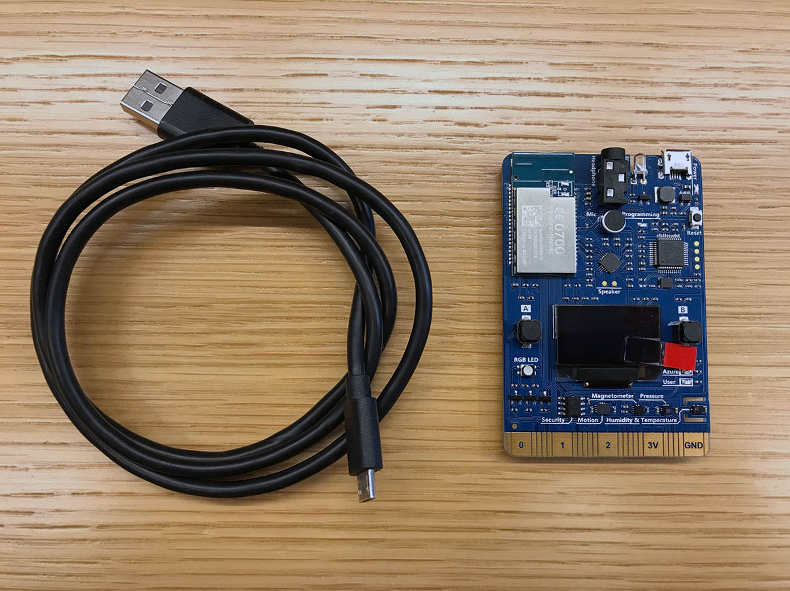

To connect the DevKit to your computer, follow these steps:

1. Connect the USB end to your computer.

2. Connect the Micro-USB end to the DevKit.

3. The green LED for power confirms the connection.

   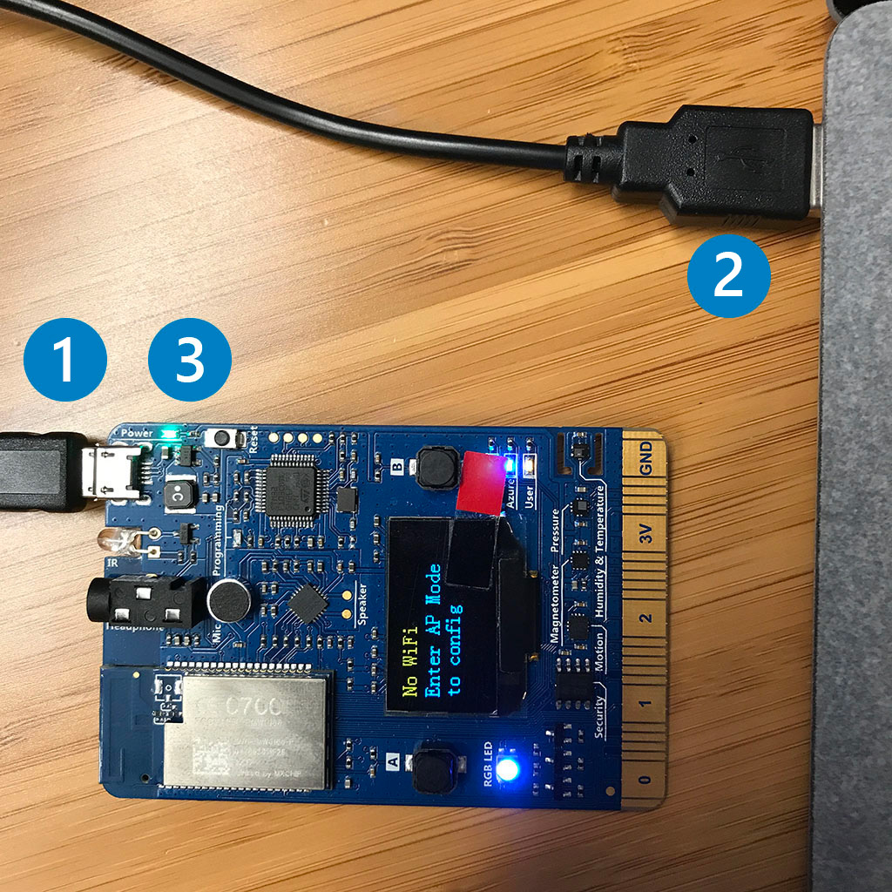

## Configure Wi-Fi

IoT projects rely on internet connectivity. Use the following instructions to configure the DevKit to connect to Wi-Fi.

### Enter AP mode

Hold down button B, push and release the reset button, and then release button B. Your DevKit enters AP mode for configuring Wi-Fi. The screen displays the service set identifier (SSID) of the DevKit and the configuration portal IP address.

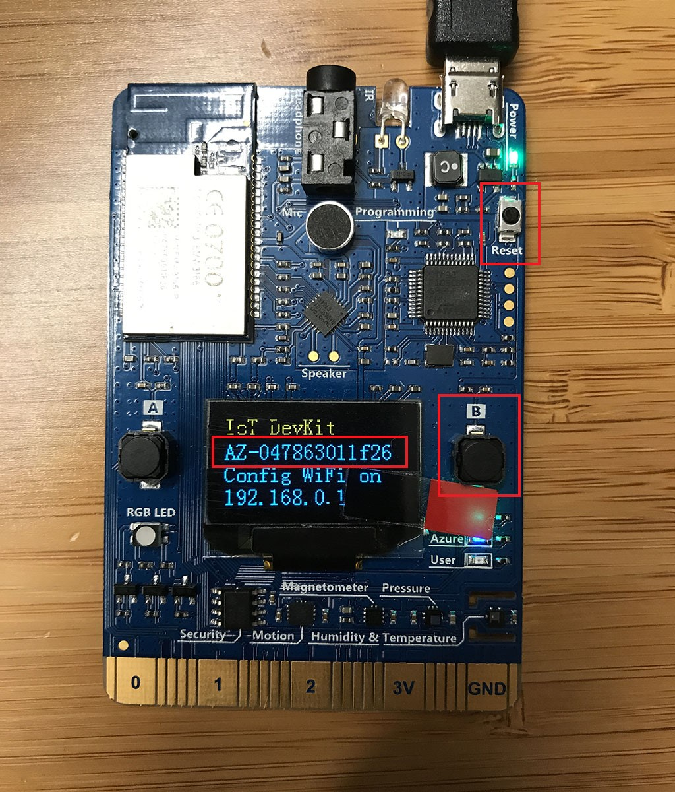

### Connect to DevKit AP

Now, use another Wi-Fi enabled device (computer or mobile phone) to connect to the DevKit SSID (highlighted in the previous image). Leave the password empty.

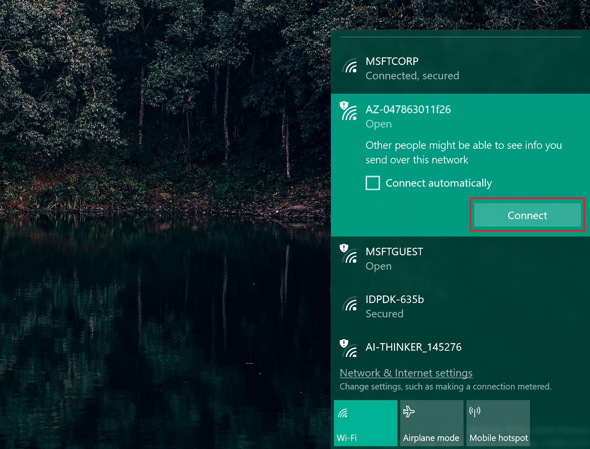

### Configure Wi-Fi for the DevKit

Open the IP address shown on the DevKit screen on your computer or mobile phone browser, select the Wi-Fi network that you want the DevKit to connect to, and then type the password. Select **Connect**.

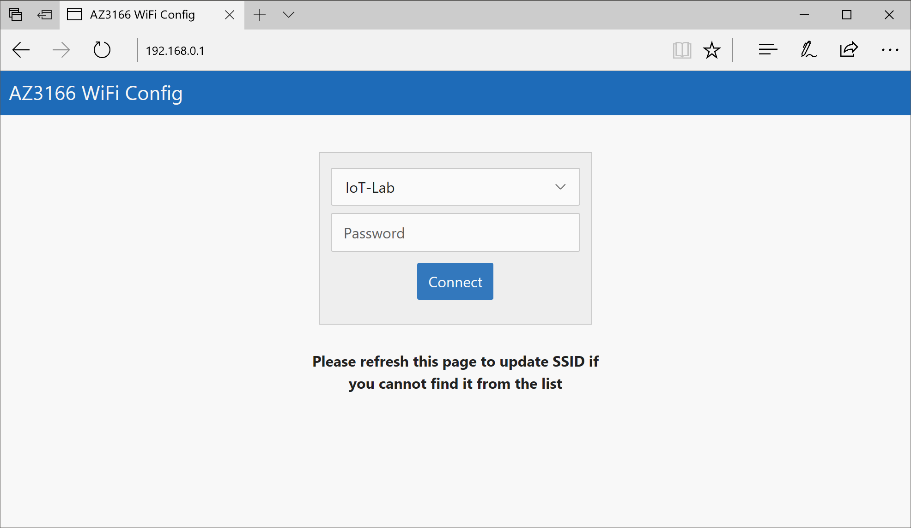

When the connection succeeds, the DevKit reboots in a few seconds. You then see the Wi-Fi name and IP address on the screen:

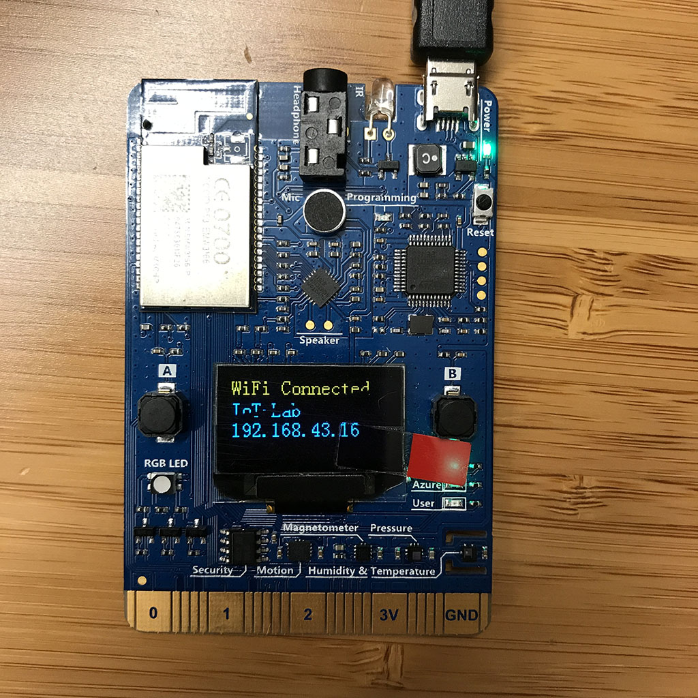

> [!NOTE] 
> The IP address displayed in the photo might not match the actual IP address assigned and displayed on the DevKit screen. This is normal, because Wi-Fi uses DHCP to dynamically assign IPs.

After Wi-Fi is configured, your credentials will persist on the device for that connection, even if the device is unplugged. For example, if you configure the DevKit for Wi-Fi in your home and then take the DevKit to the office, you will need to reconfigure AP mode (starting at the step in the "Enter AP Mode" section) to connect the DevKit to your office Wi-Fi. 

## Start using the DevKit

The default app running on the DevKit checks the latest version of the firmware and displays some sensor diagnosis data for you.

### Upgrade to the latest firmware

> [!NOTE]
> Since v1.1, DevKit enables ST-SAFE in bootloader. You need to upgrade the firmware if you are running a version prior to v1.1.

If you need a firmware upgrade, the screen will show the current and latest firmware versions. To upgrade, follow the [Upgrade firmware](https://microsoft.github.io/azure-iot-developer-kit/docs/firmware-upgrading/) guide.

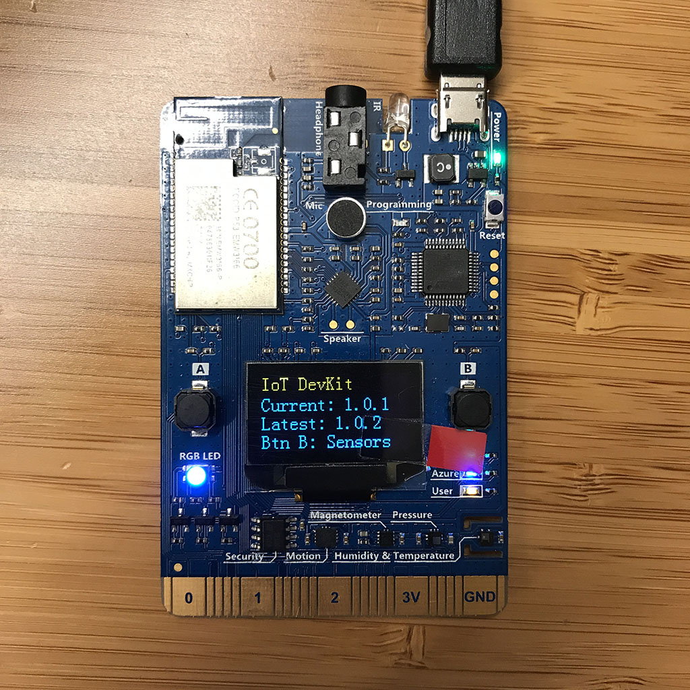

> [!NOTE]
> This is a one-time effort. After you start developing on the DevKit and upload your app, the latest firmware will come with your app.

### Test various sensors

Press button B to test the sensors. Continue pressing and releasing the button B to cycle through each sensor.

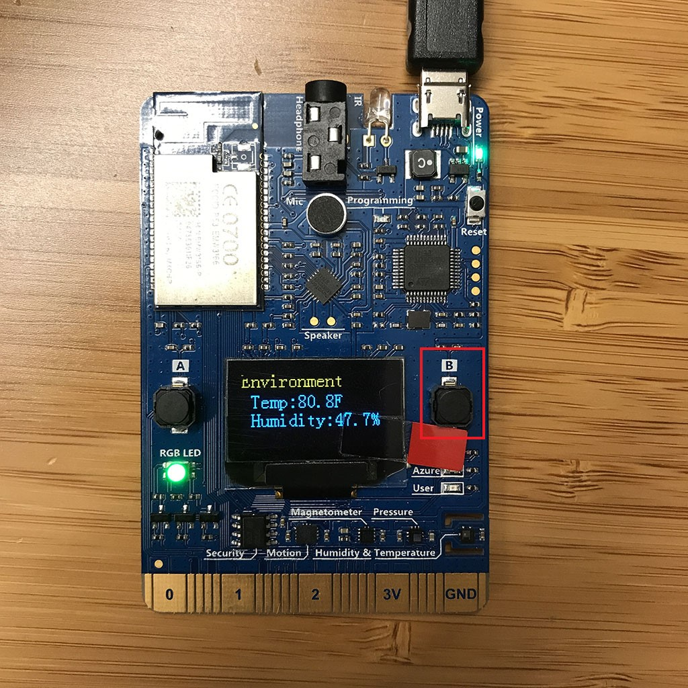

## Prepare the development environment

### Install Azure IoT Workbench

We recommend [Azure IoT Workbench](https://aka.ms/iot-workbench) extension for Visual Studio Code to develop on the DevKit.

Azure IoT Workbench provides an integrated experience to develop IoT solutions. It helps both on device and cloud development using Azure IoT and other services. You can watch this Channel9 video to have an overview of what it does.

Follow these steps to prepare the development environment for DevKit:

1. Download and install [Arduino IDE](https://www.arduino.cc/en/Main/Software). It provides the necessary toolchain for compiling and uploading Arduino code.
    * **Windows**: Use Windows Installer version.
    * **macOS**: Drag and drop the extracted **Arduino.app** into `/Applications` folder.
    * **Ubuntu**: Unzip it into folder such as `$HOME/Downloads/arduino-1.8.5`

2. Install [Visual Studio Code](https://code.visualstudio.com/), a cross platform source code editor with powerful developer tooling, like IntelliSense code completion and debugging.

3. Look for **Azure IoT Workbench** in the extension marketplace and install it.
    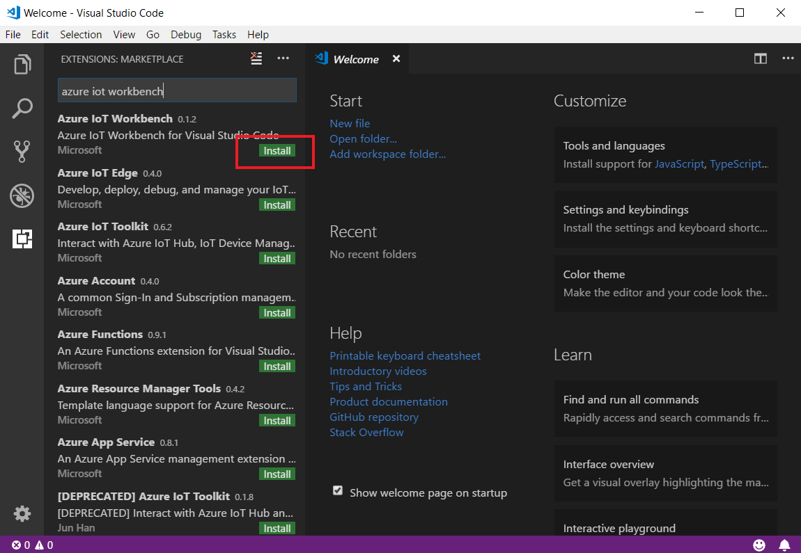
    Together with the IoT Workbench, other dependent extensions will be installed.

4. Open **File > Preference > Settings** and add following lines to configure Arduino.
    * **Windows**:

    ```json
    "arduino.path": "C:\\Program Files (x86)\\Arduino",
    "arduino.additionalUrls": "https://raw.githubusercontent.com/VSChina/azureiotdevkit_tools/master/package_azureboard_index.json"
    ```

    * **macOS**:

    ```json
    "arduino.path": "/Applications",
    "arduino.additionalUrls": "https://raw.githubusercontent.com/VSChina/azureiotdevkit_tools/master/package_azureboard_index.json"
    ```

    * **Ubuntu**:

    ```json
    "arduino.path": "/home/{username}/Downloads/arduino-1.8.5",
    "arduino.additionalUrls": "https://raw.githubusercontent.com/VSChina/azureiotdevkit_tools/master/package_azureboard_index.json"
    ```

5. Click `F1` to open the command palette, type and select **Arduino: Board Manager**. Search for **AZ3166** and install the latest version.
    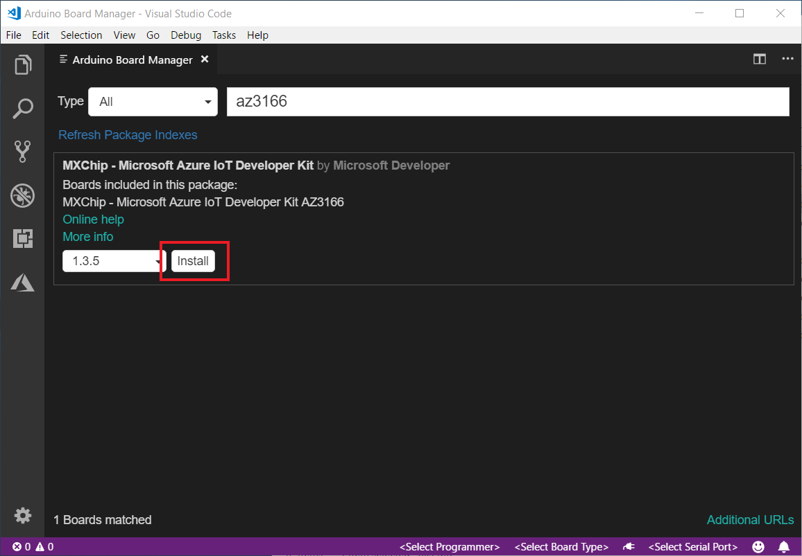

### Install ST-Link drivers

[ST-Link/V2](http://www.st.com/en/development-tools/st-link-v2.html) is the USB interface that IoT DevKit uses to communicate with your development machine. Follow the OS-specific steps to allow the machine access to your device.

* **Windows**: Download and install USB driver from [STMicroelectronics website](http://www.st.com/en/development-tools/stsw-link009.html).
* **macOS**: No driver is required for macOS.
* **Ubuntu**: Run the following in terminal and logout and login for the group change to take effect:
    ```bash
    # Copy the default rules. This grants permission to the group 'plugdev'
    sudo cp ~/.arduino15/packages/AZ3166/tools/openocd/0.10.0/linux/contrib/60-openocd.rules /etc/udev/rules.d/
    sudo udevadm control --reload-rules

    # Add yourself to the group 'plugdev'
    # Logout and log back in for the group to take effect
    sudo usermod -a -G plugdev $(whoami)
    ```

Now you are all set with preparing and configuring your development environment. Let us build the “Hello World” sample for IoT: sending temperature telemetry data to Azure IoT Hub.

## Build your first project

1. Make sure your IoT DevKit is **not connected** to your computer. Start VS Code first, and then connect the DevKit to your computer.

1. In the bottom right status bar, check the **MXCHIP AZ3166** is shown as selected board and serial port with **STMicroelectronics** is used.
    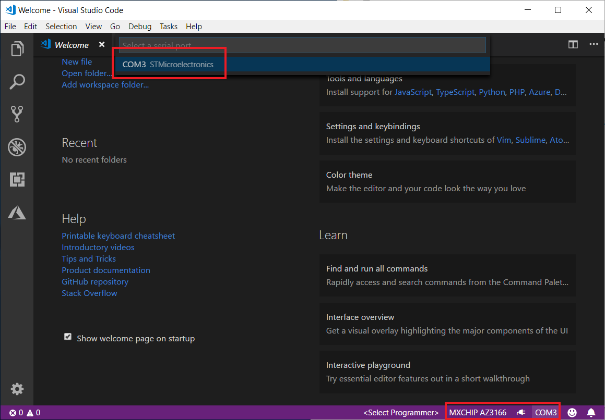

1. Click `F1` to open the command palette, type and select **IoT Workbench: Examples**. Then select **IoT DevKit** as board.

1. In the IoT Workbench Examples page, find **Get Started** and click **Open Sample**. Then selects the default path to download the sample code.
    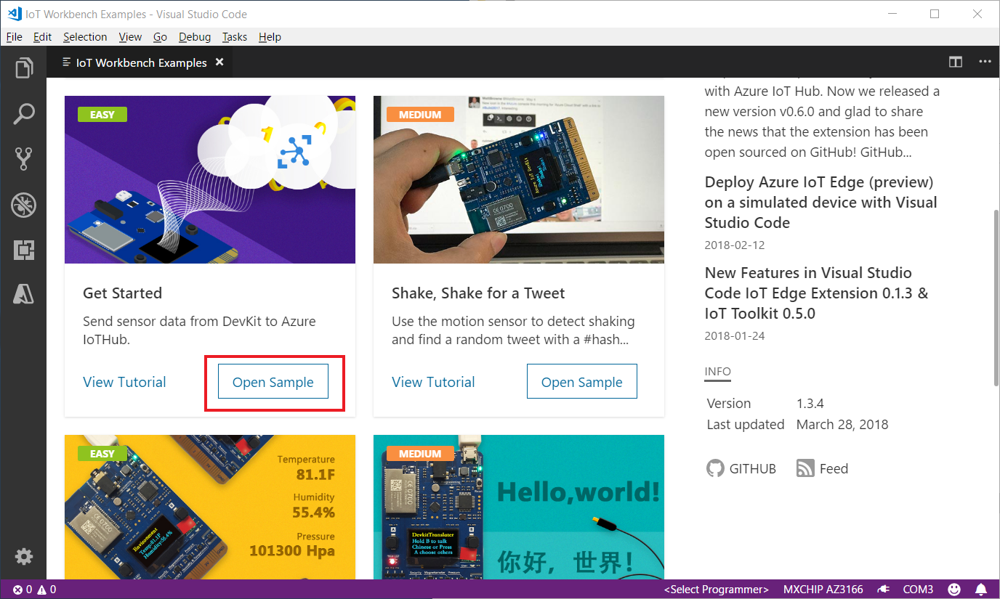

1. If you don't have Arduino extension in VS Code installed, click the **Install** in the notification pane.
    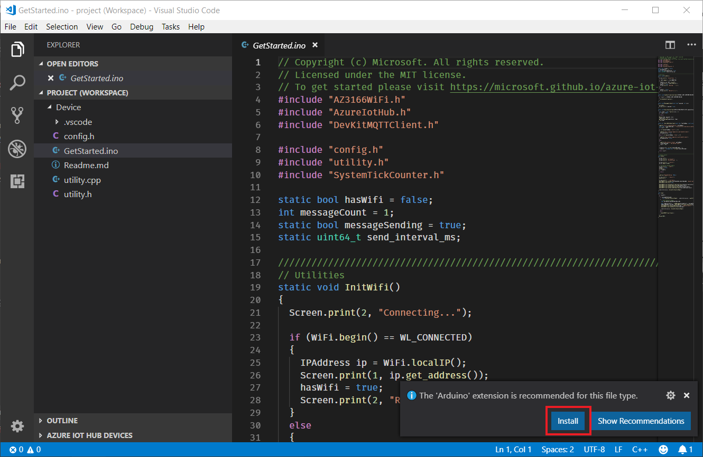

1. In the new opened project window, click `F1` to open the command palette, type and select **IoT Workbench: Cloud**, then select **Azure Provision**. Follow the step by step guide to finish provisioning your Azure IoT Hub and creating the device.
    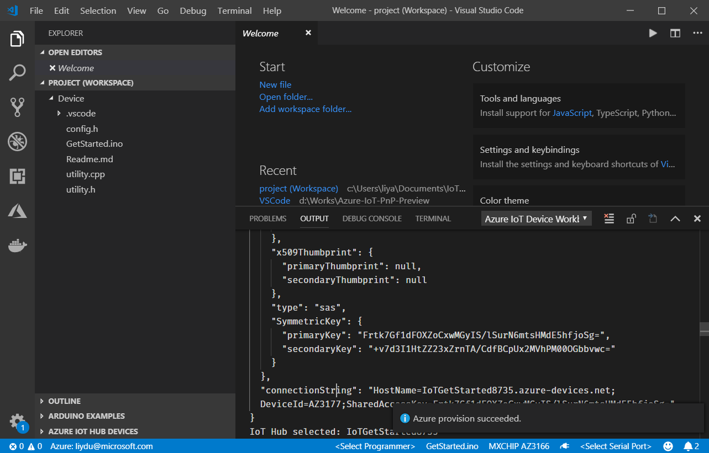

1. Click `F1` to open the command palette, type and select **IoT Workbench: Device**, then select **Config Device Settings > Select IoT Hub Device Connection String**.

1. On DevKit, hold down **button A**, push and release the **reset** button, and then release **button A**. Your DevKit enters configuration mode and saves the connection string.
    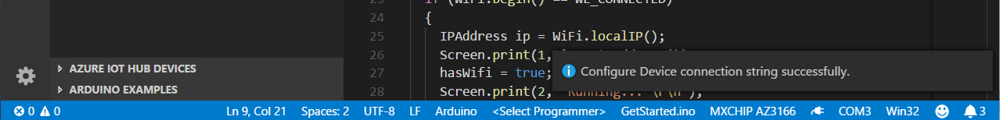

1. Click `F1` again, type and select **IoT Workbench: Device**, then select **Device Upload**.
    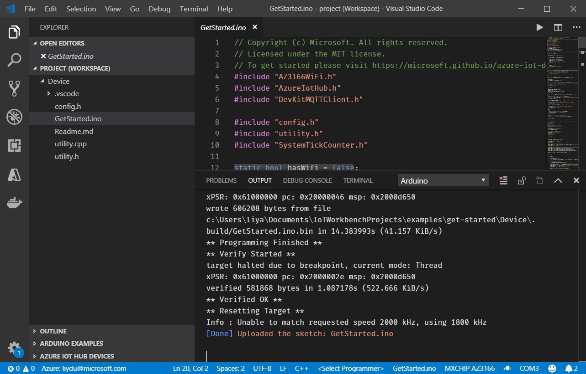

The DevKit reboots and starts running the code.

> [!NOTE]
> If there is errors or interruptions, you can always recover by running the command again.

## Test the project

### View the telemetry sent to Azure IoT Hub

Click the power plug icon on the status bar to open the Serial Monitor:
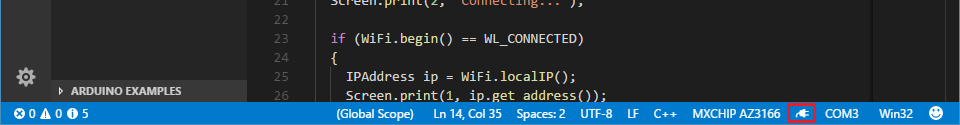

The sample application is running successfully when you see the following results:

* The Serial Monitor displays the message sent to the IoT Hub.
* The LED on the MXChip IoT DevKit is blinking.

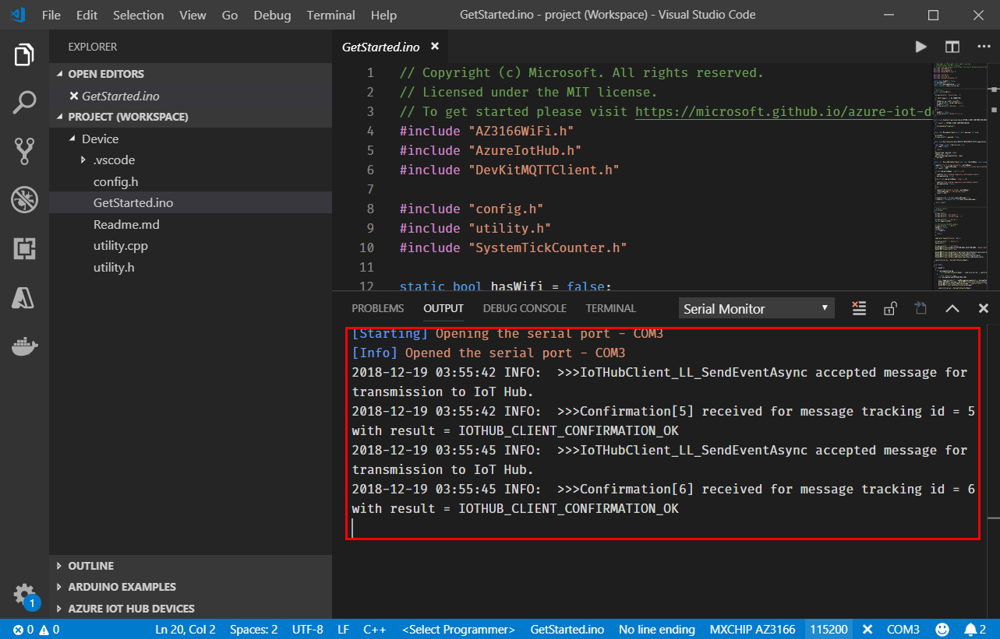

### View the telemetry received by Azure IoT Hub

You can use [Azure IoT Toolkit](https://marketplace.visualstudio.com/items?itemName=vsciot-vscode.azure-iot-toolkit) to monitor device-to-cloud (D2C) messages in IoT Hub.

1. In Visual Studio Code, look for **Azure IoT Toolkit** in the extension marketplace and install it.

1. Log in [Azure portal](https://portal.azure.com/), find the IoT Hub you created.
    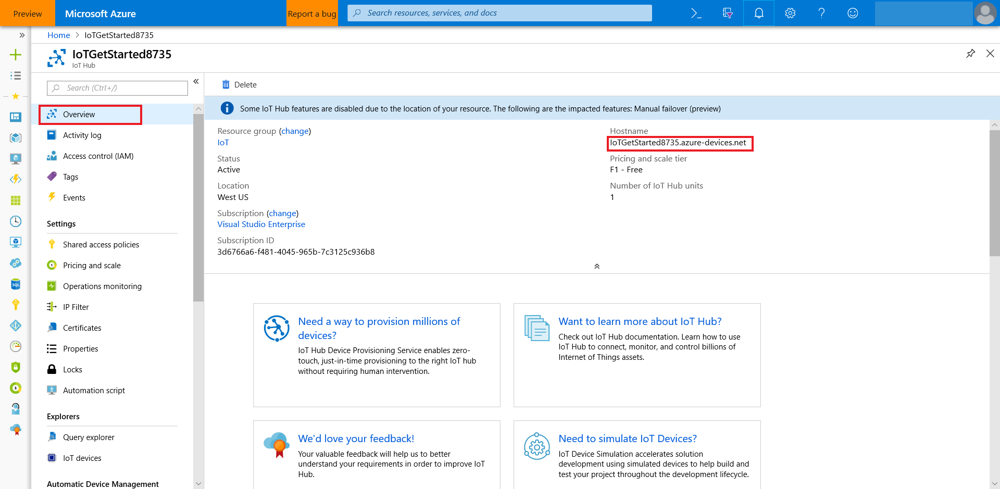

1. In the **Shared access policies** pane, click the **iothubowner policy**, and write down the Connection string of your IoT hub.
    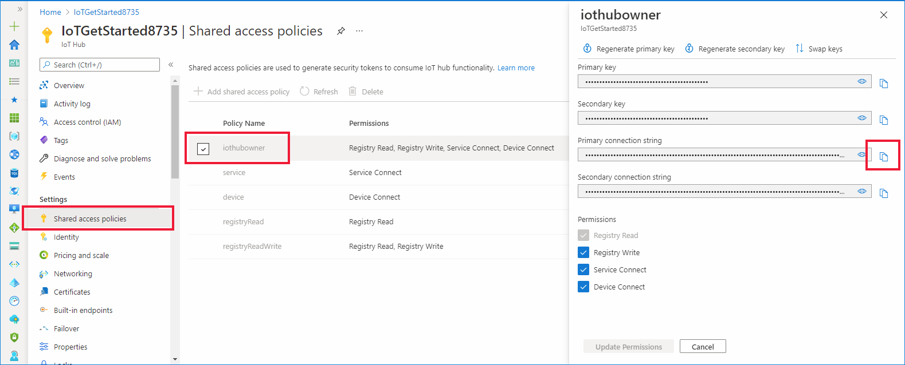

1. In Visual Studio Code, expand **AZURE IOT HUB DEVICES** on the bottom left corner, click **Set IoT Hub Connection String**.
    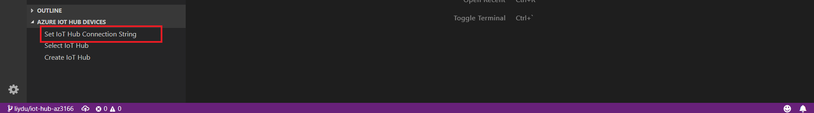

1. Click **IoT: Start monitoring D2C message** in context menu.

1. In **OUTPUT** pane, you can see the incoming D2C messages to the IoT Hub.
    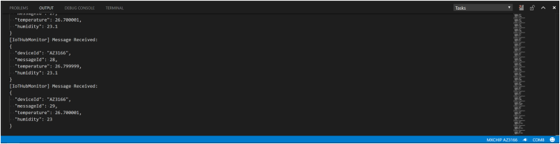

## Problems and feedback

If you encounter problems, you can check for a solution in the [IoT DevKit FAQ](https://microsoft.github.io/azure-iot-developer-kit/docs/faq/) or reach out to us from [Gitter](https://gitter.im/Microsoft/azure-iot-developer-kit). You can also give us feedback by leaving a comment on this page.

## Next steps

You have successfully connected an MXChip IoT DevKit to your IoT hub, and you have sent the captured sensor data to your IoT hub.

[!INCLUDE [iot-hub-get-started-az3166-next-steps](../../includes/iot-hub-get-started-az3166-next-steps.md)]
