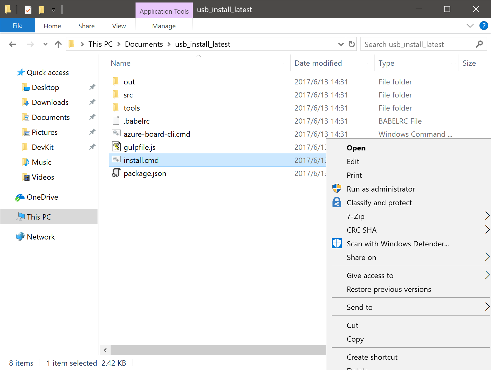
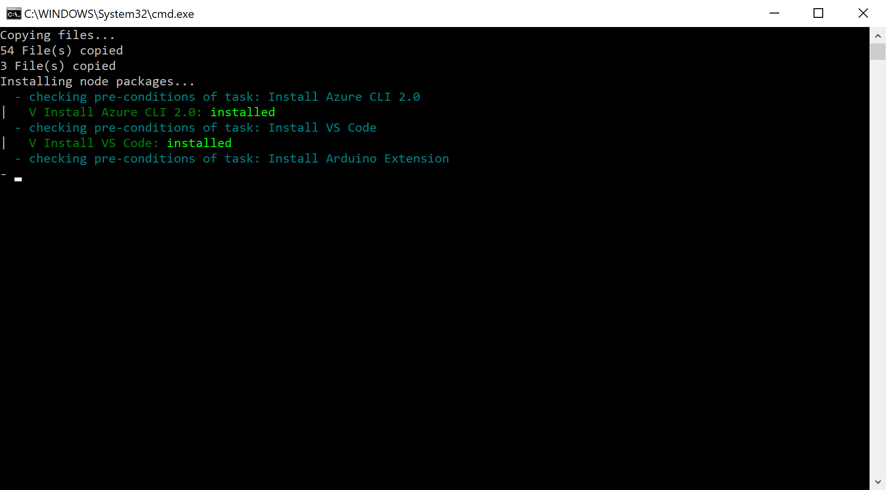
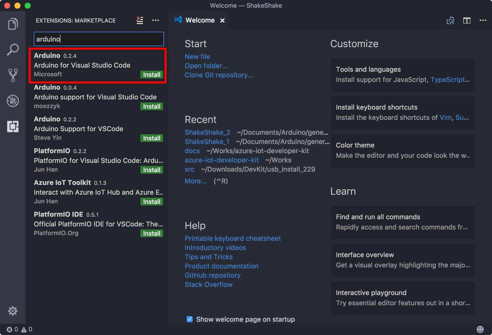
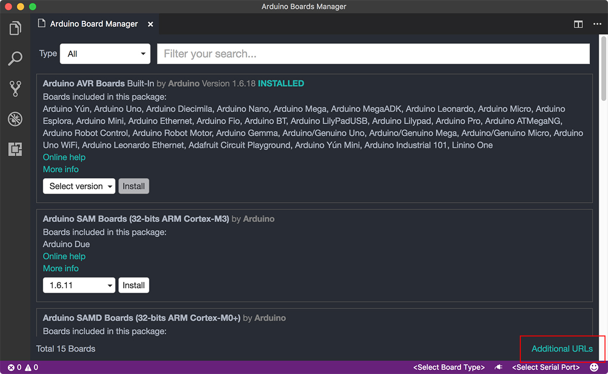
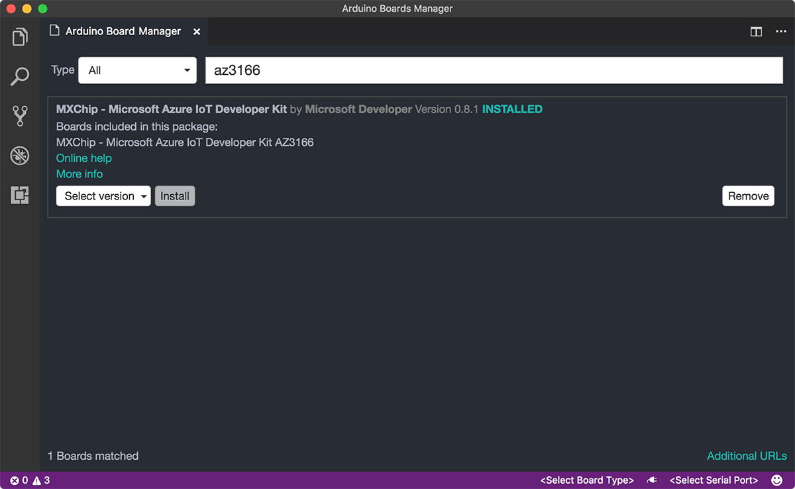
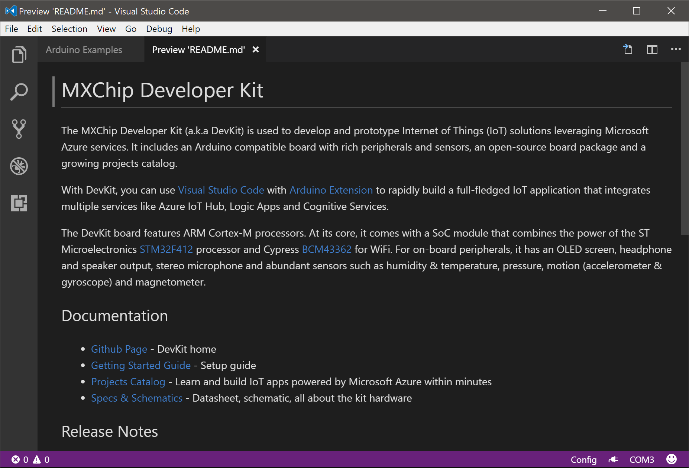
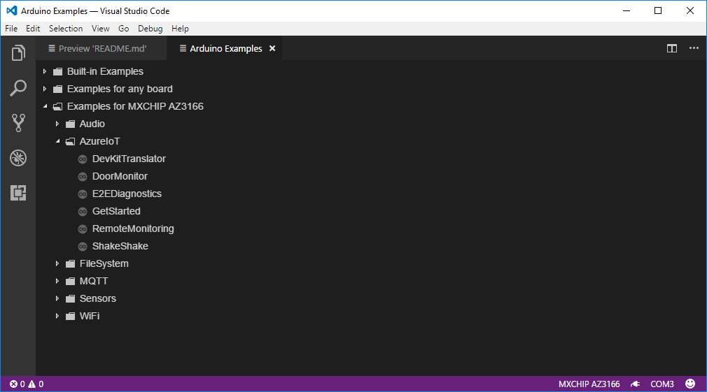
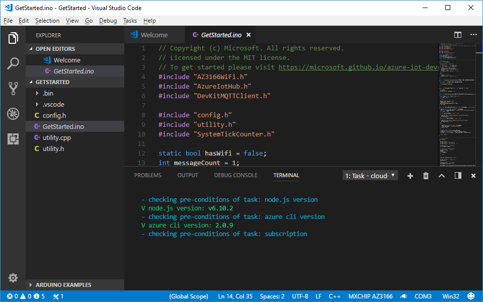
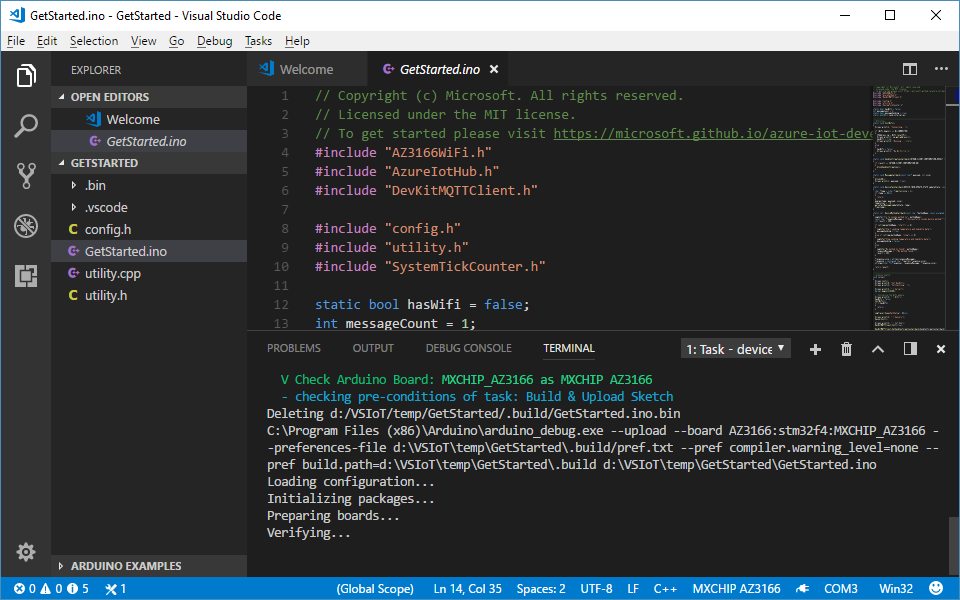
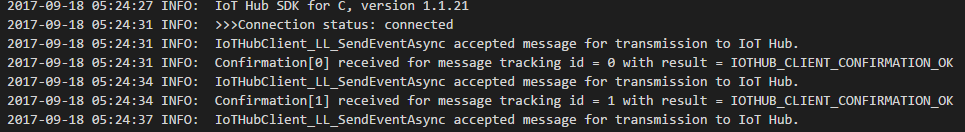

# Connect IoT DevKit AZ3166 to Azure IoT Hub in the cloud

[!INCLUDE [iot-hub-get-started-device-selector](../../includes/iot-hub-get-started-device-selector.md)]

You can use the [MXChip IoT DevKit](https://microsoft.github.io/azure-iot-developer-kit/) to develop and prototype Internet of Things (IoT) solutions that take advantage of Microsoft Azure services. It includes an Arduino-compatible board with rich peripherals and sensors, an open-source board package, and a growing [projects catalog](https://microsoft.github.io/azure-iot-developer-kit/docs/projects/).

## What you do
Connect the [DevKit](https://microsoft.github.io/azure-iot-developer-kit/) to an Azure IoT hub that you create, collect the temperature and humidity data from sensors, and send the data to the IoT hub.

Don't have a DevKit yet? [Get one](https://aka.ms/iot-devkit-purchase).

## What you learn

* How to connect the IoT DevKit to a wireless access point and prepare your development environment.
* How to create an IoT hub and register a device for the MXChip IoT DevKit.
* How to collect sensor data by running a sample application on the MXChip IoT DevKit.
* How to send the sensor data to your IoT hub.

## What you need

* An MXChip IoT DevKit board with a Micro-USB cable. [Get it now](https://aka.ms/iot-devkit-purchase).
* A computer running Windows 10 or macOS 10.10+.
* An active Azure subscription. [Activate a free 30-day trial Microsoft Azure account](https://azureinfo.microsoft.com/us-freetrial.html).
  

## Prepare your hardware

Hook up the hardware to your computer.

You need this hardware:

* DevKit board
* Micro-USB cable


To connect the DevKit to your computer:

1. Connect the USB end to your computer.
2. Connect the Micro-USB end to the DevKit.
3. The green LED for power confirms the connection.


## Configure Wi-Fi

IoT projects rely on internet connectivity. Use the following instructions to configure the DevKit to connect to Wi-Fi.

### Enter AP mode

Hold down button B, push and release the reset button, and then release button B. Your DevKit enters AP mode for configuring Wi-Fi. The screen displays the service set identifier (SSID) of the DevKit and the configuration portal IP address.


### Connect to DevKit AP

Now, use another Wi-Fi enabled device (computer or mobile phone) to connect to the DevKit SSID (highlighted in the previous image). Leave the password empty.


### Configure Wi-Fi for the DevKit

Open the IP address shown on the DevKit screen on your computer or mobile phone browser, select the Wi-Fi network that you want the DevKit to connect to, and then type the password. Select **Connect**.


When the connection succeeds, the DevKit reboots in a few seconds. You then see the Wi-Fi name and IP address on the screen:


> [!NOTE] 
> The IP address displayed in the photo might not match the actual IP address assigned and displayed on the DevKit screen. This is normal, because Wi-Fi uses DHCP to dynamically assign IPs.

After Wi-Fi is configured, your credentials will persist on the device for that connection, even if the device is unplugged. For example, if you configure the DevKit for Wi-Fi in your home and then take the DevKit to the office, you will need to reconfigure AP mode (starting at the step in the "Enter AP mode" section) to connect the DevKit to your office Wi-Fi. 

## Start using the DevKit

The default app running on the DevKit checks the latest version of the firmware and displays some sensor diagnosis data for you.

### Upgrade to the latest firmware

If you need a firmware upgrade, the screen will show the current and latest firmware versions. To upgrade, follow the [Upgrade firmware](https://microsoft.github.io/azure-iot-developer-kit/docs/upgrading/) guide.


> [!NOTE] 
> This is a one-time effort. After you start developing on the DevKit and upload your app, the latest firmware will come with your app.

### Test various sensors

Press button B to test sensors. Continue pressing and releasing button B to cycle through each sensor.


## Prepare the development environment

Now it's time to set up the development environment: tools and packages for you to build stunning IoT applications. You can choose the Windows or macOS version according to your operating system.


### Windows

We encourage you to use the installation package to prepare the development environment. If you encounter any problems, you can follow the [manual steps](https://microsoft.github.io/azure-iot-developer-kit/docs/installation/) to get it done.

#### Download the latest package

The .zip file that you download contains all the necessary tools and packages for DevKit development.

> [!div class="button"]
[Download](https://azureboard.azureedge.net/prod/installpackage/devkit_install_1.0.2.zip)


The .zip file contains the following tools and packages. If you already have some components installed, the script will detect and skip them.

* Node.js and Yarn: Runtime for the setup script and automated tasks.
* [Azure CLI 2.0 MSI](https://docs.microsoft.com//cli/azure/install-azure-cli#windows): Cross-platform command-line experience for managing Azure resources. The MSI contains dependent Python and pip.
* [Visual Studio Code](https://code.visualstudio.com/) (VS Code): Lightweight code editor for DevKit development.
* [Visual Studio Code extension for Arduino](https://marketplace.visualstudio.com/items?itemName=vsciot-vscode.vscode-arduino): Extension that enables Arduino development in Visual Studio Code.
* [Arduino IDE](https://www.arduino.cc/en/Main/Software): Tool that the extension for Arduino relies on.
* DevKit Board Package: Tool chains, libraries, and projects for the DevKit.
* ST-Link Utility: Essential tools and drivers.

#### Run the installation script

In Windows File Explorer, locate the .zip file and extract it. Find install.cmd, right-click it, and select **Run as administrator**.



During installation, you see the progress of each tool or package.



#### Install drivers

The VS Code for Arduino extension relies on the Arduino IDE. If this is the first time you are installing the Arduino IDE, you're prompted to install relevant drivers:


Installation should take around 10 minutes, depending on your internet speed. After the installation is complete, you should see Visual Studio Code and Arduino IDE shortcuts on your desktop.

> [!NOTE] 
> Occasionally, when you start VS Code, you're prompted with an error that it cannot find the Arduino IDE or related board package. Close VS Code and restart the Arduino IDE. VS Code should then locate the Arduino IDE path correctly.


### macOS (preview)

Follow these steps to prepare the development environment on macOS.

#### Install Azure CLI 2.0

1. Install Azure CLI 2.0 by using one `curl` command:

   ```bash
   curl -L https://aka.ms/InstallAzureCli | bash
   ```

2. Restart your command shell for changes to take effect:

   ```bash
   exec -l $SHELL
   ```

For more information about installing Azure CLI 2.0, see the [official guide](https://docs.microsoft.com//cli/azure/install-azure-cli).

#### Install the Arduino IDE

The Visual Studio Code Arduino extension relies on the Arduino IDE. Download and install the [Arduino IDE for macOS](https://www.arduino.cc/en/Main/Software).

#### Install Visual Studio Code

Download and install [Visual Studio Code for macOS](https://code.visualstudio.com/). This is the primary development tool for building DevKit IoT applications.

####  Download the latest package

1. Install Node.js. You can use the popular macOS package manager [Homebrew](https://brew.sh/) or the [pre-built installer](https://nodejs.org/en/download/) to install it.

2. Download the .zip file that contains required task scripts for DevKit development in VS Code.

   > [!div class="button"]
   [Download](https://azureboard.azureedge.net/installpackage/devkit_tasks_1.0.2.zip)

3. Locate the .zip file and extract it. Then start the **Terminal** app and run the following commands:

   a. Move extracted folder to your macOS user folder:
      ```bash
      mv [.zip extracted folder]/azure-board-cli ~/. ; cd ~/azure-board-cli
      ```
  
   b. Install npm packages:
      ```
      npm install
      ```

#### Install the VS Code extension for Arduino

You can install Azure Marketplace extensions directly in Visual Studio Code. Select the extensions icon in the left pane, search for **Arduino**, and then select **Install**:



#### Install the DevKit board package

Add the DevKit board by using Board Manager in Visual Studio Code.

1. Use Cmd+Shift+P to open the command palette, type **Arduino**, and then find and select **Arduino: Board Manager**.

2. Select **Additional URLs** at the lower right.
   

3. In the settings.json file, add a line at the bottom of the **USER SETTINGS** pane and save.
   ```json
   "arduino.additionalUrls": "https://raw.githubusercontent.com/VSChina/azureiotdevkit_tools/master/package_azureboard_index.json"
   ```
   

4. In Board Manager, search for **az3166** and install the latest version.
   

You now have all the necessary tools and packages installed for macOS.


## Open the project folder

### Start VS Code

Make sure your DevKit is not connected. Start VS Code first and connect the DevKit to your computer. VS Code automatically finds the DevKit and opens an introduction page:



> [!NOTE] 
> Occasionally, when you start VS Code, you're prompted with an error that it cannot find the Arduino IDE or related board package. Close VS Code and restart the Arduino IDE. VS Code should then locate the Arduino IDE path correctly.


### Open the Arduino Examples folder

On the **Arduino Examples** tab, browse to **Examples for MXCHIP AZ3166** > **AzureIoT**, and select **GetStarted**.



If you happen to close the pane, you can reopen it. Use Ctrl+Shift+P (macOS: Cmd+Shift+P) to open the command palette, type **Arduino**, and then find and select **Arduino: Examples**.

## Provision Azure services

In the solution window, run your task through Ctrl+P (macOS: Cmd+P) by entering `task cloud-provision`.

In the VS Code terminal, an interactive command line guides you through provisioning the required Azure services:



## Build and upload the Arduino sketch

### Install the required library

1. Select F1 or Ctrl+Shift+P (macOS: Cmd+Shift+P) to open the command palette, type **Arduino**, and then find and select **Arduino: Library Manager**.

2. Search for the **ArduinoJson** library and select **Install**.

### Build and upload the device code

Use Ctrl+P (macOS: Cmd+P) to run `task device-upload`. The terminal prompts you to enter configuration mode. To do so, hold down button A, and then push and release the reset button. The screen displays **Configuration**. This is to set the connection string that's retrieved from the `task cloud-provision` step.

Then the terminal starts verifying and uploading the Arduino sketch:



The DevKit reboots and starts running the code.

## Test the project

In VS Code, select the power plug icon on the status bar to open Serial Monitor.

The sample application is running successfully when you see the following results:

* Serial Monitor displays the same information as the content in the following screenshot.
* The LED on the MXChip IoT DevKit is blinking.



## Problems and feedback

If you encounter problems, you can find [FAQs](https://microsoft.github.io/azure-iot-developer-kit/docs/faq/). You can also give us feedback by leaving a comment on this page.

## Next steps

You have successfully connected an MXChip IoT DevKit to your IoT hub, and you have sent the captured sensor data to your IoT hub.

To continue getting started with Azure IoT Hub and to explore other IoT scenarios, see:

- [Manage cloud device messaging with iothub-explorer](https://docs.microsoft.com/azure/iot-hub/iot-hub-explorer-cloud-device-messaging)
- [Save IoT Hub messages to Azure data storage](https://docs.microsoft.com//azure/iot-hub/iot-hub-store-data-in-azure-table-storage)
- [Use Power BI to visualize real-time sensor data from Azure IoT Hub](https://docs.microsoft.com//azure/iot-hub/iot-hub-live-data-visualization-in-power-bi)
- [Use Web Apps to visualize real-time sensor data from Azure IoT Hub](https://docs.microsoft.com//azure/iot-hub/iot-hub-live-data-visualization-in-web-apps)
- [Weather forecast using the sensor data from your IoT hub in Azure Machine Learning](https://docs.microsoft.com/azure/iot-hub/iot-hub-weather-forecast-machine-learning)
- [Device management with iothub-explorer](https://docs.microsoft.com/azure/iot-hub/iot-hub-device-management-iothub-explorer)
- [Remote monitoring and notifications with ​​Logic ​​Apps](https://docs.microsoft.com/azure/iot-hub/iot-hub-monitoring-notifications-with-azure-logic-apps)
