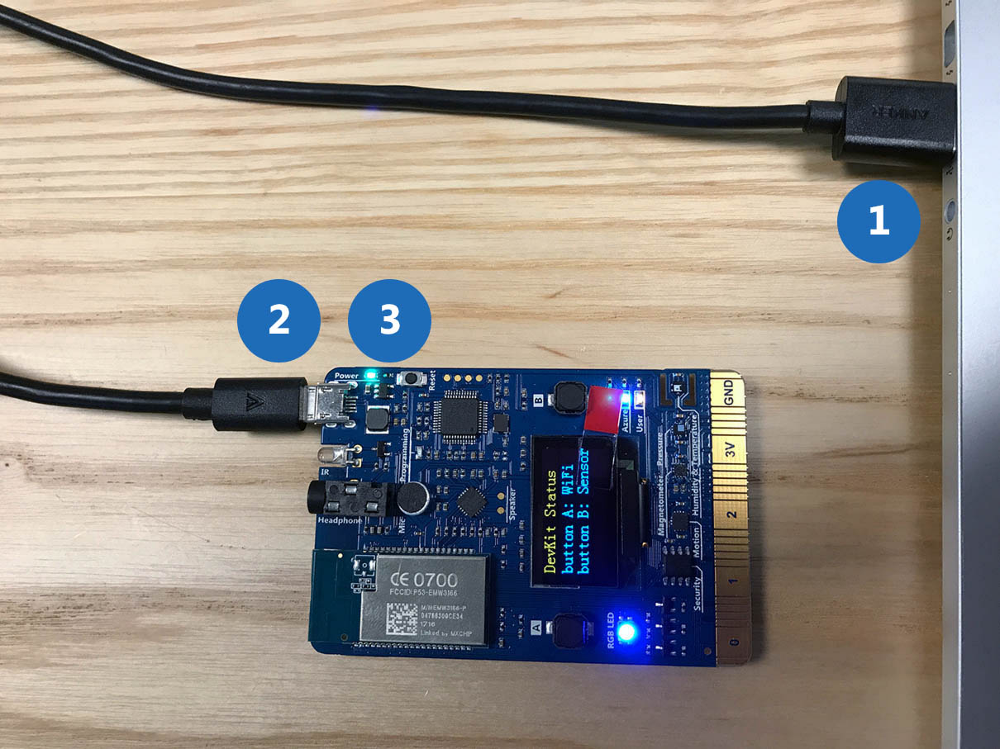
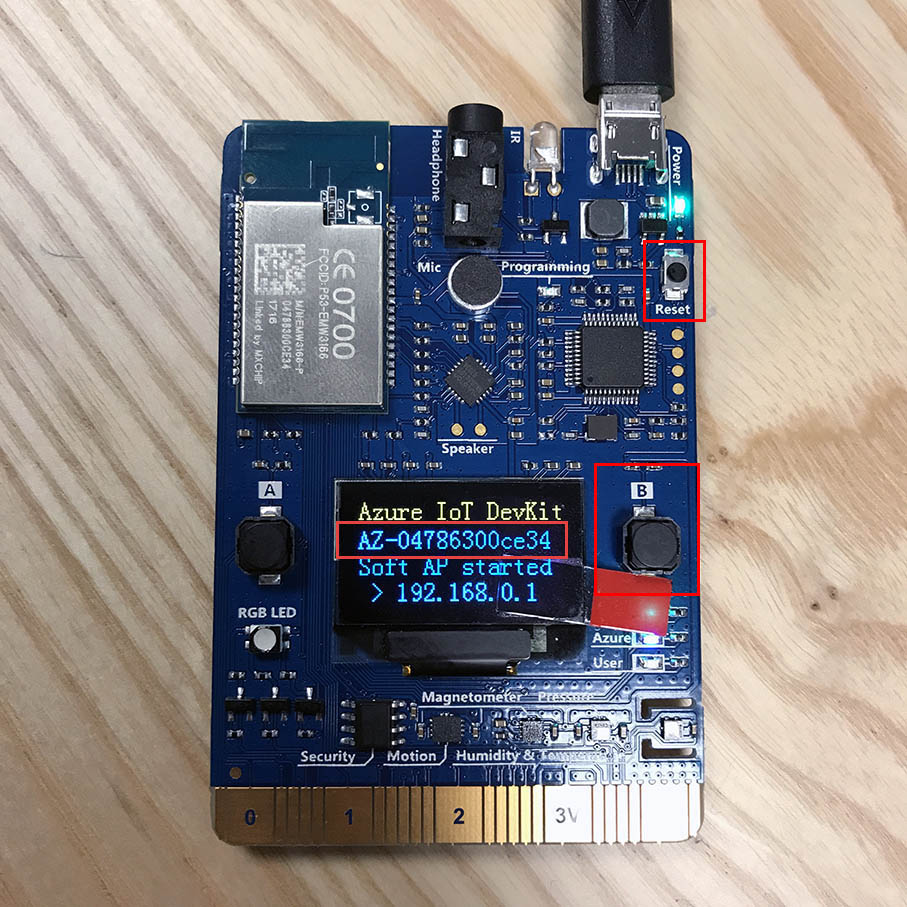
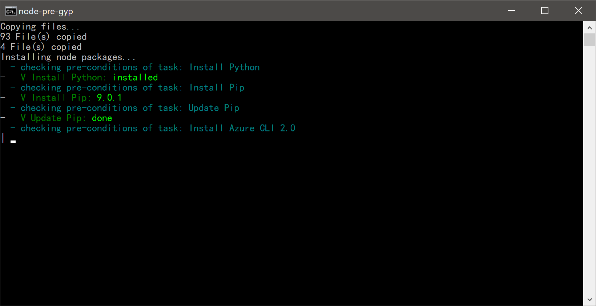
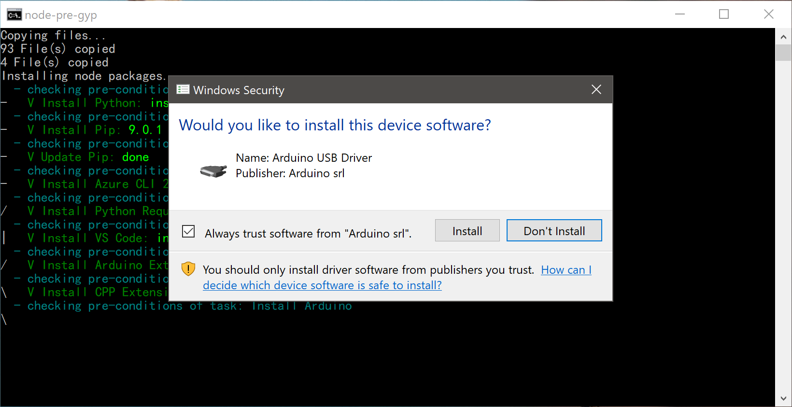
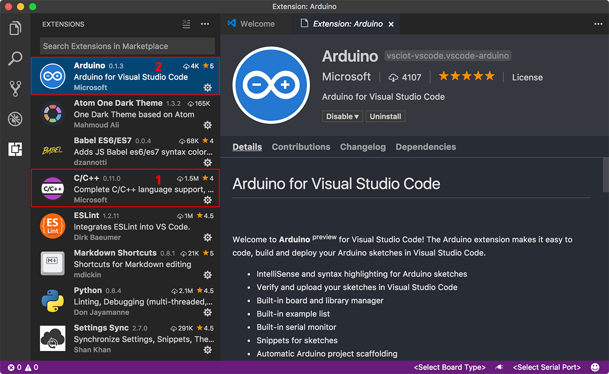
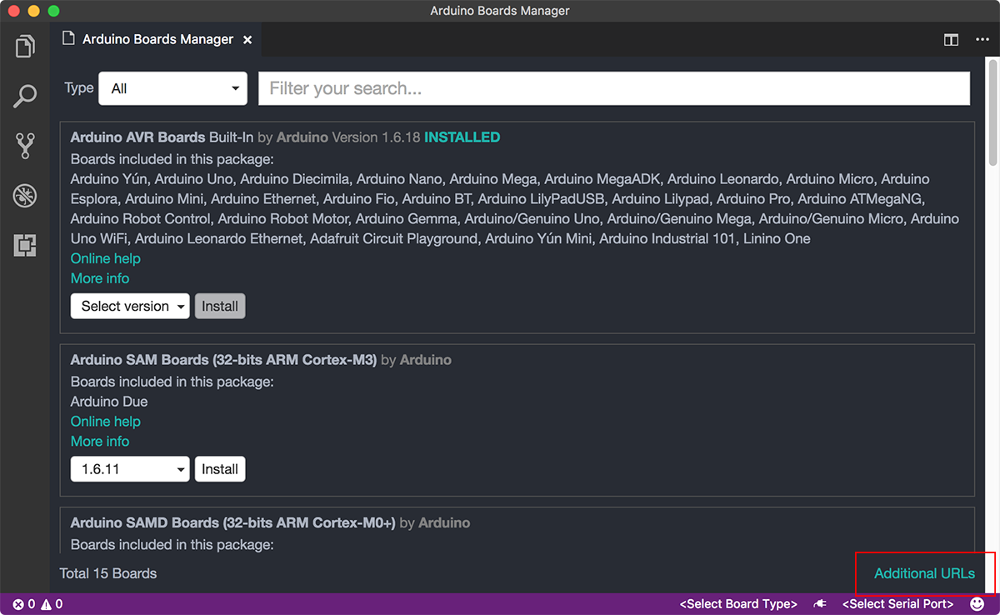
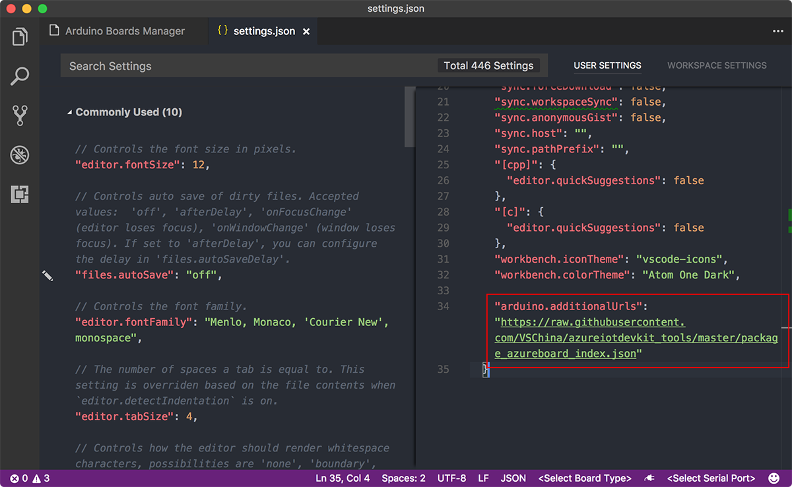
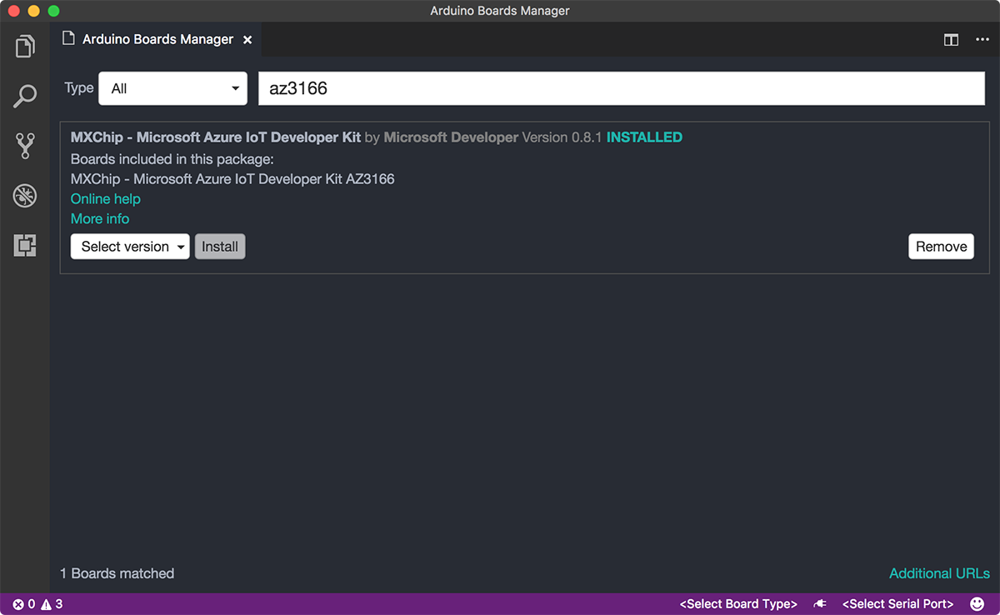
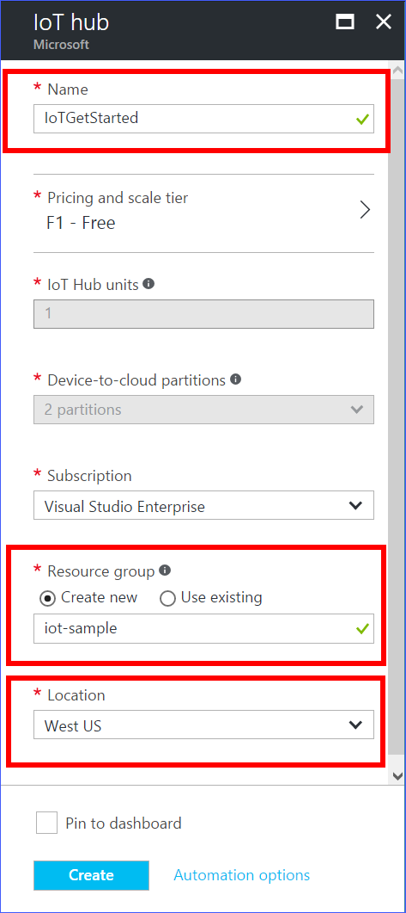

# Connect IoT DevKit AZ3166 to Azure IoT Hub in the cloud

[!INCLUDE [iot-hub-get-started-device-selector](../../includes/iot-hub-get-started-device-selector.md)]


## What you do

Connect DevKit to an Azure IoT hub that you create, collect the temperature and humidity data from sensors and send the data to IoT hub.

Don't have a DevKit yet? Get a new one [here](https://aka.ms/iot-devkit-purchase).

## What you learn

* How to connect IoT DevKit to Wireless access point and prepare your development environment.
* How to create an IoT hub and register a device for MXChip IoT DevKit.
* How to collect sensor data by running a sample application on MXChip IoT DevKit.
* How to send the sensor data to your IoT hub.

## What you need

* An MXChip IoT DevKit board with a micro USB cable. [Get it now](https://aka.ms/iot-devkit-purchase)
* A computer running Windows 10 or macOS 10.10+
* An active Azure subscription
  * Activate a [free 30-day trial Microsoft Azure account](https://azureinfo.microsoft.com/us-freetrial.html)


## Prepare your Hardware
### Connect DevKit to your computer

1. Connect USB end to your PC
2. Connect Micro USB end to the DevKit
3. The green LED next to power confirms connection



### Upgrade to the latest firmware

If this is the first time you are developing on the DevKit, follow [Upgrading](https://microsoft.github.io/azure-iot-developer-kit/docs/upgrading/) guide to upgrade the DevKit firmware to the latest version.

This is a one-time effort, once you start developing on the DevKit and upload your app, you will have the latest firmware.

> [!NOTE] 
You will see the firmware version on the screen of the kit. If there is no version number, it means the DevKit is running on old version and needs an upgrade. [Versions](https://microsoft.github.io/azure-iot-developer-kit/versions/) contains the latest version number and release notes.


### Test sensors and WiFi on DevKit

Now you have connected your DevKit to computer. Follow the instructions on the screen to test sensors and WiFi:

- Press button A to test WiFi connection
- Press button B to test sensors, continue pressing and releasing the B button to cycle through each sensor


## Configure WiFi

IoT projects rely on Internet connectivity. Use the following instructions to setup Access Point(AP) Mode on the DevKit to enable WiFi connectivity.

### Enter AP Mode

Hold down button B, then push and release the reset button, then release button B. The screen will display the Service Set Identifier(SSID) of the DevKit as well as the configuration portal IP address:



### Connect to DevKit AP

Use another WiFi enabled device (PC or mobile phone) to connect to the DevKit SSID (highlighted in the screenshot above), leave the password empty.

### Configure WiFi for DevKit

Open the IP address shown on the DevKit screen in your PC or mobile phone browser, select the WiFi network you want the DevKit to connect to, then type the password. Click **'Connect'** to complete.


Once the connection succeeds, the DevKit will take a few seconds to reboot. Then, you can test the connection by clicking button A. The WiFi SSID you selected and an IP address will display on the screen.


> [!NOTE]
The IP address displayed in the photo may not match the actual IP assigned and displayed on the DevKit screen. This is normal as WiFi uses DHCP to dynamically assign IPs.


After WiFi is configured, your credentials will be persisted on the device for that connection, even if unplugged. For example, if you configured the DevKit for WiFi in your home and then took the DevKit to the office, you will need to reconfigure AP mode (starting at step 3A) to connect the DevKit to your office WiFi. 

## Prepare development environment

Now it's time to set up the development environment: tools and packages for you to build stunning IoT applications.

# [Windows](#tab/windows)

### Download latest package

The `.zip` file you download contains all necessary tools and packages required for DevKit development.

> [!div class="button"]
[Download](https://azureboard.azureedge.net/installpackage/devkit_install_1.0.1.zip)

> [!NOTE]
> **MD5:** 01527cb5c349601452d1f5546149f3be
> The `.zip` file contains the following tools and packages. If you already have some components installed, the script will detect and skip them.
> * Node.js and Yarn: Runtime for the setup script and automated tasks
> * Python and pip: For running Azure CLI 2.0
> * [Azure CLI 2.0](https://docs.microsoft.com/en-us/cli/azure/overview) - Cross-platform  command-line experience for managing Azure resources
> * [Visual Studio Code](https://code.visualstudio.com/) (VS Code): Lightweight code editor for DevKit development
> * [VS Code Arduino Extension](https://marketplace.visualstudio.com/items?itemName=vsciot-vscode.vscode-arduino): Enables Arduino development in VS Code
> * [Arduino IDE](https://www.arduino.cc/en/Main/Software): VS Code Arduino Extension relies on this tool
> * DevKit Board Package: Tool chains, libraries and projects for the DevKit
> * ST-Link Utility: Essential utility and drivers

### Run installation script

In Windows File Explorer, locate the `.zip` and extract it, find `install.cmd`, right-click and select **"Run as administrator"** to start.


During installation, you will see the progress of each tool or package.



### Confirm to install drivers

The VS Code for Arduino extension relies on the Arduino IDE. If this is the first time you are installing the Arduino IDE, you will be prompted to install relevant drivers:



It should take around 10 minutes to finish installation depending on your Internet speed. Once installation is complete, you should see Visual Studio Code and Arduino IDE shortcuts on your desktop.

# [macOS](#tab/macos)

### Install Azure CLI 2.0

Follow the [official guide](https://docs.microsoft.com/en-us/cli/azure/install-azure-cli) to install Azure CLI 2.0:

Install Azure CLI 2.0 with one `curl` command:

```bash
curl -L https://aka.ms/InstallAzureCli | bash
```

And restart your command shell for changes to take effect:

```bash
exec -l $SHELL
```

### Install Arduino IDE

The Visual Studio Code Arduino extension relies on the Arduino IDE. Download and install the [Arduino IDE for macOS](https://www.arduino.cc/en/Main/Software).

### Install Visual Studio Code

Download and install [Visual Studio Code for macOS](https://code.visualstudio.com/). This will be the primary development tool for building DevKit IoT applications.

### Download latest package

The `.zip` file you download contains necessary scripts required for DevKit development in VS Code.


> [!div class="button"]
[Download](https://azureboard.azureedge.net/installpackage/devkit_install_1.0.1.zip)

> [!NOTE]
> **MD5:** 01527cb5c349601452d1f5546149f3be

Locate the `.zip` and extract it. Then launch Terminal and run the following commands to configure:

```bash
mkdir ~/azure-board-cli
cp -R [.zip extracted folder] ~/azure-board-cli/. | cd ~/azure-board-cli
npm install
```

### Install VS Code extension for Arduino

Visual Studio Code allows you to install Marketplace extensions directly in the tool, simply click the extensions icon in the left menu pane and then search. You will need two extensions:

1. C++ extension for grammar support, it is required by the Arduino extension so you need to install it first.
2. Arduino extension which makes it easy to code, build, deploy and debug your Arduino sketches in Visual Studio Code. It comes with IntelliSense, automatic project scaffolding and debugging.



### Install DevKit board package

You will need to add the DevKit board using the Boards Manager in Visual Studio Code.

1. Use `Cmd+Shift+P` to invoke command palette and type **Arduino** then find and select **Arduino: Boards Manager**.

2. Click **'Additional URLs'** at the bottom right.

   

3. In the `settings.json` file, add a line at the bottom of 'USER SETTINGS' pane.

   ```json
   "arduino.additionalUrls": "https://raw.githubusercontent.com/VSChina/azureiotdevkit_tools/master/package_azureboard_index.json"
   ```
   

4. Now in the Boards Manager search for 'az3166' and install the latest version.
   

---

You now have all the necessary tools and packages installed.


## Create an IoT hub and register a device for MXChip IoT DevKit

### Create an IoT hub

1. In the [Azure portal](https://portal.azure.com/), click **New** > **Internet of Things** > **IoT Hub**.

   
2. In the **IoT hub** pane, enter the following information for your IoT hub:

   **Name**: It is the name for your IoT hub. If the name you enter is valid, a green check mark appears.

   **Pricing and scale tier**: Select the free F1 tier. This option is sufficient for this demo. See [pricing and scale tier](https://azure.microsoft.com/pricing/details/iot-hub/).

   **Resource group**: Create a resource group to host the IoT hub or use an existing one. See [Using resource groups to manage your Azure resources](https://docs.microsoft.com/en-us/azure/azure-resource-manager/resource-group-portal).

   **Location**: Select the closest location to you where the IoT hub is created.

   **Pin the dashboard**: Check this option for easy access to your IoT hub from the dashboard.

   

3. Click **Create**. It could take a few minutes for your IoT hub to be created. You can see the progress in the **Notifications** pane.

   

4. Once your IoT hub is created, click it from the dashboard. Make a note of the **Hostname**, and then click **Shared access policies**.

   

5. In the **Shared access policies** pane, click the **iothubowner** policy, and then make a note of the **Connection string** of your IoT hub. For more information, see [Control access to IoT Hub](iot-hub-devguide-security.md).

   

### Register a device in the IoT hub for the your device

1. In the [Azure portal](https://portal.azure.com/), open your IoT hub.

2. Click **Device Explorer**.

3. In the Device Explorer pane, click **Add**, and then enter the following information to create a device in your IoT hub:

   **Device ID**: The ID of the new device.

   **Authentication Type**: Select **Symmetric Key**.

   **Auto Generate Keys**: Check this field.

   **Connect device to IoT Hub**: Click **Enable**.

   

4. Click **Save**.

5. After the device is created, open the device in the **Device Explorer** pane.

6. Make a note of the primary key of the **device connection string**.

   

## Connect MXChip IoT DevKit with your computer

Use the Micro USB to Type A USB cable to connect MXChip IoT DevKit to your computer.

## Collect sensor data and send it to your IoT hub

In this section, you deploy and run a sample application on MXChip IoT DevKit. The sample application blinks the LED on MXChip IoT DevKit, and sends the temperature and humidity data collected from the sensor to your IoT hub.

### Get the sample application

1. In Visual Studio Code, press `F1` or `Ctrl + Shift + P` to open the command palette, and then type `Arduino: Examples`.

2. In the `Arduino Examples` tab, expand `Examples for MXCHIP AZ3166` > `AzureIoTHub`, and then click `GetStarted`.

###  Install required libraries

1. In the Visual Studio Code, press `F1` or `Ctrl + Shift + P` to open command palette, type **Arduino: Libraries Manager**.

2. Search for the `ArduinoJson` library and click **Install**. 

### Configure device connection string to DevKit (Windows)

1. Download and install [PuTTY](http://www.putty.org/).

2. Configure PuTTY with the following settings in the sequence they are listed:
   * **Connection type**: select **Serial**.
   * **Serial line**: Enter the port that MXChip IoT DevKit uses to connect to your computer. For example, you enter `COM5`. You can find the port on the status bar of Visual Studio Code.
   * **Speed**: Enter `115200`.

3. Click **Open** to open a PuTTY command-line window.

   

4. On MXChip IoT DevKit, press and hold button A, press the Reset button, and then release button A.
   This makes the PuTTY command-line to start with a `#` prompt.

5. Configure the device connection string for MXChip IoT DevKit by running the following command in the PuTTY command-line window:
   ```bash
   set_az_iothub [device connection string]
   ```

   If the configuration is successful, the following information is displayed:
   ```bash
   INFO: Set Azure Iot hub connection string successfully.
   ```

6. Close the PuTTY command-line window.

### Deploy the sample application to MXChip IoT DevKit

1. In Visual Studio Code, click `COM<Port>` on the status bar, and then click `COM<Port> STMicroelectronics` in the command palette.

2. Press `F1` or `Ctrl + Shift + P`, type `arduino:upload`, and then click `Arduino: Upload` to build and deploy the sample application to MXChip IoT DevKit.

### Verify the sample application is running successfully

In Visual Studio Code, click the power plug icon in the status bar to open the Serial Monitor.

The sample application is running successfully when you see the following results:

* The Serial Monitor dispalys the same information as the content in the screenshot below.
* The LED on MXChip IoT DevKit is blinking.


## Problems and feedback

You can find [FAQs]({{"/docs/faq/) if you encounter problems or reach out to us from the channels below.

## Next steps

You have successfully connected a MXChip IoT DevKit to your IoT hub, and sent the captured sensor data to your IoT hub.

To continue getting started with IoT Hub and to explore other IoT scenarios, see:

- [Manage cloud device messaging with iothub-explorer](https://docs.microsoft.com/en-us/azure/iot-hub/iot-hub-explorer-cloud-device-messaging)
- [Save IoT Hub messages to Azure data storage](https://docs.microsoft.com/en-us/azure/iot-hub/iot-hub-store-data-in-azure-table-storage)
- [Use Power BI to visualize real-time sensor data from Azure IoT Hub](https://docs.microsoft.com/en-us/azure/iot-hub/iot-hub-live-data-visualization-in-power-bi)
- [Use Azure Web Apps to visualize real-time sensor data from Azure IoT Hub](https://docs.microsoft.com/en-us/azure/iot-hub/iot-hub-live-data-visualization-in-web-apps)
- [Weather forecast using the sensor data from your IoT hub in Azure Machine Learning](https://docs.microsoft.com/en-us/azure/iot-hub/iot-hub-weather-forecast-machine-learning)
- [Device management with iothub-explorer](https://docs.microsoft.com/en-us/azure/iot-hub/iot-hub-device-management-iothub-explorer)
- [Remote monitoring and notifications with ​​Logic ​​Apps](https://docs.microsoft.com/en-us/azure/iot-hub/iot-hub-monitoring-notifications-with-azure-logic-apps)