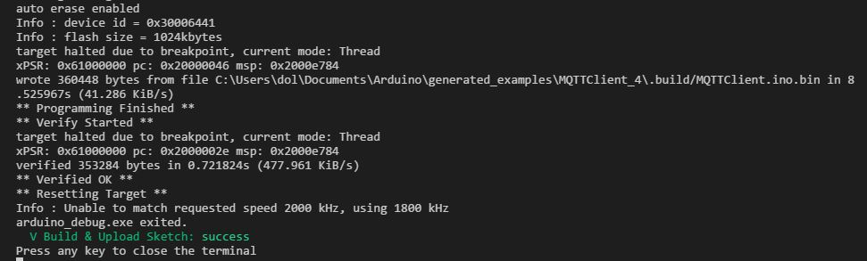
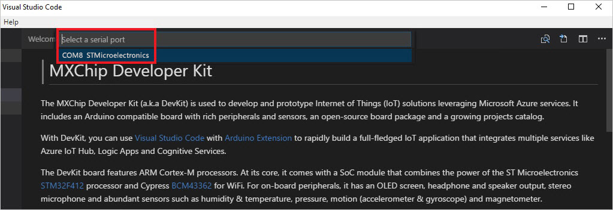
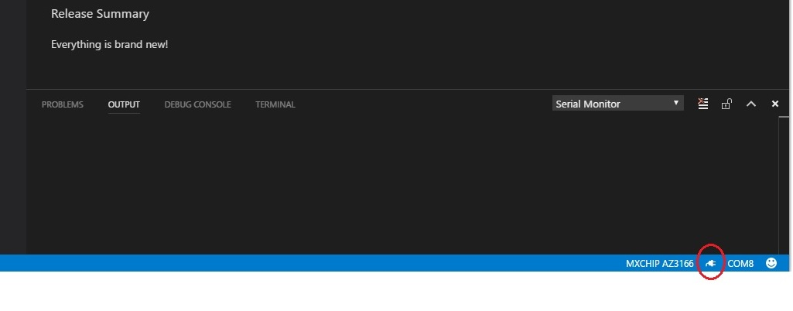
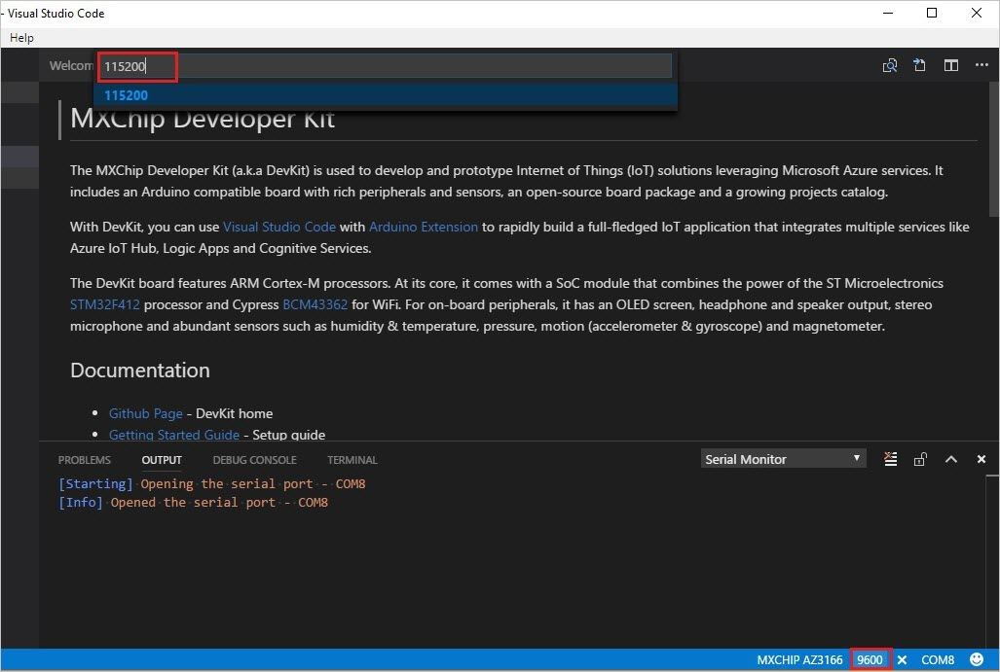
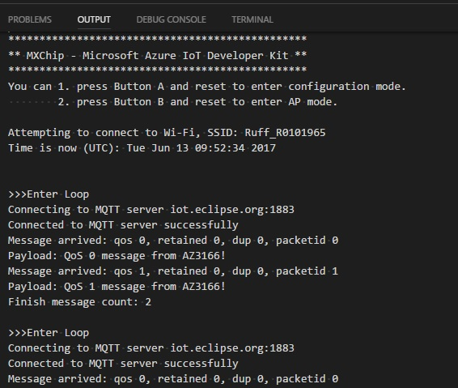

# Send messages to an MQTT server

Internet of Things (IoT) systems often deal with intermittent, poor quality, or slow internet connections. MQTT is a machine-to-machine (M2M) connectivity protocol, which was developed with such challenges in mind. 

The MQTT client library used here is part of the [Eclipse Paho](https://www.eclipse.org/paho/) project, which provides APIs for using MQTT over multiple means of transport.

## What you learn

In this project, you learn:
- How to use the MQTT Client library to send messages to an MQTT broker.
- How to configure your MXChip Iot DevKit as an MQTT client.

## What you need

Finish the [Getting Started Guide](https://docs.microsoft.com/azure/iot-hub/iot-hub-arduino-iot-devkit-az3166-get-started) to:

* Have your DevKit connected to Wi-Fi
* Prepare the development environment

## Open the project folder

1. If the DevKit is already connect to your computer, disconnect it.

2. Start VS Code.

3. Connect the DevKit to your computer.

## Open the MQTTClient Sample

Expand left side **ARDUINO EXAMPLES** section, browse to **Examples for MXCHIP AZ3166 > MQTT**, and select **MQTTClient**. A new VS Code window opens with a project folder in it.

> [!NOTE]
> You can also open example from command palette. Use `Ctrl+Shift+P` (macOS: `Cmd+Shift+P`) to open the command palette, type **Arduino**, and then find and select **Arduino: Examples**.

## Build and upload the Arduino sketch to the DevKit

Type `Ctrl+P` (macOS: `Cmd+P`) to run `task device-upload`. Once the upload is completed, DevKit restarts and runs the sketch.

> [!NOTE]
> You may receive an "Error: AZ3166: Unknown package" error message. This error occurs when the board package index is not refreshed correctly. To resolve this error, refer to the [development section of the IoT DevKit FAQ](https://microsoft.github.io/azure-iot-developer-kit/docs/faq/#development).

## Test the project

In VS Code, follow this procedure to open and set up the Serial Monitor:

1. Click the `COM[X]` word on the status bar to set the right COM port with `STMicroelectronics`:
  

2. Click the power plug icon on the status bar to open the Serial Monitor:
  
  
3. On the status bar, click the number that represents the Baud Rate and set it to `115200`:
  

The Serial Monitor displays all the messages sent by the sample sketch. The sketch connects the DevKit to Wi-Fi. Once the Wi-Fi connection is successful, the sketch sends a message to the MQTT broker. After that, the sample repeatedly sends two "iot.eclipse.org" messages using QoS 0 and QoS 1, respectively.

## Problems and feedback

If you encounter problems, refer to the [IoT DevKit FAQ](https://microsoft.github.io/azure-iot-developer-kit/docs/faq/) or connect using the following channels:

* [Gitter.im](https://gitter.im/Microsoft/azure-iot-developer-kit)
* [Stack Overflow](https://stackoverflow.com/questions/tagged/iot-devkit)

## See also

* [Connect IoT DevKit AZ3166 to Azure IoT Hub in the cloud](iot-hub-arduino-iot-devkit-az3166-get-started.md)
* [Shake, Shake for a Tweet](iot-hub-arduino-iot-devkit-az3166-retrieve-twitter-message.md)

## Next steps

Now that you have learned how to configure your MXChip Iot DevKit as an MQTT client and use the MQTT Client library to send messages to an MQTT broker, here are the suggested next steps:

* [Azure IoT Remote Monitoring solution accelerator overview](https://docs.microsoft.com/azure/iot-suite/)
* [Connect an MXChip IoT DevKit device to your Azure IoT Central application](https://docs.microsoft.com/microsoft-iot-central/howto-connect-devkit)
