# Shake, Shake for a Tweet -- Retrieve a Twitter message with Azure Functions

In this project, you learn how to use the motion sensor to trigger an event using Azure Functions. The app retrieves a random tweet with a #hashtag you configure in your Arduino sketch. The tweet displays on the DevKit screen.

## What you need

Finish the [Getting Started Guide](https://docs.microsoft.com/azure/iot-hub/iot-hub-arduino-iot-devkit-az3166-get-started) to:

* Have your DevKit connected to Wi-Fi.
* Prepare the development environment.

An active Azure subscription. If you don't have one, you can register via one of these methods:

* Activate a [free 30-day trial Microsoft Azure account](https://azure.microsoft.com/free/)
* Claim your [Azure credit](https://azure.microsoft.com/pricing/member-offers/msdn-benefits-details/) if you are an MSDN or Visual Studio subscriber

## Open the project folder

Start by opening the project folder. 

### Start VS Code

* Make sure your DevKit is connected to your computer.

* Start VS Code.

* Connect the DevKit to your computer.

   > [!NOTE]
   > When launching VS Code, you may receive an error message that the Arduino IDE or related board package can't be found. If this error occurs, close VS Code and launch the Arduino IDE again. VS Code should now locate the Arduino IDE path correctly.

### Open the Arduino Examples folder

Expand the left side **ARDUINO EXAMPLES** section, browse to **Examples for MXCHIP AZ3166 > AzureIoT**, and select **ShakeShake**. A new VS Code window opens, displaying the project folder. If you can't see the MXCHIP AZ3166 section, make sure your device is properly connected and restart Visual Studio Code.  
the
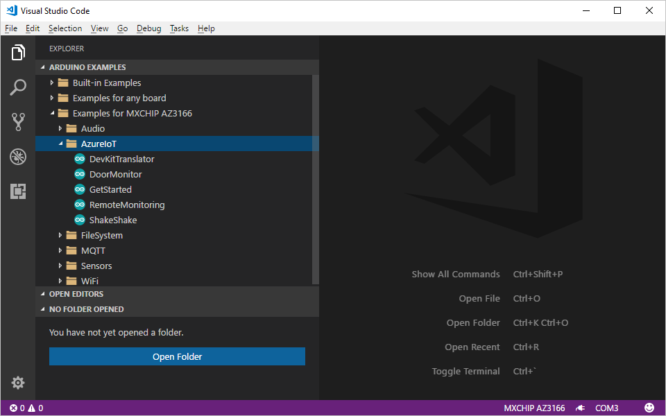

You can also open the sample project from command palette. Click `Ctrl+Shift+P` (macOS: `Cmd+Shift+P`) to open the command palette, type **Arduino**, and then find and select **Arduino: Examples**.

## Provision Azure services

In the solution window, run your task through `Ctrl+P` (macOS: `Cmd+P`) by entering `task cloud-provision`.

In the VS Code terminal, an interactive command line guides you through provisioning the required Azure services:

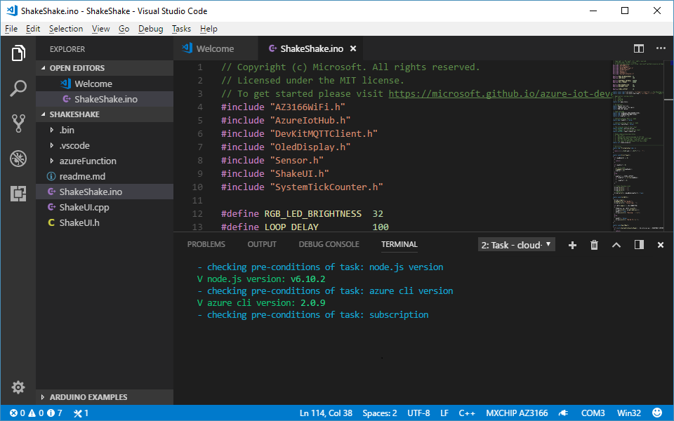

> [!NOTE]
> If the page hangs in the loading status when trying to sign in to Azure, refer to the ["login page hangs" step in the IoT DevKit FAQ](https://microsoft.github.io/azure-iot-developer-kit/docs/faq/#page-hangs-when-log-in-azure).
 
## Modify the #hashtag

Open `ShakeShake.ino` and look for this line of code:

```cpp
static const char* iot_event = "{\"topic\":\"iot\"}";
```

Replace the string `iot` within the curly braces with your preferred hashtag. The DevKit later retrieves a random tweet that includes the hashtag you specify in this step.

## Deploy Azure Functions

Use `Ctrl+P` (macOS: `Cmd+P`) to run `task cloud-deploy` to start deploying the Azure Functions code:

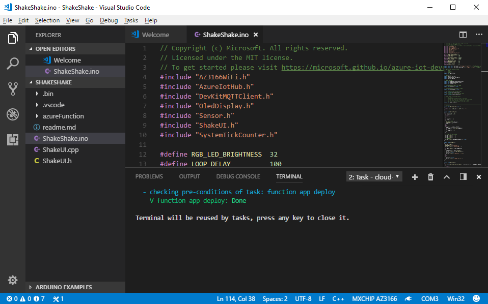

> [!NOTE]
> Occasionally, the Azure Function may not work properly. To resolve this issue when it occurs, check the ["compilation error" section of the IoT DevKit FAQ](https://microsoft.github.io/azure-iot-developer-kit/docs/faq/#compilation-error-for-azure-function).

## Build and upload the device code

Next, build and upload the device code.

### Windows

1. Use `Ctrl+P` to run `task device-upload`.

2. The terminal prompts you to enter configuration mode. To do so:

   * Hold down button A

   * Push and release the reset button.

3. The screen displays the DevKit ID and 'Configuration'.

### macOS

1. Put the DevKit into configuration mode:

   Hold down button A, then push and release the reset button. The screen displays 'Configuration'.

2. Use `Cmd+P` to run `task device-upload` to set the connection string that is retrieved from the `task cloud-provision` step.

### Verify, upload, and run

Now the connection string is set, it verifies and uploads the app, then runs it. 

1. VS Code starts verifying and uploading the Arduino sketch to your DevKit:

   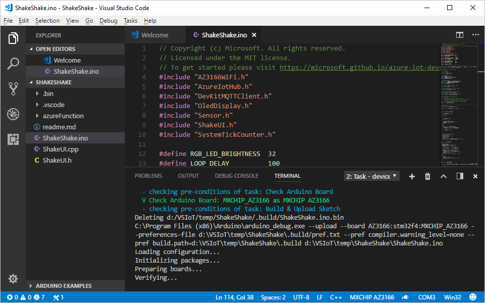

2. The DevKit reboots and starts running the code.

You may get an "Error: AZ3166: Unknown package" error message. This error occurs when the board package index isn't refreshed correctly. To resolve this issue, check the ["unknown package" error in the IoT DevKit FAQ](https://microsoft.github.io/azure-iot-developer-kit/docs/faq/#development).

## Test the project

After app initialization, click and release button A, then gently shake the DevKit board. This action retrieves a random tweet, which contains the hashtag you specified earlier. Within a few seconds, a tweet displays on your DevKit screen:

### Arduino application initializing...

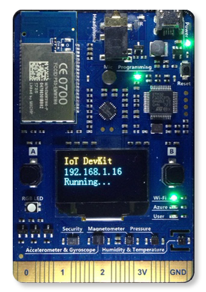

### Press A to shake...

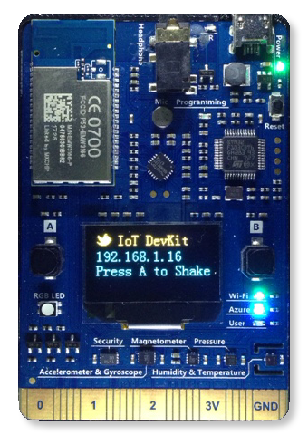

### Ready to shake...

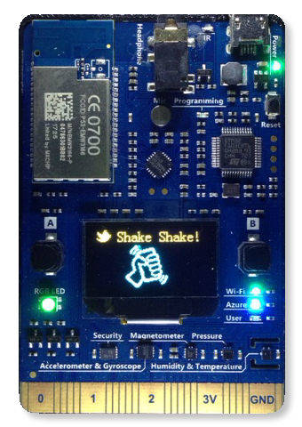

### Processing...

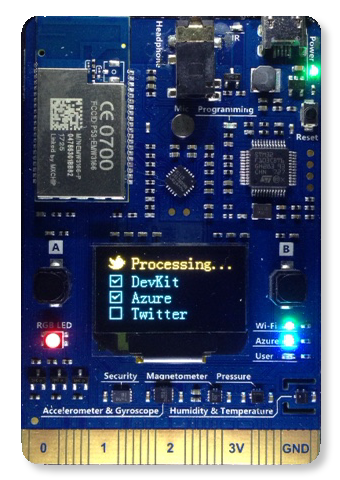

### Press B to read...

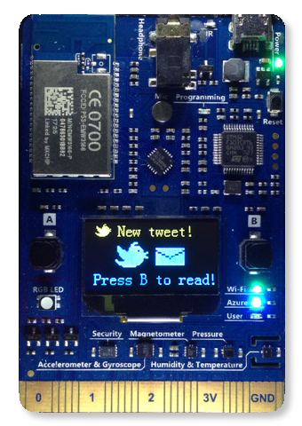

### Display a random tweet...

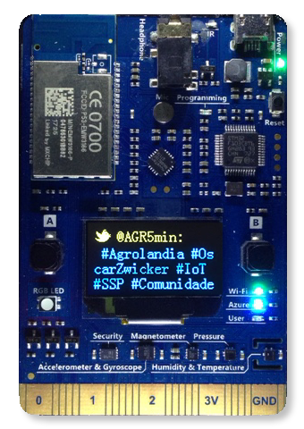

- Press button A again, then shake for a new tweet.
- Press button B to scroll through the rest of the tweet.

## How it works

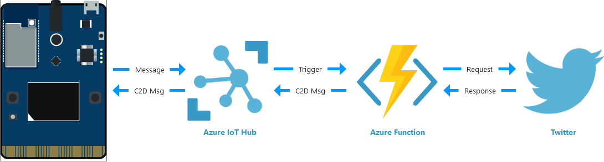

The Arduino sketch sends an event to the Azure IoT Hub. This event triggers the Azure Functions app. The Azure Functions app contains the logic to connect to Twitter's API and retrieve a tweet. It then wraps the tweet text into a C2D (Cloud-to-device) message and sends it back to the device.

## Optional: Use your own Twitter bearer token

For testing purposes, this sample project uses a pre-configured Twitter bearer token. However, there is a [rate limit](https://dev.twitter.com/rest/reference/get/search/tweets) for every Twitter account. If you want to consider using your own token, follow these steps:

1. Go to [Twitter Developer portal](https://dev.twitter.com/) to register a new Twitter app.

2. [Get Consumer Key and Consumer Secrets](https://support.yapsody.com/hc/en-us/articles/360003291573-How-do-I-get-a-Twitter-Consumer-Key-and-Consumer-Secret-key-) of your app.

3. Use [some utility](https://gearside.com/nebula/utilities/twitter-bearer-token-generator/) to generate a Twitter bearer token from these two keys.

4. In the [Azure portal](https://portal.azure.com/){:target="_blank"}, get into the **Resource Group** and find the Azure Function (Type: App Service) for your "Shake, Shake" project. The name always contains 'shake...' string.

   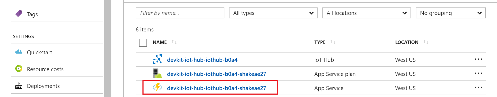

5. Update the code for `run.csx` within **Functions > shakeshake-cs** with your own token:

   ```csharp
   string authHeader = "Bearer " + "[your own token]";
   ```
  
   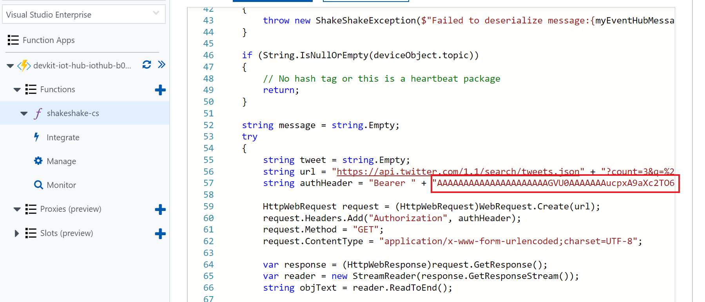

6. Save the file and click **Run**.

## Problems and feedback

How to troubleshoot problems or provide feedback. 

### Problems

One problem you could see if the screen displays 'No Tweets' while every step has run successfully. This condition normally happens the first time you deploy and run the sample because the function app requires anywhere from a couple of seconds to as much as one minute to cold start the app. 

Or, when running the code, there are some blips that cause a restarting of the app. When this condition happens, the device app can get a timeout for fetching the tweet. In this case, you may try one or both of these methods to solve the issue:

1. Click the reset button on the DevKit to run the device app again.

2. In the [Azure portal](https://portal.azure.com/), find the Azure Functions app you created and restart it:

   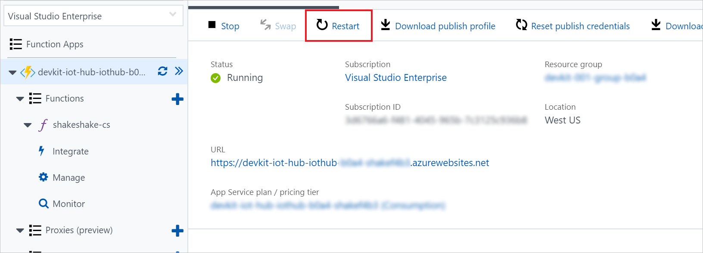

### Feedback

If you experience other problems, refer to the [IoT DevKit FAQ](https://microsoft.github.io/azure-iot-developer-kit/docs/faq/) or contact us using the following channels:

* [Gitter.im](https://gitter.im/Microsoft/azure-iot-developer-kit)
* [Stack Overflow](https://stackoverflow.com/questions/tagged/iot-devkit)

## Next steps

Now that you have learned how to connect a DevKit device to your Azure IoT Remote Monitoring solution accelerator and retrieve a tweet, here are the suggested next steps:

* [Azure IoT Remote Monitoring solution accelerator overview](https://docs.microsoft.com/azure/iot-suite/)