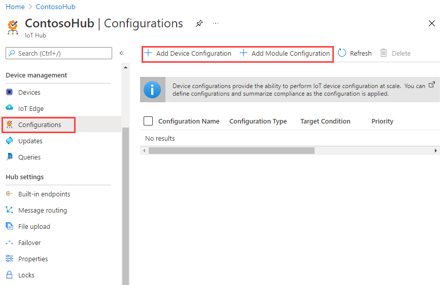
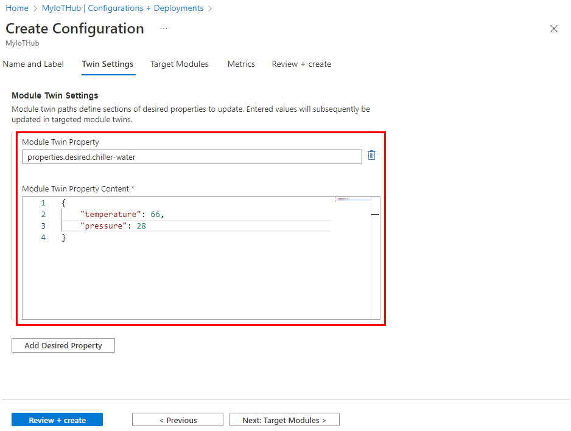

# Automatic IoT device and module management using the Azure portal

[!INCLUDE [iot-edge-how-to-deploy-monitor-selector](../../includes/iot-hub-auto-device-config-selector.md)]

Automatic device management in Azure IoT Hub automates many of the repetitive and complex tasks of managing large device fleets. With automatic device management, you can target a set of devices based on their properties, define a desired configuration, and then let IoT Hub update the devices when they come into scope. This update is done using an _automatic device configuration_ or _automatic module configuration_, which lets you summarize completion and compliance, handle merging and conflicts, and roll out configurations in a phased approach.

[!INCLUDE [iot-hub-basic](../../includes/iot-hub-basic-whole.md)]

Automatic device management works by updating a set of device twins or module twins with desired properties and reporting a summary that's based on twin reported properties.  It introduces a new class and JSON document called a *Configuration* that has three parts:

* The **target condition** defines the scope of device twins or module twins to be updated. The target condition is specified as a query on twin tags and/or reported properties.

* The **target content** defines the desired properties to be added or updated in the targeted device twins or module twins. The content includes a path to the section of desired properties to be changed.

* The **metrics** define the summary counts of various configuration states such as **Success**, **In Progress**, and **Error**. Custom metrics are specified as queries on twin reported properties.  System metrics are the default metrics that measure twin update status, such as the number of twins that are targeted and the number of twins that have been successfully updated.

Automatic configurations run for the first time shortly after the configuration is created and then at five minute intervals. Metrics queries run each time the automatic configuration runs.

## Implement twins

Automatic device configurations require the use of device twins to synchronize state between the cloud and devices.  For more information, see [Understand and use device twins in IoT Hub](iot-hub-devguide-device-twins.md).

Automatic module configurations require the use of module twins to synchronize state between the cloud and modules. For more information, see [Understand and use module twins in IoT Hub](iot-hub-devguide-module-twins.md).

## Use tags to target twins

Before you create a configuration, you must specify which devices or modules you want to affect. Azure IoT Hub identifies devices and using tags in the device twin, and identifies modules using tags in the module twin. Each device or modules can have multiple tags, and you can define them any way that makes sense for your solution. For example, if you manage devices in different locations, add the following tags to a device twin:

```json
"tags": {
	"location": {
		"state": "Washington",
		"city": "Tacoma"
    }
},
```

## Create a configuration

1. In the [Azure portal](https://portal.azure.com), go to your IoT hub. 

2. Select **IoT device configuration**.

3. Select **Add device configuration** or **Add module configuration**.

   

There are five steps to create a configuration. The following sections walk through each one. 

### Name and Label

1. Give your configuration a unique name that is up to 128 lowercase letters. Avoid spaces and the following invalid characters: `& ^ [ ] { } \ | " < > /`.

2. Add labels to help track your configurations. Labels are **Name**, **Value** pairs that describe your configuration. For example, `HostPlatform, Linux` or `Version, 3.0.1`.

3. Select **Next** to move to the next step. 

### Specify Settings

This section defines the content to be set in targeted device or module twins. There are two inputs for each set of settings. The first is the twin path, which is the path to the JSON section within the twin desired properties that will be set.  The second is the JSON content to be inserted in that section. 

For example, you could set the twin path to `properties.desired.chiller-water` and then provide the following JSON content: 

```json
{
  "temperature": 66,
  "pressure": 28
}
```




You can also set individual settings by specifying the entire twin path and providing the value with no brackets. For example, with the twin path `properties.desired.chiller-water.temperature`, set the content to `66`. Then create a new twin setting for the pressure property. 

If two or more configurations target the same twin path, the content from the highest priority configuration will apply (priority is defined in step 4).

If you wish to remove an existing property, specify the property value to `null`.

You can add additional settings by selecting **Add Device Twin Setting** or **Add Module Twin Setting**.

### Specify Metrics (optional)

Metrics provide summary counts of the various states that a device or module may report back after applying configuration content. For example, you may create a metric for pending settings changes, a metric for errors, and a metric for successful settings changes.

Each configuration can have up to five custom metrics. 

1. Enter a name for **Metric Name**.

2. Enter a query for **Metric Criteria**.  The query is based on device twin reported properties.  The metric represents the number of rows returned by the query.

For example:

```sql
SELECT deviceId FROM devices 
  WHERE properties.reported.chillerWaterSettings.status='pending'
```

You can include a clause that the configuration was applied, for example: 

```sql
/* Include the double brackets. */
SELECT deviceId FROM devices 
  WHERE configurations.[[yourconfigname]].status='Applied'
```

If you're building a metric to report on configured modules, select `moduleId` from `devices.modules`. For example:

```sql
SELECT deviceId, moduleId FROM devices.modules
  WHERE properties.reported.lastDesiredStatus.code = 200
```

### Target Devices

Use the tags property from your twins to target the specific devices or modules that should receive this configuration. You can also target twin reported properties.

Automatic device configurations can only target device twin tags, and automatic module configurations can only target module twin tags. 

Since multiple configurations may target the same device or module, each configuration needs a priority number. If there's ever a conflict, the configuration with the highest priority wins. 

1. Enter a positive integer for the configuration **Priority**. The highest numerical value is considered the highest priority. If two configurations have the same priority number, the one that was created most recently wins. 

2. Enter a **Target condition** to determine which devices or modules will be targeted with this configuration. The condition is based on twin tags or twin reported properties and should match the expression format. 

   For automatic device configuration, you can specify just the tag or reported property to target. For example, `tags.environment='test'` or `properties.reported.chillerProperties.model='4000x'`. You can specify `*` to target all devices. 
   
   For automatic module configuration, use a query to specify tags or reported properties from the modules registered to the IoT hub. For example, `from devices.modules where tags.environment='test'` or `from devices.modules where properties.reported.chillerProperties.model='4000x'`. The wildcard cannot be used to target all modules. 

3. Select **Next** to move on to the final step.

### Review Configuration

Review your configuration information, then select **Submit**.

## Monitor a configuration

To view the details of a configuration and monitor the devices running it, use the following steps:

1. In the [Azure portal](https://portal.azure.com), go to your IoT hub. 

2. Select **IoT device configuration**.

3. Inspect the configuration list. For each configuration, you can view the following details:

   * **ID** - the name of the configuration.

   * **Target condition** - the query used to define targeted devices or modules.

   * **Priority** - the priority number assigned to the configuration.

   * **Creation time** - the timestamp from when the configuration was created. This timestamp is used to break ties when two configurations have the same priority. 

   * **System metrics** - metrics that are calculated by IoT Hub and cannot be customized by developers. Targeted specifies the number of device twins that match the target condition. Applies specified the number of device twins that have been modified by the configuration, which can include partial modifications in the event that a separate, higher priority configuration also made changes. 

   * **Custom metrics** - metrics that have been specified by the developer as queries against twin reported properties.  Up to five custom metrics can be defined per configuration. 
   
4. Select the configuration that you want to monitor.  

5. Inspect the configuration details. You can use tabs to view specific details about the devices that received the configuration.

   * **Target Condition** - the devices or modules that match the target condition. 

   * **Metrics** - a list of system metrics and custom metrics.  You can view a list of devices or modules that are counted for each metric by selecting the metric in the drop-down and then selecting **View Devices** or **View Modules**.

   * **Device Twin Settings** or **Module Twin Settings** - the twin settings that are set by the configuration. 

   * **Configuration Labels** - key-value pairs used to describe a configuration.  Labels have no impact on functionality. 

## Modify a configuration

When you modify a configuration, the changes immediately replicate to all targeted devices or modules. 

If you update the target condition, the following updates occur:

* If a twin didn't meet the old target condition, but meets the new target condition and this configuration is the highest priority for that twin, then this configuration is applied. 

* If a twin currently running this configuration no longer meets the target condition, the settings from the configuration will be removed and the twin will be modified by the next highest priority configuration. 

* If a twin currently running this configuration no longer meets the target condition and doesn't meet the target condition of any other configurations, then the settings from the configuration will be removed and no other changes will be made on the twin. 

To modify a configuration, use the following steps: 

1. In the [Azure portal](https://portal.azure.com), go to your IoT hub. 

2. Select **IoT device configuration**. 

3. Select the configuration that you want to modify. 

4. Make updates to the following fields: 

   * Target condition 
   * Labels 
   * Priority 
   * Metrics

4. Select **Save**.

5. Follow the steps in [Monitor a configuration](#monitor-a-configuration) to watch the changes roll out. 

## Delete a configuration

When you delete a configuration, any device twins take on their next highest priority configuration. If device twins don't meet the target condition of any other configuration, then no other settings are applied. 

1. In the [Azure portal](https://portal.azure.com), go to your IoT hub. 

2. Select **IoT device configuration**. 

3. Use the checkbox to select the configuration that you want to delete. 

4. Select **Delete**.

5. A prompt will ask you to confirm.

## Next steps

In this article, you learned how to configure and monitor IoT devices at scale. Follow these links to learn more about managing Azure IoT Hub:

* [Manage your IoT Hub device identities in bulk](iot-hub-bulk-identity-mgmt.md)
* [IoT Hub metrics](iot-hub-metrics.md)
* [Operations monitoring](iot-hub-operations-monitoring.md)

To further explore the capabilities of IoT Hub, see:

* [IoT Hub developer guide](iot-hub-devguide.md)
* [Deploying AI to edge devices with Azure IoT Edge](../iot-edge/tutorial-simulate-device-linux.md)

To explore using the IoT Hub Device Provisioning Service to enable zero-touch, just-in-time provisioning, see: 

* [Azure IoT Hub Device Provisioning Service](/azure/iot-dps)
