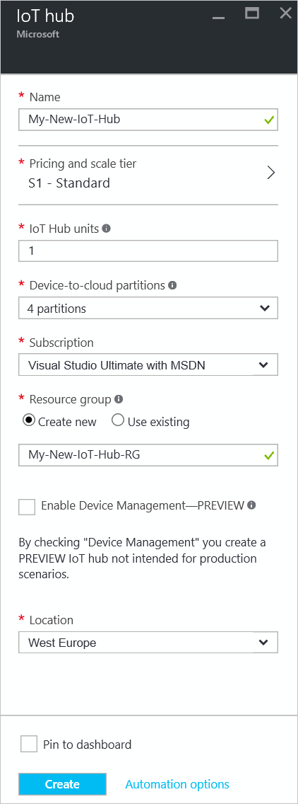
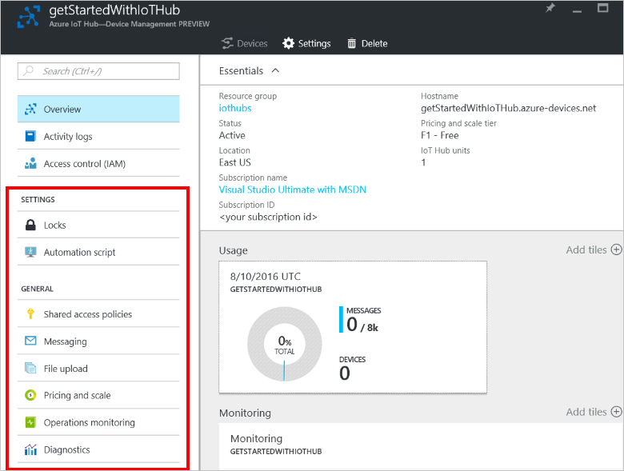
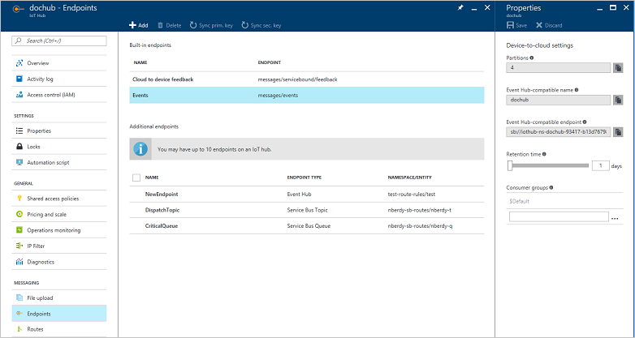
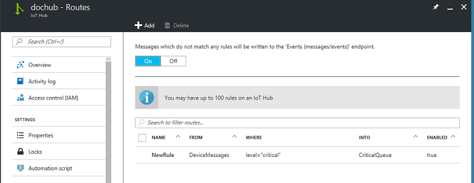
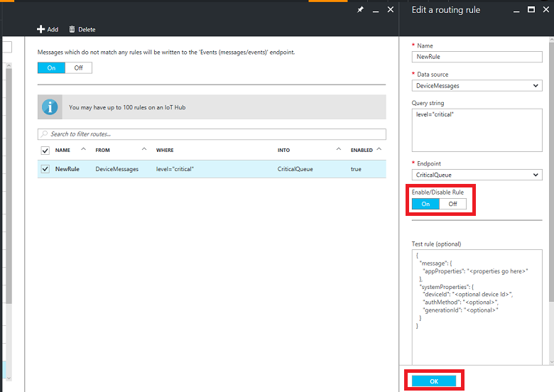

# Create an IoT hub using the Azure portal

[!INCLUDE [iot-hub-resource-manager-selector](../../includes/iot-hub-resource-manager-selector.md)]

This article describes:

* How to find the IoT Hub service in the Azure portal.
* How to create and manage IoT hubs.

## Where to find the IoT Hub service

You can find the IoT Hub service in the following locations in the portal:

* Choose **+ New**, then choose **Internet of Things**.
* In the Marketplace, choose **Internet of Things**.

## Create an IoT hub

You can create an IoT hub using the following methods:

* The **+ New** option opens the blade shown in the following screen shot. The steps for creating the IoT hub through this method and through the marketplace are identical.

* In the Marketplace, choose **Create** to open the blade shown in the following screen shot.

The following sections describe the several steps to create an IoT hub.

### Choose the name of the IoT hub

To create an IoT hub, you must name the IoT hub. This name must be unique across all IoT hubs.

[!INCLUDE [iot-hub-pii-note-naming-hub](../../includes/iot-hub-pii-note-naming-hub.md)]

### Choose the pricing tier

You can choose from several tiers depending on how many features you want and how many messages you send through your solution per day. The free tier is intended for testing and evaluation. It allows 500 devices to be connected to the IoT hub and up to 8,000 messages per day. Each Azure subscription can create one IoT Hub in the free tier. 

For details about the other tier options, see [Choosing the right IoT Hub tier](iot-hub-scaling.md).

### IoT hub units

The number of messages allowed per unit per day depends on your hub's pricing tier. For example, if you want the IoT hub to support ingress of 700,000 messages, you choose two S1 tier units.

### Device to cloud partitions and resource group

You can change the number of partitions for an IoT hub. The default number of partitions is 4; you can choose a different number from the drop-down list.

You do not need to explicitly create an empty resource group. When you create a resource, you can choose either to create a new resource group, or use an existing resource group.

### Choose subscription

Azure IoT Hub automatically lists the Azure subscriptions the user account is linked to. You can choose the Azure subscription to associate the IoT hub to.

### Choose the location

The location option provides a list of the regions where IoT Hub is available.

### Create the IoT hub

When all previous steps are complete, you can create the IoT hub. Click **Create** to start the backend process to create and deploy the IoT hub with the options you chose.

It can take a few minutes to create the IoT hub as it takes time for the backend deployment to run on the appropriate location servers.

## Change the settings of the IoT hub
<!--robinsh these screenshots are out of date -->

You can change the settings of an existing IoT hub after it is created from the IoT Hub blade.

**Shared access policies**: These policies define the permissions for devices and services to connect to IoT Hub. You can access these policies by clicking **Shared access policies** under **General**. In this blade, you can either modify existing policies or add a new policy.

### Create a policy

* Click **Add** to open a blade. Here you can enter the new policy name and the permissions that you want to associate with this policy, as shown in the following figure:

    There are several permissions that can be associated with these shared policies. The **Registry read** and **Registry write** policies grant read and write access rights to the identity registry. Choosing the write option automatically chooses the read option.

    The **Service connect** policy grants permission to access service endpoints such as **Receive device-to-cloud**. The **Device connect** policy grants permissions for sending and receiving messages using the IoT Hub device-side endpoints.

* Click **Create** to add this newly created policy to the existing list.

   

## Endpoints

Click **Endpoints** to display a list of endpoints for the IoT hub that you are modifying. There are two types of endpoints: endpoints that are built into the IoT hub, and endpoints that you add to the IoT hub after its creation.

### Built-in endpoints

There are two built-in endpoints: **Cloud to device feedback** and **Events**.

* **Cloud to device feedback** settings: This setting has two subsettings: **Cloud to Device TTL** (time-to-live) and **Retention time** (in hours) for the messages. When your first create an IoT hub, both these settings have the default value of one hour. To adjust these settings, use the sliders or type the values.

* **Events** settings: This setting has several subsettings, some of which are read-only. The following list describes these settings:

  * **Partitions**: A default value is set when the IoT hub is created. You can change the number of partitions through this setting.

  * **Event Hub-compatible name and endpoint**: When the IoT hub is created, an Event Hub is created internally that you may need access to under certain circumstances. You cannot customize the Event Hub-compatible name and endpoint values but you can copy them by clicking **Copy**.

  * **Retention Time**: Set to one day by default but you can change it using the drop-down list. This value is in days for the device-to-cloud setting.

  * **Consumer Groups**: Consumer groups enable multiple readers to read messages independently from the IoT hub. Every IoT hub is created with a default consumer group. However, you can add or delete consumer groups to your IoT hubs using this setting.

  > [!NOTE]
  > The default consumer group cannot be edited or deleted.

### Custom endpoints

You can add custom endpoints on your IoT hub using the portal. From the **Endpoints** blade, click **Add** at the top to open the **Add endpoint** blade. Enter the required information, then click **OK**. Your custom endpoint is now listed in the main **Endpoints** blade.

You can read more about custom endpoints in [Reference - IoT hub endpoints]( iot-hub-devguide-endpoints.md).

## Routes

Click **Routes** to manage how IoT Hub dispatches your device-to-cloud messages.

You can add routes to your IoT hub by clicking **Add** at the top of the **Routes*** blade, entering the required information, and clicking **OK**. Your route is then listed in the main **Routes** blade. You can edit a route by clicking it in the list of routes. To enable a route, click it in the list of routes and set the **Enabled** toggle to **Off**. To save the change, click **OK** at the bottom of the blade.

## Delete the IoT hub

You can browse to the IoT hub you want to delete by clicking **Browse**, and then choosing the appropriate hub to delete. To delete the IoT hub, click the **Delete** button below the IoT hub name.

## Next steps

Follow these links to learn more about managing Azure IoT Hub:

* [Bulk manage IoT devices](iot-hub-bulk-identity-mgmt.md)
* [IoT Hub metrics](iot-hub-metrics.md)
* [Operations monitoring](iot-hub-operations-monitoring.md)

To further explore the capabilities of IoT Hub, see:

* [IoT Hub developer guide](iot-hub-devguide.md)
* [Deploying AI to edge devices with Azure IoT Edge](../iot-edge/tutorial-simulate-device-linux.md)
* [Secure your IoT solution from the ground up](../iot-fundamentals/iot-security-ground-up.md)
