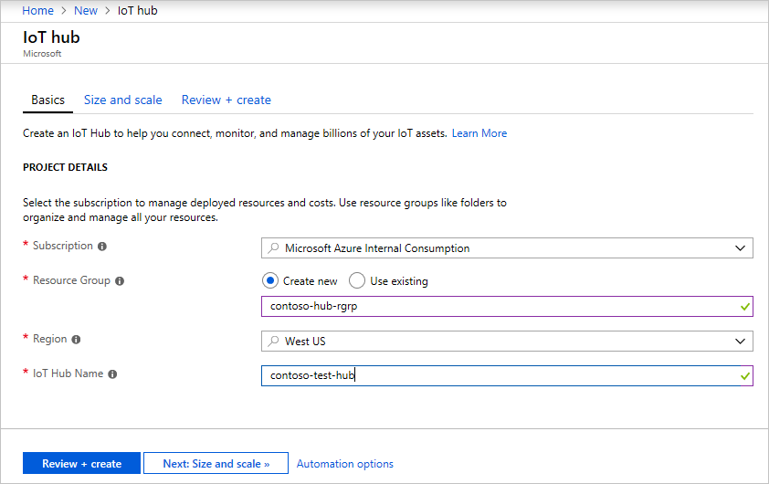
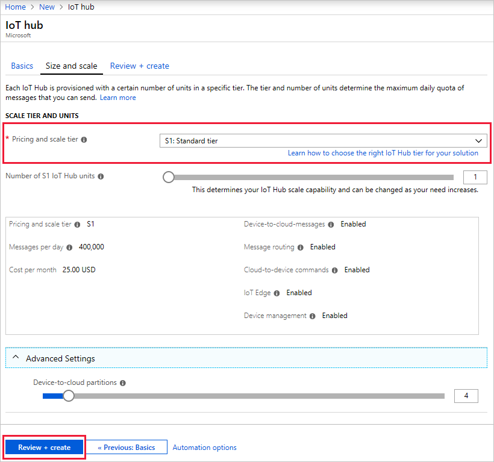
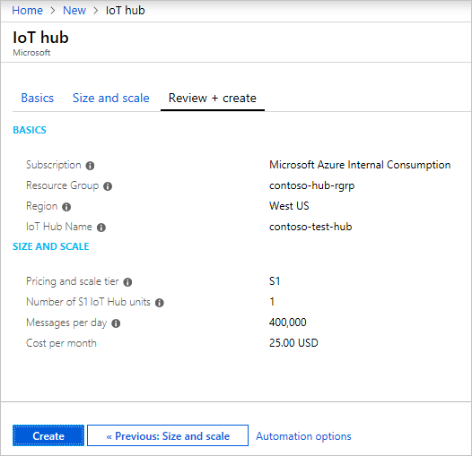
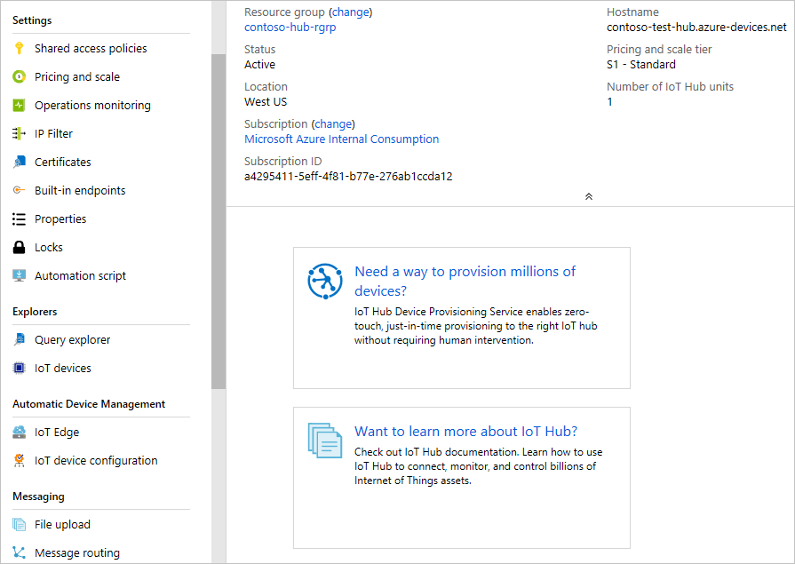
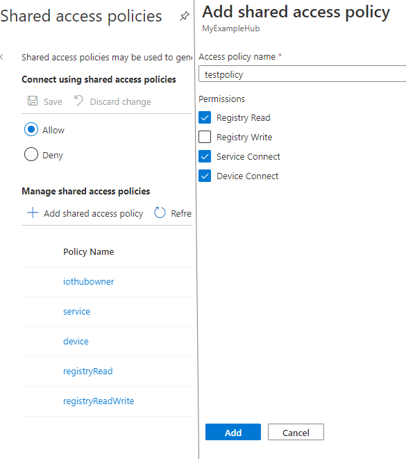
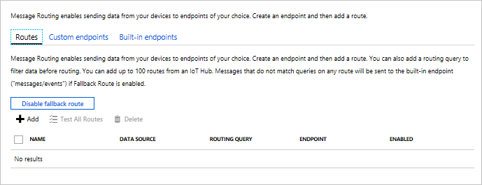
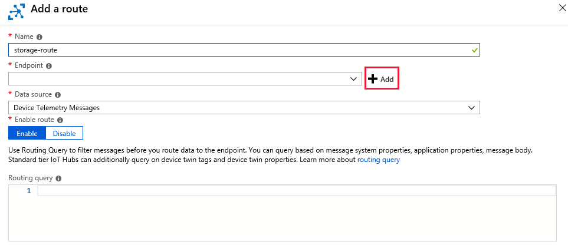
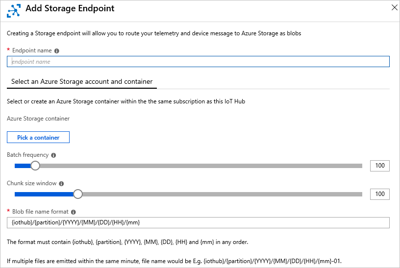
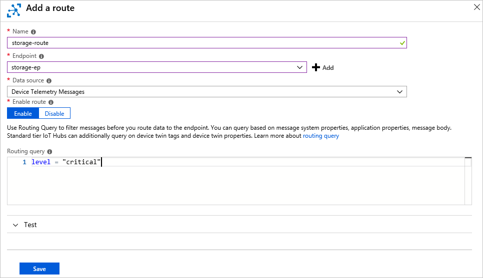

# Create an IoT hub using the Azure portal

[!INCLUDE [iot-hub-resource-manager-selector](../../includes/iot-hub-resource-manager-selector.md)]

This article describes how to create and manage IoT hubs using the [Azure portal](https://portal.azure.com).

To use the steps in this tutorial, you need an Azure subscription. If you don't have an Azure subscription, create a [free account](https://azure.microsoft.com/free/?WT.mc_id=A261C142F) before you begin.

## Create an IoT hub

1. Log in to the [Azure portal](https://portal.azure.com). 

2. Choose +**Create a resource**, then choose **Internet of Things**.

3. Click **Iot Hub** from the list on the right. You see the first screen for creating an IoT hub.

   

   Fill in the fields.

   **Subscription**: Select the subscription to use for your IoT hub.

   **Resource Group**: You can create a new resource group or use an existing one. To create a new one, click **Create new** and fill in the name you want to use. To use an existing resource group, click **Use existing** and select the resource group from the dropdown list.

   **Region**: Select the region in which you want your hub to be located from the dropdown list.

   **IoT Hub Name**: Put in the name for your IoT Hub. This name must be globally unique. 

   [!INCLUDE [iot-hub-pii-note-naming-hub](../../includes/iot-hub-pii-note-naming-hub.md)]

4. Click **Next: Size and scale** to go to the next screen.

   

   On this screen, you can take the defaults and just click **Review + create** at the bottom. Or you can fill in the fields as needed.

   **Pricing and scale tier**: You can choose from several tiers depending on how many features you want and how many messages you send through your solution per day. The free tier is intended for testing and evaluation. It allows 500 devices to be connected to the IoT hub and up to 8,000 messages per day. Each Azure subscription can create one IoT Hub in the free tier. 

   **IoT Hub units**: The number of messages allowed per unit per day depends on your hub's pricing tier. For example, if you want the IoT hub to support ingress of 700,000 messages, you choose two S1 tier units.

   For details about the other tier options, see [Choosing the right IoT Hub tier](iot-hub-scaling.md).

   **Advanced / Device-to-cloud partitions**: This property relates the device-to-cloud messages to the number of simultaneous readers of the messages. Most IoT hubs only need four partitions. 

5. Click **Review + create** to review your choices. You see something similar to this screen.

   

5. Click **Create** to create your new IoT hub. Creating the hub takes a few minutes.

## Change the settings of the IoT hub

You can change the settings of an existing IoT hub after it's created from the IoT Hub pane.

Here are some of the properties you can set for an IoT hub:

**Pricing and scale**: You can use this property to migrate to a different tier or set the number of IoT Hub units. 

**Operations monitoring**: Turn the different monitoring categories on or off, such as logging for events related to device-to-cloud messages or cloud-to-device messages.

**IP Filter**: Specify a range of IP addresses that will be accepted or rejected by the IoT hub.

**Properties**: Provides the list of properties that you can copy and use elsewhere, such as the resource ID, resource group, location, and so on.

### Shared access policies

You can also view or modify the list of shared access policies by clicking **Shared access policies** in the **Settings** section. These policies define the permissions for devices and services to connect to IoT Hub. 

Click **Add** to open the **Add a shared access policy** blade.  You can enter the new policy name and the permissions that you want to associate with this policy, as shown in the following figure:

* The **Registry read** and **Registry write** policies grant read and write access rights to the identity registry. Choosing the write option automatically chooses the read option.

* The **Service connect** policy grants permission to access service endpoints such as **Receive device-to-cloud**. 

* The **Device connect** policy grants permissions for sending and receiving messages using the IoT Hub device-side endpoints.

Click **Create** to add this newly created policy to the existing list.

## Message Routing for an IoT hub

Click **Message Routing** under **Messaging** to see the Message Routing pane, where you define routes and custom endpoints for the hub. [Message routing](iot-hub-devguide-messages-d2c.md) enables you to manage how data is sent from your devices to your endpoints. The first step is to add a new route. Then you can add an existing endpoint to the route, or create a new one of the types supported, such as blob storage. 

### Routes

Routes is the first tab on the Message Routing pane. To add a new route, click +**Add**. You see the following screen. 

Name your hub. The name must be unique within the list of routes for that hub. 

For **Endpoint**, you can select one from the dropdown list, or add a new one. In this example, a storage account and container are already available. To add them as an endpoint, click +**Add** next to the Endpoint dropdown and select **Blob Storage**. The following screen shows where the storage account and container are specified.

Click **Pick a container** to select the storage account and container. When you have selected those fields, it returns to the Endpoint pane. Use the defaults for the rest of the fields and **Create** to create the endpoint for the storage account and add it to the routing rules.

For **Data source**, select Device Telemetry Messages. 

Next, add a routing query. In this example, the messages that have an application property called `level` with a value equal to `critical` are routed to the storage account.

Click **Save** to save the routing rule. You return to the Message Routing pane, and your new routing rule is displayed.

### Custom endpoints

Click the **Custom endpoints** tab. You see any custom endpoints already created. From here, you can add new endpoints or delete existing endpoints. 

> [!NOTE]
> If you delete a route, it does not delete the endpoints assigned to that route. To delete an endpoint, click the Custom endpoints tab, select the endpoint you want to delete, and click Delete.
>

You can read more about custom endpoints in [Reference - IoT hub endpoints](iot-hub-devguide-endpoints.md).

You can define up to 10 custom endpoints for an IoT hub. 

To see a full example of how to use custom endpoints with routing, see [Message routing with IoT Hub](tutorial-routing.md).

## Find a specific IoT hub

Here are two ways to find a specific IoT hub in your subscription:

1. If you know the resource group to which the IoT hub belongs, click **Resource groups**, then select the resource group from the list. The resource group screen shows all of the resources in that group, including the IoT hubs. Click on the hub for which you're looking.

2. Click **All resources**. On the **All resources** pane, there is a dropdown list that defaults to `All types`. Click on the dropdown list, uncheck `Select all`. Find `IoT Hub` and check it. Click on the dropdown list box to close it, and the entries will be filtered, showing only your IoT hubs.

## Delete the IoT hub

To delete an Iot hub, find the IoT hub you want to delete, then click the **Delete** button below the IoT hub name.

## Next steps

Follow these links to learn more about managing Azure IoT Hub:

* [Message routing with IoT Hub](tutorial-routing.md)
* [IoT Hub metrics](iot-hub-metrics.md)
* [Operations monitoring](iot-hub-operations-monitoring.md)