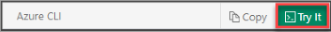

# Create an IoT hub using Azure CLI

<!--ROBINSH  REMOVE THIS IF IT'S ONLY USED IN THESE 2 ARTICLES -->
[!INCLUDE [iot-hub-resource-manager-selector](../../includes/iot-hub-resource-manager-selector.md)]

## Introduction

To do this how-to, you need an Azure subscription. If you don't have an Azure subscription, create a [free account](https://azure.microsoft.com/free/?WT.mc_id=A261C142F) before you begin.

To use Azure CLI, while you can install and use Azure CLI locally, we recommend you use the Azure Cloud Shell. Azure Cloud Shell is a free, interactive shell that you can use to run Azure CLI scripts. Common Azure tools are preinstalled and configured in Cloud Shell for you to use with your account, so you don't have to install them locally. 

### Azure Cloud Shell

<!--ROBINSH  get the include file and use it instead of this  -->
There are a few ways to open Cloud Shell:

|  |   |
|-----------------------------------------------|---|
| Select **Try It** in the upper-right corner of a code block. |  |
| Open Cloud Shell in your browser. | [](https://shell.azure.com) |
| Select the **Cloud Shell** button on the menu in the upper-right corner of the [Azure portal](https://portal.azure.com). |	 |
|  |  |

For this how-to, you need an active Azure account. If you don't have an account, you can create a [free account](https://azure.microsoft.com/pricing/free-trial/) in just a couple of minutes.


## Sign in and set your Azure account

First, sign in to your Azure account.

<!--ROBINSH make sure these links are right, this one isn't -->
At the command prompt, run the [login command](https://docs.microsoft.com/cli/azure/get-started-with-az-cli2):
    
    ```azurecli
    az login
    ```

Follow the instructions to authenticate using the code and sign in to your Azure account through a web browser.

## Create an IoT Hub

Use the Azure CLI to create a resource group and then add an IoT hub.

1. When you create an IoT hub, you must create it in a resource group. Either use an existing resource group, or run the following [command to create a resource group](https://docs.microsoft.com/cli/azure/resource):
    
   ```azurecli
   az group create --name {your resource group name} --location westus
   ```

   > [!TIP]
   > The previous example creates the resource group in the West US location. You can view a list of available locations by running the command `az account list-locations -o table`.
   >

2. Run the following [command to create an IoT hub](https://docs.microsoft.com/cli/azure/iot) in your resource group, using a globally unique name for your IoT hub:
    
   ```azurecli
   az iot hub create --name {your iot hub name} -\
      -resource-group {your resource group name} --sku S1
   ```

   [!INCLUDE [iot-hub-pii-note-naming-hub](../../includes/iot-hub-pii-note-naming-hub.md)]


> [!NOTE]
> The previous command creates an IoT hub in the S1 pricing tier for which you are billed. For more information, see [Azure IoT Hub pricing](https://azure.microsoft.com/pricing/details/iot-hub/).
>

## Remove an IoT Hub

You can use the Azure CLI to [delete an individual resource](https://docs.microsoft.com/cli/azure/resource), such as an IoT hub, or delete a resource group and all its resources, including any IoT hubs.

To delete an IoT hub, run the following command:

```azurecli
az iot hub delete --name {your iot hub name} -\
  -resource-group {your resource group name}
```

To delete a resource group and all its resources, run the following command:

```azurecli
az group delete --name {your resource group name}
```

## Next steps

To learn more about using an IoT hub, see the following articles:

* [IoT Hub developer guide](iot-hub-devguide.md)
* [Using the Azure portal to manage IoT Hub](iot-hub-create-through-portal.md)
