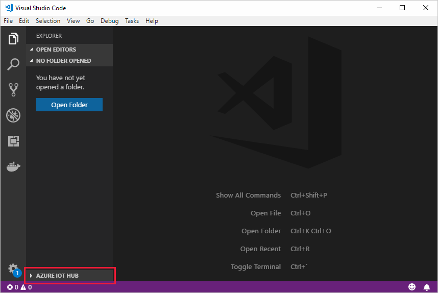

# Create an Azure IoT Hub using Cloud Explorer for Visual Studio

[!INCLUDE [iot-hub-resource-manager-selector](../../includes/iot-hub-resource-manager-selector.md)]

This article shows you how to use the [Cloud Explorer for Visual Studio](https://marketplace.visualstudio.com/items?itemName=ms-azuretools.CloudExplorerForVS) to create an Azure IoT hub. 

To complete this article, you need the following:

- Microsoft Azure account - If you don't have an account, you can [sign up for a free trial](http://go.microsoft.com/fwlink/?LinkId=623901) or [activate your Visual Studio subscriber benefits](http://go.microsoft.com/fwlink/?LinkId=623901).

- [Visual Studio 2017](https://www.visualstudio.com/downloads/) with the **Azure workload** selected.

> [!NOTE]
> To view Cloud Explorer, select **View** > **Cloud Explorer** on the menu bar.

## Create an IoT hub

1. In Visual Studio Code, open the **Explorer** view.

2. At the bottom of the Explorer, expand the **Azure IoT Hub Devices** section. 

   

3. Click on the **...** in the **Azure IoT Hub Devices** section header. If you don't see the ellipsis, hover over the header. 

4. Choose **Create IoT Hub**.

5. A pop-up will show in the bottom right corner to let you sign in to Azure for the first time.

6. Select Azure subscription. 

7. Select resource group.

8. Select location.

9. Select pricing tier.

10. Enter a globally unique name for your IoT Hub.

11. Wait a few minutes until the IoT Hub is created.

## Next steps

Now you have deployed an IoT hub using the Azure IoT Tools for Visual Studio Code. To explore further, check out the following articles:

* [Use the Azure IoT Tools for Visual Studio Code to send and receive messages between your device and an IoT Hub](iot-hub-vscode-iot-toolkit-cloud-device-messaging.md).

* [Use the Azure IoT Tools for Visual Studio Code for Azure IoT Hub device management](iot-hub-device-management-iot-toolkit.md)

* [See the Azure IoT Hub Toolkit wiki page](https://github.com/microsoft/vscode-azure-iot-toolkit/wiki).
