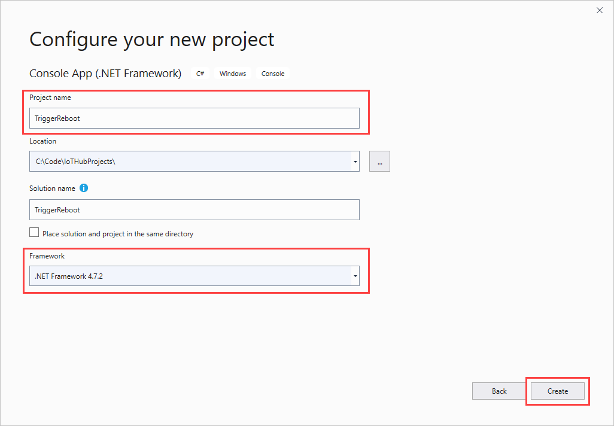
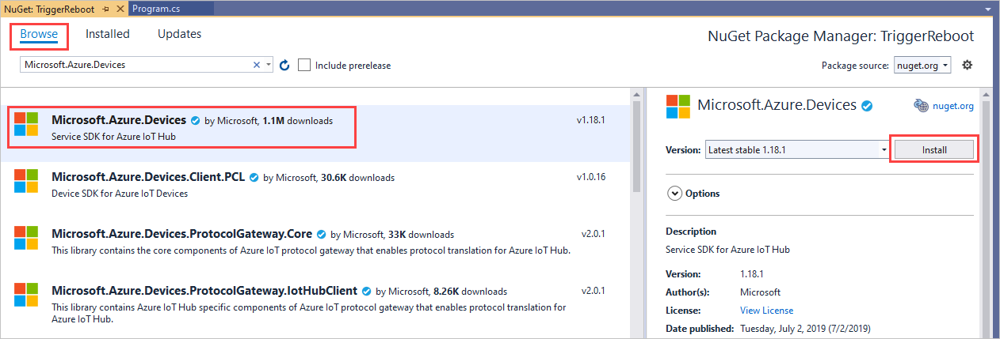
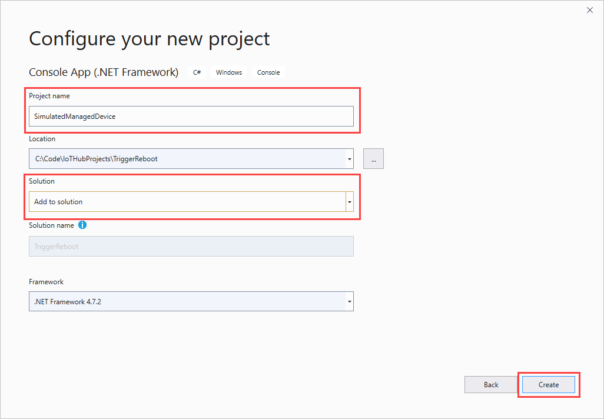
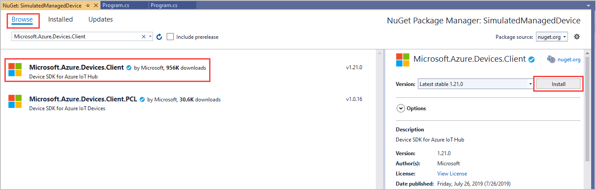

# Get started with device management (.NET)

[!INCLUDE [iot-hub-selector-dm-getstarted](../../includes/iot-hub-selector-dm-getstarted.md)]

This tutorial shows you how to:

* Use the Azure portal to create an IoT hub and create a device identity in your IoT hub.

* Create a simulated device app that contains a direct method that reboots that device. Direct methods are invoked from the cloud.

* Create a .NET console app that calls the reboot direct method in the simulated device app through your IoT hub.

At the end of this tutorial, you have two .NET console apps:

* **SimulateManagedDevice**. This app connects to your IoT hub with the device identity created earlier, receives a reboot direct method, simulates a physical reboot, and reports the time for the last reboot.

* **TriggerReboot**. This app calls a direct method in the simulated device app, displays the response, and displays the updated reported properties.

## Prerequisites

* Visual Studio.

* An active Azure account. If you don't have an account, you can create a [free account](https://azure.microsoft.com/pricing/free-trial/) in just a couple of minutes.

* Make sure that port 8883 is open in your firewall. The device sample in this article uses MQTT protocol, which communicates over port 8883. This port may be blocked in some corporate and educational network environments. For more information and ways to work around this issue, see [Connecting to IoT Hub (MQTT)](iot-hub-mqtt-support.md#connecting-to-iot-hub).

## Create an IoT hub

[!INCLUDE [iot-hub-include-create-hub](../../includes/iot-hub-include-create-hub.md)]

## Register a new device in the IoT hub

[!INCLUDE [iot-hub-include-create-device](../../includes/iot-hub-include-create-device.md)]

## Get the IoT hub connection string

[!INCLUDE [iot-hub-howto-device-management-shared-access-policy-text](../../includes/iot-hub-howto-device-management-shared-access-policy-text.md)]

[!INCLUDE [iot-hub-include-find-service-connection-string](../../includes/iot-hub-include-find-service-connection-string.md)]

## Trigger a remote reboot on the device using a direct method

In this section, you create a .NET console app, using C#, that initiates a remote reboot on a device using a direct method. The app uses device twin queries to discover the last reboot time for that device.

1. In Visual Studio, select **Create a new project**.

1. In **Create a new project**, find and select the **Console App (.NET Framework)** project template, and then select **Next**.

1. In **Configure your new project**, name the project *TriggerReboot*, and select .NET Framework version 4.5.1 or later. Select **Create**.

    

1. In **Solution Explorer**, right-click the **TriggerReboot** project, and then select **Manage NuGet Packages**.

1. Select **Browse**, then search for and select **Microsoft.Azure.Devices**. Select **Install** to install the **Microsoft.Azure.Devices** package.

    

   This step downloads, installs, and adds a reference to the [Azure IoT service SDK](https://www.nuget.org/packages/Microsoft.Azure.Devices/) NuGet package and its dependencies.

1. Add the following `using` statements at the top of the **Program.cs** file:

   ```csharp
   using Microsoft.Azure.Devices;
   using Microsoft.Azure.Devices.Shared;
   ```

1. Add the following fields to the **Program** class. Replace the `{iot hub connection string}` placeholder value with the IoT Hub connection string you copied previously in [Get the IoT hub connection string](#get-the-iot-hub-connection-string).

   ```csharp
   static RegistryManager registryManager;
   static string connString = "{iot hub connection string}";
   static ServiceClient client;
   static string targetDevice = "myDeviceId";
   ```

1. Add the following method to the **Program** class.  This code gets the device twin for the rebooting device and outputs the reported properties.

   ```csharp
   public static async Task QueryTwinRebootReported()
   {
       Twin twin = await registryManager.GetTwinAsync(targetDevice);
       Console.WriteLine(twin.Properties.Reported.ToJson());
   }
   ```

1. Add the following method to the **Program** class.  This code initiates the reboot on the device using a direct method.

   ```csharp
   public static async Task StartReboot()
   {
       client = ServiceClient.CreateFromConnectionString(connString);
       CloudToDeviceMethod method = new CloudToDeviceMethod("reboot");
       method.ResponseTimeout = TimeSpan.FromSeconds(30);

       CloudToDeviceMethodResult result = await 
         client.InvokeDeviceMethodAsync(targetDevice, method);

       Console.WriteLine("Invoked firmware update on device.");
   }
   ```

1. Finally, add the following lines to the **Main** method:

   ```csharp
   registryManager = RegistryManager.CreateFromConnectionString(connString);
   StartReboot().Wait();
   QueryTwinRebootReported().Wait();
   Console.WriteLine("Press ENTER to exit.");
   Console.ReadLine();
   ```

1. Select **Build** > **Build Solution**.

> [!NOTE]
> This tutorial performs only a single query for the device's reported properties. In production code, we recommend polling to detect changes in the reported properties.

## Create a simulated device app

In this section, you:

* Create a .NET console app that responds to a direct method called by the cloud.

* Trigger a simulated device reboot.

* Use the reported properties to enable device twin queries to identify devices and when they were last rebooted.

To create the simulated device app, follow these steps:

1. In Visual Studio, in the TriggerReboot solution you already created, select **File** > **New** > **Project**. In **Create a new project**, find and select the **Console App (.NET Framework)** project template, and then select **Next**.

1. In **Configure your new project**, name the project *SimulateManagedDevice*, and for **Solution**, select **Add to solution**. Select **Create**.

    

1. In Solution Explorer, right-click the new **SimulateManagedDevice** project, and then select **Manage NuGet Packages**.

1. Select **Browse**, then search for and select **Microsoft.Azure.Devices.Client**. Select **Install**.

    

   This step downloads, installs, and adds a reference to the [Azure IoT device SDK](https://www.nuget.org/packages/Microsoft.Azure.Devices.Client/) NuGet package and its dependencies.

1. Add the following `using` statements at the top of the **Program.cs** file:

    ```csharp
    using Microsoft.Azure.Devices.Client;
    using Microsoft.Azure.Devices.Shared;
    ```

1. Add the following fields to the **Program** class. Replace the `{device connection string}` placeholder value with the device connection string that you noted previously in [Register a new device in the IoT hub](#register-a-new-device-in-the-iot-hub).

    ```csharp
    static string DeviceConnectionString = "{device connection string}";
    static DeviceClient Client = null;
    ```

1. Add the following to implement the direct method on the device:

   ```csharp
   static Task<MethodResponse> onReboot(MethodRequest methodRequest, object userContext)
   {
       // In a production device, you would trigger a reboot 
       //   scheduled to start after this method returns.
       // For this sample, we simulate the reboot by writing to the console
       //   and updating the reported properties.
       try
       {
           Console.WriteLine("Rebooting!");

           // Update device twin with reboot time. 
           TwinCollection reportedProperties, reboot, lastReboot;
           lastReboot = new TwinCollection();
           reboot = new TwinCollection();
           reportedProperties = new TwinCollection();
           lastReboot["lastReboot"] = DateTime.Now;
           reboot["reboot"] = lastReboot;
           reportedProperties["iothubDM"] = reboot;
           Client.UpdateReportedPropertiesAsync(reportedProperties).Wait();
       }
       catch (Exception ex)
       {
           Console.WriteLine();
           Console.WriteLine("Error in sample: {0}", ex.Message);
       }

       string result = @"{""result"":""Reboot started.""}";
       return Task.FromResult(new MethodResponse(Encoding.UTF8.GetBytes(result), 200));
   }
   ```

1. Finally, add the following code to the **Main** method to open the connection to your IoT hub and initialize the method listener:

   ```csharp
   try
   {
       Console.WriteLine("Connecting to hub");
       Client = DeviceClient.CreateFromConnectionString(DeviceConnectionString, 
         TransportType.Mqtt);

       // setup callback for "reboot" method
       Client.SetMethodHandlerAsync("reboot", onReboot, null).Wait();
       Console.WriteLine("Waiting for reboot method\n Press enter to exit.");
       Console.ReadLine();

       Console.WriteLine("Exiting...");

       // as a good practice, remove the "reboot" handler
       Client.SetMethodHandlerAsync("reboot", null, null).Wait();
       Client.CloseAsync().Wait();
   }
   catch (Exception ex)
   {
       Console.WriteLine();
       Console.WriteLine("Error in sample: {0}", ex.Message);
   }
   ```

1. In Solution Explorer, right-click your solution, and then select **Set StartUp Projects**.

1. For **Common Properties** > **Startup Project**, Select **Single startup project**, and then select the **SimulateManagedDevice** project. Select **OK** to save your changes.

1. Select **Build** > **Build Solution**.

> [!NOTE]
> To keep things simple, this tutorial does not implement any retry policy. In production code, you should implement retry policies (such as an exponential backoff), as suggested in [Transient fault handling](/azure/architecture/best-practices/transient-faults).

## Run the apps

You're now ready to run the apps.

1. To run the .NET device app **SimulateManagedDevice**, in Solution Explorer, right-click the **SimulateManagedDevice** project, select **Debug**, and then select **Start new instance**. The app should start listening for method calls from your IoT hub.

1. After that the device is connected and waiting for method invocations, right-click the **TriggerReboot** project, select **Debug**, and then select **Start new instance**.

   You should see "Rebooting!" written in the **SimulatedManagedDevice** console and the reported properties of the device, which include the last reboot time,  written in the **TriggerReboot** console.

    

[!INCLUDE [iot-hub-dm-followup](../../includes/iot-hub-dm-followup.md)]
