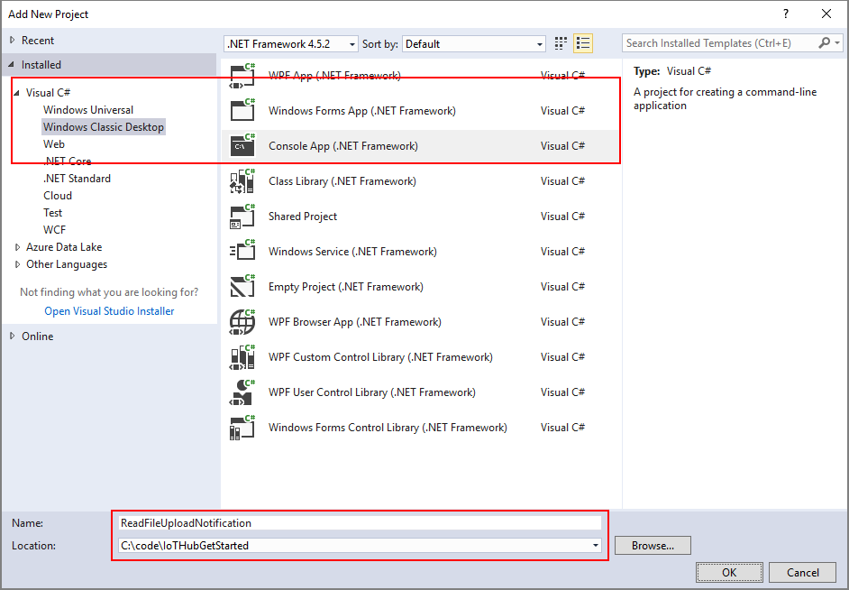

# Upload files from your device to the cloud with IoT Hub using .NET

[!INCLUDE [iot-hub-file-upload-language-selector](../../includes/iot-hub-file-upload-language-selector.md)]

This tutorial builds on the code in the [Send Cloud-to-Device messages with IoT Hub](iot-hub-csharp-csharp-c2d.md) tutorial to show you how to use the file upload capabilities of IoT Hub. It shows you how to:

- Securely provide a device with an Azure blob URI for uploading a file.

- Use the IoT Hub file upload notifications to trigger processing the file in your app back end.

The [Send telemetry from a device to an IoT hub](quickstart-send-telemetry-dotnet.md) and [Send Cloud-to-Device messages with IoT Hub](iot-hub-csharp-csharp-c2d.md) articles show the basic device-to-cloud and cloud-to-device messaging functionality of IoT Hub. The [Configure Message Routing with IoT Hub](tutorial-routing.md) tutorial describes a way to reliably store device-to-cloud messages in Azure blob storage. However, in some scenarios you cannot easily map the data your devices send into the relatively small device-to-cloud messages that IoT Hub accepts. For example:

* Large files that contain images
* Videos
* Vibration data sampled at high frequency
* Some form of preprocessed data

These files are typically batch processed in the cloud using tools such as [Azure Data Factory](../data-factory/introduction.md) or the [Hadoop](../hdinsight/index.yml) stack. When you need to upload files from a device, you can still use the security and reliability of IoT Hub.

At the end of this tutorial you run two .NET console apps:

* **SimulatedDevice**, a modified version of the app created in the [Send Cloud-to-Device messages with IoT Hub](iot-hub-csharp-csharp-c2d.md) tutorial. This app uploads a file to storage using a SAS URI provided by your IoT hub.

* **ReadFileUploadNotification**, which receives file upload notifications from your IoT hub.

> [!NOTE]
> IoT Hub supports many device platforms and languages (including C, Java, and Javascript) through Azure IoT device SDKs. Refer to the [Azure IoT Developer Center](http://azure.microsoft.com/develop/iot) for step-by-step instructions on how to connect your device to Azure IoT Hub.

To complete this tutorial, you need the following:

* Visual Studio 2017
* An active Azure account. (If you don't have an account, you can create a [free account](http://azure.microsoft.com/pricing/free-trial/) in just a couple of minutes.)

[!INCLUDE [iot-hub-associate-storage](../../includes/iot-hub-associate-storage.md)]

## Upload a file from a device app

In this section, you modify the device app you created in [Send Cloud-to-Device messages with IoT Hub](iot-hub-csharp-csharp-c2d.md) to receive cloud-to-device messages from the IoT hub.

1. In Visual Studio, right-click the **SimulatedDevice** project, click **Add**, and then click **Existing Item**. Navigate to an image file and include it in your project. This tutorial assumes the image is named `image.jpg`.

1. Right-click on the image, and then click **Properties**. Make sure that **Copy to Output Directory** is set to **Copy always**.

    

1. In the **Program.cs** file, add the following statements at the top of the file:

    ```csharp
    using System.IO;
    ```

1. Add the following method to the **Program** class:

    ```csharp
    private static async void SendToBlobAsync()
    {
        string fileName = "image.jpg";
        Console.WriteLine("Uploading file: {0}", fileName);
        var watch = System.Diagnostics.Stopwatch.StartNew();

        using (var sourceData = new FileStream(@"image.jpg", FileMode.Open))
        {
            await deviceClient.UploadToBlobAsync(fileName, sourceData);
        }

        watch.Stop();
        Console.WriteLine("Time to upload file: {0}ms\n", watch.ElapsedMilliseconds);
    }
    ```

    The `UploadToBlobAsync` method takes in the file name and stream source of the file to be uploaded and handles the upload to storage. The console app displays the time it takes to upload the file.

1. Add the following method in the **Main** method, right before the `Console.ReadLine()` line:

    ```csharp
    SendToBlobAsync();
    ```

> [!NOTE]
> For simplicity's sake, this tutorial does not implement any retry policy. In production code, you should implement retry policies (such as exponential backoff), as suggested in the article, [Transient Fault Handling](/azure/architecture/best-practices/transient-faults).

## Receive a file upload notification

In this section, you write a .NET console app that receives file upload notification messages from IoT Hub.

1. In the current Visual Studio solution, create a Visual C# Windows project by using the **Console Application** project template. Name the project **ReadFileUploadNotification**.

    

2. In Solution Explorer, right-click the **ReadFileUploadNotification** project, and then click **Manage NuGet Packages...**.

3. In the **NuGet Package Manager** window, search for **Microsoft.Azure.Devices**, click **Install**, and accept the terms of use.

    This action downloads, installs, and adds a reference to the [Azure IoT service SDK NuGet package](https://www.nuget.org/packages/Microsoft.Azure.Devices/) in the **ReadFileUploadNotification** project.

4. In the **Program.cs** file, add the following statements at the top of the file:

    ```csharp
    using Microsoft.Azure.Devices;
    ```

5. Add the following fields to the **Program** class. Substitute the placeholder value with the IoT hub connection string from [Send telemetry from a device to an IoT hub](quickstart-send-telemetry-dotnet.md):

    ```csharp
    static ServiceClient serviceClient;
    static string connectionString = "{iot hub connection string}";
    ```

6. Add the following method to the **Program** class:

    ```csharp
    private async static void ReceiveFileUploadNotificationAsync()
    {
        var notificationReceiver = serviceClient.GetFileNotificationReceiver();

        Console.WriteLine("\nReceiving file upload notification from service");
        while (true)
        {
            var fileUploadNotification = await notificationReceiver.ReceiveAsync();
            if (fileUploadNotification == null) continue;

            Console.ForegroundColor = ConsoleColor.Yellow;
            Console.WriteLine("Received file upload notification: {0}", 
              string.Join(", ", fileUploadNotification.BlobName));
            Console.ResetColor();

            await notificationReceiver.CompleteAsync(fileUploadNotification);
        }
    }   
    ```

    Note this receive pattern is the same one used to receive cloud-to-device messages from the device app.

7. Finally, add the following lines to the **Main** method:

    ```csharp
    Console.WriteLine("Receive file upload notifications\n");
    serviceClient = ServiceClient.CreateFromConnectionString(connectionString);
    ReceiveFileUploadNotificationAsync();
    Console.WriteLine("Press Enter to exit\n");
    Console.ReadLine();
    ```

## Run the applications

Now you are ready to run the applications.

1. In Visual Studio, right-click your solution, and select **Set StartUp projects**. Select **Multiple startup projects**, then select the **Start** action for **ReadFileUploadNotification** and **SimulatedDevice**.

2. Press **F5**. Both applications should start. You should see the upload completed in one console app and the upload notification message received by the other console app. You can use the [Azure portal](https://portal.azure.com/) or Visual Studio Server Explorer to check for the presence of the uploaded file in your Azure Storage account.

    

## Next steps

In this tutorial, you learned how to use the file upload capabilities of IoT Hub to simplify file uploads from devices. You can continue to explore IoT hub features and scenarios with the following articles:

* [Create an IoT hub programmatically](iot-hub-rm-template-powershell.md)
* [Introduction to C SDK](iot-hub-device-sdk-c-intro.md)
* [Azure IoT SDKs](iot-hub-devguide-sdks.md)

To further explore the capabilities of IoT Hub, see:

* [Deploying AI to edge devices with Azure IoT Edge](../iot-edge/tutorial-simulate-device-linux.md)

