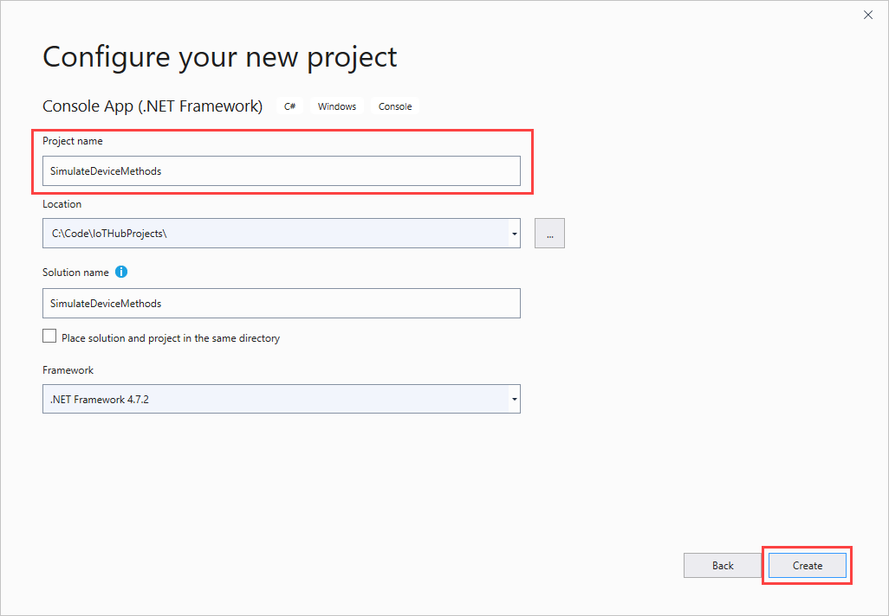
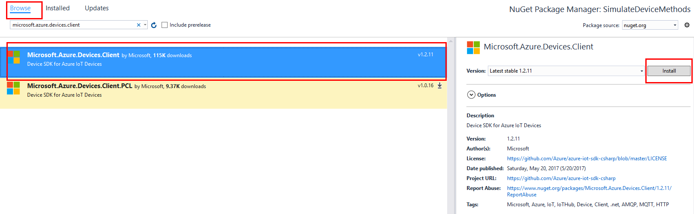
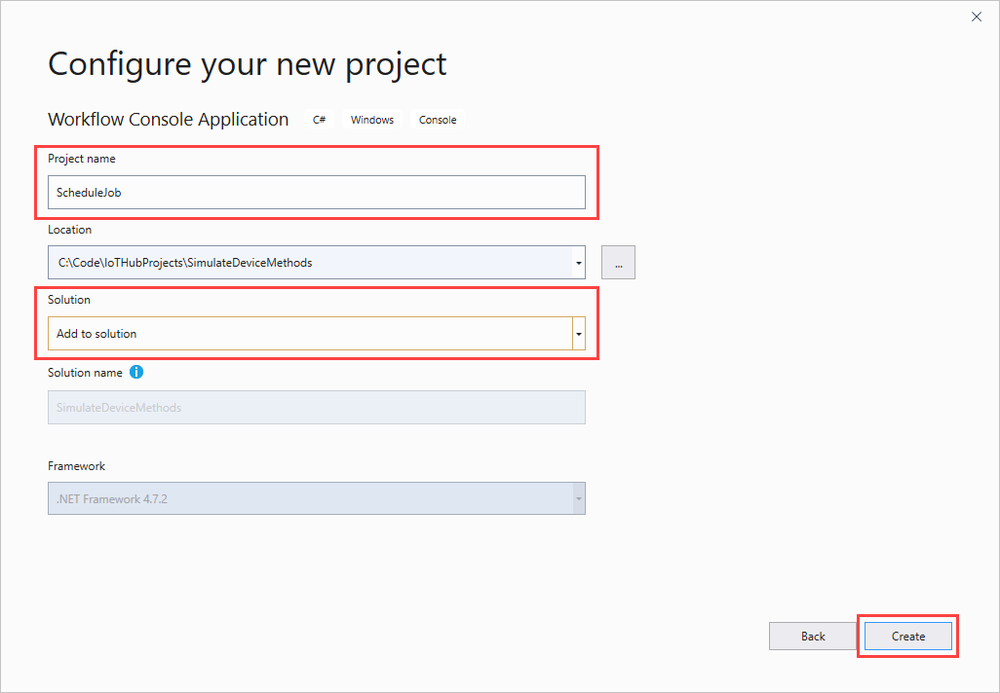
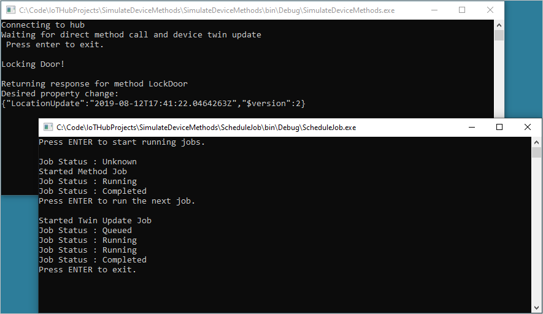

# Schedule and broadcast jobs (.NET)

[!INCLUDE [iot-hub-selector-schedule-jobs](../../includes/iot-hub-selector-schedule-jobs.md)]

Use Azure IoT Hub to schedule and track jobs that update millions of devices. Use jobs to:

* Update desired properties

* Update tags

* Invoke direct methods

A job wraps one of these actions and tracks the execution against a set of devices that is defined by a device twin query. For example, a back-end app can use a job to invoke a direct method on 10,000 devices that reboots the devices. You specify the set of devices with a device twin query and schedule the job to run at a future time. The job tracks progress as each of the devices receive and execute the reboot direct method.

To learn more about each of these capabilities, see:

* Device twin and properties: [Get started with device twins](iot-hub-csharp-csharp-twin-getstarted.md) and [Tutorial: How to use device twin properties](tutorial-device-twins.md)

* Direct methods: [IoT Hub developer guide - direct methods](iot-hub-devguide-direct-methods.md) and [Tutorial: Use direct methods](quickstart-control-device-dotnet.md)

[!INCLUDE [iot-hub-basic](../../includes/iot-hub-basic-whole.md)]

This tutorial shows you how to:

* Create a device app that implements a direct method called **LockDoor**, which can be called by the back-end app.

* Create a back-end app that creates a job to call the **LockDoor** direct method on multiple devices. Another job sends desired property updates to multiple devices.

At the end of this tutorial, you have two .NET (C#) console apps:

* **SimulateDeviceMethods**. This app connects to your IoT hub and implements the **LockDoor** direct method.

* **ScheduleJob**. This app uses jobs to call the **LockDoor** direct method and update the device twin desired properties on multiple devices.

## Prerequisites

* Visual Studio.

* An active Azure account. If you don't have an account, you can create a [free account](https://azure.microsoft.com/pricing/free-trial/) in just a couple of minutes.

* Make sure that port 8883 is open in your firewall. The device sample in this article uses MQTT protocol, which communicates over port 8883. This port may be blocked in some corporate and educational network environments. For more information and ways to work around this issue, see [Connecting to IoT Hub (MQTT)](iot-hub-mqtt-support.md#connecting-to-iot-hub).

## Create an IoT hub

[!INCLUDE [iot-hub-include-create-hub](../../includes/iot-hub-include-create-hub.md)]

## Register a new device in the IoT hub

[!INCLUDE [iot-hub-include-create-device](../../includes/iot-hub-include-create-device.md)]

## Create a simulated device app

In this section, you create a .NET console app that responds to a direct method called by the solution back end.

1. In Visual Studio, select **Create a new project**, and then choose the **Console App (.NET Framework)** project template. Select **Next** to continue.

1. In **Configure your new project**, name the project *SimulateDeviceMethods*, and then select **Create**.

    

1. In Solution Explorer, right-click the **SimulateDeviceMethods** project, and then select **Manage NuGet Packages**.

1. In **NuGet Package Manager**, select **Browse** and search for and choose **Microsoft.Azure.Devices.Client**. Select **Install**.

    

    This step downloads, installs, and adds a reference to the [Azure IoT device SDK](https://www.nuget.org/packages/Microsoft.Azure.Devices.Client/) NuGet package and its dependencies.

1. Add the following `using` statements at the top of the **Program.cs** file:

    ```csharp
    using Microsoft.Azure.Devices.Client;
    using Microsoft.Azure.Devices.Shared;
    using Newtonsoft.Json;
    ```

1. Add the following fields to the **Program** class. Replace the placeholder value with the device connection string that you noted in the previous section:

    ```csharp
    static string DeviceConnectionString = "<yourDeviceConnectionString>";
    static DeviceClient Client = null;
    ```

1. Add the following code to implement the direct method on the device:

    ```csharp
    static Task<MethodResponse> LockDoor(MethodRequest methodRequest, object userContext)
    {
        Console.WriteLine();
        Console.WriteLine("Locking Door!");
        Console.WriteLine("\nReturning response for method {0}", methodRequest.Name);

        string result = "'Door was locked.'";
        return Task.FromResult(new MethodResponse(Encoding.UTF8.GetBytes(result), 200));
    }
    ```

1. Add the following method to implement the device twins listener on the device:

    ```csharp
    private static async Task OnDesiredPropertyChanged(TwinCollection desiredProperties, 
      object userContext)
    {
        Console.WriteLine("Desired property change:");
        Console.WriteLine(JsonConvert.SerializeObject(desiredProperties));
    }
    ```

1. Finally, add the following code to the **Main** method to open the connection to your IoT hub and initialize the method listener:

    ```csharp
    try
    {
        Console.WriteLine("Connecting to hub");
        Client = DeviceClient.CreateFromConnectionString(DeviceConnectionString, 
          TransportType.Mqtt);

        Client.SetMethodHandlerAsync("LockDoor", LockDoor, null);
        Client.SetDesiredPropertyUpdateCallbackAsync(OnDesiredPropertyChanged, null);

        Console.WriteLine("Waiting for direct method call and device twin update\n Press enter to exit.");
        Console.ReadLine();

        Console.WriteLine("Exiting...");

        Client.SetMethodHandlerAsync("LockDoor", null, null);
        Client.CloseAsync().Wait();
    }
    catch (Exception ex)
    {
        Console.WriteLine();
        Console.WriteLine("Error in sample: {0}", ex.Message);
    }
    ```

1. Save your work and build your solution.

> [!NOTE]
> To keep things simple, this tutorial does not implement any retry policies. In production code, you should implement retry policies (such as connection retry), as suggested in [Transient fault handling](/azure/architecture/best-practices/transient-faults).
>

## Get the IoT hub connection string

[!INCLUDE [iot-hub-howto-schedule-jobs-shared-access-policy-text](../../includes/iot-hub-howto-schedule-jobs-shared-access-policy-text.md)]

[!INCLUDE [iot-hub-include-find-registryrw-connection-string](../../includes/iot-hub-include-find-registryrw-connection-string.md)]

## Schedule jobs for calling a direct method and sending device twin updates

In this section, you create a .NET console app (using C#) that uses jobs to call the **LockDoor** direct method and send desired property updates to multiple devices.

1. In Visual Studio, select **File** > **New** > **Project**. In **Create a new project**, choose **Console App (.NET Framework)**, and then select **Next**.

1. In **Configure your new project**, name the project *ScheduleJob*. For **Solution**, choose **Add to solution**, and then select **Create**.

    

1. In Solution Explorer, right-click the **ScheduleJob** project, and then select **Manage NuGet Packages**.

1. In the **NuGet Package Manager**, select **Browse**, search for and choose **Microsoft.Azure.Devices**, then select **Install**.

   This step downloads, installs, and adds a reference to the [Azure IoT service SDK](https://www.nuget.org/packages/Microsoft.Azure.Devices/) NuGet package and its dependencies.

1. Add the following `using` statements at the top of the **Program.cs** file:

    ```csharp
    using Microsoft.Azure.Devices;
    using Microsoft.Azure.Devices.Shared;
    ```

1. Add the following `using` statement if not already present in the default statements.

    ```csharp
    using System.Threading;
    using System.Threading.Tasks;
    ```

1. Add the following fields to the **Program** class. Replace the placeholders with the IoT Hub connection string that you copied previously in [Get the IoT hub connection string](#get-the-iot-hub-connection-string) and the name of your device.

    ```csharp
    static JobClient jobClient;
    static string connString = "<yourIotHubConnectionString>";
    static string deviceId = "<yourDeviceId>";
    ```

1. Add the following method to the **Program** class:

    ```csharp
    public static async Task MonitorJob(string jobId)
    {
        JobResponse result;
        do
        {
            result = await jobClient.GetJobAsync(jobId);
            Console.WriteLine("Job Status : " + result.Status.ToString());
            Thread.Sleep(2000);
        } while ((result.Status != JobStatus.Completed) && 
          (result.Status != JobStatus.Failed));
    }
    ```

1. Add the following method to the **Program** class:

    ```csharp
    public static async Task StartMethodJob(string jobId)
    {
        CloudToDeviceMethod directMethod = 
          new CloudToDeviceMethod("LockDoor", TimeSpan.FromSeconds(5), 
          TimeSpan.FromSeconds(5));

        JobResponse result = await jobClient.ScheduleDeviceMethodAsync(jobId,
            $"DeviceId IN ['{deviceId}']",
            directMethod,
            DateTime.UtcNow,
            (long)TimeSpan.FromMinutes(2).TotalSeconds);

        Console.WriteLine("Started Method Job");
    }
    ```

1. Add another method to the **Program** class:

    ```csharp
    public static async Task StartTwinUpdateJob(string jobId)
    {
        Twin twin = new Twin(deviceId);
        twin.Tags = new TwinCollection();
        twin.Tags["Building"] = "43";
        twin.Tags["Floor"] = "3";
        twin.ETag = "*";

        twin.Properties.Desired["LocationUpdate"] = DateTime.UtcNow;

        JobResponse createJobResponse = jobClient.ScheduleTwinUpdateAsync(
            jobId,
            $"DeviceId IN ['{deviceId}']", 
            twin, 
            DateTime.UtcNow, 
            (long)TimeSpan.FromMinutes(2).TotalSeconds).Result;

        Console.WriteLine("Started Twin Update Job");
    }
    ```

    > [!NOTE]
    > For more information about query syntax, see [IoT Hub query language](https://docs.microsoft.com/azure/iot-hub/iot-hub-devguide-query-language).
    >

1. Finally, add the following lines to the **Main** method:

    ```csharp
    Console.WriteLine("Press ENTER to start running jobs.");
    Console.ReadLine();

    jobClient = JobClient.CreateFromConnectionString(connString);

    string methodJobId = Guid.NewGuid().ToString();

    StartMethodJob(methodJobId);
    MonitorJob(methodJobId).Wait();
    Console.WriteLine("Press ENTER to run the next job.");
    Console.ReadLine();

    string twinUpdateJobId = Guid.NewGuid().ToString();

    StartTwinUpdateJob(twinUpdateJobId);
    MonitorJob(twinUpdateJobId).Wait();
    Console.WriteLine("Press ENTER to exit.");
    Console.ReadLine();
    ```

1. Save your work and build your solution.

## Run the apps

You are now ready to run the apps.

1. In the Visual Studio Solution Explorer, right-click your solution, and then select **Set StartUp Projects**.

1. Select **Common Properties** > **Startup Project**, and then select **Multiple startup projects**.

1. Make sure `SimulateDeviceMethods` is at the top of the list followed by `ScheduleJob`. Set both their actions to **Start** and select **OK**.

1. Run the projects by clicking **Start** or go to the **Debug** menu and click **Start Debugging**.

   You see the output from both device and back-end apps.

    

## Next steps

In this tutorial, you used a job to schedule a direct method to a device and the update of the device twin's properties.

* To continue getting started with IoT Hub and device management patterns such as remote over the air firmware update, read [Tutorial: How to do a firmware update](tutorial-firmware-update.md).

* To learn about deploying AI to edge devices with Azure IoT Edge, see [Getting started with IoT Edge](../iot-edge/tutorial-simulate-device-linux.md).
