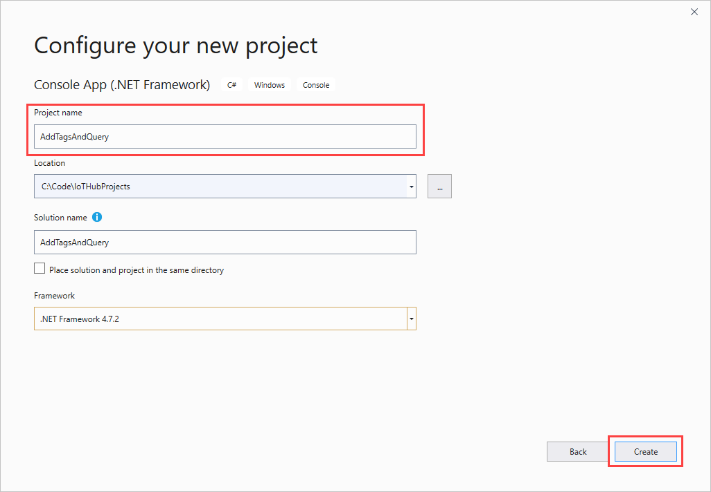
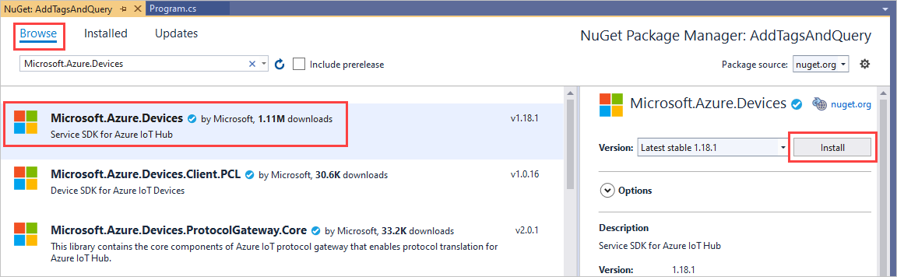

# Get started with device twins (.NET)

[!INCLUDE [iot-hub-selector-twin-get-started](../../includes/iot-hub-selector-twin-get-started.md)]

In this tutorial, you create these .NET console apps:

* **CreateDeviceIdentity**. This app creates a device identity and associated security key to connect your simulated device app.

* **AddTagsAndQuery**. This back-end app adds tags and queries device twins.

* **ReportConnectivity**. This device app simulates a device that connects to your IoT hub with the device identity created earlier, and reports its connectivity condition.

> [!NOTE]
> The article [Azure IoT SDKs](iot-hub-devguide-sdks.md) provides information about the Azure IoT SDKs that you can use to build both device and back-end apps.
>

## Prerequisites

* Visual Studio.

* An active Azure account. If you don't have an account, you can create a [free account](https://azure.microsoft.com/pricing/free-trial/) in just a couple of minutes.

* Make sure that port 8883 is open in your firewall. The device sample in this article uses MQTT protocol, which communicates over port 8883. This port may be blocked in some corporate and educational network environments. For more information and ways to work around this issue, see [Connecting to IoT Hub (MQTT)](iot-hub-mqtt-support.md#connecting-to-iot-hub).

## Create an IoT hub

[!INCLUDE [iot-hub-include-create-hub](../../includes/iot-hub-include-create-hub.md)]

## Register a new device in the IoT hub

[!INCLUDE [iot-hub-include-create-device](../../includes/iot-hub-include-create-device.md)]

## Get the IoT hub connection string

[!INCLUDE [iot-hub-howto-twin-shared-access-policy-text](../../includes/iot-hub-howto-twin-shared-access-policy-text.md)]

[!INCLUDE [iot-hub-include-find-custom-connection-string](../../includes/iot-hub-include-find-custom-connection-string.md)]

## Create the service app

In this section, you create a .NET console app, using C#, that adds location metadata to the device twin associated with **myDeviceId**. It then queries the device twins stored in the IoT hub selecting the devices located in the US, and then the ones that reported a cellular connection.

1. In Visual Studio, select **Create a new project**. In **Create new project**, select **Console App (.NET Framework)**, and then select **Next**.

1. In **Configure your new project**, name the project **AddTagsAndQuery**.

    

1. In Solution Explorer, right-click the **AddTagsAndQuery** project, and then select **Manage NuGet Packages**.

1. Select **Browse** and search for and select **Microsoft.Azure.Devices**. Select **Install**.

    

   This step downloads, installs, and adds a reference to the [Azure IoT service SDK](https://www.nuget.org/packages/Microsoft.Azure.Devices/) NuGet package and its dependencies.

1. Add the following `using` statements at the top of the **Program.cs** file:

    ```csharp  
    using Microsoft.Azure.Devices;
    ```

1. Add the following fields to the **Program** class. Replace `{iot hub connection string}` with the IoT Hub connection string that you copied in [Get the IoT hub connection string](#get-the-iot-hub-connection-string).

    ```csharp  
    static RegistryManager registryManager;
    static string connectionString = "{iot hub connection string}";
    ```

1. Add the following method to the **Program** class:

    ```csharp  
    public static async Task AddTagsAndQuery()
    {
        var twin = await registryManager.GetTwinAsync("myDeviceId");
        var patch =
            @"{
                tags: {
                    location: {
                        region: 'US',
                        plant: 'Redmond43'
                    }
                }
            }";
        await registryManager.UpdateTwinAsync(twin.DeviceId, patch, twin.ETag);

        var query = registryManager.CreateQuery(
          "SELECT * FROM devices WHERE tags.location.plant = 'Redmond43'", 100);
        var twinsInRedmond43 = await query.GetNextAsTwinAsync();
        Console.WriteLine("Devices in Redmond43: {0}", 
          string.Join(", ", twinsInRedmond43.Select(t => t.DeviceId)));

        query = registryManager.CreateQuery("SELECT * FROM devices WHERE tags.location.plant = 'Redmond43' AND properties.reported.connectivity.type = 'cellular'", 100);
        var twinsInRedmond43UsingCellular = await query.GetNextAsTwinAsync();
        Console.WriteLine("Devices in Redmond43 using cellular network: {0}", 
          string.Join(", ", twinsInRedmond43UsingCellular.Select(t => t.DeviceId)));
    }
    ```

    The **RegistryManager** class exposes all the methods required to interact with device twins from the service. The previous code first initializes the **registryManager** object, then retrieves the device twin for **myDeviceId**, and finally updates its tags with the desired location information.

    After updating, it executes two queries: the first selects only the device twins of devices located in the **Redmond43** plant, and the second refines the query to select only the devices that are also connected through cellular network.

    The previous code, when it creates the **query** object, specifies a maximum number of returned documents. The **query** object contains a **HasMoreResults** boolean property that you can use to invoke the **GetNextAsTwinAsync** methods multiple times to retrieve all results. A method called **GetNextAsJson** is available for results that are not device twins, for example, results of aggregation queries.

1. Finally, add the following lines to the **Main** method:

    ```csharp  
    registryManager = RegistryManager.CreateFromConnectionString(connectionString);
    AddTagsAndQuery().Wait();
    Console.WriteLine("Press Enter to exit.");
    Console.ReadLine();
    ```

1. Run this application by right-clicking on the **AddTagsAndQuery** project and selecting **Debug**, followed by **Start new instance**. You should see one device in the results for the query asking for all devices located in **Redmond43** and none for the query that restricts the results to devices that use a cellular network.

    

In the next section, you create a device app that reports the connectivity information and changes the result of the query in the previous section.

## Create the device app

In this section, you create a .NET console app that connects to your hub as **myDeviceId**, and then updates its reported properties to contain the information that it is connected using a cellular network.

1. In Visual Studio, select **File** > **New** > **Project**. In **Create new project**, choose **Console App (.NET Framework)**, and then select **Next**.

1. In **Configure your new project**, name the project **ReportConnectivity**. For **Solution**, choose **Add to solution**, and then select **Create**.

1. In Solution Explorer, right-click the **ReportConnectivity** project, and then select **Manage NuGet Packages**.

1. Select **Browse** and search for and choose **Microsoft.Azure.Devices.Client**. Select **Install**.

   This step downloads, installs, and adds a reference to the [Azure IoT device SDK](https://www.nuget.org/packages/Microsoft.Azure.Devices.Client/) NuGet package and its dependencies.

1. Add the following `using` statements at the top of the **Program.cs** file:

    ```csharp  
    using Microsoft.Azure.Devices.Client;
    using Microsoft.Azure.Devices.Shared;
    using Newtonsoft.Json;
    ```

1. Add the following fields to the **Program** class. Replace `{device connection string}` with the device connection string that you noted in [Register a new device in the IoT hub](#register-a-new-device-in-the-iot-hub).

    ```csharp  
    static string DeviceConnectionString = "HostName=<yourIotHubName>.azure-devices.net;DeviceId=<yourIotDeviceName>;SharedAccessKey=<yourIotDeviceAccessKey>";
    static DeviceClient Client = null;
    ```

1. Add the following method to the **Program** class:

    ```csharp
    public static async void InitClient()
    {
        try
        {
            Console.WriteLine("Connecting to hub");
            Client = DeviceClient.CreateFromConnectionString(DeviceConnectionString, 
              TransportType.Mqtt);
            Console.WriteLine("Retrieving twin");
            await Client.GetTwinAsync();
        }
        catch (Exception ex)
        {
            Console.WriteLine();
            Console.WriteLine("Error in sample: {0}", ex.Message);
        }
    }
    ```

    The **Client** object exposes all the methods you require to interact with device twins from the device. The code shown above initializes the **Client** object, and then retrieves the device twin for **myDeviceId**.

1. Add the following method to the **Program** class:

    ```csharp  
    public static async void ReportConnectivity()
    {
        try
        {
            Console.WriteLine("Sending connectivity data as reported property");

            TwinCollection reportedProperties, connectivity;
            reportedProperties = new TwinCollection();
            connectivity = new TwinCollection();
            connectivity["type"] = "cellular";
            reportedProperties["connectivity"] = connectivity;
            await Client.UpdateReportedPropertiesAsync(reportedProperties);
        }
        catch (Exception ex)
        {
            Console.WriteLine();
            Console.WriteLine("Error in sample: {0}", ex.Message);
        }
    }
    ```

   The code above updates the reported property of  **myDeviceId** with the connectivity information.

1. Finally, add the following lines to the **Main** method:

    ```csharp
    try
    {
        InitClient();
        ReportConnectivity();
    }
    catch (Exception ex)
    {
        Console.WriteLine();
        Console.WriteLine("Error in sample: {0}", ex.Message);
    }
    Console.WriteLine("Press Enter to exit.");
    Console.ReadLine();
    ```

1. In Solution Explorer, right-click on your solution, and select **Set StartUp Projects**.

1. In **Common Properties** > **Startup Project**, select **Multiple startup projects**. For **ReportConnectivity**, select **Start** as the **Action**. Select **OK** to save your changes.  

1. Run this app by right-clicking the **ReportConnectivity** project and selecting **Debug**, then **Start new instance**. You should see the app getting the twin information, and then sending connectivity as a ***reported property***.

    

   After the device reported its connectivity information, it should appear in both queries.

1. Right-click the **AddTagsAndQuery** project and select **Debug** > **Start new instance** to run the queries again. This time, **myDeviceId** should appear in both query results.

    

## Next steps

In this tutorial, you configured a new IoT hub in the Azure portal, and then created a device identity in the IoT hub's identity registry. You added device metadata as tags from a back-end app, and wrote a simulated device app to report device connectivity information in the device twin. You also learned how to query this information using the SQL-like IoT Hub query language.

You can learn more from the following resources:

* To learn how to send telemetry from devices, see the [Send telemetry from a device to an IoT hub](quickstart-send-telemetry-dotnet.md) tutorial.

* To learn how to configure devices using device twin's desired properties, see the [Use desired properties to configure devices](tutorial-device-twins.md) tutorial.

* To learn how to control devices interactively, such as turning on a fan from a user-controlled app, see the [Use direct methods](quickstart-control-device-dotnet.md) tutorial.
