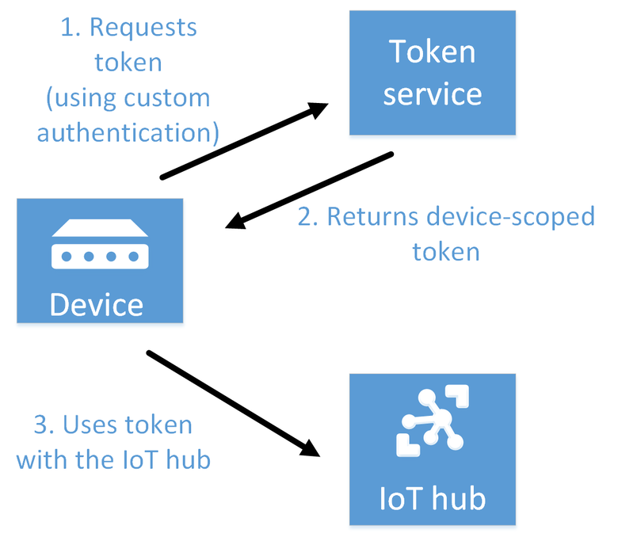

# Control access to IoT Hub using Shared Access Signatures

This article describes the options for securing your IoT hub. IoT Hub uses *permissions* to grant access to each IoT hub endpoint. Permissions limit the access to an IoT hub based on functionality.

This article introduces:

* The different permissions that you can grant to a client to access your IoT hub.
* The tokens IoT Hub uses to verify permissions.
* How to scope credentials to limit access to specific resources.
* Custom device authentication mechanisms that use existing device identity registries or authentication schemes.

[!INCLUDE [iot-hub-basic](../../includes/iot-hub-basic-partial.md)]

You must have appropriate permissions to access any of the IoT Hub endpoints. For example, a device must include a token containing security credentials along with every message it sends to IoT Hub. However, the signing keys, like the device symmetric keys, are never sent over the wire.

## Access control and permissions

Use shared access policies for IoT hub-level access, and use the individual device credentials to scope access to that device only.

### IoT hub-level shared access policies

Shared access policies can grant any combination of permissions. You can define policies in the [Azure portal](https://portal.azure.com), programmatically by using the [IoT Hub Resource REST APIs](/rest/api/iothub/iothubresource), or using the [az iot hub policy](/cli/azure/iot/hub/policy) CLI. A newly created IoT hub has the following default policies:
  
| Shared Access Policy | Permissions |
| -------------------- | ----------- |
| iothubowner | All permission |
| service | **ServiceConnect** permissions |
| device | **DeviceConnect** permissions |
| registryRead | **RegistryRead** permissions |
| registryReadWrite | **RegistryRead** and **RegistryWrite** permissions |

The following table lists the permissions you can use to control access to your IoT hub.

| Permission | Notes |
| --- | --- |
| **ServiceConnect** |Grants access to cloud service-facing communication and monitoring endpoints. <br/>Grants permission to receive device-to-cloud messages, send cloud-to-device messages, and retrieve the corresponding delivery acknowledgments. <br/>Grants permission to retrieve delivery acknowledgments for file uploads. <br/>Grants permission to access twins to update tags and desired properties, retrieve reported properties, and run queries. <br/>This permission is used by back-end cloud services. |
| **DeviceConnect** |Grants access to device-facing endpoints. <br/>Grants permission to send device-to-cloud messages and receive cloud-to-device messages. <br/>Grants permission to perform file upload from a device. <br/>Grants permission to receive device twin desired property notifications and update device twin reported properties. <br/>Grants permission to perform file uploads. <br/>This permission is used by devices. |
| **RegistryRead** |Grants read access to the identity registry. For more information, see [Identity registry](iot-hub-devguide-identity-registry.md). <br/>This permission is used by back-end cloud services. |
| **RegistryReadWrite** |Grants read and write access to the identity registry. For more information, see [Identity registry](iot-hub-devguide-identity-registry.md). <br/>This permission is used by back-end cloud services. |

### Per-device security credentials

Each IoT Hub contains an [identity registry](iot-hub-devguide-identity-registry.md) For each device in this identity registry, you can configure security credentials that grant **DeviceConnect** permissions scoped to the corresponding device endpoints.

## SAS tokens

IoT Hub uses Shared Access Signature (SAS) tokens to authenticate devices and services to avoid sending keys on the wire. SAS tokens are limited in time validity and scope. [Azure IoT SDKs](iot-hub-devguide-sdks.md) automatically generate tokens without requiring any special configuration. Some scenarios do require you to generate and use SAS tokens directly. Such scenarios include:

* The direct use of the MQTT, AMQP, or HTTPS surfaces.

* The implementation of the token service pattern, as explained in [Custom device authentication](iot-hub-dev-guide-sas.md#create-a-token-service-to-integrate-existing-devices).

You use SAS tokens to grant time-bounded access to devices and services to specific functionality in IoT Hub. To get authorization to connect to IoT Hub, devices and services must send SAS tokens signed with either a shared access or symmetric key. Symmetric keys are stored with a device identity in the identity registry.

### SAS token structure

A token signed with a shared access key grants access to all the functionality associated with the shared access policy permissions. A token signed with a device identity's symmetric key only grants the **DeviceConnect** permission for the associated device identity.

A SAS token has the following format:

`SharedAccessSignature sig={signature-string}&se={expiry}&skn={policyName}&sr={URL-encoded-resourceURI}`

Here are the expected values:

| Value | Description |
| --- | --- |
| {signature} |An HMAC-SHA256 signature string of the form: `{URL-encoded-resourceURI} + "\n" + expiry`. **Important**: The key is decoded from base64 and used as key to perform the HMAC-SHA256 computation. |
| {resourceURI} |URI prefix (by segment) of the endpoints that can be accessed with this token, starting with host name of the IoT hub (no protocol). SAS tokens granted to backend services are scoped to the IoT hub-level; for example, `myHub.azure-devices.net`. SAS tokens granted to devices must be scoped to an individual device; for example, `myHub.azure-devices.net/devices/device1`. |
| {expiry} |UTF8 strings for number of seconds since the epoch 00:00:00 UTC on 1 January 1970. |
| {URL-encoded-resourceURI} |Lower case URL-encoding of the lower case resource URI |
| {policyName} |The name of the shared access policy to which this token refers. Absent if the token refers to device-registry credentials. |

The URI prefix is computed by segment and not by character. For example `/a/b` is a prefix for `/a/b/c` but not for `/a/bc`.

### [Node.js](#tab/node)

The following code generates a SAS token using the resource URI, signing key, policy name, and expiration period. The next sections detail how to initialize the different inputs for the different token use cases.

```javascript
var generateSasToken = function(resourceUri, signingKey, policyName, expiresInMins) {
    resourceUri = encodeURIComponent(resourceUri);

    // Set expiration in seconds
    var expires = (Date.now() / 1000) + expiresInMins * 60;
    expires = Math.ceil(expires);
    var toSign = resourceUri + '\n' + expires;

    // Use crypto
    var hmac = crypto.createHmac('sha256', Buffer.from(signingKey, 'base64'));
    hmac.update(toSign);
    var base64UriEncoded = encodeURIComponent(hmac.digest('base64'));

    // Construct authorization string
    var token = "SharedAccessSignature sr=" + resourceUri + "&sig="
    + base64UriEncoded + "&se=" + expires;
    if (policyName) token += "&skn="+policyName;
    return token;
};
```

### [Python](#tab/python)

The following code generates a SAS token using the resource URI, signing key, policy name, and expiration period. The next sections detail how to initialize the different inputs for the different token use cases.

```python
from base64 import b64encode, b64decode
from hashlib import sha256
from time import time
from urllib import parse
from hmac import HMAC

def generate_sas_token(uri, key, policy_name, expiry=3600):
    ttl = time() + expiry
    sign_key = "%s\n%d" % ((parse.quote_plus(uri)), int(ttl))
    print(sign_key)
    signature = b64encode(HMAC(b64decode(key), sign_key.encode('utf-8'), sha256).digest())

    rawtoken = {
        'sr' :  uri,
        'sig': signature,
        'se' : str(int(ttl))
    }

    if policy_name is not None:
        rawtoken['skn'] = policy_name

    return 'SharedAccessSignature ' + parse.urlencode(rawtoken)
```

### [C#](#tab/csharp)

The following code generates a SAS token using the resource URI, signing key, policy name, and expiration period. The next sections detail how to initialize the different inputs for the different token use cases.

```csharp
using System;
using System.Globalization;
using System.Net;
using System.Net.Http;
using System.Security.Cryptography;
using System.Text;

public static string GenerateSasToken(string resourceUri, string key, string policyName, int expiryInSeconds = 3600)
{
    TimeSpan fromEpochStart = DateTime.UtcNow - new DateTime(1970, 1, 1);
    string expiry = Convert.ToString((int)fromEpochStart.TotalSeconds + expiryInSeconds);

    string stringToSign = WebUtility.UrlEncode(resourceUri) + "\n" + expiry;

    HMACSHA256 hmac = new HMACSHA256(Convert.FromBase64String(key));
    string signature = Convert.ToBase64String(hmac.ComputeHash(Encoding.UTF8.GetBytes(stringToSign)));

    string token = String.Format(CultureInfo.InvariantCulture, "SharedAccessSignature sr={0}&sig={1}&se={2}", WebUtility.UrlEncode(resourceUri), WebUtility.UrlEncode(signature), expiry);

    if (!String.IsNullOrEmpty(policyName))
    {
        token += "&skn=" + policyName;
    }

    return token;
}
```

### [Java](#tab/java)

The following code generates a SAS token using the resource URI and signing key. The expiration period is set to one hour from the current time. The next sections detail how to initialize the different inputs for the different token use cases.

```java
    public static String generateSasToken(String resourceUri, String key) throws Exception {
        // Token will expire in one hour
        var expiry = Instant.now().getEpochSecond() + 3600;

        String stringToSign = URLEncoder.encode(resourceUri, StandardCharsets.UTF_8) + "\n" + expiry;
        byte[] decodedKey = Base64.getDecoder().decode(key);

        Mac sha256HMAC = Mac.getInstance("HmacSHA256");
        SecretKeySpec secretKey = new SecretKeySpec(decodedKey, "HmacSHA256");
        sha256HMAC.init(secretKey);
        Base64.Encoder encoder = Base64.getEncoder();

        String signature = new String(encoder.encode(
            sha256HMAC.doFinal(stringToSign.getBytes(StandardCharsets.UTF_8))), StandardCharsets.UTF_8);

        String token = "SharedAccessSignature sr=" + URLEncoder.encode(resourceUri, StandardCharsets.UTF_8)
                + "&sig=" + URLEncoder.encode(signature, StandardCharsets.UTF_8.name()) + "&se=" + expiry;
            
        return token;
    }
```
---

### Protocol specifics

Each supported protocol, such as MQTT, AMQP, and HTTPS, transports tokens in different ways.

When using MQTT, the CONNECT packet has the deviceId as the ClientId, `{iothubhostname}/{deviceId}` in the Username field, and a SAS token in the Password field. `{iothubhostname}` should be the full CName of the IoT hub (for example, contoso.azure-devices.net).

When using [AMQP](https://www.amqp.org/), IoT Hub supports [SASL PLAIN](https://tools.ietf.org/html/rfc4616) and [AMQP Claims-Based-Security](https://www.oasis-open.org/committees/download.php/50506/amqp-cbs-v1%200-wd02%202013-08-12.doc).

If you use AMQP claims-based-security, the standard specifies how to transmit these tokens.

For SASL PLAIN, the **username** can be:

* `{policyName}@sas.root.{iothubName}` if using IoT hub-level tokens.
* `{deviceId}@sas.{iothubname}` if using device-scoped tokens.

In both cases, the password field contains the token, as described in [IoT Hub SAS tokens](iot-hub-dev-guide-sas.md#sas-tokens).

HTTPS implements authentication by including a valid token in the **Authorization** request header.

For example, Username (DeviceId is case-sensitive):
`iothubname.azure-devices.net/DeviceId`

Password (You can generate a SAS token with the CLI extension command [az iot hub generate-sas-token](/cli/azure/iot/hub#az-iot-hub-generate-sas-token), or the [Azure IoT Tools for Visual Studio Code](https://marketplace.visualstudio.com/items?itemName=vsciot-vscode.azure-iot-toolkit)):

`SharedAccessSignature sr=iothubname.azure-devices.net%2fdevices%2fDeviceId&sig=kPszxZZZZZZZZZZZZZZZZZAhLT%2bV7o%3d&se=1487709501`

> [!NOTE]
> The [Azure IoT SDKs](iot-hub-devguide-sdks.md) automatically generate tokens when connecting to the service. In some cases, the Azure IoT SDKs do not support all the protocols or all the authentication methods.

### Special considerations for SASL PLAIN

When using SASL PLAIN with AMQP, a client connecting to an IoT hub can use a single token for each TCP connection. When the token expires, the TCP connection disconnects from the service and triggers a reconnection. This behavior, while not problematic for a back-end app, is damaging for a device app for the following reasons:

* Gateways usually connect on behalf of many devices. When using SASL PLAIN, they have to create a distinct TCP connection for each device connecting to an IoT hub. This scenario considerably increases the consumption of power and networking resources, and increases the latency of each device connection.

* Resource-constrained devices are adversely affected by the increased use of resources to reconnect after each token expiration.

## Use SAS tokens from services

Services can generate SAS tokens by using a shared access policy which defines the appropriate permissions as explained previously in [Access control and permissions](#access-control-and-permissions).

As an example, a service using the pre-created shared access policy called **registryRead** would create a token with the following parameters:

* resource URI: `{IoT hub name}.azure-devices.net`,
* signing key: one of the keys of the `registryRead` policy,
* policy name: `registryRead`,
* any expiration time.

```javascript
var endpoint = "myhub.azure-devices.net";
var policyName = 'registryRead';
var policyKey = '...';

var token = generateSasToken(endpoint, policyKey, policyName, 60);
```

The result, which would grant access to read all device identities, would be:

`SharedAccessSignature sr=myhub.azure-devices.net&sig=JdyscqTpXdEJs49elIUCcohw2DlFDR3zfH5KqGJo4r4%3D&se=1456973447&skn=registryRead`

 For services, SAS tokens only grant permissions at the IoT Hub-level. That is, a service authenticating with a token based on the **service** policy, will be able to perform all the operations granted by the **ServiceConnect** permission. These operations include receiving device-to-cloud messages, sending cloud-to-device messages, and so on. If you want to grant more granular access to your services, for example, limiting a service to only sending cloud-to-device messages, you can use Azure Active Directory. To learn more, see [Control access to IoT Hub with Azure AD](iot-hub-dev-guide-azure-ad-rbac.md).

## Authenticating a device to IoT Hub

### Supported X.509 certificates

You can use any X.509 certificate to authenticate a device with IoT Hub by uploading either a certificate thumbprint or a certificate authority (CA) to Azure IoT Hub. To learn more, see [Device Authentication using X.509 CA Certificates](iot-hub-x509ca-overview.md). For information about how to upload and verify a certificate authority with your IoT hub, see [Set up X.509 security in your Azure IoT hub](./tutorial-x509-prove-possession.md).

### Enforcing X.509 authentication

For additional security, an IoT hub can be configured to not allow SAS authentication for devices and modules, leaving X.509 as the only accepted authentication option. Currently, this feature isn't available in Azure portal. To configure, set `disableDeviceSAS` and `disableModuleSAS` to `true` on the IoT Hub resource properties:

```azurecli-interactive
az resource update -n <iothubName> -g <resourceGroupName> --resource-type Microsoft.Devices/IotHubs --set properties.disableDeviceSAS=true properties.disableModuleSAS=true
```

### Use SAS tokens as a device

There are two ways to obtain **DeviceConnect** permissions with IoT Hub with SAS tokens: use a [symmetric device key from the identity registry](#use-a-symmetric-key-in-the-identity-registry), or use a [shared access key](#use-a-shared-access-policy-to-access-on-behalf-of-a-device).

Remember that all functionality accessible from devices is exposed by design on endpoints with prefix `/devices/{deviceId}`.

The device-facing endpoints are (irrespective of the protocol):

| Endpoint | Functionality |
| --- | --- |
| `{iot hub host name}/devices/{deviceId}/messages/events` |Send device-to-cloud messages. |
| `{iot hub host name}/devices/{deviceId}/messages/devicebound` |Receive cloud-to-device messages. |

#### Use a symmetric key in the identity registry

When using a device identity's symmetric key to generate a token, the policyName (`skn`) element of the token is omitted.

For example, a token created to access all device functionality should have the following parameters:

* resource URI: `{IoT hub name}.azure-devices.net/devices/{device id}`,
* signing key: any symmetric key for the `{device id}` identity,
* no policy name,
* any expiration time.

An example using the preceding Node.js function would be:

```javascript
var endpoint ="myhub.azure-devices.net/devices/device1";
var deviceKey ="...";

var token = generateSasToken(endpoint, deviceKey, null, 60);
```

The result, which grants access to all functionality for device1, would be:

`SharedAccessSignature sr=myhub.azure-devices.net%2fdevices%2fdevice1&sig=13y8ejUk2z7PLmvtwR5RqlGBOVwiq7rQR3WZ5xZX3N4%3D&se=1456971697`

> [!NOTE]
> It's possible to generate a SAS token with the CLI extension command [az iot hub generate-sas-token](/cli/azure/iot/hub#az-iot-hub-generate-sas-token), or the [Azure IoT Tools for Visual Studio Code](https://marketplace.visualstudio.com/items?itemName=vsciot-vscode.azure-iot-toolkit).

#### Use a shared access policy to access on behalf of a device

When you create a token from a shared access policy, set the `skn` field to the name of the policy. This policy must grant the **DeviceConnect** permission.

The two main scenarios for using shared access policies to access device functionality are:

* [cloud protocol gateways](iot-hub-devguide-endpoints.md),
* [token services](iot-hub-dev-guide-sas.md#create-a-token-service-to-integrate-existing-devices) used to implement custom authentication schemes.

Since the shared access policy can potentially grant access to connect as any device, it is important to use the correct resource URI when creating SAS tokens. This setting is especially important for token services, which have to scope the token to a specific device using the resource URI. This point is less relevant for protocol gateways as they are already mediating traffic for all devices.

As an example, a token service using the pre-created shared access policy called **device** would create a token with the following parameters:

* resource URI: `{IoT hub name}.azure-devices.net/devices/{device id}`,
* signing key: one of the keys of the `device` policy,
* policy name: `device`,
* any expiration time.

An example using the preceding Node.js function would be:

```javascript
var endpoint ="myhub.azure-devices.net/devices/device1";
var policyName = 'device';
var policyKey = '...';

var token = generateSasToken(endpoint, policyKey, policyName, 60);
```

The result, which grants access to all functionality for device1, would be:

`SharedAccessSignature sr=myhub.azure-devices.net%2fdevices%2fdevice1&sig=13y8ejUk2z7PLmvtwR5RqlGBOVwiq7rQR3WZ5xZX3N4%3D&se=1456971697&skn=device`

A protocol gateway could use the same token for all devices simply setting the resource URI to `myhub.azure-devices.net/devices`.

## Create a token service to integrate existing devices

You can use the IoT Hub [identity registry](iot-hub-devguide-identity-registry.md) to configure per-device/module security credentials and access control using [tokens](#sas-tokens). If an IoT solution already has a custom identity registry and/or authentication scheme, consider creating a *token service* to integrate this infrastructure with IoT Hub. In this way, you can use other IoT features in your solution.

A token service is a custom cloud service. It uses an IoT Hub *shared access policy* with the **DeviceConnect** permission to create *device-scoped* or *module-scoped* tokens. These tokens enable a device and module to connect to your IoT hub.



Here are the main steps of the token service pattern:

1. Create an IoT Hub shared access policy with the **DeviceConnect** permission for your IoT hub. You can create this policy in the [Azure portal](https://portal.azure.com) or programmatically. The token service uses this policy to sign the tokens it creates.

2. When a device/module needs to access your IoT hub, it requests a signed token from your token service. The device can authenticate with your custom identity registry/authentication scheme to determine the device/module identity that the token service uses to create the token.

3. The token service returns a token. The token is created by using `/devices/{deviceId}` or `/devices/{deviceId}/modules/{moduleId}` as `resourceURI`, with `deviceId` as the device being authenticated or `moduleId` as the module being authenticated. The token service uses the shared access policy to construct the token.

4. The device/module uses the token directly with the IoT hub.

> [!NOTE]
> You can use the .NET class [SharedAccessSignatureBuilder](/dotnet/api/microsoft.azure.devices.common.security.sharedaccesssignaturebuilder) or the Java class [IotHubServiceSasToken](/java/api/com.microsoft.azure.sdk.iot.service.auth.iothubservicesastoken) to create a token in your token service.

The token service can set the token expiration as desired. When the token expires, the IoT hub severs the device/module connection. Then, the device/module must request a new token from the token service. A short expiry time increases the load on both the device/module and the token service.

For a device/module to connect to your hub, you must still add it to the IoT Hub identity registry — even though it is using a token and not a key to connect. Therefore, you can continue to use per-device/per-module access control by enabling or disabling device/module identities in the [identity registry](iot-hub-devguide-identity-registry.md). This approach mitigates the risks of using tokens with long expiry times.

### Comparison with a custom gateway

The token service pattern is the recommended way to implement a custom identity registry/authentication scheme with IoT Hub. This pattern is recommended because IoT Hub continues to handle most of the solution traffic. However, if the custom authentication scheme is so intertwined with the protocol, you may require a *custom gateway* to process all the traffic. An example of such a scenario is using [Transport Layer Security (TLS) and pre-shared keys (PSKs)](https://tools.ietf.org/html/rfc4279). For more information, see [How an IoT Edge device can be used as a gateway](../iot-edge/iot-edge-as-gateway.md).

## Additional reference material

Other reference topics in the IoT Hub developer guide include:

* [IoT Hub endpoints](iot-hub-devguide-endpoints.md) describes the various endpoints that each IoT hub exposes for run-time and management operations.

* [Throttling and quotas](iot-hub-devguide-quotas-throttling.md) describes the quotas and throttling behaviors that apply to the IoT Hub service.

* [Azure IoT device and service SDKs](iot-hub-devguide-sdks.md) lists the various language SDKs you can use when you develop both device and service apps that interact with IoT Hub.

* [IoT Hub query language](iot-hub-devguide-query-language.md) describes the query language you can use to retrieve information from IoT Hub about your device twins and jobs.

* [IoT Hub MQTT support](iot-hub-mqtt-support.md) provides more information about IoT Hub support for the MQTT protocol.

* [RFC 5246 - The Transport Layer Security (TLS) Protocol Version 1.2](https://www.rfc-editor.org/rfc/rfc5246) provides more information about TLS authentication.

* For more information about authentication using certificate authority, see [Device Authentication using X.509 CA Certificates](iot-hub-x509ca-overview.md)

## Next steps

Now that you have learned how to control access IoT Hub, you may be interested in the following IoT Hub developer guide topics:

* [Use device twins to synchronize state and configurations](iot-hub-devguide-device-twins.md)
* [Invoke a direct method on a device](iot-hub-devguide-direct-methods.md)
* [Schedule jobs on multiple devices](iot-hub-devguide-jobs.md)

If you would like to try out some of the concepts described in this article, see the following IoT Hub tutorials:

* [Get started with Azure IoT Hub](../iot-develop/quickstart-send-telemetry-iot-hub.md?pivots=programming-language-nodejs)
* [How to send cloud-to-device messages with IoT Hub](c2d-messaging-dotnet.md)
* [How to process IoT Hub device-to-cloud messages](tutorial-routing.md)
