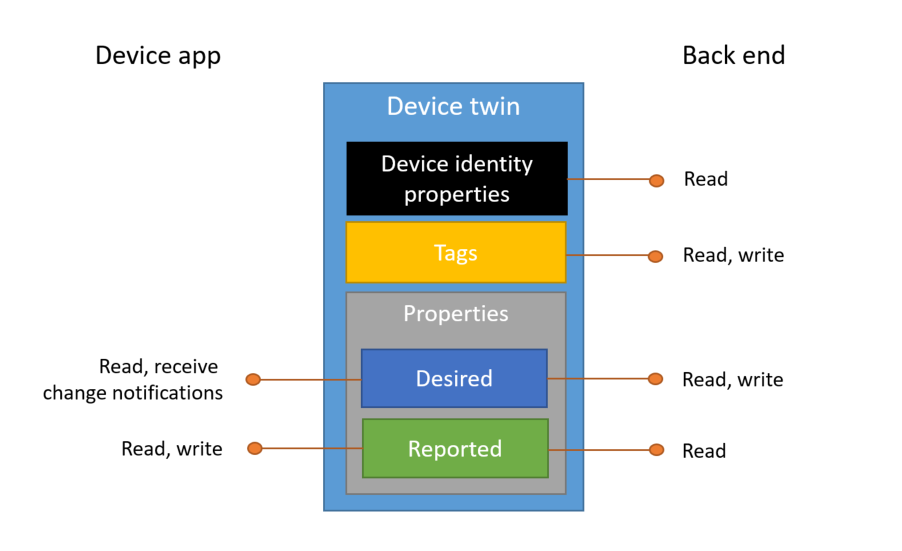

# Understand and use device twins in IoT Hub

*Device twins* are JSON documents that store device state information including metadata, configurations, and conditions. Azure IoT Hub maintains a device twin for each device that you connect to IoT Hub. 

[!INCLUDE [iot-hub-basic](../../includes/iot-hub-basic-whole.md)]

This article describes:

* The structure of the device twin: *tags*, *desired* and *reported properties*.
* The operations that device apps and back ends can perform on device twins.

Use device twins to:

* Store device-specific metadata in the cloud. For example, the deployment location of a vending machine.

* Report current state information such as available capabilities and conditions from your device app. For example, a device is connected to your IoT hub over cellular or WiFi.

* Synchronize the state of long-running workflows between device app and back-end app. For example, when the solution back end specifies the new firmware version to install, and the device app reports the various stages of the update process.

* Query your device metadata, configuration, or state.

Refer to [Device-to-cloud communication guidance](iot-hub-devguide-d2c-guidance.md) for guidance on using reported properties, device-to-cloud messages, or file upload.

Refer to [Cloud-to-device communication guidance](iot-hub-devguide-c2d-guidance.md) for guidance on using desired properties, direct methods, or cloud-to-device messages.

## Device twins

Device twins store device-related information that:

* Device and back ends can use to synchronize device conditions and configuration.

* The solution back end can use to query and target long-running operations.

The lifecycle of a device twin is linked to the corresponding [device identity](iot-hub-devguide-identity-registry.md). Device twins are implicitly created and deleted when a device identity is created or deleted in IoT Hub.

A device twin is a JSON document that includes:

* **Tags**. A section of the JSON document that the solution back end can read from and write to. Tags are not visible to device apps.

* **Desired properties**. Used along with reported properties to synchronize device configuration or conditions. The solution back end can set desired properties, and the device app can read them. The device app can also receive notifications of changes in the desired properties.

* **Reported properties**. Used along with desired properties to synchronize device configuration or conditions. The device app can set reported properties, and the solution back end can read and query them.

* **Device identity properties**. The root of the device twin JSON document contains the read-only properties from the corresponding device identity stored in the [identity registry](iot-hub-devguide-identity-registry.md). Properties `connectionStateUpdatedTime` and `generationId` will not be included.



The following example shows a device twin JSON document:

```json
{
    "deviceId": "devA",
    "etag": "AAAAAAAAAAc=", 
    "status": "enabled",
    "statusReason": "provisioned",
    "statusUpdateTime": "0001-01-01T00:00:00",
    "connectionState": "connected",
    "lastActivityTime": "2015-02-30T16:24:48.789Z",
    "cloudToDeviceMessageCount": 0, 
    "authenticationType": "sas",
    "x509Thumbprint": {     
        "primaryThumbprint": null, 
        "secondaryThumbprint": null 
    }, 
    "version": 2, 
    "tags": {
        "$etag": "123",
        "deploymentLocation": {
            "building": "43",
            "floor": "1"
        }
    },
    "properties": {
        "desired": {
            "telemetryConfig": {
                "sendFrequency": "5m"
            },
            "$metadata" : {...},
            "$version": 1
        },
        "reported": {
            "telemetryConfig": {
                "sendFrequency": "5m",
                "status": "success"
            },
            "batteryLevel": 55,
            "$metadata" : {...},
            "$version": 4
        }
    }
}
```

In the root object are the device identity properties, and container objects for `tags` and both `reported` and `desired` properties. The `properties` container contains some read-only elements (`$metadata`, `$etag`, and `$version`) described in the [Device twin metadata](iot-hub-devguide-device-twins.md#device-twin-metadata) and [Optimistic concurrency](iot-hub-devguide-device-twins.md#optimistic-concurrency) sections.

### Reported property example

In the previous example, the device twin contains a `batteryLevel` property that is reported by the device app. This property makes it possible to query and operate on devices based on the last reported battery level. Other examples include the device app reporting device capabilities or connectivity options.

> [!NOTE]
> Reported properties simplify scenarios where the solution back end is interested in the last known value of a property. Use [device-to-cloud messages](iot-hub-devguide-messages-d2c.md) if the solution back end needs to process device telemetry in the form of sequences of timestamped events, such as time series.

### Desired property example

In the previous example, the `telemetryConfig` device twin desired and reported properties are used by the solution back end and the device app to synchronize the telemetry configuration for this device. For example:

1. The solution back end sets the desired property with the desired configuration value. Here is the portion of the document with the desired property set:

   ```json
   "desired": {
       "telemetryConfig": {
           "sendFrequency": "5m"
       },
       ...
   },
   ```

2. The device app is notified of the change immediately if connected, or at the first reconnect. The device app then reports the updated configuration (or an error condition using the `status` property). Here is the portion of the reported properties:

   ```json
   "reported": {
       "telemetryConfig": {
           "sendFrequency": "5m",
           "status": "success"
       }
       ...
   }
   ```

3. The solution back end can track the results of the configuration operation across many devices by [querying](iot-hub-devguide-query-language.md) device twins.

> [!NOTE]
> The preceding snippets are examples, optimized for readability, of one way to encode a device configuration and its status. IoT Hub does not impose a specific schema for the device twin desired and reported properties in the device twins.
> 

You can use twins to synchronize long-running operations such as firmware updates. For more information on how to use properties to synchronize and track a long running operation across devices, see [Use desired properties to configure devices](tutorial-device-twins.md).

## Back-end operations

The solution back end operates on the device twin using the following atomic operations, exposed through HTTPS:

* **Retrieve device twin by ID**. This operation returns the device twin document, including tags and desired and reported system properties.

* **Partially update device twin**. This operation enables the solution back end to partially update the tags or desired properties in a device twin. The partial update is expressed as a JSON document that adds or updates any property. Properties set to `null` are removed. The following example creates a new desired property with value `{"newProperty": "newValue"}`, overwrites the existing value of `existingProperty` with `"otherNewValue"`, and removes `otherOldProperty`. No other changes are made to existing desired properties or tags:

   ```json
   {
       "properties": {
           "desired": {
               "newProperty": {
                   "nestedProperty": "newValue"
               },
               "existingProperty": "otherNewValue",
               "otherOldProperty": null
           }
       }
   }
   ```

* **Replace desired properties**. This operation enables the solution back end to completely overwrite all existing desired properties and substitute a new JSON document for `properties/desired`.

* **Replace tags**. This operation enables the solution back end to completely overwrite all existing tags and substitute a new JSON document for `tags`.

* **Receive twin notifications**. This operation allows the solution back end to be notified when the twin is modified. To do so, your IoT solution needs to create a route and to set the Data Source equal to *twinChangeEvents*. By default, no such routes pre-exist, so no twin notifications are sent. If the rate of change is too high, or for other reasons such as internal failures, the IoT Hub might send only one notification that contains all changes. Therefore, if your application needs reliable auditing and logging of all intermediate states, you should use device-to-cloud messages. The twin notification message includes properties and body.

  - Properties

    | Name | Value |
    | --- | --- |
    $content-type | application/json |
    $iothub-enqueuedtime |  Time when the notification was sent |
    $iothub-message-source | twinChangeEvents |
    $content-encoding | utf-8 |
    deviceId | ID of the device |
    hubName | Name of IoT Hub |
    operationTimestamp | [ISO8601](https://en.wikipedia.org/wiki/ISO_8601) timestamp of operation |
    iothub-message-schema | twinChangeNotification |
    opType | "replaceTwin" or "updateTwin" |

    Message system properties are prefixed with the `$` symbol.

  - Body
        
    This section includes all the twin changes in a JSON format. It uses the same format as a patch, with the difference that it can contain all twin sections: tags, properties.reported, properties.desired, and that it contains the "$metadata" elements. For example,

    ```json
    {
      "properties": {
          "desired": {
              "$metadata": {
                  "$lastUpdated": "2016-02-30T16:24:48.789Z"
              },
              "$version": 1
          },
          "reported": {
              "$metadata": {
                  "$lastUpdated": "2016-02-30T16:24:48.789Z"
              },
              "$version": 1
          }
      }
    }
    ```

All the preceding operations support [Optimistic concurrency](iot-hub-devguide-device-twins.md#optimistic-concurrency) and require the **ServiceConnect** permission, as defined in [Control access to IoT Hub](iot-hub-devguide-security.md).

In addition to these operations, the solution back end can:

* Query the device twins using the SQL-like [IoT Hub query language](iot-hub-devguide-query-language.md).

* Perform operations on large sets of device twins using [jobs](iot-hub-devguide-jobs.md).

## Device operations

The device app operates on the device twin using the following atomic operations:

* **Retrieve device twin**. This operation returns the device twin document (including desired and reported system properties) for the currently connected device. (Tags are not visible to device apps.)

* **Partially update reported properties**. This operation enables the partial update of the reported properties of the currently connected device. This operation uses the same JSON update format that the solution back end uses for a partial update of desired properties.

* **Observe desired properties**. The currently connected device can choose to be notified of updates to the desired properties when they happen. The device receives the same form of update (partial or full replacement) executed by the solution back end.

All the preceding operations require the **DeviceConnect** permission, as defined in [Control Access to IoT Hub](iot-hub-devguide-security.md).

The [Azure IoT device SDKs](iot-hub-devguide-sdks.md) make it easy to use the preceding operations from many languages and platforms. For more information on the details of IoT Hub primitives for desired properties synchronization, see [Device reconnection flow](iot-hub-devguide-device-twins.md#device-reconnection-flow).

## Tags and properties format

Tags, desired properties, and reported properties are JSON objects with the following restrictions:

* **Keys**: All keys in JSON objects are UTF-8 encoded, case-sensitive, and up-to 1 KB in length. Allowed characters exclude UNICODE control characters (segments C0 and C1), and `.`, `$`, and SP.

* **Values**: All values in JSON objects can be of the following JSON types: boolean, number, string, object. Arrays are not allowed.

    * Integers can have a minimum value of -4503599627370496 and a maximum value of 4503599627370495.

    * String values are UTF-8 encoded and can have a maximum length of 4 KB.

* **Depth**: The maximum depth of JSON objects in tags, desired properties, and reported properties is 10. For example, the following object is valid:

   ```json
   {
       ...
       "tags": {
           "one": {
               "two": {
                   "three": {
                       "four": {
                           "five": {
                               "six": {
                                   "seven": {
                                       "eight": {
                                           "nine": {
                                               "ten": {
                                                   "property": "value"
                                               }
                                           }
                                       }
                                   }
                               }
                           }
                       }
                   }
               }
           }
       },
       ...
   }
   ```

## Device twin size

IoT Hub enforces an 8 KB size limit on the value of `tags`, and a 32 KB size limit each on the value of `properties/desired` and `properties/reported`. These totals are exclusive of read-only elements like `$etag`, `$version`, and `$metadata/$lastUpdated`.

Twin size is computed as follows:

* For each property in the JSON document, IoT Hub cumulatively computes and adds the length of the property's key and value.

* Property keys are considered as UTF8-encoded strings.

* Simple property values are considered as UTF8-encoded strings, numeric values (8 Bytes), or Boolean values (4 Bytes).

* The size of UTF8-encoded strings is computed by counting all characters, excluding UNICODE control characters (segments C0 and C1).

* Complex property values (nested objects) are computed based on the aggregate size of the property keys and property values that they contain.

IoT Hub rejects with an error all operations that would increase the size of the `tags`, `properties/desired`, or `properties/reported` documents above the limit.

## Device twin metadata

IoT Hub maintains the timestamp of the last update for each JSON object in device twin desired and reported properties. The timestamps are in UTC and encoded in the [ISO8601](https://en.wikipedia.org/wiki/ISO_8601) format `YYYY-MM-DDTHH:MM:SS.mmmZ`.

For example:

```json
{
    ...
    "properties": {
        "desired": {
            "telemetryConfig": {
                "sendFrequency": "5m"
            },
            "$metadata": {
                "telemetryConfig": {
                    "sendFrequency": {
                        "$lastUpdated": "2016-03-30T16:24:48.789Z"
                    },
                    "$lastUpdated": "2016-03-30T16:24:48.789Z"
                },
                "$lastUpdated": "2016-03-30T16:24:48.789Z"
            },
            "$version": 23
        },
        "reported": {
            "telemetryConfig": {
                "sendFrequency": "5m",
                "status": "success"
            },
            "batteryLevel": "55%",
            "$metadata": {
                "telemetryConfig": {
                    "sendFrequency": "5m",
                    "status": {
                        "$lastUpdated": "2016-03-31T16:35:48.789Z"
                    },
                    "$lastUpdated": "2016-03-31T16:35:48.789Z"
                },
                "batteryLevel": {
                    "$lastUpdated": "2016-04-01T16:35:48.789Z"
                },
                "$lastUpdated": "2016-04-01T16:24:48.789Z"
            },
            "$version": 123
        }
    }
    ...
}
```

This information is kept at every level (not just the leaves of the JSON structure) to preserve updates that remove object keys.

## Optimistic concurrency

Tags, desired, and reported properties all support optimistic concurrency.
Tags have an ETag, as per [RFC7232](https://tools.ietf.org/html/rfc7232), that represents the tag's JSON representation. You can use ETags in conditional update operations from the solution back end to ensure consistency.

Device twin desired and reported properties do not have ETags, but have a `$version` value that is guaranteed to be incremental. Similarly to an ETag, the version can be used by the updating party to enforce consistency of updates. For example, a device app for a reported property or the solution back end for a desired property.

Versions are also useful when an observing agent (such as the device app observing the desired properties) must reconcile races between the result of a retrieve operation and an update notification. The [Device reconnection flow section](iot-hub-devguide-device-twins.md#device-reconnection-flow) provides more information.

## Device reconnection flow

IoT Hub does not preserve desired properties update notifications for disconnected devices. It follows that a device that is connecting must retrieve the full desired properties document, in addition to subscribing for update notifications. Given the possibility of races between update notifications and full retrieval, the following flow must be ensured:

1. Device app connects to an IoT hub.
2. Device app subscribes for desired properties update notifications.
3. Device app retrieves the full document for desired properties.

The device app can ignore all notifications with `$version` less or equal than the version of the full retrieved document. This approach is possible because IoT Hub guarantees that versions always increment.

> [!NOTE]
> This logic is already implemented in the [Azure IoT device SDKs](iot-hub-devguide-sdks.md). This description is useful only if the device app cannot use any of Azure IoT device SDKs and must program the MQTT interface directly.
> 

## Additional reference material

Other reference topics in the IoT Hub developer guide include:

* The [IoT Hub endpoints](iot-hub-devguide-endpoints.md) article describes the various endpoints that each IoT hub exposes for run-time and management operations.

* The [Throttling and quotas](iot-hub-devguide-quotas-throttling.md) article describes the quotas that apply to the IoT Hub service and the throttling behavior to expect when you use the service.

* The [Azure IoT device and service SDKs](iot-hub-devguide-sdks.md) article lists the various language SDKs you can use when you develop both device and service apps that interact with IoT Hub.

* The [IoT Hub query language for device twins, jobs, and message routing](iot-hub-devguide-query-language.md) article describes the IoT Hub query language you can use to retrieve information from IoT Hub about your device twins and jobs.

* The [IoT Hub MQTT support](iot-hub-mqtt-support.md) article provides more information about IoT Hub support for the MQTT protocol.

## Next steps

Now you have learned about device twins, you may be interested in the following IoT Hub developer guide topics:

* [Understand and use module twins in IoT Hub](iot-hub-devguide-module-twins.md)
* [Invoke a direct method on a device](iot-hub-devguide-direct-methods.md)
* [Schedule jobs on multiple devices](iot-hub-devguide-jobs.md)

To try out some of the concepts described in this article, see the following IoT Hub tutorials:

* [How to use the device twin](iot-hub-node-node-twin-getstarted.md)
* [How to use device twin properties](tutorial-device-twins.md)
* [Device management with Azure IoT Tools for VS Code](iot-hub-device-management-iot-toolkit.md)
