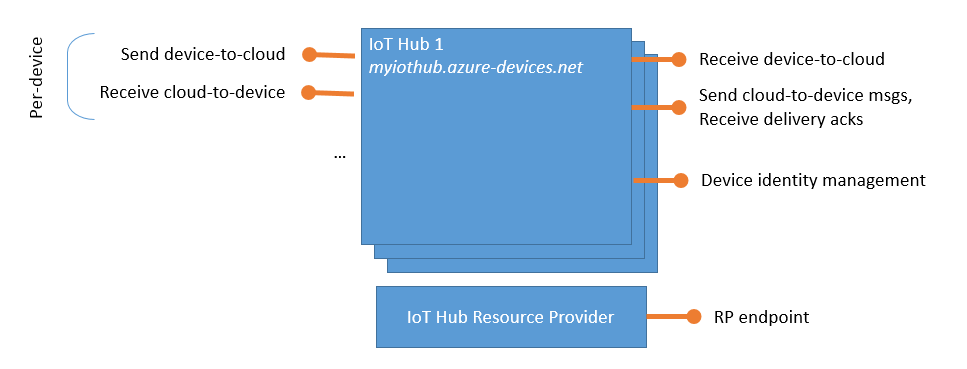

# Reference - IoT Hub endpoints

[!INCLUDE [iot-hub-basic](../../includes/iot-hub-basic-partial.md)]

## IoT Hub names

You can find the hostname of the IoT hub that hosts your endpoints in the portal on your hub's  **Overview** page. By default, the DNS name of an IoT hub looks like: `{your iot hub name}.azure-devices.net`.

You can use Azure DNS to create a custom DNS name for your IoT hub. For more information, see [Use Azure DNS to provide custom domain settings for an Azure service](../dns/dns-custom-domain.md).

## List of built-in IoT Hub endpoints

Azure IoT Hub is a multi-tenant service that exposes its functionality to various actors. The following diagram shows the various endpoints that IoT Hub exposes.

The following list describes the endpoints:

* **Resource provider**. The IoT Hub resource provider exposes an [Azure Resource Manager](../azure-resource-manager/resource-group-overview.md) interface. This interface enables Azure subscription owners to create and delete IoT hubs, and to update IoT hub properties. IoT Hub properties govern [hub-level security policies](iot-hub-devguide-security.md#access-control-and-permissions), as opposed to device-level access control, and functional options for cloud-to-device and device-to-cloud messaging. The IoT Hub resource provider also enables you to [export device identities](iot-hub-devguide-identity-registry.md#import-and-export-device-identities).

* **Device identity management**. Each IoT hub exposes a set of HTTPS REST endpoints to manage device identities (create, retrieve, update, and delete). [Device identities](iot-hub-devguide-identity-registry.md) are used for device authentication and access control.

* **Device twin management**. Each IoT hub exposes a set of service-facing HTTPS REST endpoint to query and update [device twins](iot-hub-devguide-device-twins.md) (update tags and properties).

* **Jobs management**. Each IoT hub exposes a set of service-facing HTTPS REST endpoint to query and manage [jobs](iot-hub-devguide-jobs.md).

* **Device endpoints**. For each device in the identity registry, IoT Hub exposes a set of endpoints:

  * *Send device-to-cloud messages*. A device uses this endpoint to [send device-to-cloud messages](iot-hub-devguide-messages-d2c.md).

  * *Receive cloud-to-device messages*. A device uses this endpoint to receive targeted [cloud-to-device messages](iot-hub-devguide-messages-c2d.md).

  * *Initiate file uploads*. A device uses this endpoint to receive an Azure Storage SAS URI from IoT Hub to [upload a file](iot-hub-devguide-file-upload.md).

  * *Retrieve and update device twin properties*. A device uses this endpoint to access its [device twin](iot-hub-devguide-device-twins.md)'s properties.

  * *Receive direct method requests*. A device uses this endpoint to listen for [direct method](iot-hub-devguide-direct-methods.md)'s requests.

    These endpoints are exposed using [MQTT v3.1.1](http://mqtt.org/), HTTPS 1.1, and [AMQP 1.0](https://www.amqp.org/) protocols. AMQP is also available over [WebSockets](https://tools.ietf.org/html/rfc6455) on port 443.

* **Service endpoints**. Each IoT hub exposes a set of endpoints  for your solution back end to communicate with your devices. With one exception, these endpoints are only exposed using the [AMQP](https://www.amqp.org/) protocol. The method invocation endpoint is exposed over the HTTPS protocol.
  
  * *Receive device-to-cloud messages*. This endpoint is compatible with [Azure Event Hubs](http://azure.microsoft.com/documentation/services/event-hubs/). A back-end service can use it to read the [device-to-cloud messages](iot-hub-devguide-messages-d2c.md) sent by your devices. You can create custom endpoints on your IoT hub in addition to this built-in endpoint.
  
  * *Send cloud-to-device messages and receive delivery acknowledgments*. These endpoints enable your solution back end to send reliable [cloud-to-device messages](iot-hub-devguide-messages-c2d.md), and to receive the corresponding delivery or expiration acknowledgments.
  
  * *Receive file notifications*. This messaging endpoint allows you to receive notifications of when your devices successfully upload a file. 
  
  * *Direct method invocation*. This endpoint allows a back-end service to invoke a [direct method](iot-hub-devguide-direct-methods.md) on a device.
  
  * *Receive operations monitoring events*. This endpoint allows you to receive operations monitoring events if your IoT hub has been configured to emit them. For more information, see [IoT Hub operations monitoring](iot-hub-operations-monitoring.md).

The [Azure IoT SDKs](iot-hub-devguide-sdks.md) article describes the various ways to access these endpoints.

All IoT Hub endpoints use the [TLS](https://tools.ietf.org/html/rfc5246) protocol, and no endpoint is ever exposed on unencrypted/unsecured channels.

## Custom endpoints

You can link existing Azure services in your subscription to your IoT hub to act as endpoints for message routing. These endpoints act as service endpoints and are used as sinks for message routes. Devices cannot write directly to the additional endpoints. Learn more about [message routing](../iot-hub/iot-hub-devguide-messages-d2c.md).

IoT Hub currently supports the following Azure services as additional endpoints:

* Azure Storage containers
* Event Hubs
* Service Bus Queues
* Service Bus Topics

For the limits on the number of endpoints you can add, see [Quotas and throttling](iot-hub-devguide-quotas-throttling.md).

## Field gateways

In an IoT solution, a *field gateway* sits between your devices and your IoT Hub endpoints. It is typically located close to your devices. Your devices communicate directly with the field gateway by using a protocol supported by the devices. The field gateway connects to an IoT Hub endpoint using a protocol that is supported by IoT Hub. A field gateway might be a dedicated hardware device or a low-power computer running custom gateway software.

You can use [Azure IoT Edge](/azure/iot-edge/) to implement a field gateway. IoT Edge offers functionality such as multiplexing communications from multiple devices onto the same IoT Hub connection.

## Next steps

Other reference topics in this IoT Hub developer guide include:

* [IoT Hub query language for device twins, jobs, and message routing](iot-hub-devguide-query-language.md)
* [Quotas and throttling](iot-hub-devguide-quotas-throttling.md)
* [IoT Hub MQTT support](iot-hub-mqtt-support.md)
