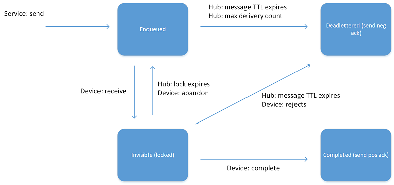

# Send cloud-to-device messages from IoT Hub

To send one-way notifications to the device app from your solution back end, send cloud-to-devices messages from your IoT hub to your device. For a discussion of other cloud-to-devices options supported by IoT Hub, see [Cloud-to-device communications guidance](iot-hub-devguide-c2d-guidance.md).

[!INCLUDE [iot-hub-basic](../../includes/iot-hub-basic-whole.md)]

You send cloud-to-device messages through a service-facing endpoint (**/messages/devicebound**). A device then receives the messages through a device-specific endpoint (**/devices/{deviceId}/messages/devicebound**).

To target each cloud-to-device message at a single device, IoT Hub sets the **to** property to **/devices/{deviceId}/messages/devicebound**.

Each device queue holds at most 50 cloud-to-device messages. Trying to send more messages to the same device results in an error.

## The cloud-to-device message lifecycle

To guarantee at-least-once message delivery, IoT Hub persists cloud-to-device messages in per-device queues. Devices must explicitly acknowledge *completion* for IoT Hub to remove them from the queue. This approach guarantees resiliency against connectivity and device failures.

The following diagram shows the lifecycle state graph for a cloud-to-device message in IoT Hub.



When the IoT Hub service sends a message to a device, the service sets the message state to **Enqueued**. When a device wants to *receive* a message, IoT Hub *locks* the message (by setting the state to **Invisible**), which allows other threads on the device to start receiving other messages. When a device thread completes the processing of a message, it notifies IoT Hub by *completing* the message. IoT Hub then sets the state to **Completed**.

A device can also choose to:

* *Reject* the message, which causes IoT Hub to set it to the **Dead lettered** state. Devices that connect over the MQTT protocol cannot reject cloud-to-device messages.

* *Abandon* the message, which causes IoT Hub to put the message back in the queue, with the state set to **Enqueued**. Devices that connect over the MQTT protocol cannot abandon cloud-to-device messages.

A thread could fail to process a message without notifying IoT Hub. In this case, messages automatically transition from the **Invisible** state back to the **Enqueued** state after a *visibility (or lock) timeout*. The default value of this timeout is one minute.

The **max delivery count** property on IoT Hub determines the maximum number of times a message can transition between the **Enqueued** and **Invisible** states. After that number of transitions, IoT Hub sets the state of the message to **Dead lettered**. Similarly, IoT Hub sets the state of a message to **Dead lettered** after its expiration time (see [Time to live](#message-expiration-time-to-live)).

The [How to send cloud-to-device messages with IoT Hub](iot-hub-csharp-csharp-c2d.md) shows you how to send cloud-to-device messages from the cloud and receive them on a device.

Typically, a device completes a cloud-to-device message when the loss of the message does not affect the application logic. For example, when the device has persisted the message content locally or has successfully executed an operation. The message could also carry transient information, whose loss would not impact the functionality of the application. Sometimes, for long-running tasks, you can:

* Complete the cloud-to-device message after persisting the task description in local storage.

* Notify the solution back end with one or more device-to-cloud messages at various stages of progress of the task.

## Message expiration (time to live)

Every cloud-to-device message has an expiration time. This time is set by one of:

* The **ExpiryTimeUtc** property in the service.
* IoT Hub using the default *time to live* specified as an IoT Hub property.

See [Cloud-to-device configuration options](#cloud-to-device-configuration-options).

A common way to take advantage of message expiration and avoid sending messages to disconnected devices, is to set short time to live values. This approach achieves the same result as maintaining the device connection state, while being more efficient. When you request message acknowledgements, IoT Hub notifies you which devices are:

* Able to receive messages.
* Are not online or have failed.

## Message feedback

When you send a cloud-to-device message, the service can request the delivery of per-message feedback regarding the final state of that message.

| Ack property | Behavior |
| ------------ | -------- |
| **positive** | If the cloud-to-device message reaches the **Completed** state, IoT Hub generates a feedback message. |
| **negative** | If the cloud-to-device message reaches the **Dead lettered** state, IoT Hub generates a feedback message. |
| **full**     | IoT Hub generates a feedback message in either case. |

If **Ack** is **full**, and you don't receive a feedback message, it means that the feedback message expired. The service can't know what happened to the original message. In practice, a service should ensure that it can process the feedback before it expires. The maximum expiry time is two days, which leaves time to get the service running again if a failure occurs.

As explained in [Endpoints](iot-hub-devguide-endpoints.md), IoT Hub delivers feedback through a service-facing endpoint (**/messages/servicebound/feedback**) as messages. The semantics for receiving feedback are the same as for cloud-to-device messages. Whenever possible, message feedback is batched in a single message, with the following format:

| Property     | Description |
| ------------ | ----------- |
| EnqueuedTime | Timestamp indicating when the feedback message was received by the hub. |
| UserId       | `{iot hub name}` |
| ContentType  | `application/vnd.microsoft.iothub.feedback.json` |

The body is a JSON-serialized array of records, each with the following properties:

| Property           | Description |
| ------------------ | ----------- |
| EnqueuedTimeUtc    | Timestamp indicating when the outcome of the message happened. For example, the hub received the feedback message or the original message expired. |
| OriginalMessageId  | **MessageId** of the cloud-to-device message to which this feedback information relates. |
| StatusCode         | Required string. Used in feedback messages generated by IoT Hub. <br/> 'Success' <br/> 'Expired' <br/> 'DeliveryCountExceeded' <br/> 'Rejected' <br/> 'Purged' |
| Description        | String values for **StatusCode**. |
| DeviceId           | **DeviceId** of the target device of the cloud-to-device message to which this piece of feedback relates. |
| DeviceGenerationId | **DeviceGenerationId** of the target device of the cloud-to-device message to which this piece of feedback relates. |

The service must specify a **MessageId** for the cloud-to-device message to be able to correlate its feedback with the original message.

The following example shows the body of a feedback message.

```json
[
  {
    "OriginalMessageId": "0987654321",
    "EnqueuedTimeUtc": "2015-07-28T16:24:48.789Z",
    "StatusCode": 0,
    "Description": "Success",
    "DeviceId": "123",
    "DeviceGenerationId": "abcdefghijklmnopqrstuvwxyz"
  },
  {
    ...
  },
  ...
]
```

## Cloud-to-device configuration options

Each IoT hub exposes the following configuration options for cloud-to-device messaging:

| Property                  | Description | Range and default |
| ------------------------- | ----------- | ----------------- |
| defaultTtlAsIso8601       | Default TTL for cloud-to-device messages. | ISO_8601 interval up to 2D (minimum 1 minute). Default: 1 hour. |
| maxDeliveryCount          | Maximum delivery count for cloud-to-device per-device queues. | 1 to 100. Default: 10. |
| feedback.ttlAsIso8601     | Retention for service-bound feedback messages. | ISO_8601 interval up to 2D (minimum 1 minute). Default: 1 hour. |
| feedback.maxDeliveryCount |Maximum delivery count for feedback queue. | 1 to 100. Default: 100. |

For more information about how to set these configuration options, see [Create IoT hubs](iot-hub-create-through-portal.md).

## Next steps

For information about the SDKs you can use to receive cloud-to-device messages, see [Azure IoT SDKs](iot-hub-devguide-sdks.md).

To try out receiving cloud-to-device messages, see the [Send cloud-to-device](iot-hub-csharp-csharp-c2d.md) tutorial.