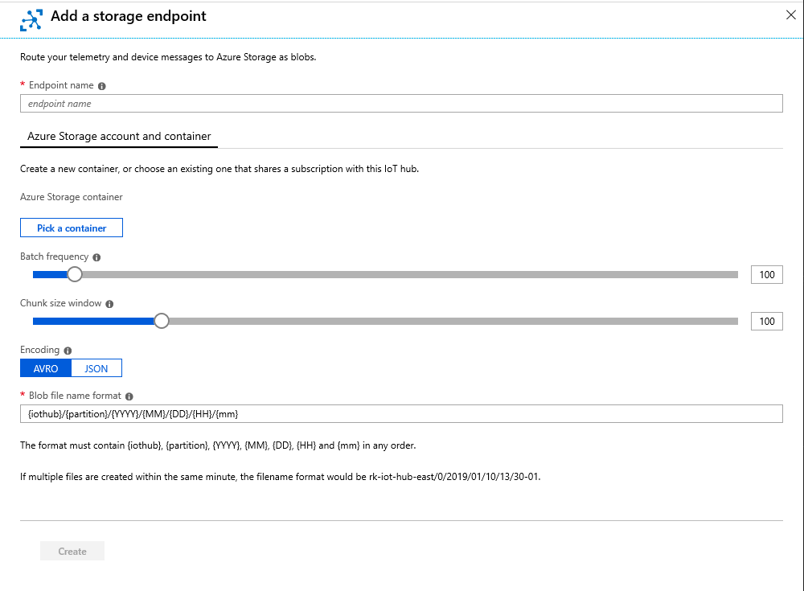

# Use IoT Hub message routing to send device-to-cloud messages to different endpoints

[!INCLUDE [iot-hub-basic](../../includes/iot-hub-basic-partial.md)]

Message routing enables you to send messages from your devices to cloud services in an automated, scalable, and reliable manner. Message routing can be used for: 

* **Sending device telemetry messages as well as events** namely, device lifecycle events, and device twin change events to the built-in-endpoint and custom endpoints. Learn about [routing endpoints](#routing-endpoints).

* **Filtering data before routing it to various endpoints** by applying rich queries. Message routing allows you to query on the message properties and message body as well as device twin tags and device twin properties. Learn more about using [queries in message routing](iot-hub-devguide-routing-query-syntax.md).

IoT Hub needs write access to these service endpoints for message routing to work. If you configure your endpoints through the Azure portal, the necessary permissions are added for you. Make sure you configure your services to support the expected throughput. When you first configure your IoT solution, you may need to monitor your additional endpoints and make any necessary adjustments for the actual load.

The IoT Hub defines a [common format](iot-hub-devguide-messages-construct.md) for all device-to-cloud messaging for interoperability across protocols. If a message matches multiple routes that point to the same endpoint, IoT Hub delivers message to that endpoint only once. Therefore, you don't need to configure deduplication on your Service Bus queue or topic. In partitioned queues, partition affinity guarantees message ordering. Use this tutorial to learn how to [configure message routing](tutorial-routing.md).

## Routing endpoints

An IoT hub has a default built-in-endpoint (**messages/events**) that is compatible with Event Hubs. You can create [custom endpoints](iot-hub-devguide-endpoints.md#custom-endpoints) to route messages to by linking other services in your subscription to the IoT Hub. IoT Hub currently supports the following services as custom endpoints:

### Built-in endpoint

You can use standard [Event Hubs integration and SDKs](iot-hub-devguide-messages-read-builtin.md) to receive device-to-cloud messages from the built-in endpoint (**messages/events**). Once a Route is created, data stops flowing to the built-in-endpoint unless a Route is created to that endpoint.

### Azure Blob Storage

IoT Hub supports writing data to Azure Blob Storage in the [Apache Avro](https://avro.apache.org/) format as well as in JSON format. The capability to encode JSON format is generally available in all regions in which IoT Hub is available. The default is AVRO. The encoding format can be only set when the blob storage endpoint is configured. The format cannot be edited for an existing endpoint. When using JSON encoding, you must set the contentType to JSON and contentEncoding to UTF-8 in the message [system properties](iot-hub-devguide-routing-query-syntax.md#system-properties). If this is not set, then IoT Hub will write the messages in base 64 encoded format. You can select the encoding format using the IoT Hub Create or Update REST API, specifically the [RoutingStorageContainerProperties](https://docs.microsoft.com/rest/api/iothub/iothubresource/createorupdate#routingstoragecontainerproperties), the Azure portal, [Azure CLI](https://docs.microsoft.com/cli/azure/iot/hub/routing-endpoint?view=azure-cli-latest), or the [Azure Powershell](https://docs.microsoft.com/powershell/module/az.iothub/add-aziothubroutingendpoint?view=azps-1.3.0). The following diagram shows how to select the encoding format in the Azure portal.



IoT Hub batches messages and writes data to a blob whenever the batch reaches a certain size or a certain amount of time has elapsed. IoT Hub defaults to the following file naming convention:

```
{iothub}/{partition}/{YYYY}/{MM}/{DD}/{HH}/{mm}
```

You may use any file naming convention, however you must use all listed tokens. IoT Hub will write to an empty blob if there is no data to write.

When routing to blob storage, we recommend enlisting the blobs and then iterating over them, to ensure all containers are read without making any assumptions of partition. The partition range could potentially change during a [Microsoft-initiated failover](iot-hub-ha-dr.md#microsoft-initiated-failover) or IoT Hub [manual failover](iot-hub-ha-dr.md#manual-failover-preview). You can use the [List Blobs API](https://docs.microsoft.com/rest/api/storageservices/list-blobs) to enumerate the list of blobs. Please see the following sample as guidance.

   ```csharp
        public void ListBlobsInContainer(string containerName, string iothub)
        {
            var storageAccount = CloudStorageAccount.Parse(this.blobConnectionString);
            var cloudBlobContainer = storageAccount.CreateCloudBlobClient().GetContainerReference(containerName);
            if (cloudBlobContainer.Exists())
            {
                var results = cloudBlobContainer.ListBlobs(prefix: $"{iothub}/");
                foreach (IListBlobItem item in results)
                {
                    Console.WriteLine(item.Uri);
                }
            }
        }
   ```

### Service Bus Queues and Service Bus Topics

Service Bus queues and topics used as IoT Hub endpoints must not have **Sessions** or **Duplicate Detection** enabled. If either of those options are enabled, the endpoint appears as **Unreachable** in the Azure portal.

### Event Hubs

Apart from the built-in-Event Hubs compatible endpoint, you can also route data to custom endpoints of type Event Hubs. 

## Reading data that has been routed

You can configure a route by following this [tutorial](tutorial-routing.md).

Use the following tutorials to learn how to read message from an endpoint.

* Reading from [Built-in-endpoint](quickstart-send-telemetry-node.md)

* Reading from [Blob storage](../storage/blobs/storage-blob-event-quickstart.md)

* Reading from [Event Hubs](../event-hubs/event-hubs-dotnet-standard-getstarted-send.md)

* Reading from [Service Bus Queues](../service-bus-messaging/service-bus-dotnet-get-started-with-queues.md)

* Read from [Service Bus Topics](https://docs.microsoft.com/azure/service-bus-messaging/service-bus-dotnet-how-to-use-topics-subscriptions)

## Fallback route

The fallback route sends all the messages that don't satisfy query conditions on any of the existing routes to the built-in-Event Hubs (**messages/events**), that is compatible with [Event Hubs](/azure/event-hubs/). If message routing is turned on, you can enable the fallback route capability. Once a route is created, data stops flowing to the built-in-endpoint, unless a route is created to that endpoint. If there are no routes to the built-in-endpoint and a fallback route is enabled, only messages that don't match any query conditions on routes will be sent to the built-in-endpoint. Also, if all existing routes are deleted, fallback route must be enabled to receive all data at the built-in-endpoint.

You can enable/disable the fallback route in the Azure portal->Message Routing blade. You can also use Azure Resource Manager for [FallbackRouteProperties](/rest/api/iothub/iothubresource/createorupdate#fallbackrouteproperties) to use a custom endpoint for fallback route.

## Non-telemetry events

In addition to device telemetry, message routing also enables sending device twin change events and device lifecycle events. For example, if a route is created with data source set to **device twin change events**, IoT Hub sends messages to the endpoint that contain the change in the device twin. Similarly, if a route is created with data source set to **device lifecycle events**, IoT Hub will send a message indicating whether the device was deleted or created. 

[IoT Hub also integrates with Azure Event Grid](iot-hub-event-grid.md) to publish device events to support real-time integrations and automation of workflows based on these events. See key [differences between message routing and Event Grid](iot-hub-event-grid-routing-comparison.md) to learn which works best for your scenario.

## Testing routes

When you create a new route or edit an existing route, you should test the route query with a sample message. You can test individual routes or test all routes at once and no messages are routed to the endpoints during the test. Azure portal, Azure Resource Manager, Azure PowerShell, and Azure CLI can be used for testing. Outcomes help identify whether the sample message matched the query, message did not match the query, or test couldn't run because the sample message or query syntax are incorrect. To learn more, see [Test Route](/rest/api/iothub/iothubresource/testroute) and [Test all routes](/rest/api/iothub/iothubresource/testallroutes).

## Latency

When you route device-to-cloud telemetry messages using built-in endpoints, there is a slight increase in the end-to-end latency after the creation of the first route.

In most cases, the average increase in latency is less than 500 ms. You can monitor the latency using **Routing: message latency for messages/events** or **d2c.endpoints.latency.builtIn.events** IoT Hub metric. Creating or deleting any route after the first one does not impact the end-to-end latency.

## Monitoring and troubleshooting

IoT Hub provides several metrics related to routing and endpoints to give you an overview of the health of your hub and messages sent. You can combine information from multiple metrics to identify root cause for issues. For example, use metric **Routing: telemetry messages dropped** or **d2c.telemetry.egress.dropped** to identify the number of messages that were dropped when they didn't match queries on any of the routes and fallback route was disabled. [IoT Hub metrics](iot-hub-metrics.md) lists all metrics that are enabled by default for your IoT Hub.

You can use the REST API [Get Endpoint Health](https://docs.microsoft.com/rest/api/iothub/iothubresource/getendpointhealth#iothubresource_getendpointhealth) to get [health status](iot-hub-devguide-endpoints.md#custom-endpoints) of the endpoints. We recommend using the [IoT Hub metrics](iot-hub-metrics.md) related to routing message latency to identify and debug errors when endpoint health is dead or unhealthy. For example, for endpoint type Event Hubs, you can monitor **d2c.endpoints.latency.eventHubs**. The status of an unhealthy endpoint will be updated to healthy when IoT Hub has established an eventually consistent state of health.

Using the **routes** diagnostic logs in Azure Monitor [diagnostic settings](../iot-hub/iot-hub-monitor-resource-health.md), you can track errors that occur during evaluation of a routing query and endpoint health as perceived by IoT Hub, for example when an endpoint is dead. These diagnostic logs can be sent to Azure Monitor logs, Event Hubs, or Azure Storage for custom processing.

## Next steps

* To learn how to create Message Routes, see [Process IoT Hub device-to-cloud messages using routes](tutorial-routing.md).

* [How to send device-to-cloud messages](quickstart-send-telemetry-node.md)

* For information about the SDKs you can use to send device-to-cloud messages, see [Azure IoT SDKs](iot-hub-devguide-sdks.md).
