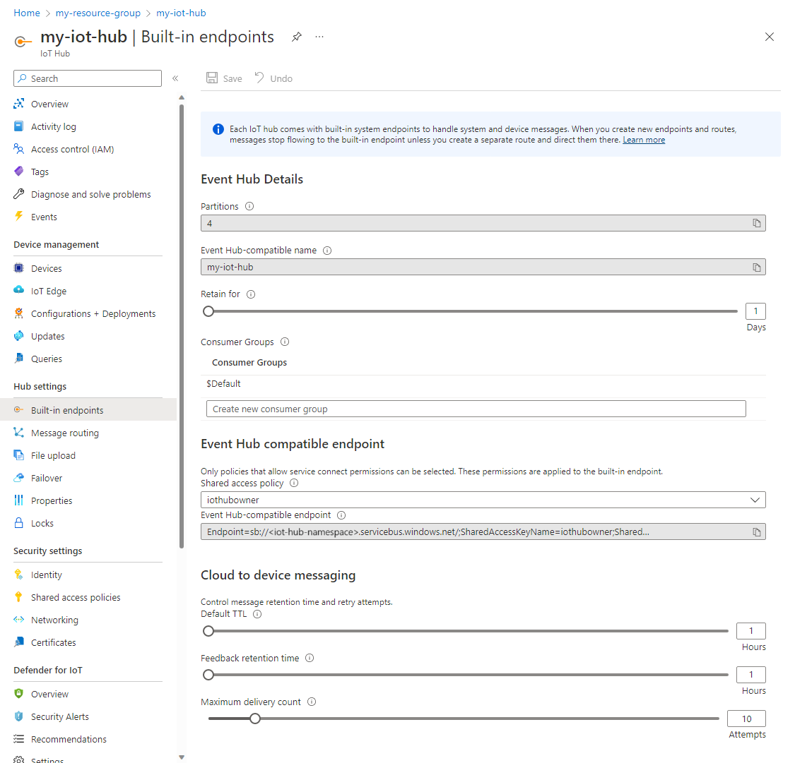

# Read device-to-cloud messages from the built-in endpoint

By default, messages are routed to the built-in service-facing endpoint (**messages/events**) that is compatible with [Event Hubs](https://azure.microsoft.com/documentation/services/event-hubs/). This endpoint is currently only exposed using the [AMQP](https://www.amqp.org/) protocol on port 5671. An IoT hub exposes the following properties to enable you to control the built-in Event Hub-compatible messaging endpoint **messages/events**.

| Property            | Description |
| ------------------- | ----------- |
| **Partition count** | Set this property at creation to define the number of [partitions](../event-hubs/event-hubs-features.md#partitions) for device-to-cloud event ingestion. |
| **Retention time**  | This property specifies how long in days messages are retained by IoT Hub. The default is one day, but it can be increased to seven days. |

IoT Hub allows data retention in the built-in Event Hubs for a maximum of 7 days. You can set the retention time during creation of your IoT Hub. Data retention time in IoT Hub depends on your IoT hub tier and unit type. In terms of size, the built-in Event Hubs can retain messages of the maximum message size up to at least 24 hours of quota. For example, for 1 S1 unit IoT Hub provides enough storage to retain at least 400K messages of 4k size each. If your devices are sending smaller messages, they may be retained for longer (up to 7 days) depending on how much storage is consumed. We guarantee retaining the data for the specified retention time as a minimum.

IoT Hub also enables you to manage consumer groups on the built-in device-to-cloud receive endpoint.

If you're using [message routing](iot-hub-devguide-messages-d2c.md) and the [fallback route](iot-hub-devguide-messages-d2c.md#fallback-route) is enabled, all messages that don't match a query on any route go to the built-in endpoint. If you disable this fallback route, messages that don't match any query are dropped.

You can modify the retention time, either programmatically using the [IoT Hub resource provider REST APIs](/rest/api/iothub/iothubresource), or with the [Azure portal](https://portal.azure.com).

IoT Hub exposes the **messages/events** built-in endpoint for your back-end services to read the device-to-cloud messages received by your hub. This endpoint is Event Hub-compatible, which enables you to use any of the mechanisms the Event Hubs service supports for reading messages.

## Read from the built-in endpoint

Some product integrations and Event Hubs SDKs are aware of IoT Hub and let you use your IoT hub service connection string to connect to the built-in endpoint.

When you use Event Hubs SDKs or product integrations that are unaware of IoT Hub, you need an Event Hub-compatible endpoint and Event Hub-compatible name. You can retrieve these values from the portal as follows:

1. Sign in to the [Azure portal](https://portal.azure.com) and navigate to your IoT hub.

2. Click **Built-in endpoints**.

3. The **Events** section contains the following values: **Partitions**, **Event Hub-compatible name**, **Event Hub-compatible endpoint**, **Retention time**, and **Consumer groups**.

    

In the portal, the Event Hub-compatible endpoint field contains a complete Event Hubs connection string that looks like: **Endpoint=sb://abcd1234namespace.servicebus.windows.net/;SharedAccessKeyName=iothubowner;SharedAccessKey=keykeykeykeykeykey=;EntityPath=iothub-ehub-abcd-1234-123456**. If the SDK you're using requires other values, then they would be:

| Name | Value |
| ---- | ----- |
| Endpoint | sb://abcd1234namespace.servicebus.windows.net/ |
| Hostname | abcd1234namespace.servicebus.windows.net |
| Namespace | abcd1234namespace |

You can then use any shared access policy that has the **ServiceConnect** permissions to connect to the specified Event Hub.

The SDKs you can use to connect to the built-in Event Hub-compatible endpoint that IoT Hub exposes include:

| Language | SDK | Example | Notes |
| -------- | --- | ------ | ----- |
| .NET | https://github.com/Azure/azure-event-hubs-dotnet | [Quickstart](quickstart-send-telemetry-dotnet.md) | Uses Event Hubs-compatible information |
 Java | https://github.com/Azure/azure-event-hubs-java | [Quickstart](quickstart-send-telemetry-java.md) | Uses Event Hubs-compatible information |
| Node.js | https://github.com/Azure/azure-event-hubs-node | [Quickstart](quickstart-send-telemetry-node.md) | Uses IoT Hub connection string |
| Python | https://github.com/Azure/azure-event-hubs-python | https://github.com/Azure/azure-event-hubs-python/blob/master/examples/iothub_recv.py | Uses IoT Hub connection string |

The product integrations you can use with the built-in Event Hub-compatible endpoint that IoT Hub exposes include:

* [Azure Functions](https://docs.microsoft.com/azure/azure-functions/). See [Processing data from IoT Hub with Azure Functions](https://azure.microsoft.com/resources/samples/functions-js-iot-hub-processing/).
* [Azure Stream Analytics](https://docs.microsoft.com/azure/stream-analytics/). See [Stream data as input into Stream Analytics](../stream-analytics/stream-analytics-define-inputs.md#stream-data-from-iot-hub).
* [Time Series Insights](https://docs.microsoft.com/azure/time-series-insights/). See [Add an IoT hub event source to your Time Series Insights environment](../time-series-insights/time-series-insights-how-to-add-an-event-source-iothub.md).
* [Apache Storm spout](../hdinsight/storm/apache-storm-develop-csharp-event-hub-topology.md). You can view the [spout source](https://github.com/apache/storm/tree/master/external/storm-eventhubs) on GitHub.
* [Apache Spark integration](../hdinsight/spark/apache-spark-eventhub-streaming.md).
* [Azure Databricks](https://docs.microsoft.com/azure/azure-databricks/).

## Next steps

* For more information about IoT Hub endpoints, see [IoT Hub endpoints](iot-hub-devguide-endpoints.md).

* The [Quickstarts](quickstart-send-telemetry-node.md) show you how to send device-to-cloud messages from simulated devices and read the messages from the built-in endpoint. 

For more detail, see the [Process IoT Hub device-to-cloud messages using routes](tutorial-routing.md) tutorial.

* If you want to route your device-to-cloud messages to custom endpoints, see [Use message routes and custom endpoints for device-to-cloud messages](iot-hub-devguide-messages-read-custom.md).
