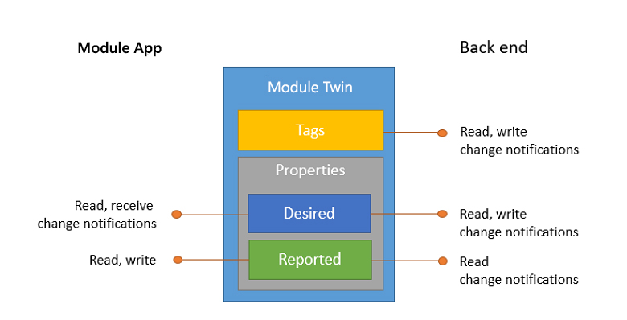

# Understand and use module twins in IoT Hub

This article assumes you've read [Understand and use device twins in IoT Hub](iot-hub-devguide-device-twins.md) first. In IoT Hub, under each device identity, you can create up to 50 module identities. Each module identity implicitly generates a module twin. Similar to device twins, module twins are JSON documents that store module state information including metadata, configurations, and conditions. Azure IoT Hub maintains a module twin for each module that you connect to IoT Hub. 

On the device side, the IoT Hub device SDKs enable you to create modules where each one opens an independent connection to IoT Hub. This functionality enables you to use separate namespaces for different components on your device. For example, you have a vending machine that has three different sensors. Each sensor is controlled by different departments in your company. You can create a module for each sensor. This way, each department is only able to send jobs or direct methods to the sensor that they control, avoiding conflicts and user errors.

 Module identity and module twin provide the same capabilities as device identity and device twin but at a finer granularity. This finer granularity enables capable devices, such as operating system-based devices or firmware devices managing multiple components, to isolate configuration and conditions for each of those components. Module identity and module twins provide a management separation of concerns when working with IoT devices that have modular software components. We aim at supporting all the device twin functionality at module twin level by module twin general availability. 

[!INCLUDE [iot-hub-basic](../../includes/iot-hub-basic-whole.md)]

This article describes:

* The structure of the module twin: *tags*, *desired* and *reported properties*.
* The operations that the modules and back ends can perform on module twins.

Refer to [Device-to-cloud communication guidance](iot-hub-devguide-d2c-guidance.md) for guidance on using reported properties, device-to-cloud messages, or file upload.

Refer to [Cloud-to-device communication guidance](iot-hub-devguide-c2d-guidance.md) for guidance on using desired properties, direct methods, or cloud-to-device messages.

## Module twins

Module twins store module-related information that:

* Modules on the device and IoT Hub can use to synchronize module conditions and configuration.

* The solution back end can use to query and target long-running operations.

The lifecycle of a module twin is linked to the corresponding [module identity](iot-hub-devguide-identity-registry.md). Modules twins are implicitly created and deleted when a module identity is created or deleted in IoT Hub.

A module twin is a JSON document that includes:

* **Tags**. A section of the JSON document that the solution back end can read from and write to. Tags are not visible to modules on the device. Tags are set for querying purpose.

* **Desired properties**. Used along with reported properties to synchronize module configuration or conditions. The solution back end can set desired properties, and the module app can read them. The module app can also receive notifications of changes in the desired properties.

* **Reported properties**. Used along with desired properties to synchronize module configuration or conditions. The module app can set reported properties, and the solution back end can read and query them.

* **Module identity properties**. The root of the module twin JSON document contains the read-only properties from the corresponding module identity stored in the [identity registry](iot-hub-devguide-identity-registry.md).



The following example shows a module twin JSON document:

```json
{
    "deviceId": "devA",
    "moduleId": "moduleA",
    "etag": "AAAAAAAAAAc=", 
    "status": "enabled",
    "statusReason": "provisioned",
    "statusUpdateTime": "0001-01-01T00:00:00",
    "connectionState": "connected",
    "lastActivityTime": "2015-02-30T16:24:48.789Z",
    "cloudToDeviceMessageCount": 0, 
    "authenticationType": "sas",
    "x509Thumbprint": {     
        "primaryThumbprint": null, 
        "secondaryThumbprint": null 
    }, 
    "version": 2, 
    "tags": {
        "$etag": "123",
        "deploymentLocation": {
            "building": "43",
            "floor": "1"
        }
    },
    "properties": {
        "desired": {
            "telemetryConfig": {
                "sendFrequency": "5m"
            },
            "$metadata" : {...},
            "$version": 1
        },
        "reported": {
            "telemetryConfig": {
                "sendFrequency": "5m",
                "status": "success"
            },
            "batteryLevel": 55,
            "$metadata" : {...},
            "$version": 4
        }
    }
}
```

In the root object are the module identity properties, and container objects for `tags` and both `reported` and `desired` properties. The `properties` container contains some read-only elements (`$metadata`, `$etag`, and `$version`) described in the [Module twin metadata](iot-hub-devguide-module-twins.md#module-twin-metadata) and [Optimistic concurrency](iot-hub-devguide-device-twins.md#optimistic-concurrency) sections.

### Reported property example

In the previous example, the module twin contains a `batteryLevel` property that is reported by the module app. This property makes it possible to query and operate on modules based on the last reported battery level. Other examples include the module app reporting module capabilities or connectivity options.

> [!NOTE]
> Reported properties simplify scenarios where the solution back end is interested in the last known value of a property. Use [device-to-cloud messages](iot-hub-devguide-messages-d2c.md) if the solution back end needs to process module telemetry in the form of sequences of timestamped events, such as time series.

### Desired property example

In the previous example, the `telemetryConfig` module twin desired and reported properties are used by the solution back end and the module app to synchronize the telemetry configuration for this module. For example:

1. The solution back end sets the desired property with the desired configuration value. Here is the portion of the document with the desired property set:

    ```json
    ...
    "desired": {
        "telemetryConfig": {
            "sendFrequency": "5m"
        },
        ...
    },
    ...
    ```

2. The module app is notified of the change immediately if connected, or at the first reconnect. The module app then reports the updated configuration (or an error condition using the `status` property). Here is the portion of the reported properties:

    ```json
    "reported": {
        "telemetryConfig": {
            "sendFrequency": "5m",
            "status": "success"
        }
        ...
    }
    ```

3. The solution back end can track the results of the configuration operation across many modules, by [querying](iot-hub-devguide-query-language.md) module twins.

> [!NOTE]
> The preceding snippets are examples, optimized for readability, of one way to encode a module configuration and its status. IoT Hub does not impose a specific schema for the module twin desired and reported properties in the module twins.
> 
> 

## Back-end operations
The solution back end operates on the module twin using the following atomic operations, exposed through HTTPS:

* **Retrieve module twin by ID**. This operation returns the module twin document, including tags and desired and reported system properties.

* **Partially update module twin**. This operation enables the solution back end to partially update the tags or desired properties in a module twin. The partial update is expressed as a JSON document that adds or updates any property. Properties set to `null` are removed. The following example creates a new desired property with value `{"newProperty": "newValue"}`, overwrites the existing value of `existingProperty` with `"otherNewValue"`, and removes `otherOldProperty`. No other changes are made to existing desired properties or tags:

    ```json
    {
        "properties": {
            "desired": {
                "newProperty": {
                    "nestedProperty": "newValue"
                },
                "existingProperty": "otherNewValue",
                "otherOldProperty": null
            }
        }
    }
    ```

* **Replace desired properties**. This operation enables the solution back end to completely overwrite all existing desired properties and substitute a new JSON document for `properties/desired`.

* **Replace tags**. This operation enables the solution back end to completely overwrite all existing tags and substitute a new JSON document for `tags`.

* **Receive twin notifications**. This operation allows the solution back end to be notified when the twin is modified. To do so, your IoT solution needs to create a route and to set the Data Source equal to *twinChangeEvents*. By default, no twin notifications are sent, that is, no such routes pre-exist. If the rate of change is too high, or for other reasons such as internal failures, the IoT Hub might send only one notification that contains all changes. Therefore, if your application needs reliable auditing and logging of all intermediate states, you should use device-to-cloud messages. The twin notification message includes properties and body.

  - Properties

    | Name | Value |
    | --- | --- |
    $content-type | application/json |
    $iothub-enqueuedtime |  Time when the notification was sent |
    $iothub-message-source | twinChangeEvents |
    $content-encoding | utf-8 |
    deviceId | ID of the device |
    moduleId | ID of the module |
    hubName | Name of IoT Hub |
    operationTimestamp | [ISO8601](https://en.wikipedia.org/wiki/ISO_8601) timestamp of operation |
    iothub-message-schema | twinChangeNotification |
    opType | "replaceTwin" or "updateTwin" |

    Message system properties are prefixed with the `$` symbol.

  - Body
        
    This section includes all the twin changes in a JSON format. It uses the same format as a patch, with the difference that it can contain all twin sections: tags, properties.reported, properties.desired, and that it contains the “$metadata” elements. For example,

    ```json
    {
      "properties": {
          "desired": {
              "$metadata": {
                  "$lastUpdated": "2016-02-30T16:24:48.789Z"
              },
              "$version": 1
          },
          "reported": {
              "$metadata": {
                  "$lastUpdated": "2016-02-30T16:24:48.789Z"
              },
              "$version": 1
          }
      }
    }
    ```

All the preceding operations support [Optimistic concurrency](iot-hub-devguide-device-twins.md#optimistic-concurrency) and require the **ServiceConnect** permission, as defined in the [Control Access to IoT Hub](iot-hub-devguide-security.md) article.

In addition to these operations, the solution back end can query the module twins using the SQL-like [IoT Hub query language](iot-hub-devguide-query-language.md).

## Module operations

The module app operates on the module twin using the following atomic operations:

* **Retrieve module twin**. This operation returns the module twin document (including tags and desired and reported system properties) for the currently connected module.

* **Partially update reported properties**. This operation enables the partial update of the reported properties of the currently connected module. This operation uses the same JSON update format that the solution back end uses for a partial update of desired properties.

* **Observe desired properties**. The currently connected module can choose to be notified of updates to the desired properties when they happen. The module receives the same form of update (partial or full replacement) executed by the solution back end.

All the preceding operations require the **ModuleConnect** permission, as defined in the [Control Access to IoT Hub](iot-hub-devguide-security.md) article.

The [Azure IoT device SDKs](iot-hub-devguide-sdks.md) make it easy to use the preceding operations from many languages and platforms.

## Tags and properties format

Tags, desired properties, and reported properties are JSON objects with the following restrictions:

* **Keys**: All keys in JSON objects are UTF-8 encoded, case-sensitive, and up-to 1 KB in length. Allowed characters exclude UNICODE control characters (segments C0 and C1), and `.`, `$`, and SP.

* **Values**: All values in JSON objects can be of the following JSON types: boolean, number, string, object. Arrays are not allowed.

    * Integers can have a minimum value of -4503599627370496 and a maximum value of 4503599627370495.

    * String values are UTF-8 encoded and can have a maximum length of 4 KB.

* **Depth**: The maximum depth of JSON objects in tags, desired properties, and reported properties is 10. For example, the following object is valid:

   ```json
   {
       ...
       "tags": {
           "one": {
               "two": {
                   "three": {
                       "four": {
                           "five": {
                               "six": {
                                   "seven": {
                                       "eight": {
                                           "nine": {
                                               "ten": {
                                                   "property": "value"
                                               }
                                           }
                                       }
                                   }
                               }
                           }
                       }
                   }
               }
           }
       },
       ...
   }
   ```

## Module twin size

IoT Hub enforces an 8 KB size limit on the value of `tags`, and a 32 KB size limit each on the value of `properties/desired` and `properties/reported`. These totals are exclusive of read-only elements like `$etag`, `$version`, and `$metadata/$lastUpdated`.

Twin size is computed as follows:

* For each property in the JSON document, IoT Hub cumulatively computes and adds the length of the property's key and value.

* Property keys are considered as UTF8-encoded strings.

* Simple property values are considered as UTF8-encoded strings, numeric values (8 Bytes), or Boolean values (4 Bytes).

* The size of UTF8-encoded strings is computed by counting all characters, excluding UNICODE control characters (segments C0 and C1).

* Complex property values (nested objects) are computed based on the aggregate size of the property keys and property values that they contain.

IoT Hub rejects with an error all operations that would increase the size of those documents above the limit.

## Module twin metadata

IoT Hub maintains the timestamp of the last update for each JSON object in module twin desired and reported properties. The timestamps are in UTC and encoded in the [ISO8601](https://en.wikipedia.org/wiki/ISO_8601) format `YYYY-MM-DDTHH:MM:SS.mmmZ`.
For example:

```json
{
    ...
    "properties": {
        "desired": {
            "telemetryConfig": {
                "sendFrequency": "5m"
            },
            "$metadata": {
                "telemetryConfig": {
                    "sendFrequency": {
                        "$lastUpdated": "2016-03-30T16:24:48.789Z"
                    },
                    "$lastUpdated": "2016-03-30T16:24:48.789Z"
                },
                "$lastUpdated": "2016-03-30T16:24:48.789Z"
            },
            "$version": 23
        },
        "reported": {
            "telemetryConfig": {
                "sendFrequency": "5m",
                "status": "success"
            },
            "batteryLevel": "55%",
            "$metadata": {
                "telemetryConfig": {
                    "sendFrequency": "5m",
                    "status": {
                        "$lastUpdated": "2016-03-31T16:35:48.789Z"
                    },
                    "$lastUpdated": "2016-03-31T16:35:48.789Z"
                },
                "batteryLevel": {
                    "$lastUpdated": "2016-04-01T16:35:48.789Z"
                },
                "$lastUpdated": "2016-04-01T16:24:48.789Z"
            },
            "$version": 123
        }
    }
    ...
}
```

This information is kept at every level (not just the leaves of the JSON structure) to preserve updates that remove object keys.

## Optimistic concurrency

Tags, desired, and reported properties all support optimistic concurrency.
Tags have an ETag, as per [RFC7232](https://tools.ietf.org/html/rfc7232), that represents the tag's JSON representation. You can use ETags in conditional update operations from the solution back end to ensure consistency.

Module twin desired and reported properties do not have ETags, but have a `$version` value that is guaranteed to be incremental. Similarly to an ETag, the version can be used by the updating party to enforce consistency of updates. For example, a module app for a reported property or the solution back end for a desired property.

Versions are also useful when an observing agent (such as the module app observing the desired properties) must reconcile races between the result of a retrieve operation and an update notification. The section [Device reconnection flow](iot-hub-devguide-device-twins.md#device-reconnection-flow) provides more information. 

## Next steps

To try out some of the concepts described in this article, see the following IoT Hub tutorials:

* [Get started with IoT Hub module identity and module twin using .NET back end and .NET device](iot-hub-csharp-csharp-module-twin-getstarted.md)
