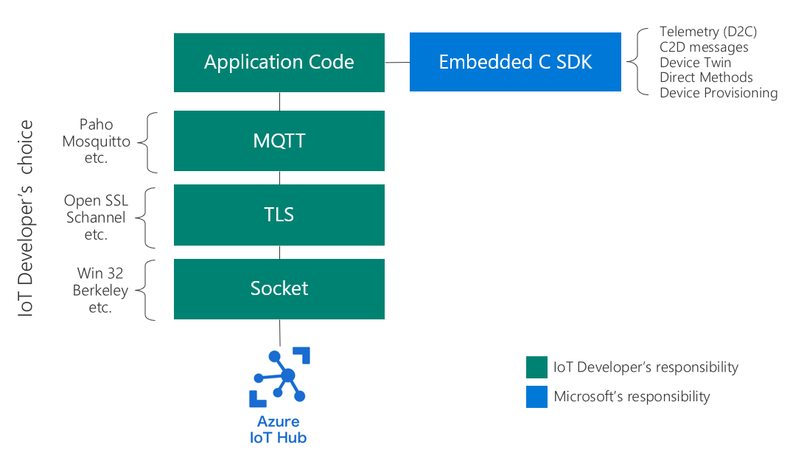

# Azure IoT Embedded C SDK

The [Embedded C SDK is an SDK](https://github.com/Azure/azure-sdk-for-c/tree/master/sdk/docs/iot) for constrained devices that supports the bring your own network (BYON) approach. IoT developers have the freedom to bring the MQTT client, TLS, and socket of their choice to create a device solution. The following design decisions make this SDK a perfect option to build solutions for constrained devices.

- Customers of our SDK compile our source code along with their own.
- We target the C99 programming language and test with gcc, clang, & MS Visual C compilers.
- We offer few abstractions making our code easy to understand and debug.
- Our SDK is non allocating. Customers must allocate our data structures where they desire (global memory, heap, stack, etc.) and then pass the address of the allocated structure into our functions to initialize them and to perform various operations.
- Unlike our other language SDKs, many things (such as composing an HTTP pipeline of policies) are done in source code as opposed to runtime. This optimization reduces code size, improves execution speed and locks-in behavior, reducing the chance of bugs at runtime.
- We support microcontrollers with no operating system, microcontrollers with a real-time operating system (like [Azure RTOS](https://azure.microsoft.com/services/rtos/)), Linux, and Windows. Customers can implement custom platform layers to use our SDK on custom devices. We provide some platform layers, and encourage the community to submit platform layers to increase the out-of-the-box supported platforms.

> [!NOTE]
> We have additional middleware libraries built on top of the Azure IoT Embedded C SDK for Azure RTOS and FreeRTOS. If you are using either of those platforms, we highly suggest you use those.
>
> See here for those libraries:
> - [Azure IoT middleware for Azure RTOS](https://github.com/azure-rtos/netxduo/tree/master/addons/azure_iot)
> - [Azure IoT middleware for FreeRTOS](https://github.com/Azure/azure-iot-middleware-freertos)

## Architecture

As mentioned before, the Azure IoT Embedded C SDK uses a "bring-your-own-network" approach. That means you are free to choose your MQTT, TLS, and TCP/IP stacks and use them with the Azure IoT Embedded C SDK. The utility of this SDK is to help make Azure IoT MQTT features easier to use. It provides functionality such as parsing inbound topics, provide authentication details, and creating subscription topics (among other features).

As you can see in the diagram, the Azure IoT Embedded C SDK is meant to be used *alongside* your application code and not *on top of* since there are no networking dependencies. Instead, it enables the most freedom to choose the components you need for your solution, whether with offloaded, hardware MQTT or TLS or any other custom networking stack.

## Next steps

We have several samples to help get you started. See the below links for our available samples.

- [Linux and Windows](https://github.com/Azure/azure-sdk-for-c/tree/main/sdk/samples/iot)
- [ESP32](https://github.com/Azure/azure-sdk-for-c/tree/main/sdk/samples/iot/aziot_esp32)
- [ESP8266](https://github.com/Azure/azure-sdk-for-c/tree/main/sdk/samples/iot/aziot_esp8266)
- [Realtek AmebaD](https://github.com/Azure/azure-sdk-for-c/tree/main/sdk/samples/iot/aziot_realtek_amebaD)
- [Microchip PIC IoT Board](https://github.com/Azure-Samples/Microchip-PIC-IoT-Wx)
- [Microchip SAM IoT Board](https://github.com/Azure-Samples/Microchip-SAM-IoT-Wx)
