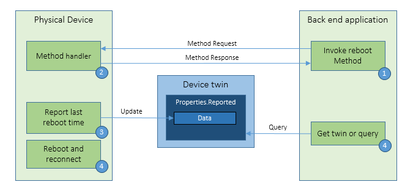
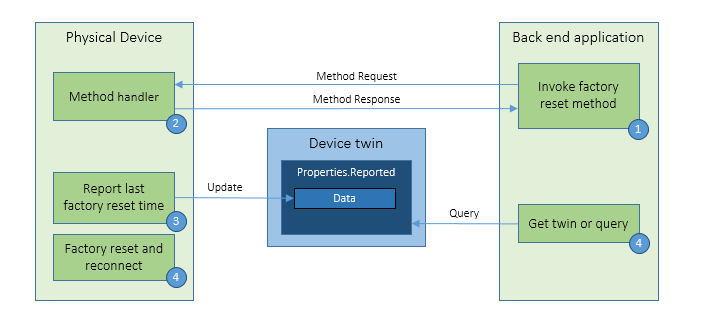
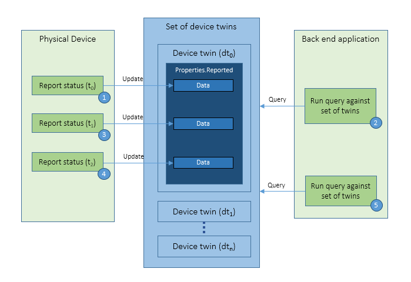

# Overview of device management with IoT Hub

Azure IoT Hub provides the features and an extensibility model that enable device and back-end developers to build robust device management solutions. Devices range from constrained sensors and single purpose microcontrollers, to powerful gateways that route communications for groups of devices.  Also, the use cases and requirements for IoT operators vary significantly across industries.  Despite this variation, device management with IoT Hub provides the capabilities, patterns, and code libraries to cater to a diverse set of devices and end users.

[!INCLUDE [iot-hub-basic](../../includes/iot-hub-basic-partial.md)]

A crucial part of creating a successful enterprise IoT solution is to provide a strategy for how operators handle the ongoing management of their collection of devices. IoT operators require simple and reliable tools and applications that enable them to focus on the more strategic aspects of their jobs. This article provides:

* A brief overview of Azure IoT Hub approach to device management.
* A description of common device management principles.
* A description of the device lifecycle.
* An overview of common device management patterns.

## Device lifecycle

General device management stages are common in most enterprise IoT projects. In Azure IoT, there are five stages within the device lifecycle:

Within each of these five stages, there are several device operator requirements that should be fulfilled to provide a complete solution:

* **Plan**: Enable operators to create a device metadata scheme that enables them to easily and accurately query for, and target a group of devices for bulk management operations. You can use the device twin to store this device metadata in the form of tags and properties.
  
    *Further reading*: 
  * [Get started with device twins](device-twins-node.md)
  * [Understand device twins](iot-hub-devguide-device-twins.md)
  * [How to use device twin properties](tutorial-device-twins.md)
  * [Best practices for device configuration within an IoT solution](iot-hub-configuration-best-practices.md)

* **Provision**: Securely provision new devices to IoT Hub and enable operators to immediately discover device capabilities.  Use the IoT Hub identity registry to create flexible device identities and credentials, and do this operation in bulk by using a job. Build devices to report their capabilities and conditions through device properties in the device twin.
  
    *Further reading*: 
    * [Manage device identities](iot-hub-devguide-identity-registry.md)
    * [Bulk management of device identities](iot-hub-bulk-identity-mgmt.md)
    * [How to use device twin properties](tutorial-device-twins.md)
    * [Best practices for device configuration within an IoT solution](iot-hub-configuration-best-practices.md)
    * [Azure IoT Hub Device Provisioning Service](../iot-dps/index.yml)

* **Configure**: Facilitate bulk configuration changes and firmware updates to devices while maintaining both health and security. Perform these device management operations in bulk by using desired properties or with direct methods and broadcast jobs.
  
    *Further reading*:
    * [How to use device twin properties](tutorial-device-twins.md)
    * [Configure and monitor IoT devices at scale](./iot-hub-automatic-device-management.md)
    * [Best practices for device configuration within an IoT solution](iot-hub-configuration-best-practices.md)

* **Monitor**: Monitor overall device collection health, the status of ongoing operations, and alert operators to issues that might require their attention.  Apply the device twin to allow devices to report real-time operating conditions and status of update operations. Build powerful dashboard reports that surface the most immediate issues by using device twin queries. Protect your IoT environment from threats, with multiple deployment options including fully on-premises, cloud-connected, or hybrid.
  
    *Further reading*: 
    * [How to use device twin properties](tutorial-device-twins.md)
    * [IoT Hub query language for device twins, jobs, and message routing](iot-hub-devguide-query-language.md)
    * [Configure and monitor IoT devices at scale](./iot-hub-automatic-device-management.md)
    * [Microsoft Defender for IoT for organizations to provide comprehensive threat detection](../defender-for-iot/organizations/overview.md)
    * [Best practices for device configuration within an IoT solution](iot-hub-configuration-best-practices.md)

* **Retire**: Replace or decommission devices after a failure, upgrade cycle, or at the end of the service lifetime.  Use the device twin to maintain device info if the physical device is being replaced, or archived if being retired. Use the IoT Hub identity registry for securely revoking device identities and credentials.
  
    *Further reading*: 
    * [How to use device twin properties](tutorial-device-twins.md)
    * [Manage device identities](iot-hub-devguide-identity-registry.md)

## Device management patterns

IoT Hub enables the following set of device management patterns. The [device management tutorials](device-management-node.md) show you in more detail how to extend these patterns to fit your exact scenario and how to design new patterns based on these core templates.

* **Reboot**: The back-end app informs the device through a direct method that it has started a reboot.  The device uses the reported properties to update the reboot status of the device.
  
    

* **Factory Reset**: The back-end app informs the device through a direct method that it has started a factory reset. The device uses the reported properties to update the factory reset status of the device.
  
    

* **Configuration**: The back-end app uses the desired properties to configure software running on the device. The device uses the reported properties to update configuration status of the device.
  
    

* **Reporting progress and status**: The solution back end runs device twin queries, across a set of devices, to report on the status and progress of actions running on the devices.
  
    

## Device Updates

[Device Update for IoT Hub](../iot-hub-device-update/understand-device-update.md)  is a comprehensive platform that customers can use to publish, distribute, and manage over-the-air updates for everything from tiny sensors to gateway-level devices. Device Update for IoT Hub allows customers to rapidly respond to security threats and deploy features to meet business objectives without incurring more development and maintenance costs of building custom update platforms.

Device Update for IoT Hub offers optimized update deployment and streamlined operations through integration with Azure IoT Hub. With extended reach through Azure IoT Edge, it provides a cloud-hosted solution that connects virtually any device. It supports a broad range of IoT operating systems—including Linux and Azure RTOS (real-time operating system)—and is extensible via open source. Some features include:

* Support for updating edge devices, including the host-level components of Azure IoT Edge
* Update management UX integrated with Azure IoT Hub
* Gradual update rollout through device grouping and update scheduling controls
* Programmatic APIs to enable automation and custom portal experiences
* At-a-glance update compliance and status views across heterogenous device fleets
* Support for resilient device updates (A/B) to deliver seamless rollback
* Content caching and disconnected device support, including those devices that are in nested configurations, through built-in Microsoft Connected Cache and integration with Azure IoT Edge
* Subscription and role-based access controls available via the [Azure portal](https://portal.azure.com)
* Comprehensive cloud-to-edge security features and privacy controls

For more information, see [Device Update for IoT Hub](../iot-hub-device-update/index.yml).

## Next Steps

The capabilities, patterns, and code libraries that IoT Hub provides for device management, enable you to create IoT applications that fulfill enterprise IoT operator requirements within each device lifecycle stage.

To continue learning about the device management features in IoT Hub, see [Get started with device management (Node.js)](device-management-node.md).
