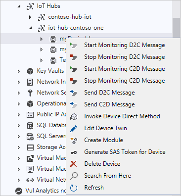

# Use Cloud Explorer for Visual Studio for Azure IoT Hub device management

In this article, you learn how to use the Cloud Explorer for Visual Studio with various management options on your development computer. [Cloud Explorer](https://marketplace.visualstudio.com/items?itemName=ms-azuretools.CloudExplorerForVS) is a useful Visual Studio extension that enables you to view your Azure resources, inspect their properties and perform key developer actions from within Visual Studio. It comes with management options that you can use to perform various tasks.

[!INCLUDE [iot-hub-basic](../../includes/iot-hub-basic-whole.md)]

| Management option          | Task                    |
|----------------------------|--------------------------------|
| Direct methods             | Make a device act such as starting or stopping sending messages or rebooting the device.                                        |
| Read device twin           | Get the reported state of a device. For example, the device reports the LED is blinking now.                                    |
| Update device twin         | Put a device into certain states, such as setting an LED to green or setting the telemetry send interval to 30 minutes.         |
| Cloud-to-device messages   | Send notifications to a device. For example, "It is very likely to rain today. Don't forget to bring an umbrella."              |

For more detailed explanation on the differences and guidance on using these options, see [Device-to-cloud communication guidance](iot-hub-devguide-d2c-guidance.md) and [Cloud-to-device communication guidance](iot-hub-devguide-c2d-guidance.md).

Device twins are JSON documents that store device state information, including metadata, configurations, and conditions. IoT Hub persists a device twin for each device that connects to it. For more information about device twins, see [Get started with device twins](iot-hub-node-node-twin-getstarted.md).

## Prerequisites

- An active Azure subscription.

- An Azure IoT Hub under your subscription.

- Microsoft Visual Studio 2017 Update 9 or later. This article uses [Visual Studio 2017 or Visual Studio 2019](https://www.visualstudio.com/vs/).

- Cloud Explorer component from Visual Studio Installer, which is selected by default with Azure Workload.

## Update Cloud Explorer to latest version

The Cloud Explorer component from Visual Studio Installer for Visual Studio 2017 only supports monitoring device-to-cloud and cloud-to-device messages. To use Visual Studio 2017, download and install the latest [Cloud Explorer](https://marketplace.visualstudio.com/items?itemName=ms-azuretools.CloudExplorerForVS).

## Sign in to access your hub

1. In Visual Studio, select **View** > **Cloud Explorer** to open Cloud Explorer.

1. Select the Account Management icon to show your subscriptions.

    

1. If you are signed in to Azure, your accounts appear. To sign into Azure for the first time, choose **Add an account**.

1. Select the Azure subscriptions you want to use and choose **Apply**.

1. Expand your subscription, then expand **IoT Hubs**.  Under each hub, you can see your devices for that hub. Right-click one device to access the management options.

    

## Direct methods

To use direct methods, do the following steps:

1. Right-click your device and select **Invoke Device Direct Method**.

1. Enter the method name and payload in **Invoke Direct Method**, and then select **OK**.

    Results appear in **Output**.

## Update device twin

To edit a device twin, do the following steps:

1. Right-click your device and select **Edit Device Twin**.

   An **azure-iot-device-twin.json** file opens with the content of device twin.

1. Make some edits of **tags** or **properties.desired** fields to the **azure-iot-device-twin.json** file.

1. Press **Ctrl+S** to update the device twin.

   Results appear in **Output**.

## Send cloud-to-device messages

To send a message from your IoT Hub to your device, follow these steps:

1. Right-click your device and select **Send C2D Message**.

1. Enter the message in **Send C2D message** and select **OK**.

   Results appear in **Output**.

## Next steps

You've learned how to use Cloud Explorer for Visual Studio with various management options.

[!INCLUDE [iot-hub-get-started-next-steps](../../includes/iot-hub-get-started-next-steps.md)]
