<properties
	pageTitle="Using the Azure IoT device SDK for C | Microsoft Azure"
	description="Learn about and get started working with the sample code in the Azure IoT device SDK for C."
	services="iot-hub"
	documentationCenter=""
	authors="olivierbloch"
	manager="timlt"
	editor=""/>

<tags
     ms.service="iot-hub"
     ms.devlang="cpp"
     ms.topic="article"
     ms.tgt_pltfrm="na"
     ms.workload="na"
     ms.date="03/29/2016"
     ms.author="obloch"/>

# Introducing the Azure IoT device SDK for C

The **Azure IoT device SDK** is a set of libraries designed to simplify the process of sending events and receiving messages from the **Azure IoT Hub** service. There are different variations of the SDK, each targeting a specific platform, but this article describes the **Azure IoT device SDK for C**.

The Azure IoT device SDK for C is written in ANSI C (C99) to maximize portability. This makes it well-suited to operate on a number of platforms and devices, especially where minimizing disk and memory footprint is a priority.  

There are a broad range of platforms on which the SDK has been tested (see the [platforms and compatibility list](iot-hub-tested-configurations.md) for details). Although this article includes walkthroughs of sample code running on the Windows platform, keep in mind that the code described in this article is exactly the same across the range of supported platforms.

In this article you'll be introduced to the architecture of the Azure IoT device SDK for C. We'll demonstrate how to initialize the device library, send events to IoT Hub as well as receive messages from it. The information in this article should be enough to get started using the SDK, but also provides pointers to additional information about the libraries.

>> [AZURE.NOTE] This article does not include information about how to use the *device management* capabilities of the C libraries in the SDK. To learn how to use the device management capabilities, see [Introducing the Azure IoT Hub device management library for C](iot-hub-device-management-library.md).

## SDK architecture

You can find the **Azure IoT device SDK for C** in the [Microsoft Azure IoT SDKs](https://github.com/Azure/azure-iot-sdks) GitHub repository and view details of the API in the [C API reference](http://azure.github.io/azure-iot-sdks/c/api_reference/index.html).

The latest version of the libraries can be found in the **master** branch of this repository:

  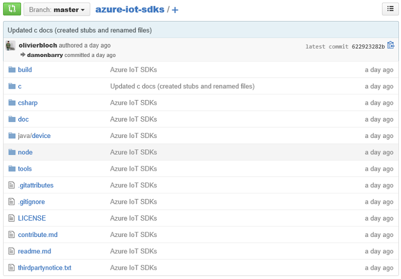

This repository contains the entire family of Azure IoT device SDKs. However, this article is about the Azure IoT device SDK *for C* which can be found in the **c** folder.

  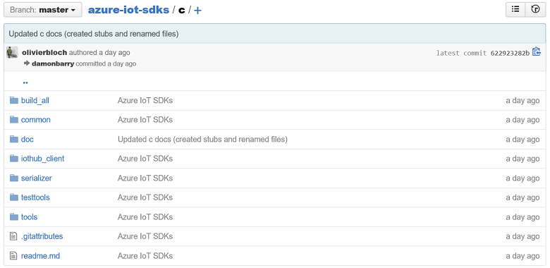

* The core implementation of the SDK can be found in the **iothub\_client** folder which contains the implementation of the lowest API layer in the SDK: the **IoTHubClient** library. The **IoTHubClient** library contains APIs implementing raw messaging for sending messages to IoT Hub as well as receiving messages from it. When using this library, you are responsible for implementing message serialization (eventually using the serializer sample described below), but other details of communicating with IoT Hub are handled for you.
* The **serializer** folder contains helper functions and samples showing how to serialize data before sending to Azure IoT Hub using the client library. Note that the use of the serializer is not mandatory and only provided as a convinience. If you use the **serializer** library, you start by defining a model that specifies the events you want to send to IoT Hub as well as the messages you expect to receive from it. Once the model is defined, the SDK provides you an API surface that enables you to easily work with events and messages without having to worry about serialization details
The library depends on other open source libraries that implement transport using several protocols (AMQP, MQTT).
* The **IoTHubClient** library depends on other open source libraries:
   * The [Azure C shared utility](https://github.com/Azure/azure-c-shared-utility) library which provides common functionality for basic tasks (like string, list manipulation, IO, etc...) needed accross several Azure related C SDKs
   * The [Azure uAMQP](https://github.com/Azure/azure-uamqp-c) library which is client side implementation of AMQP optimized for resource constraint devices.
   * The [Azure uMQTT](https://github.com/Azure/azure-umqtt-c) library which is a general purpose library implementing the MQTT protocol and optimized for resource constraint devices.

All of this is easier to understand by looking at example code. The following sections walk you through a couple of the sample applications that are included in the SDK. This should give you a good feel for the various capabilities of the architectural layers of the SDK as well as an introduction to how the APIs work.

## Before running the samples

Before you can run the samples in the Azure IoT device SDK for C you must create an instance of the service on your Azure subscription if you don't already have one and complete 2 tasks:
* prepare your development environment
* obtain device credentials.

If you need to create an instance of Azure IoT Hub on your Azure subscription, follow the instructions [here](https://github.com/Azure/azure-iot-sdks/blob/master/doc/setup_iothub.md).

The [readme file](https://github.com/Azure/azure-iot-sdks/tree/master/c) included with the SDK provides instructions for preparing your development environment and obtain device credentials.
The following sections include some additional commentary on those instructions.

### Preparing your development environment

While packages are provided for some platforms (such as NuGet for Windows or apt_get for Debian and Ubuntu) and the samples use these packages when available, the below instructions detail how to build the library and the samples directly form the code.

First, you'll need to obtain a copy of the SDK from GitHub and then build the source. You should get a copy of the source from the **master** branch of the [GitHub repository](https://github.com/Azure/azure-iot-sdks).

When you’ve downloaded a copy of the source, you must complete the steps described in the SDK article ["Prepare your development environment"](https://github.com/Azure/azure-iot-sdks/blob/master/c/doc/devbox_setup.md).


The following are a few tips to help you complete the procedure described in the preparation guide:

-   When you install the **CMake** utility, choose the option to add **CMake** to the system PATH for **all users** (adding to **the current user** works as well):

  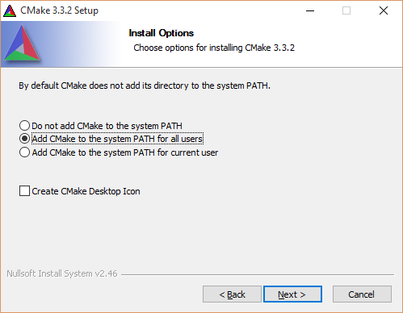


-   Before you open the **Developer Command Prompt for VS2015**, install the Git command line tools. To install these tools, complete the following steps:

	1. Launch the **Visual Studio 2015** setup program (or chose **Microsoft Visual Studio 2015** from the **Programs and Features** control panel and select **Change**).
	
	2. Make sure the **Git for Windows** feature is selected in the installer but you may also want to check the **GitHub Extension for Visual Studio** option to provide IDE integration:

  		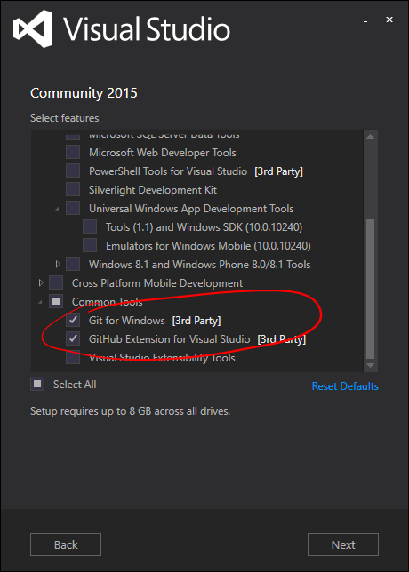

	3. Complete the setup wizard to install the tools.

	4. Add the Git tools **bin** directory to the system **PATH** environment variable. On Windows, this looks like the following:

  		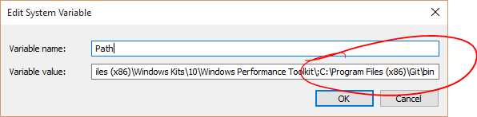


When you have completed all the steps described in the ["Prepare your development environment"](https://github.com/Azure/azure-iot-sdks/blob/master/c/doc/devbox_setup.md) page, you're ready to compile the sample applications.

### Obtaining device credentials

Now that your development environment is set up, the next thing to do is to get a set of device credentials.  For a device to be able to access an IoT hub, you must first add the device to the IoT Hub device registry. When you add your device you'll get a set of device credentials which you'll need in order for the device to be able to connect to an IoT hub. The sample applications that we’ll look at in the next section expect these credentials in the form of a **device connection string**.

There are a couple tools provided in the SDK open source repository to help managing the IoT Hub. One is a Windows application called Device Explorer, the second one is a node.js based cross platform CLI tool caled iothub-explorer. You can learn more about these tools [here](https://github.com/Azure/azure-iot-sdks/blob/master/doc/manage_iot_hub.md).

As we are going through running the samples on Windows in this article, we are using the Device Explorer tool. But you can also use iothub-explorer if you prefer CLI tools.

The [Device Explorer](https://github.com/Azure/azure-iot-sdks/tree/master/tools/DeviceExplorer) tool uses the Azure IoT service libraries to perform various functions on IoT Hub, including adding devices. If you use Device Explorer to add a device, you’ll get a corresponding connection string. You need this connection string to make the sample applications run.

In case you're not already familiar with the process, the following procedure describes how to use Device Explorer to add a device and obtain a device connection string.

You can find a Windows installer for the Device Explorer tool on the [SDK release page](https://github.com/Azure/azure-iot-sdks/releases). But you can also run the tool directly from its code opening **[DeviceExplorer.sln](https://github.com/Azure/azure-iot-sdks/blob/master/tools/DeviceExplorer/DeviceExplorer.sln)** in **Visual Studio 2015** and building the solution.

When you run the program you’ll see this interface:

  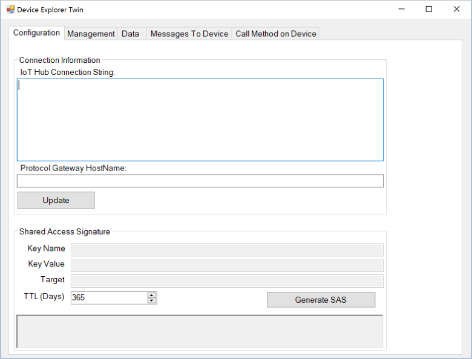

Enter your **IoT Hub Connection String** in the first field and click **Update**. This configures the tool so that it can communicate with IoT Hub.

Once the IoT Hub connection string is configured click the **Management** tab:

  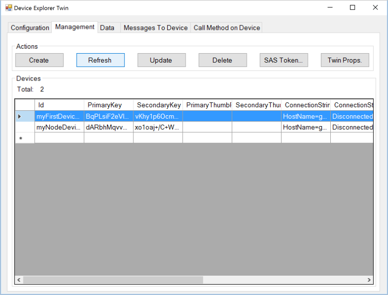

This is where you’ll manage the devices registered in your IoT hub.

You can create a device by clicking the **Create** button. A dialog is displayed with a set of pre-populated keys (primary and secondary). All you have to do is enter a **Device ID** and then click **Create**.

  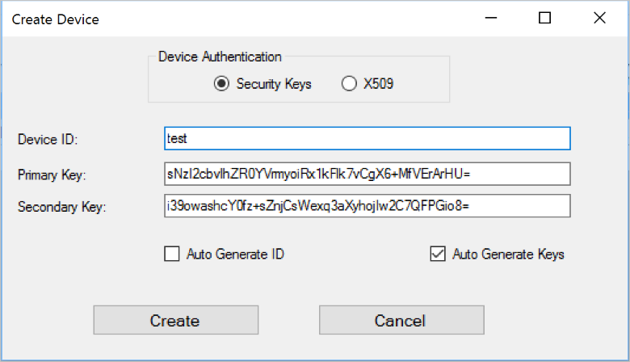

Once the device is created, the Devices list is updated with all registered devices, including the one you just created. If you right-click your new device, you’ll see this menu:

  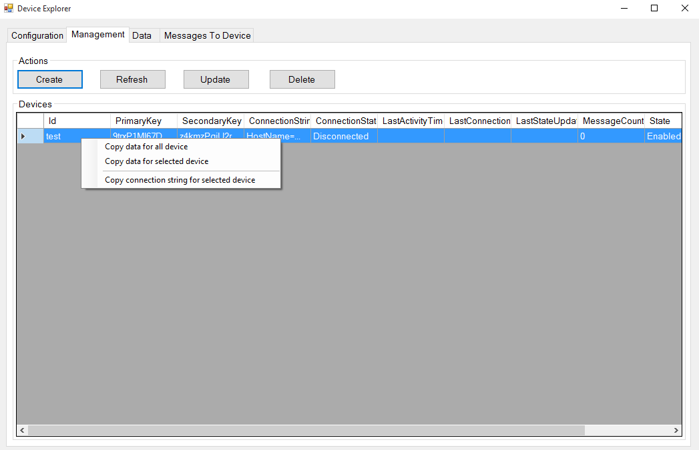

If you choose the **Copy connection string for selected device** option, the connection string for your device is copied to the clipboard. Keep a copy of the connection string. You’ll need it when running the sample applications described in the next sections.

Once you've completed the steps above, you're ready to start running some code. Both samples have a constant at the top of the main source file that enables you to enter a connection string. For example, the corresponding line from the **iothub\_client\_sample\_amqp** application appears as follows.

```
static const char* connectionString = "[device connection string]";
```

If you want to follow along, enter your device connection string here, recompile the solution, and you'll be able to run the sample.

## IoTHubClient

Within the **iothub\_client** folder in the azure-iot-sdks repository, there is a **samples** folder that contains an application called **iothub\_client\_sample\_amqp**.

The Windows version of the **iothub\_client\_sample\_ampq** application includes the following Visual Studio solution:

  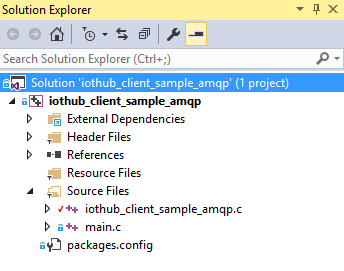

This solution contains a single project. It is worth noting that there are four NuGet packages installed in this solution:

- Microsoft.Azure.C.SharedUtility
- Microsoft.Azure.IoTHub.AmqpTransport
- Microsoft.Azure.IoTHub.IoTHubClient
- Microsoft.Azure.uamqp

You always need the **Microsoft.Azure.C.SharedUtility** package when you are working with the SDK. Since this sample relies on AMQP, you must also include the **Microsoft.Azure.uamqp** and **Microsoft.Azure.IoTHub.AmqpTransport** packages (there are equivalent packages for HTTP and MQTT). Because the sample uses the **IoTHubClient** library, you must also include the **Microsoft.Azure.IoTHub.IoTHubClient** package in your solution.

You can find the implementation for the sample application in the **iothub\_client\_sample\_amqp.c** source file.

We'll use this sample application to walk you through what’s required to use the **IoTHubClient** library.

### Initializing the library

> [AZURE.NOTE] Before you start working with the libraries, you may need to perform some platform specific initialization. For example, if you plan to use AMQPS on Linux you must initialize the OpenSSL library. The samples in the [GitHub repository](https://github.com/Azure/azure-iot-sdks) call the utility function **platform_init** when the client starts and call the **platform_deinit** function before exiting. These functions are declared in the "platform.h" header file. You should examine the definitions of these functions for your target platform in the [repository](https://github.com/Azure/azure-iot-sdks) to determine whether you need to include any platform initialization code in your client.

To start working with the libraries you must first allocate an IoT Hub client handle:

```
IOTHUB_CLIENT_HANDLE iotHubClientHandle;
iotHubClientHandle = IoTHubClient_CreateFromConnectionString(connectionString, AMQP_Protocol);
```

Note that we’re passing a copy of our device connection string to this function (the one we obtained from Device Explorer). We also designate the protocol that we want to use. This example uses AMQP, but MQTT and HTTP are also an option.

When you have a valid **IOTHUB\_CLIENT\_HANDLE**, you can start calling the APIs to send events and receive messages from IoT Hub. We’ll look at that next.

### Sending events

Sending events to IoT Hub requires that you complete the following steps:

First, create a message:

```
EVENT_INSTANCE message;
sprintf_s(msgText, sizeof(msgText), "Message_%d_From_IoTHubClient_Over_AMQP", i);
message.messageHandle = IoTHubMessage_CreateFromByteArray((const unsigned char*)msgText, strlen(msgText);
```

Next, send the message:

```
IoTHubClient_SendEventAsync(iotHubClientHandle, message.messageHandle, SendConfirmationCallback, &message);
```

Every time you send a message, you specify a reference to a callback function that’s invoked when the data is sent:

```
static void SendConfirmationCallback(IOTHUB_CLIENT_CONFIRMATION_RESULT result, void* userContextCallback)
{
    EVENT_INSTANCE* eventInstance = (EVENT_INSTANCE*)userContextCallback;
    (void)printf("Confirmation[%d] received for message tracking id = %d with result = %s\r\n", callbackCounter, eventInstance->messageTrackingId, ENUM_TO_STRING(IOTHUB_CLIENT_CONFIRMATION_RESULT, result));
    /* Some device specific action code goes here... */
    callbackCounter++;
    IoTHubMessage_Destroy(eventInstance->messageHandle);
}
```

Note the call to the **IoTHubMessage\_Destroy** function when you’re done with the message. You must make this call to free the resources allocated when you created the message.

### Receiving messages

Receiving a message is an asynchronous operation. First, you register a callback to be invoked when the device receives a message:

```
int receiveContext = 0;
IoTHubClient_SetMessageCallback(iotHubClientHandle, ReceiveMessageCallback, &receiveContext);
```

The last parameter is a void pointer to whatever you want. In the sample, it’s a pointer to an integer but it could be a pointer to a more complex data structure. This enables the callback function to operate on shared state with the caller of this function.

When the device receives a message, the registered callback function is invoked:

```
static IOTHUBMESSAGE_DISPOSITION_RESULT ReceiveMessageCallback(IOTHUB_MESSAGE_HANDLE message, void* userContextCallback)
{
    int* counter = (int*)userContextCallback;
    const char* buffer;
    size_t size;
    if (IoTHubMessage_GetByteArray(message, (const unsigned char**)&buffer, &size) == IOTHUB_MESSAGE_OK)
    {
        (void)printf("Received Message [%d] with Data: <<<%.*s>>> & Size=%d\r\n", *counter, (int)size, buffer, (int)size);
    }

    /* Some device specific action code goes here... */
    (*counter)++;
    return IOTHUBMESSAGE_ACCEPTED;
}
```

Note that you use the **IoTHubMessage\_GetByteArray** function to retrieve the message, which in this example is a string.

### Uninitializing the library

When you’re done sending events and receiving messages, you can uninitialize the IoT library. To do so, issue the following function call:

```
IoTHubClient_Destroy(iotHubClientHandle);
```

This frees up the resources previously allocated by the **IoTHubClient\_CreateFromConnectionString** function.

As you can see, it’s easy to send events and receive messages with the **IoTHubClient** library. The library handles the details of communicating with IoT Hub, including which protocol to use (from the perspective of the developer, this is a simple configuration option).

The **IoTHubClient** library also provides precise control over how to serialize the events your device sends to IoT Hub. In some cases this is an advantage, but in other cases this is an implementation detail with which you don’t want to be concerned. If that's the case, you might consider using the **serializer** library, which we'll describe in the next section.

## Serializer

Conceptually the **serializer** library sits on top of the **IoTHubClient** library in the SDK. It uses the **IoTHubClient** library for the underlying communication with IoT Hub, but it adds modeling capabilities that remove the burden of dealing with message serialization from the developer. How this library works is best demonstrated by an example.

Within the **serializer** folder in the azure-iot-sdks repository is a **samples** folder that contains an application called **simplesample\_amqp**. The Windows version of this sample includes the following Visual Studio solution:

  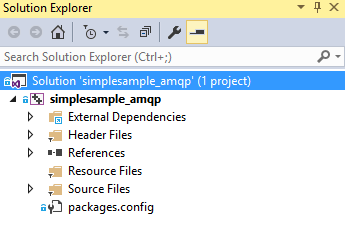

As with the previous sample, this one includes several NuGet packages:

- Microsoft.Azure.C.SharedUtility
- Microsoft.Azure.IoTHub.AmqpTransport
- Microsoft.Azure.IoTHub.IoTHubClient
- Microsoft.Azure.IoTHub.Serializer
- Microsoft.Azure.uamqp

We've seen most of these in the previous sample, but **Microsoft.Azure.IoTHub.Serializer** is new. This is required when we use the **serializer** library.

You can find the implementation of the sample application in the **simplesample\_amqp.c** file.

The following sections walk you through the key parts of this sample.

### Initializing the library

To start working with the **serializer** library, you must call the initialization APIs:

```
serializer_init(NULL);

IOTHUB_CLIENT_HANDLE iotHubClientHandle = IoTHubClient_CreateFromConnectionString(connectionString, AMQP_Protocol);

ContosoAnemometer* myWeather = CREATE_MODEL_INSTANCE(WeatherStation, ContosoAnemometer);
```

The call to the **serializer\_init** function is a one-time call and is used to initialize the underlying library. Then, you call the **IoTHubClient\_CreateFromConnectionString** function, which is the same API as in the **IoTHubClient** sample. This call sets your device connection string (this is also where you choose the protocol you want to use). Note that this sample uses AMQP as the transport, but could have used HTTP.

Finally, call the **CREATE\_MODEL\_INSTANCE** function. Note that **WeatherStation** is the namespace of the model and **ContosoAnemometer** is the name of the model. Once the model instance is created, you can use it to start sending events and receiving messages. However, it's important to understand what a model is.

### Defining the model

A model in the **serializer** library defines the events that your device can send to IoT Hub and the messages, called *actions* in the modeling language, which it can receive. You define a model using a set of C macros as in the **simplesample\_amqp** sample application:

```
BEGIN_NAMESPACE(WeatherStation);

DECLARE_MODEL(ContosoAnemometer,
WITH_DATA(ascii_char_ptr, DeviceId),
WITH_DATA(double, WindSpeed),
WITH_ACTION(TurnFanOn),
WITH_ACTION(TurnFanOff),
WITH_ACTION(SetAirResistance, int, Position)
);

END_NAMESPACE(WeatherStation);
```

The **BEGIN\_NAMESPACE** and **END\_NAMESPACE** macros both take the namespace of the model as an argument. It’s expected that anything between these macros is the definition of your model(s) and the data structures that the models use.

In this example, there is a single model called **ContosoAnemometer**. This model defines two events that your device can send to IoT Hub: **DeviceId** and **WindSpeed**. It also defines three actions (messages) that your device can receive: **TurnFanOn**, **TurnFanOff**, and **SetAirResistance**. Each event has a type, and each action has a name (and optionally a set of parameters).

The events and actions defined in the model define an API surface that you can use to send events to IoT Hub, as well as respond to messages being sent to the device. This is best understood through an example.

### Sending events

The model defines the events that you can send to IoT Hub. In this example, that means one of the two events defined using the **WITH_DATA** macro. For example, if you want to send a **WindSpeed** event to an IoT hub, there are a few steps involved in making this happen. The first is to set the data we want to send:

```
myWeather->WindSpeed = 15;
```

The model we defined earlier allows us to do this by setting a member of a **struct**. Next, we serialize the event we want to send:

```
unsigned char* destination;
size_t destinationSize;

SERIALIZE(&destination, &destinationSize, myWeather->WindSpeed);
```

This code serializes the event to a buffer (referenced by **destination**). Finally, we’ll send the event to IoT hub with this code:

```
sendMessage(iotHubClientHandle, destination, destinationSize);
```

This is a helper function in the sample application that sends our serialized event to IoT Hub:

```
static void sendMessage(IOTHUB_CLIENT_HANDLE iotHubClientHandle, const unsigned char* buffer, size_t size)
{
    static unsigned int messageTrackingId;
    IOTHUB_MESSAGE_HANDLE messageHandle = IoTHubMessage_CreateFromByteArray(buffer, size);
    if (messageHandle != NULL)
    {
        if (IoTHubClient_SendEventAsync(iotHubClientHandle, messageHandle, sendCallback, (void*)(uintptr_t)messageTrackingId) != IOTHUB_CLIENT_OK)
        {
            printf("failed to hand over the message to IoTHubClient");
        }
        else
        {
            printf("IoTHubClient accepted the message for delivery\r\n");
        }

        IoTHubMessage_Destroy(messageHandle);
    }
    free((void*)buffer);
    messageTrackingId++;
}
```

This code is very similar to what we saw in the **iothub\_client\_sample\_amqp** application, in which we created a message from a byte array and then used **IoTHubClient\_SendEventAsync** to send it to IoT Hub. After that we just have to free the message handle and serialized data buffer we allocated earlier.

The second to last parameter of **IoTHubClient\_SendEventAsync** is a reference to a callback function that’s called when the data is successfully sent. Here's an example of a callback function:

```
void sendCallback(IOTHUB_CLIENT_CONFIRMATION_RESULT result, void* userContextCallback)
{
    int messageTrackingId = (intptr_t)userContextCallback;

    (void)printf("Message Id: %d Received.\r\n", messageTrackingId);

    (void)printf("Result Call Back Called! Result is: %s \r\n", ENUM_TO_STRING(IOTHUB_CLIENT_CONFIRMATION_RESULT, result));
}
```

The second parameter is a pointer to user context; the same pointer we passed to **IoTHubClient\_SendEventAsync**. In this case the context is a simple counter, but it can be anything you want.

That's all there is to sending events. The only thing left to cover is how to receive messages.

### Receiving messages

Receiving a message works similarly to the way messages work in the **IoTHubClient** library. First, you register a message callback function:

```
IoTHubClient_SetMessageCallback(iotHubClientHandle, IoTHubMessage, myWeather)
```

Then, you write the callback function that's invoked when a message is received:

```
static IOTHUBMESSAGE_DISPOSITION_RESULT IoTHubMessage(IOTHUB_MESSAGE_HANDLE message, void* userContextCallback)
{
    IOTHUBMESSAGE_DISPOSITION_RESULT result;
    const unsigned char* buffer;
    size_t size;
    if (IoTHubMessage_GetByteArray(message, &buffer, &size) != IOTHUB_MESSAGE_OK)
    {
        printf("unable to IoTHubMessage_GetByteArray\r\n");
        result = EXECUTE_COMMAND_ERROR;
    }
    else
    {
        /*buffer is not zero terminated*/
        char* temp = malloc(size + 1);
        if (temp == NULL)
        {
            printf("failed to malloc\r\n");
            result = EXECUTE_COMMAND_ERROR;
        }
        else
        {
            memcpy(temp, buffer, size);
            temp[size] = '\0';
            EXECUTE_COMMAND_RESULT executeCommandResult = EXECUTE_COMMAND(userContextCallback, temp);
            result =
                (executeCommandResult == EXECUTE_COMMAND_ERROR) ? IOTHUBMESSAGE_ABANDONED :
                (executeCommandResult == EXECUTE_COMMAND_SUCCESS) ? IOTHUBMESSAGE_ACCEPTED :
                IOTHUBMESSAGE_REJECTED;
            free(temp);
        }
    }
    return result;
}
```

This code is boilerplate -- it's the same for any solution. This function receives the message and takes care of routing it to the appropriate function through the call to **EXECUTE\_COMMAND**. The function called at this point depends on the definition of the actions in our model.

When you define an action in your model, you're required to implement a function that's called when your device receives the corresponding message. For example, if your model defines this action:

```
WITH_ACTION(SetAirResistance, int, Position)
```

You must define a function with this signature:

```
EXECUTE_COMMAND_RESULT SetAirResistance(ContosoAnemometer* device, int Position)
{
    (void)device;
    (void)printf("Setting Air Resistance Position to %d.\r\n", Position);
    return EXECUTE_COMMAND_SUCCESS;
}
```

Note that the name of the function matches the name of the action in the model and that the parameters of the function match the parameters specified for the action. The first parameter is always required and contains a pointer to the instance of our model.

When the device receives a message that matches this signature, the corresponding function is called. Therefore, aside from having to include the boilerplate code from **IoTHubMessage**, receiving messages is just a matter of defining a simple function for each action defined in your model.

### Uninitializing the library

When you’re done sending data and receiving messages, you can uninitialize the IoT library:

```
        DESTROY_MODEL_INSTANCE(myWeather);
    }
    IoTHubClient_Destroy(iotHubClientHandle);
}
serializer_deinit();
```

Each of these three functions align with the three initialization functions described previously. Calling these APIs ensures that you free previously allocated resources.

## Next Steps

This article covered the basics of using the libraries in the **Azure IoT device SDK for C**. It provided you with enough information to understand what’s included in the SDK, its architecture, and how to get started working with the Windows samples. The next article continues the description of the SDK by explaining [more about the IoTHubClient library](iot-hub-device-sdk-c-iothubclient.md).

To learn how to use the device management capabilities in the **Azure IoT device SDK for C**, see [Introducing the Azure IoT Hub device management library for C](iot-hub-device-management-library.md).

To learn more about developing for IoT Hub, see the [IoT Hub SDKs][lnk-sdks].

To further explore the capabilities of IoT Hub, see:

- [Designing your solution][lnk-design]
- [Exploring device management using the sample UI][lnk-dmui]
- [Simulating a device with the Gateway SDK][lnk-gateway]
- [Using the Azure Portal to manage IoT Hub][lnk-portal]

[lnk-file upload]: iot-hub-csharp-csharp-file-upload.md
[lnk-create-hub]: iot-hub-rm-template-powershell.md
[lnk-c-sdk]: iot-hub-device-sdk-c-intro.md
[lnk-sdks]: iot-hub-sdks-summary.md

[lnk-design]: iot-hub-guidance.md
[lnk-dmui]: iot-hub-device-management-ui-sample.md
[lnk-gateway]: iot-hub-linux-gateway-sdk-simulated-device.md
[lnk-portal]: iot-hub-manage-through-portal.md