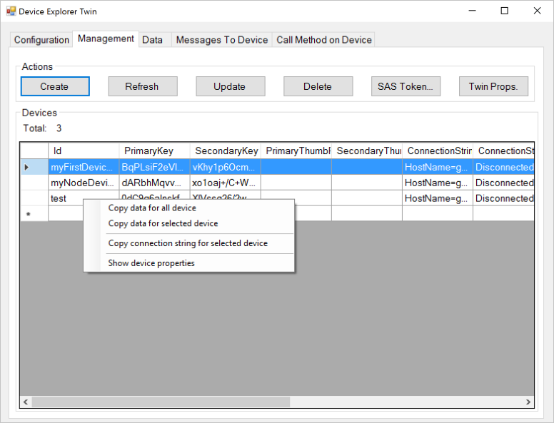
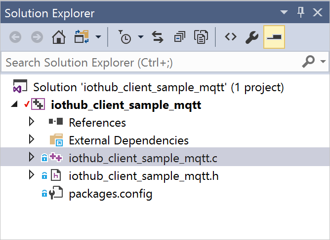

# Azure IoT device SDK for C

The **Azure IoT device SDK** is a set of libraries designed to simplify the process of sending messages to and receiving messages from the **Azure IoT Hub** service. There are different variations of the SDK, each targeting a specific platform, but this article describes the **Azure IoT device SDK for C**.

> [!NOTE]
> The Embedded C SDK is an alternative for constrained devices that supports the bring your own network (BYON) approach. IoT developers have the freedom to bring the MQTT client, TLS, and socket of their choice to create a device solution. [Learn more about the Embedded C SDK](https://github.com/Azure/azure-sdk-for-c/tree/master/sdk/docs/iot).

[!INCLUDE [iot-hub-basic](../../includes/iot-hub-basic-partial.md)]

The Azure IoT device SDK for C is written in ANSI C (C99) to maximize portability. This feature makes the libraries well suited to operate on multiple platforms and devices, especially where minimizing disk and memory footprint is a priority.

There are a broad range of platforms on which the SDK has been tested (see the [Azure Certified for IoT device catalog](https://devicecatalog.azure.com/) for details). Although this article includes walkthroughs of sample code running on the Windows platform, the code described in this article is identical across the range of supported platforms.

The following video presents an overview of the Azure IoT SDK for C:

>[!VIDEO https://learn.microsoft.com/Shows/Internet-of-Things-Show/Azure-IoT-C-SDK-insights/Player]

This article introduces you to the architecture of the Azure IoT device SDK for C. It demonstrates how to initialize the device library, send data to IoT Hub, and receive messages from it. The information in this article should be enough to get started using the SDK, but also provides pointers to additional information about the libraries.

## SDK architecture

You can find the [**Azure IoT device SDK for C**](https://github.com/Azure/azure-iot-sdk-c) GitHub repository and view details of the API in the [C API reference](https://github.com/Azure/azure-iot-sdk-c/).

The latest version of the libraries can be found in the **main** branch of the repository:

  

* The core implementation of the SDK is in the **iothub\_client** folder that contains the implementation of the lowest API layer in the SDK: the **IoTHubClient** library. The **IoTHubClient** library contains APIs implementing raw messaging for sending messages to IoT Hub and receiving messages from IoT Hub. When using this library, you are responsible for implementing message serialization, but other details of communicating with IoT Hub are handled for you.

* The **IoTHubClient** library depends on other open-source libraries:

  * The [Azure C shared utility](https://github.com/Azure/azure-c-shared-utility) library, which provides common functionality for basic tasks (such as strings, list manipulation, and IO) needed across several Azure-related C SDKs.

  * The [Azure uAMQP](https://github.com/Azure/azure-uamqp-c) library, which is a client-side implementation of AMQP optimized for resource constrained devices.

  * The [Azure uMQTT](https://github.com/Azure/azure-umqtt-c) library, which is a general-purpose library implementing the MQTT protocol and optimized for resource constrained devices.

Use of these libraries is easier to understand by looking at example code. The following sections walk you through several of the sample applications that are included in the SDK. This walkthrough should give you a good feel for the various capabilities of the architectural layers of the SDK and an introduction to how the APIs work.

## Before you run the samples

Before you can run the samples in the Azure IoT device SDK for C, you must [create an instance of the IoT Hub service](iot-hub-create-through-portal.md) in your Azure subscription. Then complete the following tasks:

* Prepare your development environment
* Obtain device credentials.

### Prepare your development environment

Packages are provided for common platforms (such as NuGet for Windows or apt_get for Debian and Ubuntu) and the samples use these packages when available. In some cases, you need to compile the SDK for or on your device. If you need to compile the SDK, see [Prepare your development environment](https://github.com/Azure/azure-iot-sdk-c/blob/master/doc/devbox_setup.md) in the GitHub repository.

To obtain the sample application code, download a copy of the SDK from GitHub. Get your copy of the source from the **main** branch of the [GitHub repository](https://github.com/Azure/azure-iot-sdk-c).


### Obtain the device credentials

Now that you have the sample source code, the next thing to do is to get a set of device credentials. For a device to be able to access an IoT hub, you must first add the device to the IoT Hub identity registry. When you add your device, you get a set of device credentials that you need for the device to be able to connect to the IoT hub. The sample applications discussed in the next section expect these credentials in the form of a **device connection string**.

There are several open-source tools to help you manage your IoT hub.

* A Windows application called [Azure IoT Explorer](https://github.com/Azure/azure-iot-explorer).

* A cross-platform Visual Studio Code extension called [Azure IoT Tools](https://marketplace.visualstudio.com/items?itemName=vsciot-vscode.azure-iot-tools).

* A cross-platform Python CLI called [the IoT extension for Azure CLI](https://github.com/Azure/azure-iot-cli-extension).

This tutorial uses the graphical *device explorer* tool. You can use the *Azure IoT Tools for VS Code* if you develop in VS Code. You can also use the *IoT extension for Azure CLI 2.0* tool if you prefer to use a CLI tool.

The device explorer tool uses the Azure IoT service libraries to perform various functions on IoT Hub, including adding devices. If you use the device explorer tool to add a device, you get a connection string for your device. You need this connection string to run the sample applications.

If you're not familiar with the device explorer tool, the following procedure describes how to use it to add a device and obtain a device connection string.

1. To install the device explorer tool, see [How to use the Device Explorer for IoT Hub devices](https://github.com/Azure/azure-iot-sdk-csharp/tree/main/tools/).

1. When you run the program, you see this interface:

   

1. Enter your **IoT Hub Connection String** in the first field and click **Update**. This step configures the tool so that it can communicate with IoT Hub. 

The **Connection String** can be found under **IoT Hub Service** > **Settings** > **Shared Access Policy** > **iothubowner**.

1. When the IoT Hub connection string is configured, click the **Management** tab:

   

This tab is where you manage the devices registered in your IoT hub.

1. You create a device by clicking the **Create** button. A dialog displays with a set of pre-populated keys (primary and secondary). Enter a **Device ID** and then click **Create**.

   

1. When the device is created, the Devices list updates with all the registered devices, including the one you just created. If you right-click your new device, you see this menu:

   

1. If you choose **Copy connection string for selected device**, the device connection string is copied to the clipboard. Keep a copy of the device connection string. You need it when running the sample applications described in the following sections.

When you've completed the steps above, you're ready to start running some code. Most samples have a constant at the top of the main source file that enables you to enter a connection string. For example, the corresponding line from the **iothub_client\_samples\_iothub_convenience_sample** application appears as follows.

```c
static const char* connectionString = "[device connection string]";
```

## Use the IoTHubClient library

Within the **iothub\_client** folder in the [azure-iot-sdk-c](https://github.com/azure/azure-iot-sdk-c) repository, there is a **samples** folder that contains an application called **iothub\_client\_sample\_mqtt**.

The Windows version of the **iothub_client\_samples\_iothub_convenience_sample** application includes the following Visual Studio solution:

  

> [!NOTE]
> If Visual Studio asks you to retarget the project to the latest version, accept the prompt.

This solution contains a single project. There are four NuGet packages installed in this solution:

* Microsoft.Azure.C.SharedUtility
* Microsoft.Azure.IoTHub.MqttTransport
* Microsoft.Azure.IoTHub.IoTHubClient
* Microsoft.Azure.umqtt

You always need the **Microsoft.Azure.C.SharedUtility** package when you are working with the SDK. This sample uses the MQTT protocol, therefore you must include the **Microsoft.Azure.umqtt** and **Microsoft.Azure.IoTHub.MqttTransport** packages (there are equivalent packages for AMQP and HTTPS). Because the sample uses the **IoTHubClient** library, you must also include the **Microsoft.Azure.IoTHub.IoTHubClient** package in your solution.

You can find the implementation for the sample application in the **iothub_client\_samples\_iothub_convenience_sample** source file.

The following steps use this sample application to walk you through what's required to use the **IoTHubClient** library.

### Initialize the library

> [!NOTE]
> Before you start working with the libraries, you may need to perform some platform-specific initialization. For example, if you plan to use AMQP on Linux you must initialize the OpenSSL library. The samples in the [GitHub repository](https://github.com/Azure/azure-iot-sdk-c) call the utility function **platform\_init** when the client starts and call the **platform\_deinit** function before exiting. These functions are declared in the platform.h header file. Examine the definitions of these functions for your target platform in the [repository](https://github.com/Azure/azure-iot-sdk-c) to determine whether you need to include any platform-specific initialization code in your client.

To start working with the libraries, first allocate an IoT Hub client handle:

```c
if ((iotHubClientHandle = 
  IoTHubClient_LL_CreateFromConnectionString(connectionString, MQTT_Protocol)) == NULL)
{
    (void)printf("ERROR: iotHubClientHandle is NULL!\r\n");
}
else
{
    ...
```

You pass a copy of the device connection string you obtained from the device explorer tool to this function. You also designate the communications protocol to use. This example uses MQTT, but AMQP and HTTPS are also options.

When you have a valid **IOTHUB\_CLIENT\_HANDLE**, you can start calling the APIs to send and receive messages to and from IoT Hub.

### Send messages

The sample application sets up a loop to send messages to your IoT hub. The following snippet:

- Creates a message.
- Adds a property to the message.
- Sends a message.

First, create a message:

```c
size_t iterator = 0;
do
{
    if (iterator < MESSAGE_COUNT)
    {
        sprintf_s(msgText, sizeof(msgText), "{\"deviceId\":\"myFirstDevice\",\"windSpeed\":%.2f}", avgWindSpeed + (rand() % 4 + 2));
        if ((messages[iterator].messageHandle = IoTHubMessage_CreateFromByteArray((const unsigned char*)msgText, strlen(msgText))) == NULL)
        {
            (void)printf("ERROR: iotHubMessageHandle is NULL!\r\n");
        }
        else
        {
            messages[iterator].messageTrackingId = iterator;
            MAP_HANDLE propMap = IoTHubMessage_Properties(messages[iterator].messageHandle);
            (void)sprintf_s(propText, sizeof(propText), "PropMsg_%zu", iterator);
            if (Map_AddOrUpdate(propMap, "PropName", propText) != MAP_OK)
            {
                (void)printf("ERROR: Map_AddOrUpdate Failed!\r\n");
            }

            if (IoTHubClient_LL_SendEventAsync(iotHubClientHandle, messages[iterator].messageHandle, SendConfirmationCallback, &messages[iterator]) != IOTHUB_CLIENT_OK)
            {
                (void)printf("ERROR: IoTHubClient_LL_SendEventAsync..........FAILED!\r\n");
            }
            else
            {
                (void)printf("IoTHubClient_LL_SendEventAsync accepted message [%d] for transmission to IoT Hub.\r\n", (int)iterator);
            }
        }
    }
    IoTHubClient_LL_DoWork(iotHubClientHandle);
    ThreadAPI_Sleep(1);

    iterator++;
} while (g_continueRunning);
```

Every time you send a message, you specify a reference to a callback function that's invoked when the data is sent. In this example, the callback function is called **SendConfirmationCallback**. The following snippet shows this callback function:

```c
static void SendConfirmationCallback(IOTHUB_CLIENT_CONFIRMATION_RESULT result, void* userContextCallback)
{
    EVENT_INSTANCE* eventInstance = (EVENT_INSTANCE*)userContextCallback;
    (void)printf("Confirmation[%d] received for message tracking id = %zu with result = %s\r\n", callbackCounter, eventInstance->messageTrackingId, MU_ENUM_TO_STRING(IOTHUB_CLIENT_CONFIRMATION_RESULT, result));
    /* Some device specific action code goes here... */
    callbackCounter++;
    IoTHubMessage_Destroy(eventInstance->messageHandle);
}
```

Note the call to the **IoTHubMessage\_Destroy** function when you're done with the message. This function frees the resources allocated when you created the message.

### Receive messages

Receiving a message is an asynchronous operation. First, you register the callback to invoke when the device receives a message:

```c
if (IoTHubClient_LL_SetMessageCallback(iotHubClientHandle, ReceiveMessageCallback, &receiveContext) != IOTHUB_CLIENT_OK)
{
    (void)printf("ERROR: IoTHubClient_LL_SetMessageCallback..........FAILED!\r\n");
}
else
{
    (void)printf("IoTHubClient_LL_SetMessageCallback...successful.\r\n");
    ...
```

The last parameter is a void pointer to whatever you want. In the sample, it's a pointer to an integer but it could be a pointer to a more complex data structure. This parameter enables the callback function to operate on shared state with the caller of this function.

When the device receives a message, the registered callback function is invoked. This callback function retrieves:

* The message ID and correlation ID from the message.
* The message content.
* Any custom properties from the message.

```c
static IOTHUBMESSAGE_DISPOSITION_RESULT ReceiveMessageCallback(IOTHUB_MESSAGE_HANDLE message, void* userContextCallback)
{
    int* counter = (int*)userContextCallback;
    const char* buffer;
    size_t size;
    MAP_HANDLE mapProperties;
    const char* messageId;
    const char* correlationId;

    // Message properties
    if ((messageId = IoTHubMessage_GetMessageId(message)) == NULL)
    {
        messageId = "<null>";
    }

    if ((correlationId = IoTHubMessage_GetCorrelationId(message)) == NULL)
    {
        correlationId = "<null>";
    }

    // Message content
    if (IoTHubMessage_GetByteArray(message, (const unsigned char**)&buffer, &size) != IOTHUB_MESSAGE_OK)
    {
        (void)printf("unable to retrieve the message data\r\n");
    }
    else
    {
        (void)printf("Received Message [%d]\r\n Message ID: %s\r\n Correlation ID: %s\r\n Data: <<<%.*s>>> & Size=%d\r\n", *counter, messageId, correlationId, (int)size, buffer, (int)size);
        // If we receive the work 'quit' then we stop running
        if (size == (strlen("quit") * sizeof(char)) && memcmp(buffer, "quit", size) == 0)
        {
            g_continueRunning = false;
        }
    }

    // Retrieve properties from the message
    mapProperties = IoTHubMessage_Properties(message);
    if (mapProperties != NULL)
    {
        const char*const* keys;
        const char*const* values;
        size_t propertyCount = 0;
        if (Map_GetInternals(mapProperties, &keys, &values, &propertyCount) == MAP_OK)
        {
            if (propertyCount > 0)
            {
                size_t index;

                printf(" Message Properties:\r\n");
                for (index = 0; index < propertyCount; index++)
                {
                    (void)printf("\tKey: %s Value: %s\r\n", keys[index], values[index]);
                }
                (void)printf("\r\n");
            }
        }
    }

    /* Some device specific action code goes here... */
    (*counter)++;
    return IOTHUBMESSAGE_ACCEPTED;
}
```

Use the **IoTHubMessage\_GetByteArray** function to retrieve the message, which in this example is a string.

### Uninitialize the library

When you're done sending events and receiving messages, you can uninitialize the IoT library. To do so, issue the following function call:

```c
IoTHubClient_LL_Destroy(iotHubClientHandle);
```

This call frees up the resources previously allocated by the **IoTHubClient\_CreateFromConnectionString** function.

As you can see, it's easy to send and receive messages with the **IoTHubClient** library. The library handles the details of communicating with IoT Hub, including which protocol to use (from the perspective of the developer, this is a simple configuration option).

## Next Steps

This article covered the basics of using the libraries in the **Azure IoT device SDK for C**. It provided you with enough information to understand what's included in the SDK, its architecture, and how to get started working with the Windows samples. The next article continues the description of the SDK by explaining [more about the IoTHubClient library](iot-hub-device-sdk-c-iothubclient.md).

To learn more about developing for IoT Hub, see the [Azure IoT SDKs](iot-hub-devguide-sdks.md).

To further explore the capabilities of IoT Hub, see:

* [Deploying AI to edge devices with Azure IoT Edge](../iot-edge/quickstart-linux.md)
