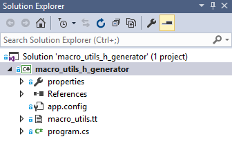
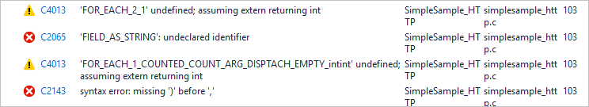
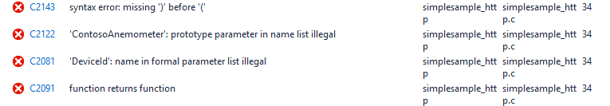
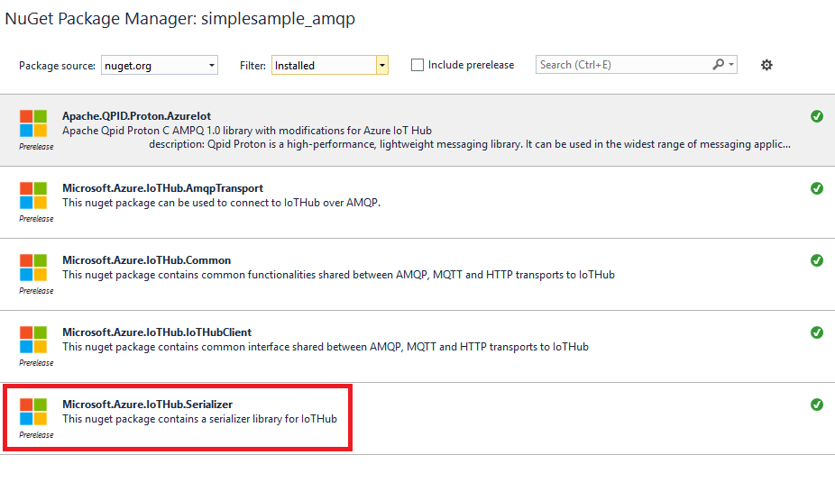
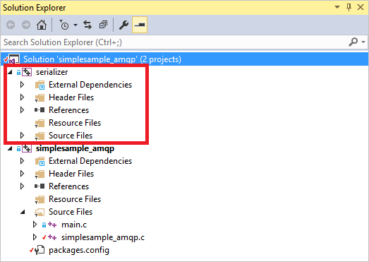

<properties
	pageTitle="Azure IoT device SDK for C - Serializer | Microsoft Azure"
	description="Learn more about using the Serializer library in the Azure IoT device SDK for C"
	services="iot-hub"
	documentationCenter=""
	authors="olivierbloch"
	manager="timlt"
	editor=""/>

<tags
     ms.service="iot-hub"
     ms.devlang="cpp"
     ms.topic="article"
     ms.tgt_pltfrm="na"
     ms.workload="na"
     ms.date="05/17/2016"
     ms.author="obloch"/>

# Microsoft Azure IoT device SDK for C – more about serializer

The [first article](iot-hub-device-sdk-c-intro.md) in this series introduced the **Azure IoT device SDK for C**. The next article provided a more detailed description of the [**IoTHubClient**](iot-hub-device-sdk-c-iothubclient.md). This article completes coverage of the SDK by providing a more detailed description of the remaining component: the **serializer** library.

The introductory article described how to use the **serializer** library to send events to and receive messages from IoT Hub. In this article we extend that discussion by providing a more complete explanation of how to model your data with the **serializer** macro language. The article also includes more detail about how the library serializes messages (and in some cases how you can control the serialization behavior). We'll also describe some parameters you can modify that determine the size of the models you create.

Finally, the article revisits some topics covered in previous articles such as message and property handling. As we'll find out, those features work in the same way using the **serializer** library as they do with the **IoTHubClient** library.

Everything described in this article is based on the **serializer** SDK samples. If you want to follow along, see the **simplesample\_amqp** and **simplesample\_http** applications included in the Azure IoT device SDK for C.

You can find the **Azure IoT device SDK for C** in the [Microsoft Azure IoT SDKs](https://github.com/Azure/azure-iot-sdks) GitHub repository and view details of the API in the [C API reference](http://azure.github.io/azure-iot-sdks/c/api_reference/index.html).

## The modeling language

The [introductory article](iot-hub-device-sdk-c-intro.md) in this series introduced the **Azure IoT device SDK for C** modeling language through the example provided in the **simplesample\_amqp** application:

```
BEGIN_NAMESPACE(WeatherStation);

DECLARE_MODEL(ContosoAnemometer,
WITH_DATA(ascii_char_ptr, DeviceId),
WITH_DATA(double, WindSpeed),
WITH_ACTION(TurnFanOn),
WITH_ACTION(TurnFanOff),
WITH_ACTION(SetAirResistance, int, Position)
);

END_NAMESPACE(WeatherStation);
```

As you can see, the modeling language is based on C macros. You always begin your definition with **BEGIN\_NAMESPACE** and always end with **END\_NAMESPACE**. It's common to name the namespace for your company or, as in this example, the project that you're working on.

What goes inside the namespace are model definitions. In this case, there is a single model for an anemometer. Once again, the model can be named anything, but typically this is named for the device or type of data you want to exchange with IoT Hub.  

Models contain a definition of the events you can ingress to IoT Hub (the *data*) as well as the messages you can receive from IoT Hub (the *actions*). As you can see from the example, events have a type and a name; actions have a name and optional parameters (each with a type).

What’s not demonstrated in this sample are additional data types that are supported by the SDK. We'll cover that next.

> [AZURE.NOTE] IoT Hub refers to the data a device sends to it as *events*, while the modeling language refers to it as *data* (defined using **WITH_DATA**). Likewise, IoT Hub refers to the data you send to devices as *messages*, while the modeling language refers to it as *actions* (defined using **WITH_ACTION**). Be aware that these terms may be used interchangeably in this article.

### Supported data types

The following data types are supported in models created with the **serializer** library:

| Type                    | Description                            |
|-------------------------|----------------------------------------|
| double                  | double precision floating point number |
| int                     | 32 bit integer                         |
| float                   | single precision floating point number |
| long                    | long integer                           |
| int8\_t                 | 8 bit integer                          |
| int16\_t                | 16 bit integer                         |
| int32\_t                | 32 bit integer                         |
| int64\_t                | 64 bit integer                         |
| bool                    | boolean                                |
| ascii\_char\_ptr        | ASCII string                           |
| EDM\_DATE\_TIME\_OFFSET | date time offset                       |
| EDM\_GUID               | GUID                                   |
| EDM\_BINARY             | binary                                 |
| DECLARE\_STRUCT         | complex data type                      |

Let’s start with the last data type. The **DECLARE\_STRUCT** allows you to define complex data types, which are groupings of the other primitive types. These groupings allow us to define a model that looks like this:

```
DECLARE_STRUCT(TestType,
double, aDouble,
int, aInt,
float, aFloat,
long, aLong,
int8_t, aInt8,
uint8_t, auInt8,
int16_t, aInt16,
int32_t, aInt32,
int64_t, aInt64,
bool, aBool,
ascii_char_ptr, aAsciiCharPtr,
EDM_DATE_TIME_OFFSET, aDateTimeOffset,
EDM_GUID, aGuid,
EDM_BINARY, aBinary
);

DECLARE_MODEL(TestModel,
WITH_DATA(TestType, Test)
);
```

Our model contains a single data event of type **TestType**. **TestType** is a complex type that includes several members, which collectively demonstrate the primitive types supported by the **serializer** modeling language.

With a model like this, we can write code to send data to IoT Hub that appears as follows:

```
TestModel* testModel = CREATE_MODEL_INSTANCE(MyThermostat, TestModel);

testModel->Test.aDouble = 1.1;
testModel->Test.aInt = 2;
testModel->Test.aFloat = 3.0f;
testModel->Test.aLong = 4;
testModel->Test.aInt8 = 5;
testModel->Test.auInt8 = 6;
testModel->Test.aInt16 = 7;
testModel->Test.aInt32 = 8;
testModel->Test.aInt64 = 9;
testModel->Test.aBool = true;
testModel->Test.aAsciiCharPtr = "ascii string 1";

time_t now;
time(&now);
testModel->Test.aDateTimeOffset = GetDateTimeOffset(now);

EDM_GUID guid = { { 0x00, 0x01, 0x02, 0x03, 0x04, 0x05, 0x06, 0x07, 0x08, 0x09, 0x0A, 0x0B, 0x0C, 0x0D, 0x0E, 0x0F } };
testModel->Test.aGuid = guid;

unsigned char binaryArray[3] = { 0x01, 0x02, 0x03 };
EDM_BINARY binaryData = { sizeof(binaryArray), &binaryArray };
testModel->Test.aBinary = binaryData;

SendAsync(iotHubClientHandle, (const void*)&(testModel->Test));
```

Basically, we’re assigning a value to every member of the **Test** structure and then calling **SendAsync** to send the **Test** data event to the cloud. **SendAsync** is a helper function that sends a single data event to IoT Hub:

```
void SendAsync(IOTHUB_CLIENT_LL_HANDLE iotHubClientHandle, const void *dataEvent)
{
	unsigned char* destination;
	size_t destinationSize;
	if (SERIALIZE(&destination, &destinationSize, *(const unsigned char*)dataEvent) ==
	{
		// null terminate the string
		char* destinationAsString = (char*)malloc(destinationSize + 1);
		if (destinationAsString != NULL)
		{
			memcpy(destinationAsString, destination, destinationSize);
			destinationAsString[destinationSize] = '\0';
			IOTHUB_MESSAGE_HANDLE messageHandle = IoTHubMessage_CreateFromString(destinationAsString);
			if (messageHandle != NULL)
			{
				IoTHubClient_SendEventAsync(iotHubClientHandle, messageHandle, sendCallback, (void*)0);

				IoTHubMessage_Destroy(messageHandle);
			}
			free(destinationAsString);
		}
		free(destination);
	}
}
```

This function serializes the given data event and sends it to IoT Hub using **IoTHubClient\_SendEventAsync**. This is the same code discussed in previous articles (**SendAsync** encapsulates the logic into a convenient function).

One other helper function used in the previous code is **GetDateTimeOffset**. This function transforms the given time into a value of type **EDM\_DATE\_TIME\_OFFSET**:

```
EDM_DATE_TIME_OFFSET GetDateTimeOffset(time_t time)
{
	struct tm newTime;
	gmtime_s(&newTime, &time);
	EDM_DATE_TIME_OFFSET dateTimeOffset;
	dateTimeOffset.dateTime = newTime;
	dateTimeOffset.fractionalSecond = 0;
	dateTimeOffset.hasFractionalSecond = 0;
	dateTimeOffset.hasTimeZone = 0;
	dateTimeOffset.timeZoneHour = 0;
	dateTimeOffset.timeZoneMinute = 0;
	return dateTimeOffset;
}
```

If you run this code, the following message is sent to IoT Hub:

```
{"aDouble":1.100000000000000, "aInt":2, "aFloat":3.000000, "aLong":4, "aInt8":5, "auInt8":6, "aInt16":7, "aInt32":8, "aInt64":9, "aBool":true, "aAsciiCharPtr":"ascii string 1", "aDateTimeOffset":"2015-09-14T21:18:21Z", "aGuid":"00010203-0405-0607-0809-0A0B0C0D0E0F", "aBinary":"AQID"}
```

Note that the serialization is JSON, which is the format generated by the **serializer** library. Also note that each member of the serialized JSON object matches the members of the **TestType** that we defined in our model. The values also exactly match those used in the code. However, note that the binary data is base64-encoded: "AQID" is the base64 encoding of {0x01, 0x02, 0x03}.

This example demonstrates the advantage of using the **serializer** library -- it enables us to send JSON to the cloud, without having to explicitly deal with serialization in our application. All we have to worry about is setting the values of the data events in our model and then calling simple APIs to send those events to the cloud.

With this information, we can define models that include the range of supported data types, including complex types (we could even include complex types within other complex types). However, he serialized JSON generated by the example above brings up an important point. *How* we send data with the **serializer** library determines exactly how the JSON is formed. That particular point is what we'll cover next.

## More about serialization

The previous section highlights an example of the output generated by the **serializer** library. In this section, we'll explain how the library serializes data and how you can control that behavior using the serialization APIs.

In order to advance the discussion on serialization, we'll work with a new model based on a thermostat. First, let's provide some background on the scenario we're trying to address.

We want to model a thermostat that measures temperature and humidity. Each piece of data is going to be sent to IoT Hub differently. By default, the thermostat ingresses a temperature event once every 2 minutes; a humidity event is ingressed once every 15 minutes. When either event is ingressed, it must include a timestamp that shows the time that the corresponding temperature or humidity was measured.

Given this scenario, we'll demonstrate two different ways to model the data, and we'll explain the effect that modeling has on the serialized output.

### Model 1

Here's the first version of a model that supports the previous scenario:

```
BEGIN_NAMESPACE(Contoso);

DECLARE_STRUCT(TemperatureEvent,
int, Temperature,
EDM_DATE_TIME_OFFSET, Time);

DECLARE_STRUCT(HumidityEvent,
int, Humidity,
EDM_DATE_TIME_OFFSET, Time);

DECLARE_MODEL(Thermostat,
WITH_DATA(TemperatureEvent, Temperature),
WITH_DATA(HumidityEvent, Humidity)
);

END_NAMESPACE(Contoso);
```

Note that the model includes two data events: **Temperature** and **Humidity**. Unlike previous examples, the type of each event is a structure defined using **DECLARE\_STRUCT**. **TemperatureEvent** includes a temperature measurement and a timestamp; **HumidityEvent** contains a humidity measurement and a timestamp. This model gives us a natural way to model the data for the scenario described above. When we send an event to the cloud, we'll either send a temperature/timestamp or a humidity/timestamp pair.

We can send a temperature event to the cloud using code such as the following:

```
time_t now;
time(&now);
thermostat->Temperature.Temperature = 75;
thermostat->Temperature.Time = GetDateTimeOffset(now);

unsigned char* destination;
size_t destinationSize;
if (SERIALIZE(&destination, &destinationSize, thermostat->Temperature) == IOT_AGENT_OK)
{
    sendMessage(iotHubClientHandle, destination, destinationSize);
}
```

We'll use hard-coded values for temperature and humidity in the sample code, but imagine that we’re actually retrieving these values by sampling the corresponding sensors on the thermostat.

The code above uses the **GetDateTimeOffset** helper that was introduced previously. For reasons that will become clear later, this code explicitly separates the task of serializing and sending the event. The previous code serializes the temperature event into a buffer. Then, **sendMessage** is a helper function (included in **simplesample\_amqp**) that sends the event to IoT Hub:

```
static void sendMessage(IOTHUB_CLIENT_HANDLE iotHubClientHandle, const unsigned char* buffer, size_t size)
{
    static unsigned int messageTrackingId;
    IOTHUB_MESSAGE_HANDLE messageHandle = IoTHubMessage_CreateFromByteArray(buffer, size);
    if (messageHandle != NULL)
    {
        IoTHubClient_SendEventAsync(iotHubClientHandle, messageHandle, sendCallback, (void*)(uintptr_t)messageTrackingId);

        IoTHubMessage_Destroy(messageHandle);
    }
    free((void*)buffer);
}
```

This code is a subset of the **SendAsync** helper described in the previous section, so we won’t go over it again here.

When we run the previous code to send the Temperature event, this serialized form of the event is sent to IoT Hub:

```
{"Temperature":75, "Time":"2015-09-17T18:45:56Z"}
```

We're sending a temperature which is of type **TemperatureEvent** and that struct contains a **Temperature** and **Time** member. This is directly reflected in the serialized data.

Similarly, we can send a humidity event with this code:

```
thermostat->Humidity.Humidity = 45;
thermostat->Humidity.Time = GetDateTimeOffset(now);
if (SERIALIZE(&destination, &destinationSize, thermostat->Humidity) == IOT_AGENT_OK)
{
    sendMessage(iotHubClientHandle, destination, destinationSize);
}
```

The serialized form that’s sent to IoT Hub appears as follows:

```
{"Humidity":45, "Time":"2015-09-17T18:45:56Z"}
```

Again, this is as expected.

With this model, you can imagine how additional events can easily be added. You define more structures using **DECLARE\_STRUCT**, and include the corresponding event in the model using **WITH\_DATA**.

Now, let’s modify the model so that it includes the same data but with a different structure.

### Model 2

Consider this alternative model to the one above:

```
DECLARE_MODEL(Thermostat,
WITH_DATA(int, Temperature),
WITH_DATA(int, Humidity),
WITH_DATA(EDM_DATE_TIME_OFFSET, Time)
);
```

In this case we've eliminated the **DECLARE\_STRUCT** macros and are simply defining the data items from our scenario using simple types from the modeling language.

Just for the moment let’s ignore the **Time** event. With that aside, here’s the code to ingress **Temperature**:

```
time_t now;
time(&now);
thermostat->Temperature = 75;

unsigned char* destination;
size_t destinationSize;
if (SERIALIZE(&destination, &destinationSize, thermostat->Temperature) == IOT_AGENT_OK)
{
    sendMessage(iotHubClientHandle, destination, destinationSize);
}
```

This code sends the following serialized event to IoT Hub:

```
{"Temperature":75}
```

And the code for sending the Humidity event appears as follows:

```
thermostat->Humidity = 45;
if (SERIALIZE(&destination, &destinationSize, thermostat->Humidity) == IOT_AGENT_OK)
{
    sendMessage(iotHubClientHandle, destination, destinationSize);
}
```

This code sends this to IoT Hub:

```
{"Humidity":45}
```

So far there are still no surprises. Now let's change how we use the SERIALIZE macro.

The **SERIALIZE** macro can take multiple data events as arguments. This enables us to serialize the **Temperature** and **Humidity** event together and send them to IoT Hub in one call:

```
if (SERIALIZE(&destination, &destinationSize, thermostat->Temperature, thermostat->Humidity) == IOT_AGENT_OK)
{
    sendMessage(iotHubClientHandle, destination, destinationSize);
}
```

You might guess that the result of this code is that two data events are sent to IoT Hub:

[

{"Temperature":75},

{"Humidity":45}

]

In other words, you might expect that this code is the same as sending **Temperature** and **Humidity** separately. It’s just a convenience to pass both events to **SERIALIZE** in the same call. However, that’s not the case. Instead, the code above sends this single data event to IoT Hub:

{"Temperature":75, "Humidity":45}

This may seem strange because our model defines **Temperature** and **Humidity** as two *separate* events:

```
DECLARE_MODEL(Thermostat,
WITH_DATA(int, Temperature),
WITH_DATA(int, Humidity),
WITH_DATA(EDM_DATE_TIME_OFFSET, Time)
);
```

More to the point, we didn’t model these events where **Temperature** and **Humidity** are in the same structure:

```
DECLARE_STRUCT(TemperatureAndHumidityEvent,
int, Temperature,
int, Humidity,
);

DECLARE_MODEL(Thermostat,
WITH_DATA(TemperatureAndHumidityEvent, TemperatureAndHumidity),
);
```

If we used this model, it would be easier to understand how **Temperature** and **Humidity** would be sent in the same serialized message. However it may not be clear why it works that way when you pass both data events to **SERIALIZE** using model 2.

This behavior is easier to understand if you know the assumptions that the **serializer** library is making. To make sense of this let’s go back to our model:

```
DECLARE_MODEL(Thermostat,
WITH_DATA(int, Temperature),
WITH_DATA(int, Humidity),
WITH_DATA(EDM_DATE_TIME_OFFSET, Time)
);
```

Think of this model in object-oriented terms. In this case we’re modeling a physical device (a thermostat) and that device includes attributes like **Temperature** and **Humidity**.

We can send the entire state of our model with code such as the following:

```
if (SERIALIZE(&destination, &destinationSize, thermostat->Temperature, thermostat->Humidity, thermostat->Time) == IOT_AGENT_OK)
{
    sendMessage(iotHubClientHandle, destination, destinationSize);
}
```

Assuming the values of Temperature, Humidity and Time are set, we would see an event like this sent to IoT Hub:

```
{"Temperature":75, "Humidity":45, "Time":"2015-09-17T18:45:56Z"}
```

Sometimes you may only want to send *some* properties of the model to the cloud (this is especially true if your model contains a large number of data events). It’s useful to send only a subset of data events, such as in our earlier example:

```
{"Temperature":75, "Time":"2015-09-17T18:45:56Z"}
```

This generates exactly the same serialized event as if we had defined a **TemperatureEvent** with a **Temperature** and **Time** member, just as we did with model 1. In this case we were able to generate exactly the same serialized event by using a different model (model 2) because we called **SERIALIZE** in a different way.

The important point is that if you pass multiple data events to **SERIALIZE,** then it assumes each event is a property in a single JSON object.

The best approach depends on you and how you think about your model. If you’re sending "events" to the cloud and each event contains a defined set of properties, then the first approach makes a lot of sense. In that case you would use **DECLARE\_STRUCT** to define the structure of each event and then include them in your model with the **WITH\_DATA** macro. Then you send each event as we did in the first example above. In this approach you would only pass a single data event to **SERIALIZER**.

If you think about your model in an object-oriented fashion, then the second approach may suit you. In this case, the elements defined using **WITH\_DATA** are the "properties" of your object. You pass whatever subset of events to **SERIALIZE** that you like, depending on how much of your "object’s" state you want to send to the cloud.

Nether approach is right or wrong. Just be aware of how the **serializer** library works, and pick the modeling approach that best fits your needs.

## Message handling

So far this article has only discussed sending events to IoT Hub, and hasn't addressed receiving messages. The reason for this is that what we need to know about receiving messages has largely been covered in an [earlier article](iot-hub-device-sdk-c-intro.md). Recall from that article that you process messages by registering a message callback function:

```
IoTHubClient_SetMessageCallback(iotHubClientHandle, IoTHubMessage, myWeather)
```

You then write the callback function that’s invoked when a message is received:

```
static IOTHUBMESSAGE_DISPOSITION_RESULT IoTHubMessage(IOTHUB_MESSAGE_HANDLE message, void* userContextCallback)
{
    IOTHUBMESSAGE_DISPOSITION_RESULT result;
    const unsigned char* buffer;
    size_t size;
    if (IoTHubMessage_GetByteArray(message, &buffer, &size) != IOTHUB_MESSAGE_OK)
    {
        printf("unable to IoTHubMessage_GetByteArray\r\n");
        result = EXECUTE_COMMAND_ERROR;
    }
    else
    {
        /*buffer is not zero terminated*/
        char* temp = malloc(size + 1);
        if (temp == NULL)
        {
            printf("failed to malloc\r\n");
            result = EXECUTE_COMMAND_ERROR;
        }
        else
        {
            memcpy(temp, buffer, size);
            temp[size] = '\0';
            EXECUTE_COMMAND_RESULT executeCommandResult = EXECUTE_COMMAND(userContextCallback, temp);
            result =
                (executeCommandResult == EXECUTE_COMMAND_ERROR) ? IOTHUBMESSAGE_ABANDONED :
                (executeCommandResult == EXECUTE_COMMAND_SUCCESS) ? IOTHUBMESSAGE_ACCEPTED :
                IOTHUBMESSAGE_REJECTED;
            free(temp);
        }
    }
    return result;
}
```

This implementation of **IoTHubMessage** calls the specific function for each action in your model. For example, if your model defines this action:

```
WITH_ACTION(SetAirResistance, int, Position)
```

You must define a function with this signature:

```
EXECUTE_COMMAND_RESULT SetAirResistance(ContosoAnemometer* device, int Position)
{
    (void)device;
    (void)printf("Setting Air Resistance Position to %d.\r\n", Position);
    return EXECUTE_COMMAND_SUCCESS;
}
```

**SetAirResistance** is then called when that message is sent to your device.

What we haven't explained yet is what the serialized version of message looks like. In other words, if you want to send a **SetAirResistance** message to your device, what does that look like?

If you're sending a message to a device, you would do so through the Azure IoT service SDK. You still need to know what string to send to invoke a particular action. The general format for sending a message appears as follows:

```
{"Name" : "", "Parameters" : "" }
```

You're sending a serialized JSON object with two properties: **Name** is the name of the action (message) and **Parameters** contains the parameters of that action.

For example, to invoke **SetAirResistance** you can send this message to a device:

```
{"Name" : "SetAirResistance", "Parameters" : { "Position" : 5 }}
```

The action name must exactly match an action defined in your model. The parameter names must match as well. Also note case sensitivity. **Name** and **Parameters** are always uppercase. Make sure to match the case of your action name and parameters in your model. In this example, the action name is "SetAirResistance" and not "setairresistance".

This section described everything you need to know when sending events and receiving messages with the **serializer** library. Before moving on, let's cover some parameters you can configure that control how large your model is.

## Macro configuration

If you’re using the **Serializer** library an important part of the SDK to be aware of is found in the azure-c-shared-utility library.
If you have cloned the Azure-iot-sdks repository from GitHub using the --recursive option, then you will find this shared utility library here:

```
.\\c\\azure-c-shared-utility
```

If you have not cloned the library, you can find it [here](https://github.com/Azure/azure-c-shared-utility).

Within the shared utility library, you will find the following folder:

```
azure-c-shared-utility\\macro\_utils\_h\_generator.
```

This folder contains a Visual Studio solution called **macro\_utils\_h\_generator.sln**:

  

The program in this solution generates the **macro\_utils.h** file. There’s a default macro\_utils.h file included with the SDK. This solution allows you to modify some parameters and then recreate the header file based on these parameters.

The two key parameters to be concerned with are **nArithmetic** and **nMacroParameters** which are defined in these two lines found in macro\_utils.tt:

```
<#int nArithmetic=1024;#>
<#int nMacroParameters=124;/*127 parameters in one macro definition in C99 in chapter 5.2.4.1 Translation limits*/#>

```

These values are the default parameters included with the SDK. Each parameter has the following meaning:

-   nMacroParameters – Controls how many parameters you can have in one DECLARE\_MODEL macro definition.

-   nArithmetic – Controls the total number of members allowed in a model.

The reason these parameters are important is because they control how large your model can be. For example, consider this model definition:

```
DECLARE_MODEL(MyModel,
WITH_DATA(int, MyData)
);
```

As mentioned previously, **DECLARE\_MODEL** is just a C macro. The name of the model and the **WITH\_DATA** statement (yet another macro) are parameters of **DECLARE\_MODEL**. **nMacroParameters** defines how many parameters can be included in **DECLARE\_MODEL**. Effectively, this defines how many data event and action declarations you can have. As such, with the default limit of 124 this means that you can define a model with a combination of about 60 actions and data events. If you try to exceed this limit, you'll receive compiler errors that look similar to this:

  

The **nArithmetic** parameter is more about the internal workings of the macro language than your application.  It controls the total number of members you can have in your model, including **DECLARE_STRUCT** macros. If you start seeing compiler errors such as this, then you should try increasing **nArithmetic**:

   

If you want to change these parameters, modify the values in the macro\_utils.tt file, recompile the macro\_utils\_h\_generator.sln solution, and run the compiled program. When you do so, a new macro\_utils.h file is generated and placed in the .\\common\\inc directory.

In order to use the new version of macro\_utils.h, remove the **serializer** NuGet package from your solution and in its place include the **serializer** Visual Studio project. This enables your code to compile against the source code of the serializer library. This includes the updated macro\_utils.h. If you want to do this for **simplesample\_amqp**, start by removing the NuGet package for the serializer library from the solution:

   

Then add this project to your Visual Studio solution:

> .\\c\\serializer\\build\\windows\\serializer.vcxproj

When you're done, your solution should look like this:

   

Now when you compile your solution, the updated macro\_utils.h is included in your binary.

Note that increasing these values high enough can exceed compiler limits. To this point, the **nMacroParameters** is the main parameter with which to be concerned. The C99 spec specifies that a minimum of 127 parameters are allowed in a macro definition. The Microsoft compiler follows the spec exactly (and has a limit of 127), so you won't be able to increase **nMacroParameters** beyond the default. Other compilers might allow you to do so (for example, the GNU compiler supports a higher limit).

So far we've covered just about everything you need to know about how to write code with the **serializer** library. Before concluding, let's revisit some topics from previous articles that you may be wondering about.

## The lower-level APIs

The sample application on which this article focused is **simplesample\_amqp**. This sample uses the higher level (the non-"LL") APIs to send events and receive messages. If you use these APIs, a background thread runs which takes care of both sending events and receiving messages. However, you can use the lower level (LL) APIs to eliminate this background thread and take explicit control over when you send events or receive messages from the cloud.

As described in a [previous article](iot-hub-device-sdk-c-iothubclient.md), there is a set of functions that consists of the higher level APIs:

-   IoTHubClient\_CreateFromConnectionString

-   IoTHubClient\_SendEventAsync

-   IoTHubClient\_SetMessageCallback

-   IoTHubClient\_Destroy

These APIs are demonstrated in **simplesample\_amqp**.

There is also an analogous set of lower level APIs.

-   IoTHubClient\_LL\_CreateFromConnectionString

-   IoTHubClient\_LL\_SendEventAsync

-   IoTHubClient\_LL\_SetMessageCallback

-   IoTHubClient\_LL\_Destroy

Note that the lower level APIs work exactly the same way as described in the previous articles. You can use the first set of APIs if you want a background thread to handle sending events and receiving messages. You use the second set of APIs if you want explicit control over when you send and receive data from IoT Hub. Either set of APIs work equally well with the **serializer** library.

For an example of how the lower level APIs are used with the **serializer** library, see the **simplesample\_http** application.

## Additional topics

A few other topics worth mentioning again are property handling, using alternate device credentials, and configuration options. These are all topics covered in a [previous article](iot-hub-device-sdk-c-iothubclient.md). The main point is that all of these features work in the same way with the **serializer** library as they do with the **IoTHubClient** library. For example, if you want to attach properties to an event from your model, you use **IoTHubMessage\_Properties** and **Map**\_**AddorUpdate**, the same way as described previously:

```
MAP_HANDLE propMap = IoTHubMessage_Properties(message.messageHandle);
sprintf_s(propText, sizeof(propText), "%d", i);
Map_AddOrUpdate(propMap, "SequenceNumber", propText);
```

Whether the event was generated from the **serializer** library or created manually using the **IoTHubClient** library does not matter.

For the alternate device credentials, using **IoTHubClient\_LL\_Create** works just as well as **IoTHubClient\_CreateFromConnectionString** for allocating an **IOTHUB\_CLIENT\_HANDLE**.

Finally, if you're using the **serializer** library, you can set configuration options with **IoTHubClient\_LL\_SetOption** just as you did when using the **IoTHubClient** library.

A feature that is unique to the **serializer** library are the initialization APIs. Before you can start working with the library, you must call **serializer\_init**:

```
serializer_init(NULL);
```

This is done just before you call **IoTHubClient\_CreateFromConnectionString**.

Similarly, when you're done working with the library, the last call you’ll make is to **serializer\_deinit**:

```
serializer_deinit();
```

Otherwise, all of the other features listed above work the same in the **serializer** library as they do in the **IoTHubClient** library. For more information about any of these topics, see the [previous article](iot-hub-device-sdk-c-iothubclient.md) in this series.

## Next steps

This article describes in detail the unique aspects of the **serializer** library contained in the **Azure IoT device SDK for C**. With the information provided you should have a good understanding of how to use models to send events and receive messages from IoT Hub.

This also concludes the three-part series on how to develop applications with the **Azure IoT device SDK for C**. This should be enough information to not only get you started but give you a thorough understanding of how the APIs work. For additional information, there are a few samples in the SDK not covered here. Otherwise, the [SDK documentation](https://github.com/Azure/azure-iot-sdks) is a good resource for additional information.


To learn more about developing for IoT Hub, see the [IoT Hub SDKs][lnk-sdks].

To further explore the capabilities of IoT Hub, see:

- [Designing your solution][lnk-design]
- [Exploring device management using the sample UI][lnk-dmui]
- [Simulating a device with the Gateway SDK][lnk-gateway]
- [Using the Azure Portal to manage IoT Hub][lnk-portal]

[lnk-sdks]: iot-hub-sdks-summary.md

[lnk-design]: iot-hub-guidance.md
[lnk-dmui]: iot-hub-device-management-ui-sample.md
[lnk-gateway]: iot-hub-linux-gateway-sdk-simulated-device.md
[lnk-portal]: iot-hub-manage-through-portal.md