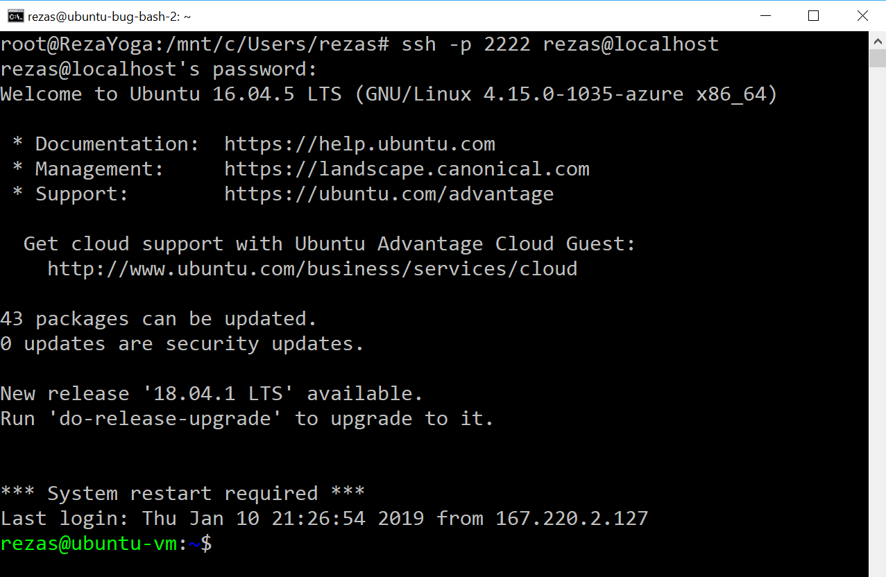

# Quickstart: SSH/RDP over IoT Hub device streams (NodeJS)

[!INCLUDE [iot-hub-quickstarts-4-selector](../../includes/iot-hub-quickstarts-4-selector.md)]

[IoT Hub device streams](./iot-hub-device-streams-overview.md) allow service and device applications to communicate in a secure and firewall-friendly manner. This quickstart describes execution of a NodeJS proxy application running on the service side to enable SSH and RDP traffic to be sent to the device over a device stream. See [this page](./iot-hub-device-streams-overview.md#local-proxies-sample-for-ssh-or-rdp) for an overview of the setup. Note that during public preview, NodeJS SDK only supports device streams on the service side. As a result, this quickstart only covers instructions to run the service-side proxy. You should run an accompanying device-side proxy which is available in [C quickstart](./iot-hub-device-streams-c-proxy-quickstart.md) or [C# quickstart](./iot-hub-device-streams-csharp-proxy-quickstart.md) guides.

We first describe the setup for SSH (using port `22`). We then describe how to modify the setup for RDP (which uses port `3389`). Since device streams are application and protocol agnostic, the same sample can be modified (usually by changing the communication ports) to accommodate other types of application traffic.

The code will demonstrate the initiation and use of a device stream and can be repurposed for other application traffic as well (other than RDP and SSH).

[!INCLUDE [cloud-shell-try-it.md](../../includes/cloud-shell-try-it.md)]

If you don’t have an Azure subscription, create a [free account](https://azure.microsoft.com/free/?WT.mc_id=A261C142F) before you begin.

## Prerequisites

To run the service-side application in this quick start you need Node.js v4.x.x or later on your development machine (note that version 10 or later is not yet supported).

You can download Node.js for multiple platforms from [nodejs.org](https://nodejs.org).

You can verify the current version of Node.js on your development machine using the following command:

```cmd/sh
node --version
```

If you haven't already done so, download the sample Node.js project from https://github.com/Azure-Samples/azure-iot-samples-node/archive/master.zip and extract the ZIP archive.

## Create an IoT hub

If you completed the previous [Quickstart: Send telemetry from a device to an IoT hub](quickstart-send-telemetry-node.md), you can skip this step.

[!INCLUDE [iot-hub-include-create-hub](../../includes/iot-hub-include-create-hub-device-streams.md)]

## Register a device

If you completed the previous [Quickstart: Send telemetry from a device to an IoT hub](quickstart-send-telemetry-node.md), you can skip this step.

A device must be registered with your IoT hub before it can connect. In this quickstart, you use the Azure Cloud Shell to register a simulated device.

1. Run the following commands in Azure Cloud Shell to add the IoT Hub CLI extension and to create the device identity. 

   **YourIoTHubName** : Replace this placeholder below with the name you chose for your IoT hub.

   **MyNodeDevice** : This is the name given for the registered device. Use MyNodeDevice as shown. If you choose a different name for your device, you will also need to use that name throughout this article, and update the device name in the sample applications before you run them.

    ```azurecli-interactive
    az extension add --name azure-cli-iot-ext
    az iot hub device-identity create \
      --hub-name YourIoTHubName --device-id MyNodeDevice
    ```

2. You also need a _service connection string_ to enable the back-end application to connect to your IoT hub and retrieve the messages. The following command retrieves the service connection string for your IoT hub:

    **YourIoTHubName** : Replace this placeholder below with the name you chose for your IoT hub.

    ```azurecli-interactive
    az iot hub show-connection-string --policy-name service --hub-name YourIoTHubName
    ```

    Make a note of the returned value, which looks like this:

   `"HostName={YourIoTHubName}.azure-devices.net;SharedAccessKeyName=service;SharedAccessKey={YourSharedAccessKey}"`

## SSH to a device via IoT Hub device streams

### Run the device-side proxy

As mentioned earlier, IoT Hub NodeJS SDK only supports device streams on the service side. For device-side application, use the accompaying device proxy programs available in [C quickstart](./iot-hub-device-streams-c-proxy-quickstart.md) or [C# quickstart](./iot-hub-device-streams-csharp-proxy-quickstart.md) guides. Ensure the device-side proxy is running before proceeding to the next step.

### Run the service-side proxy

Assuming the device-side proxy is running, follow the steps below to run the service-side proxy written in NodeJS:

- Provide your service credentials, the target device ID where SSH daemon runs, and the port number for the proxy running on the device as environment variables.
```
  # In Linux
  export IOTHUB_CONNECTION_STRING="<provide_your_service_connection_string>"
  export STREAMING_TARGET_DEVICE="MyNodeDevice"
  export PROXY_PORT=2222

  # In Windows
  SET IOTHUB_CONNECTION_STRING=<provide_your_service_connection_string>
  SET STREAMING_TARGET_DEVICE=MyNodeDevice
  SET PROXY_PORT=2222
```
Change `MyNodeDevice` to the device ID you chose for your device.

- Navigate to `service/samples` in your unzipped project folder and run the service-local proxy.
```
  cd ./service/samples
  npm install
  node tcp_streaming_proxy.js
```

### SSH to your device through the proxy
In Linux, run SSH using `ssh $USER@localhost -p 2222`. In Windows, use your favorite SSH client (e.g., PuTTY).

*Note:* Ensure that your device proxy is configured correctly for SSH and configured with SSH port `3389`.

<p>
    Console output of the SSH client program (SSH client communicates to SSH daemon by connecting to port <code>22</code> where service-local proxy is listening on):
    
</p>

### RDP to your device through the proxy
Now use your RDP client program and connect to service proxy on port `2222`. 

*Note:* Ensure that your device proxy is configured correctly for RDP and configured with RDP port `3389`.

<p>
    
</p>

## Clean up resources

[!INCLUDE [iot-hub-quickstarts-clean-up-resources](../../includes/iot-hub-quickstarts-clean-up-resources-device-streams)]

## Next steps

In this quickstart, you have set up an IoT hub, registered a device, and deployed a service proxy program to enable RDP and SSH to an IoT device. The RDP and SSH traffic will be tunneled through a device stream through IoT Hub. This eliminates the need for direct connectivity to the device.

Use the links below to learn how to use IoT Hub device streams.

> [!div class="nextstepaction"]
> [Quickstart: Communicate with IoT devices using device streams (echo) (NodeJS)](iot-hub-device-streams-nodejs-echo-quickstart.md)
> [Quickstart: Communicate with IoT devices using device streams (echo) (C#)](iot-hub-device-streams-csharp-echo-quickstart.md)
> [Quickstart: Communicate with IoT devices using device streams (echo) (C)](iot-hub-device-streams-c-echo-quickstart.md)
> [Quickstart: SSH/RDP to your IoT devices using device streams (C)](iot-hub-device-streams-c-proxy-quickstart.md)
> [Quickstart: SSH/RDP to your IoT devices using device streams (C#)](iot-hub-device-streams-csharp-proxy-quickstart.md)