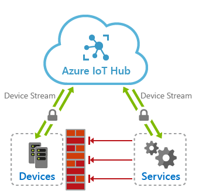
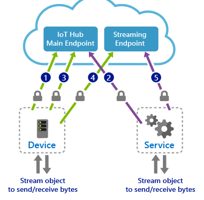
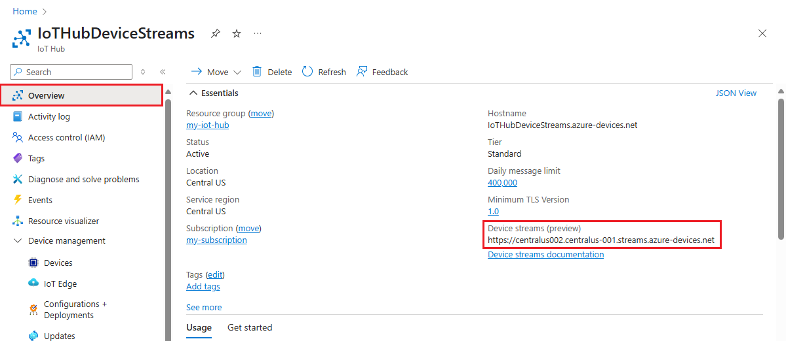
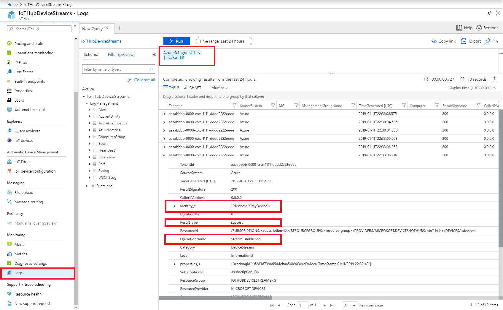

# IoT Hub Device Streams (preview)

Azure IoT Hub *device streams* facilitate the creation of secure bi-directional TCP tunnels for a variety of cloud-to-device communication scenarios. A device stream is mediated by an IoT Hub *streaming endpoint* which acts as a proxy between your device and service endpoints. This setup, depicted in the diagram below, is especially useful when devices are behind a network firewall or reside inside of a private network. As such, IoT Hub device streams help address customers' need to reach IoT devices in a firewall-friendly manner and without the need to broadly opening up incoming or outgoing network firewall ports.



Using IoT Hub device streams, devices remain secure and will only need to open up outbound TCP connections to IoT hub's streaming endpoint over port 443. Once a stream is established, the service-side and device-side applications will each have programmatic access to a WebSocket client object to send and receive raw bytes to one another. The reliability and ordering guarantees provided by this tunnel is on par with TCP.

## Benefits

IoT Hub device streams provide the following benefits:

* **Firewall-friendly secure connectivity:** IoT devices can be reached from service endpoints without opening of inbound firewall port at the device or network perimeters (only outbound connectivity to IoT Hub is needed over port 443).

* **Authentication:** Both device and service sides of the tunnel need to authenticate with IoT Hub using their corresponding credentials.

* **Encryption:** By default, IoT Hub device streams use TLS-enabled connections. This ensures that the traffic is always encrypted regardless of whether the application uses encryption or not.

* **Simplicity of connectivity:** In many cases, the use of device streams eliminates the need for complex setup of Virtual Private Networks to enable connectivity to IoT devices.

* **Compatibility with TCP/IP stack:** IoT Hub device streams can accommodate TCP/IP application traffic. This means that a wide range of proprietary as well as standards-based protocols can leverage this feature.

* **Ease of use in private network setups:** Service can communicate with a device by referencing its device ID, rather than device's IP address. This is useful in situations where a device is located inside a private network and has a private IP address, or its IP address is assigned dynamically and is unknown to the service side.

## Device stream workflows

A device stream is initiated when the service requests to connect to a device by providing its device ID. This workflow particularly fits into a client/server communication model, including SSH and RDP, where a user intends to remotely connect to the SSH or RDP server running on the device using an SSH or RDP client program.

The device stream creation process involves a negotiation between the device, service, IoT hub's main and streaming endpoints. While IoT hub's main endpoint orchestrates the creation of a device stream, the streaming endpoint handles the traffic that flows between the service and device.

### Device stream creation flow

Programmatic creation of a device stream using the SDK involves the following steps, which are also depicted in the figure below:



1. The device application registers a callback in advance to be notified of when a new device stream is initiated to the device. This step typically takes place when the device boots up and connects to IoT Hub.

2. The service-side program initiates a device stream when needed by providing the device ID (_not_ the IP address).

3. IoT hub notifies the device-side program by invoking the callback registered in step 1. The device may accept or reject the stream initiation request. This logic can be specific to your application scenario. If the stream request is rejected by the device, IoT Hub informs the service accordingly; otherwise, the steps below follow.

4. The device creates a secure outbound TCP connection to the streaming endpoint over port 443 and upgrades the connection to a WebSocket. The URL of the streaming endpoint as well as the credentials to use to authenticate are both provided to the device by IoT Hub as part of the request sent in step 3.

5. The service is notified of the result of device accepting the stream and proceeds to create its own WebSocket client to the streaming endpoint. Similarly, it receives the streaming endpoint URL and authentication information from IoT Hub.

In the handshake process above:

* The handshake process must complete within 60 seconds (step 2 through 5), otherwise the handshake would fail with a timeout and the service will be notified accordingly.

* After the stream creation flow above completes, the streaming endpoint will act as a proxy and will transfer traffic between the service and the device over their respective WebSockets.

* Device and service both need outbound connectivity to IoT Hub's main endpoint as well as the streaming endpoint over port 443. The URL of these endpoints is available on *Overview* tab on the IoT Hub's portal.

* The reliability and ordering guarantees of an established stream is on par with TCP.

* All connections to IoT Hub and streaming endpoint use TLS and are encrypted.

### Termination flow

An established stream terminates when either of the TCP connections to the gateway are disconnected (by the service or device). This can take place voluntarily by closing the WebSocket on either the device or service programs, or involuntarily in case of a network connectivity timeout or process failure. Upon termination of either device or service's connection to the streaming endpoint, the other TCP connection will also be (forcefully) terminated and the service and device are responsible to re-create the stream, if needed.

## Connectivity requirements

Both the device and the service sides of a device stream must be capable of establishing TLS-enabled connections to IoT Hub and its streaming endpoint. This requires outbound connectivity over port 443 to these endpoints. The hostname associated with these endpoints can be found on the *Overview* tab of IoT Hub, as shown in the figure below:



Alternatively, the endpoints information can be retrieved using Azure CLI under the hub's properties section, specifically, `property.hostname` and `property.deviceStreams` keys.

```azurecli-interactive
az iot hub devicestream show --name <YourIoTHubName>
```

The output is a JSON object of all endpoints that your hub's device and service may need to connect to in order to establish a device stream.

```json
{
  "streamingEndpoints": [
    "https://<YourIoTHubName>.<region-stamp>.streams.azure-devices.net"
  ]
}
```

> [!NOTE]
> Ensure you have installed Azure CLI version 2.0.57 or newer. You can download the latest version from the [Install Azure CLI](/cli/azure/install-azure-cli) page.
>

## Allow outbound connectivity to the device streaming endpoints

As mentioned at the beginning of this article, your device creates an outbound connection to IoT Hub streaming endpoint during device streams initiation process. Your firewalls on the device or its network must allow outbound connectivity to the streaming gateway over port 443 (note that communication takes place over a WebSocket connection that is encrypted using TLS).

The hostname of device streaming endpoint can be found on the Azure IoT Hub portal under the Overview tab.


Alternatively, you can find this information using Azure CLI:

```azurecli-interactive
az iot hub devicestream show --name <YourIoTHubName>
```

> [!NOTE]
> Ensure you have installed Azure CLI version 2.0.57 or newer. You can download the latest version from the [Install Azure CLI](/cli/azure/install-azure-cli) page.
>

## Troubleshoot via Device Streams resource logs

You can set up Azure Monitor to collect the [resource logs for device streams](monitor-iot-hub-reference.md#device-streams-preview) emitted by your IoT Hub. This can be very helpful in troubleshooting scenarios.

Follow the steps below to create a diagnostics setting to send device streams logs for your IoT Hub to Azure Monitor Logs:

1. In Azure portal, navigate to your IoT hub. On the left pane, under **Monitoring**, select **Diagnostic settings**. Then select **Add diagnostic setting**.

2. Provide a name for your diagnostics setting and select **DeviceStreams** from the list of logs. Then select **Send to Log Analytics**. You'll be guided to choose an existing Log Analytics workspace or create a new one.

    :::image type="content" source="media/iot-hub-device-streams-overview/device-streams-configure-diagnostics.png" alt-text="Enable device streams logs":::

3. After you create a diagnostic setting to send your device streams logs to a Log Analytics workspace, you can access the logs by selecting **Logs** under **Monitoring** on the left pane of your IoT hub in Azure portal. Device streams logs will appear in the `AzureDiagnostics` table and have `Category=DeviceStreams`. Be aware that it may take several minutes following an operation for logs to appear in the table.

   As shown below, the identity of the target device and the result of the operation is also available in the logs.

   

To learn more about using Azure Monitor with IoT Hub, see [Monitor IoT Hub](monitor-iot-hub.md). For information about all of the resource logs, metrics, and tables available for IoT Hub, see [Monitoring Azure IoT Hub data reference](monitor-iot-hub-reference.md).

## Regional availability

During public preview, IoT Hub device streams are available in the Central US, Central US EUAP, North Europe, and Southeast Asia regions. Please make sure you create your hub in one of these regions.

## SDK availability

Two sides of each stream (on the device and service side) use the IoT Hub SDK to establish the tunnel. During public preview, customers can choose from the following SDK languages:

* The C and C# SDK's support device streams on the device side.

* The NodeJS and C# SDK support device streams on the service side.

## Next steps

Use the links below to learn more about device streams.

> [!div class="nextstepaction"]
> [Azure IoT Hub Device Streams Video](/shows/Internet-of-Things-Show/Azure-IoT-Hub-Device-Streams)
