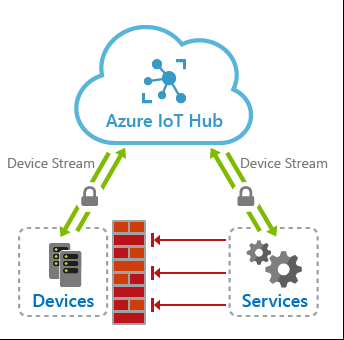

# IoT Hub Device Streams

## Overview
Azure IoT Hub *device streams* facilitate the creation of secure bi-directional TCP tunnels for a variety of cloud-to-device communication scenarios. A device stream is mediated by an IoT Hub *streaming endpoint* which acts as a proxy between your device and service endpoints. This is depicted in the diagram below. As such, IoT Hub device streams help address customers' need to reach IoT devices in a firewall-friendly manner and without broadly opening up incoming or outgoing network firewall ports.

Using IoT Hub device streams, devices remain secure and will only need to open up outbound TCP connections to IoT hub's streaming endpoint over port 443. Once a stream is established, the service-side and device-side applications will each have programmatic access to a WebSocket client object to send and receive raw byte to one another. The reliability and ordering guarantees of this tunnel is on par with TCP.

## Benefits
IoT Hub device streams provide the following benefits:
- **Firewall-friendly secure connectivity:** IoT devices can be reached from service endpoints without opening of inbound firewall port at the device or network perimeters (only outbound connectivity to IoT Hub is needed over port 443).
- **Authentication:** Both device and service sides of the tunnel need to authenticate with IoT Hub using their corresponding credentials.
- **Encryption:** By default, IoT Hub device streams use TLS-enabled connections. This ensures that the traffic is always encrypted regardless of whether the application uses encryption or not.
- **Simplicity of connectivity:** The use of device streams eliminates the need for complex setup of Virtual Private Networks to enable connectivity to IoT devices.
- **Compatibility with TCP/IP stack:** IoT Hub device streams can accommodate TCP/IP application traffic. This means that a wide range of proprietary as well as standards-based protocols can leverage this feature.
- **Ease of use in private network setups:** Service can reach a device by referencing its device ID, rather than IP address. This is useful in situations where a device is located inside a private network and has a private IP address, or its IP address is assigned dynamically and is unknown to the service side.

## SDK Availability
Two sides of each stream (on the device and service side) use the IoT Hub SDK to establish the tunnel. During public preview, customers can choose from the following SDK languages:
- The C and C# SDK's support device streams on the device side;
- The NodeJS and C# SDK support device streams on the service side.

## Cloud-to-Device Streams
A Cloud-to-Device (C2D) stream is initiated when the service requests to connect to a device. For example, application scenarios including SSH and RDP follow this pattern which is initiated when a user intends to remotely connect to a device using an SSH or RDP client program.

The C2D stream creation process involves a negotiation between the device, service, IoT hub's main and streaming endpoints. While IoT hub's main endpoint orchestrates the creation of a device stream, the streaming endpoint handles the traffic that flows between the service and device.

### C2D device stream creation flow
Programmatic creation of a C2D stream using the SDK involves the following steps which is also depicted in the figure below:
1. The device program registers a callback in advance to be notified of when a new C2D stream is initiated to the device. This step typically takes place when the device boots up and connects to IoT Hub.
2. The service-side program initiates a C2D stream when needed by providing the device ID (_not_ the IP address) and the same stream name expected by the device (registered in step 1).
3. Under the hood IoT hub notifies the device-side program via the callback registered in step 1 for the corresponding stream name. The device may accept or reject the stream initiation request. This logic can be specific to your application scenario. If the stream request is rejected by the device, the service is notified of the rejection accordingly; otherwise, the steps below follow.
4. The device creates a secure outbound TCP connection to the streaming endpoint over port 443 and upgrades the connection to a WebSocket. The URL of the streaming endpoint as well as the credentials to use to authenticate are both provided to the device by IoT Hub as part of the request sent in step 3.
5. The service is notified of the result of device accepting the stream and proceeds to create its own WebSocket to the streaming endpoint. Similarly, it receives the streaming endpoint URL and authentication information from IoT Hub.

 
  

### Notes
In the handshake workflow above:
- The handshake process must complete within 60 seconds, otherwise the handshake would fail with a timeout and the service will be notified accordingly.
- After the stream creation flow above completes, the streaming endpoint will act as a proxy and will transfer traffic between the service and the device over their respective TCP connections.
- Device and service both need outbound connectivity to IoT Hub's main endpoint as well as the streaming endpoint over port 443. The URL of these endpoints are available on Overview tab on the IoT Hub's portal.
- The reliability and ordering guarantees of an established stream is on par with TCP.

### Termination flow
An established stream terminates when either of the TCP connections to the gateway are disconnected (by the service or device). This can take place voluntarily by closing the WebSocket on either the device or service programs, or involuntarily in case of a network connectivity timeout or process failure. Upon termination of either device's or service's connection to the streaming endpoint, the remaining TCP connection will also be (forcefully) terminated and the service and device are responsible to re-create the stream, if needed.

## IoT Hub Device Stream Samples
In our SDK's, we have included two sample programs to demonstrate the use of C2D streams by applications.

### Echo Sample
The echo sample demonstrates programmatic use of C2D stream to send/receive bytes between service and device endpoints. Use the links below to access the code (you can use service and device programs in different languages, e.g., C device program can work with C# service program):

| SDK    | Service Program                                          | Device Program                                           |
|--------|----------------------------------------------------------|----------------------------------------------------------|
| C#     | [Link](iot-hub-device-streams-csharp-echo-quickstart.md) | [Link](iot-hub-device-streams-csharp-echo-quickstart.md) |
| NodeJS | [Link](iot-hub-device-streams-nodejs-echo-quickstart.md) | -                                                        |
| C      | -                                                        | [Link](iot-hub-device-streams-c-echo-quickstart.md)      |

### Local Proxies Sample (for SSH or RDP)
The local proxies sample demonstrate a way to enable tunneling of an existing application's traffic that involves communication between a client and a server program. This set up works for protocols like SSH and RDP, where the service-side acts as a client (running SSH or RDP client programs), and the device-side acts as the server (running SSH daemon or RDP server programs). In this section, we describe the setup for SSH only (RDP simply uses a different port and is covered in a similar manner).

The figure below illustrates the setup of the device- and service-local proxies needed to establish SSH session to an IoT device (the arrows indicate the direction in which connections are established between endpoints):

 
  

1. The user runs service local proxy to initiate a C2D connection to the device.
2. The device accepts the stream initiation and the tunnel is established to IoT Hub's streaming endpoint (as discussed above).
3. The local proxy on the device connects to the SSHD endpoint listening on port 22 on the device.
4. The local proxy on the service listens on a designated port awaiting new SSH connections from the user (port 2222 used in the sample is an arbitrary port). The user points the SSH client to the service-local proxy port on localhost.

The above steps complete an end-to-end tunnel between the SSH client (on the right) to the SSH daemon (on the left).

Use the links below for instructions on how to run the proxy programs in your language of choice. Similar to the echo sample, you can run service and device local proxies from different languages, as they are fully interoperable.

| SDK    | Service-Local Proxy                                       | Device-Local Proxy                                        |
|--------|-----------------------------------------------------------|-----------------------------------------------------------|
| C#     | [Link](iot-hub-device-streams-nodejs-proxy-quickstart.md) | [Link](iot-hub-device-streams-csharp-proxy-quickstart.md) |
| NodeJS | [Link](iot-hub-device-streams-nodejs-proxy-quickstart.md) | -                                                         |
| C      | -                                                         | [Link](iot-hub-device-streams-c-proxy-quickstart.md)      |