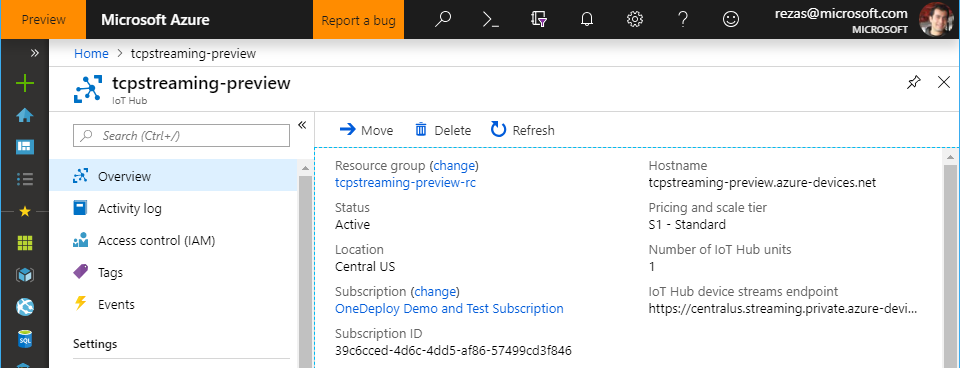

# IoT Hub Device Streams Tutorial
IoT Hub device streams enable secure communication to devices that are located behind firewalls or inside of private networks. As shown in the figure below, this is achieved by leveraging IoT Hub's cloud endpoints as a proxy to tunnel application traffic between device and services.

In our terminology, a _service_ is an entity that authenticates using IoT Hub's _service connect_ credentials and attempts to initiate a connection to a device. A device, on the other hand, has access to device credentials and awaits incoming streaming requests from the service. As such, the interaction between the service and device mimics a client/server interaction where service acts as the client connecting to the device (acting as server).
<p>
    
</p>

The device and service programs can interact using a variety of standards-based or proprietary protocols. As such, device streams treat application traffic simply as an opaque bytes stream passing through. This makes device streams application and protocol agnostic and hence allows this feature to act as a building block for end-to-end connectivity between device and service applications.


## Overview
Establishing a device stream involves an initiation handshake that takes place between the device, service, and IoT Hub. As part of the handshake, both device and service authenticate with IoT Hub and each create a WebSocket client through which they exchange application data.

The data sent over the WebSocket clients on each side will be tunneled transparently through IoT hub while maintaining reliability and ordering guarantees that are on par with TCP.


## Device Streams Initiation Handshake
The device streams initiation handshake can be thought of as a control-plane operation to be contrasted with the actual exchange of data between the device and service as a data-plane operation. As part of the handshake, device and service each receive a temporary authentication token and the URI of a _device streaming endpoint_ to connect to for sending and receiving data. The authentication token is valid for 60 seconds and device and service must use it prior to expiry to create and authenticate a WebSocket client with the streaming endpoint.

The details of the steps involved in this process are depicted in the figure below:
<p>
    
</p>

1. Device connects to IoT Hub and authenticates using its device credentials (this step usually takes place when the device first comes online). The device also registers a callback to be notified when new streams are initiated towards it from the service-side. The callback is registered for a specific stream name, which the device expects to be receiving in the future.

2. The service authenticates with IoT Hub using valid _service connect_ credentials and initiates a stream by providing the target device ID and the stream name - the latter must match the name used by the device in step 1.

3. IoT hub notifies the device's program via invoking the callback registered in step 1 for the corresponding stream name. The URI of the streaming endpoint and the authentication token will also be passed to the device via this callback. At this point, the device has an option to accept or reject the stream initiation request. The following steps assume that the device has accepted the stream request.

4. The device uses the authentication token received in step 3 to authenticate with the streaming endpoint using a WebSocket client. Once established, the device uses the WebSocket client to send and receive data to the service. This data is tunneled through the streaming endpoint.

5. The service will also be given the URI of the streaming endpoint and the authentication token, which it uses to create a WebSocket client. Once the WebSocket client is established, the service can use the WebSocket client to send and receive data to the device. This data is similarly tunneled through the streaming endpoint.


## Connectivity Requirements

Both the device and service sides of a device stream must be capable of establishing TLS-enabled connections to IoT Hub and its streaming endpoint. This requires outbound connectivity over port 443 to these endpoints. The hostname associated with these endpoints can be found on the _Overview_ tab of IoT Hub, as shown in the figure below:
<p>
    
</p>

Alternatively, the endpoints information can use be retrieved using Azure CLI under the hub's properties section (specifically, `property.hostname` and `property.deviceStreams` keys).

```azurecli-interactive
az iot hub show --name <YourIoTHubName>
```

## Troubleshoot via Device Streams Activity Logs

You can setup Azure Log Analytics to collect the activity log of device streams in your IoT Hub. This can be very helpful in troubleshooting scenarios.

Follow the steps below to configure Azure Log Analytics for your IoT Hub's device stream activities:

1. Navigate to the *Diagnostic settings* tab in your IoT Hub, and click on *Turn on diagnostics* link.

<p>
    
</p>

2. Provide a name for your diagnostics settings, and choose *Send to Log Analytics* option. You will be guided to choose an existing Log Analytics resource or create a new one. Additionally, check the *DeviceStreams* from the list.

<p>
    
</p>

3. You can now access your device streams logs under the *Logs* tab in your IoT Hub's portal. Device stream activity logs will appear in the `AzureDiagnostics` table and have `Category=DeviceStreams`.

<p>
As shown below the identity of the target device and the result of the operation is also available in the logs.
    
</p>

## Whitelist Device Streaming Endpoints

As mentioned [earlier](#Overview), your device creates an outbound connection to IoT Hub streaming endpoint during device streams initiation process. Your firewalls on the device or its network must allow outbound connectivity to the streaming gateway over port 443 (this is a WebSocket connection that is encrypted using TLS).

The hostname of device streaming endpoint can be found on the Azure IoT Hub portal under the Overview tab.
<p>
    
</p>

Alternatively, you can find this information using Azure CLI:
```cmd/sh
az iot hub show --name tcpstreaming-preview
```

## Next Steps

Use the links below to learn more about device streams:

> [!div class="nextstepaction"]
> [Device streams overview](./iot-hub-device-streams-overview.md)
> [Try other quickstarts](/azure/iot-hub)
