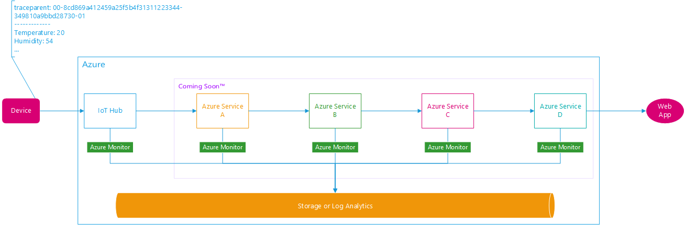
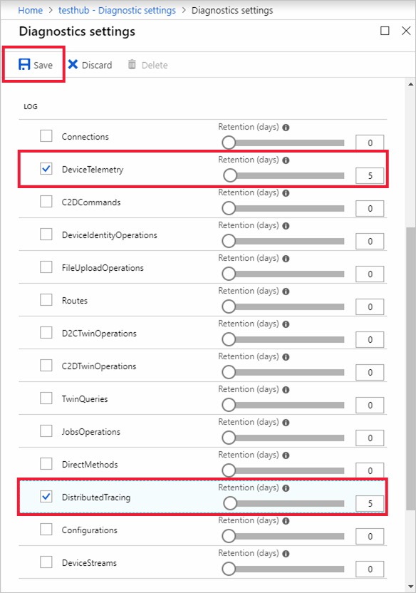

# Analyze and diagnose IoT applications end-to-end with IoT Hub distributed tracing (preview)



As your IoT solution grows in size and complexity, so does the difficulty of pinpointing bottlenecks and root causes. For example, you have an IoT solution that uses 5 different Azure services and 1500 active devices. Each device is programmed to send 10 device-to-cloud messages/second (for a total of 15000 messages/second), but you notice that your web app sees only 10000 messages/second - where is the issue? How do you find the culprit?

To better understand the flow of messages and events across Azure services, consider the [distributed tracing pattern](https://docs.microsoft.com/azure/architecture/microservices/logging-monitoring#distributed-tracing). In this article, you learn how to enable distributed tracing for your IoT Hub and devices running the Azure IoT Device SDK. 

[!INCLUDE [iot-hub-basic](../../includes/iot-hub-basic-whole.md)]

Distributed tracing for IoT Hub works by adding correlation IDs (following the [proposed W3C Trace Context format](https://github.com/w3c/trace-context)) to a subset (or all, configured via device twin) of your IoT device-to-cloud messages headers. When IoT Hub sees that a message has arrived with a trace context, it logs the messages arrival time, egress time, and destination to [Azure Monitor diagnostic logs](iot-hub-monitor-resource-health.md). As more Azure services begin to support distributed tracing, you can start tracing IoT messages life cycles throughout Azure. 

## Prerequisites

- Download C SDK version X
- IoT Hub is set up
- Device is created

## Enable distributed tracing for IoT Hub and client devices

There are three components to enabling distributed tracing for IoT Hub: device app, device twin, and diagnostic settings. You must make code changes to every device app that you want to have correlation IDs from, then make sure that you have the proper sampling rate and the correct diagnostic setting is on. 

Then, every time you add a device to your fleet, you must make sure the code is the updated and the twin is properly configured.

### Enable logging to Azure Monitor diagnostic logs

To ensure the message correlation IDs get logged to storage for analysis, turn on the **DistributedTracing** category in IoT Hub's diagnostic settings.



To learn more about enabling and storing diagnostic logs for IoT Hub, see [Monitor the health of Azure IoT Hub and diagnose problems quickly](iot-hub-monitor-resource-health.md).

### Deploy client application to your IoT device

To make annotating messages in W3C format easier, use Azure IoT client SDK version X for C. There are two parts of the SDK offering. First, the `OPTION_DIAGNOSTIC_SAMPLING_PERCENTAGE` can be used to determine the percentage of messages that should have the trace header (0 - 100%). Second, since you'll probably want to be able to change the percentage of messages sampled without modifying code every time, you can call the `IoTHub_GetTwin()` API to listen to cloud side "commands" for this percentage value.

Then you can also use [automatic device configuration](iot-hub-auto-device-config.md) to update your entire fleet to sample at a specific percentage, let's say.

For a client app that can receive sampling decisions from the cloud, check out [this sample](https://aka.ms/iottracingCsample).

You must update every device or module that you want to enable distributed tracing from.

Other languages are coming later.
	
### Enable and configure distributed tracing for your device without changing application code

IoT Hub uses the twin to communicate the sampling decision with the device, so you can use whatever way you like (JSON editor in portal, API, etc.) to update it. For the best experience, use the Azure portal:

1. Go to your IoT hub in Azure portal, then click **IoT devices**

1. Click your device

1. Look for **Distributed Tracing (Preview)**, then click **Enable**

    

1. Choose a **Sampling rate** between 0% and 100%.

1. Click **Save**

1. If successfully acknowledged by device, a check mark is shown (*pending*)

This doesn't do anything unless your device is set up to listen to twin changes by following the [Deploy client application to your IoT device](#deploy-client-application-to-your-IoT-device) section.

#### Twin schema

The exact JSON schema is shown in the following snippet. Changes in the UX directly update the [desired properties section](iot-hub-devguide-device-twins.md#device-twins) and vise versa.

```json
{
	"properties": {
		"desired": {
			"azureiot*com^dtracing^1*0*0": {
				"sampling_mode": 2,
				"sampling_rate": 10
			}
		},
		"reported": {
			"__iot:interfaces": {
				"azureiot*com^dtracing^1*0*0": {
					"@id": "http://azureiot.com/dtracing/1.0.0"
				}
			},
			"azureiot*com^dtracing^1*0*0": {
				"sampling_mode": {
					"value": 10,
					"status": {
						"code": 102,
						"version": 3,
						"description": "Completed"
					}
				},
				"sampling_rate": 10
			}
		}
	}
}
```

| Element name | Required | Type | Description |
|-----------------|----------|---------|-----------------------------------------------------|
| `sampling_mode` | Yes | Integer | Two possible values where `1` is On and `2` is Off |
| `sampling_rate` | Yes | Integer | Only values from 0 to 100 permitted (inclusive) |


## Query and Visualize

### Query using Storage or Log Analytics

If you've set up [Log Analytics with diagnostic logs](), query by looking for logs in the `DistributedTracing` category. For example, you may want to trace one message with a specific trace ID. Here's how it would look.

Query to show life cycle of message with correlation ID `8cd869a412459a25f5b4f31311223344`:

```
AzureDiagnostics
| where category == "DistributedTracing" and CorrelationId contains "8cd869a412459a25f5b4f31311223344"
```

Example logs as shown by Log Analytics:

| TimeGenerated | OperationName | Category | Level | CorrelationId | DurationMs | Properties |
|--------------------------|---------------|--------------------|---------------|---------------------------------------------------------|------------|------------------------------------------------------------------------------------------------------------------------------------------|
| 2018-02-22T03:28:28.633Z | DiagnosticIoTHubD2C | DistributedTracing | Informational | 00-8cd869a412459a25f5b4f31311223344-0144d2590aacd909-01 |  | {"deviceId":"AZ3166","messageSize":"96","callerLocalTimeUtc":"2018-02-22T03:27:28.633Z","calleeLocalTimeUtc":"2018-02-22T03:27:28.687Z"} |
| 2018-02-22T03:28:38.633Z | DiagnosticIoTHubIngress | DistributedTracing | Informational | 00-8cd869a412459a25f5b4f31311223344-349810a9bbd28730-01 | 20 | {"isRoutingEnabled":"false","parentSpanId":"0144d2590aacd909"} |
| 2018-02-22T03:28:48.633Z | DiagnosticIoTHubEgress | DistributedTracing | Informational | 00-8cd869a412459a25f5b4f31311223344-349810a9bbd28730-01 | 23 | {"endpointType":"EventHub","endpointName":"myEventHub", "parentSpanId":"0144d2590aacd909"} |

### Application Map

It would be impractical to identify issues with just raw logs. You would need visualization. Fortunately, we've built a sample app to help you do this exact thing. It works by piping date from IoT Hub to Azure Monitor, which pipes to storage, then to [Application Map](../application-insights/app-insights-app-map.md).

> [!div class="button"]
<a href="https://aka.ms/iottracingsample" target="_blank">Get the sample on Github</a>


Here's what it looks like


## Understand Azure IoT distributed tracing

*Is this section needed?*

## Limits of the public preview 

- Proposal for W3C Trace Context standard is still in draft.
- The only language supported by client SDK is C for now.
- For Basic SKUs, the cloud-to-device twin capability is not available. However, IoT Hub will still log to Azure Monitor if it sees a properly composed trace context header.
- We will be implementing an explicit throttle control to prevent abuse

## Next steps

* To learn more about the general distributed tracing pattern in microservices, see [Microservice architecture pattern: distributed tracing](https://microservices.io/patterns/observability/distributed-tracing.html).
* To set up configuration to apply distributed tracing settings to a large number of devices, see [Configure and monitor IoT devices at scale](iot-hub-auto-device-config.md).
* To learn more about Azure Monitor, see [What is Azure Monitor?](../azure-monitor/overview.md).
